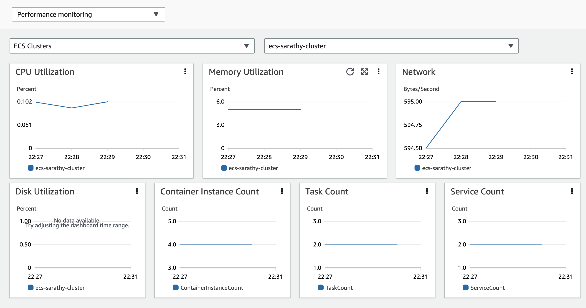

# Container Insights を使用したシステムメトリクスの収集

システムメトリクスは、サーバー上の物理コンポーネントである CPU、メモリ、ディスク、ネットワークインターフェイスなどの低レベルリソースに関連するものです。
[CloudWatch Container Insights](https://docs.aws.amazon.com/AmazonCloudWatch/latest/monitoring/ContainerInsights.html) を使用して、Amazon ECS にデプロイされたコンテナ化されたアプリケーションからシステムメトリクスを収集、集約、要約できます。
Container Insights は、コンテナの再起動失敗などの診断情報も提供し、問題を特定して迅速に解決するのに役立ちます。
EC2 と Fargate でデプロイされた Amazon ECS クラスターで利用できます。

Container Insights は、[埋め込みメトリックフォーマット](https://docs.aws.amazon.com/AmazonCloudWatch/latest/monitoring/CloudWatch_Embedded_Metric_Format.html)を使用してパフォーマンスログイベントとしてデータを収集します。 
これらのパフォーマンスログイベントは、高基数データを大規模に取り込み、保存できるように構造化された JSON スキーマを使用するエントリです。 
このデータから、CloudWatch は CloudWatch メトリクスとして、クラスター、ノード、サービス、タスクレベルで集計メトリクスを作成します。

!!! note
	Container Insights のメトリクスを CloudWatch に表示するには、Amazon ECS クラスターで Container Insights を有効にする必要があります。
	これはアカウントレベルまたは個々のクラスターレベルで実行できます。
	アカウントレベルで有効にするには、次の AWS CLI コマンドを使用します:

	```
    aws ecs put-account-setting --name "containerInsights" --value "enabled
    ```

	個々のクラスターレベルで有効にするには、次の AWS CLI コマンドを使用します:

	```
    aws ecs update-cluster-settings --cluster $CLUSTER_NAME --settings name=containerInsights,value=enabled
    ```

## クラスターレベルとサービスレベルのメトリクスの収集

デフォルトでは、CloudWatch Container Insights はタスク、サービス、クラスタのレベルでメトリクスを収集します。
Amazon ECS エージェントは、EC2 コンテナインスタンス上の各タスク(EC2 上の ECS と Fargate 上の ECS の両方)のこれらのメトリクスを収集し、パフォーマンスログイベントとして CloudWatch に送信します。
クラスタにエージェントをデプロイする必要はありません。これらのメトリクスが抽出されるログイベントは、CloudWatch ロググループ */aws/ecs/containerinsights/$CLUSTER_NAME/performance* 下に収集されます。
これらのイベントから抽出されるメトリクスの完全なリストは[ここで文書化されています](https://docs.aws.amazon.com/AmazonCloudWatch/latest/monitoring/Container-Insights-metrics-ECS.html)。
Container Insights が収集するメトリクスは、CloudWatch コンソールのナビゲーションページから *Container Insights* を選択し、ドロップダウンリストから *performance monitoring* を選択することで利用できる事前構築されたダッシュボードで直ちに表示できます。
また、CloudWatch コンソールの *Metrics* セクションでも表示できます。



!!! note
    Amazon EC2 インスタンス上で Amazon ECS を使用している場合で、Container Insights からネットワークとストレージのメトリクスを収集したい場合は、Amazon ECS エージェントバージョン 1.29 を含む AMI を使用してそのインスタンスを起動してください。
    
!!! warning
    Container Insights によって収集されたメトリクスは、カスタムメトリクスとして課金されます。CloudWatch の料金について詳しくは、[Amazon CloudWatch 料金](https://aws.amazon.com/cloudwatch/pricing/) を参照してください。

## インスタンスレベルのメトリクスの収集

CloudWatch エージェントを EC2 上にホストされている Amazon ECS クラスターにデプロイすることで、クラスターのインスタンスレベルのメトリクスを収集できます。このエージェントはデーモンサービスとしてデプロイされ、クラスタ内の各 EC2 コンテナインスタンスからパフォーマンスログイベントとしてインスタンスレベルのメトリクスを送信します。これらのイベントから抽出されるインスタンスレベルのメトリクスの完全なリストは[こちらで確認できます](https://docs.aws.amazon.com/AmazonCloudWatch/latest/monitoring/Container-Insights-metrics-ECS.html)。

!!! info
    Amazon ECS クラスターに CloudWatch エージェントをデプロイしてインスタンスレベルのメトリクスを収集する手順は、[Amazon CloudWatch ユーザーガイド](https://docs.aws.amazon.com/AmazonCloudWatch/latest/monitoring/deploy-container-insights-ECS-instancelevel.html)に記載されています。Fargate 上でホストされている Amazon ECS クラスターでは、このオプションは利用できないことに注意してください。

## Logs Insights を使用したパフォーマンスログイベントの分析

Container Insights は、埋め込みメトリック形式のパフォーマンスログイベントを使用してメトリクスを収集します。各ログイベントには、CPU やメモリなどのシステムリソース、またはタスクやサービスなどの ECS リソースで観測されたパフォーマンスデータが含まれている場合があります。Container Insights が Amazon ECS のクラスター、サービス、タスク、コンテナのレベルから収集するパフォーマンスログイベントの例は[こちらにリストされています](https://docs.aws.amazon.com/AmazonCloudWatch/latest/monitoring/Container-Insights-reference-performance-logs-ECS.html)。CloudWatch は、これらのログイベントのパフォーマンスデータの一部に基づいてのみメトリクスを生成します。しかし、これらのログイベントを使用して、CloudWatch Logs Insights クエリを使用したパフォーマンスデータのより深い分析を実行できます。

Logs Insights クエリを実行するためのユーザーインターフェイスは、ナビゲーションページから *Logs Insights* を選択することで CloudWatch コンソールで利用できます。ロググループを選択すると、CloudWatch Logs Insights はロググループ内のパフォーマンスログイベントのフィールドを自動的に検出し、右パネルの *Discovered* フィールドに表示します。クエリの実行結果は、このロググループ内の時間経過に伴うログイベントのバーグラフとして表示されます。このバーグラフは、クエリと時間範囲に一致するロググループ内のイベントの分布を示しています。


!!! info
    コンテナレベルの CPU およびメモリ使用率メトリクスを表示する Logs Insights クエリのサンプルを以下に示します。
    
    ```
    stats avg(CpuUtilized) as CPU, avg(MemoryUtilized) as Mem by TaskId, ContainerName | sort Mem, CPU desc
    ```
