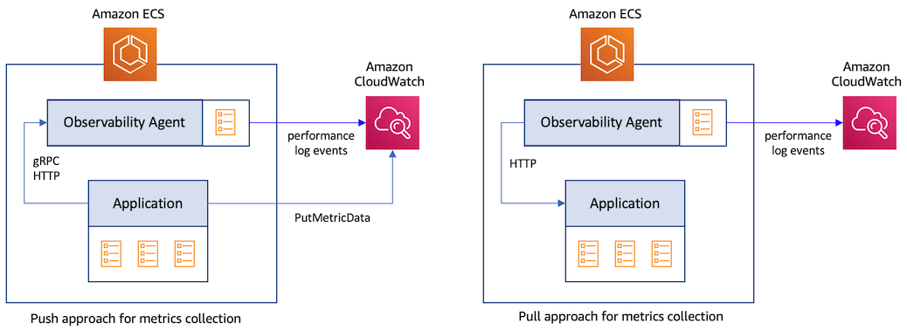

# Collecting service metrics with Container Insights
Service metrics are applicaton-level metrics that are captured by adding instrumentation to your code. These metrics can be captured from an application using two different approaches. 

1. Push approach: Here, an application sends the metrics data directly to a destination. For example, using the CloudWatch PutMetricData API, an application can publish metric data points to CloudWatch. An application may also send the data via gRPC or HTTP using the OpenTelemetry Protocol (OTLP) to an agent such as the OpenTelemetry Collector. The latter will then send the data the metrics data to the final destination.
2. Pull approach: Here, the application exposes the metrics data at an HTTP endpoint in a pre-defined format. The data are then scraped by an agent that has access to this endpoint and then sent to the destination.



## CloudWatch Container Insights monitoring for Prometheus
[Prometheus](https://prometheus.io/docs/introduction/overview/) is a popular open-source systems monitoring and alerting toolkit. It has emerged as the de facto standard for collecting metrics using the pull approach from containerized applications. To capture metrics using Prometheus, you will have to first instrument your application code using the Prometheus [client library](https://prometheus.io/docs/instrumenting/clientlibs/) which is available in all the major programming languages. Metrics are usually exposed by the application over HTTP, to be read by the Prometheus server.
When Prometheus server scrapes your applications's HTTP endpoint, the client library sends the current state of all tracked metrics to the server. The server can either store the metrics in a local storage that it manages or send the metrics data to a remote destination such as CloudWatch.

[CloudWatch Container Insights monitoring for Prometheus](https://docs.aws.amazon.com/AmazonCloudWatch/latest/monitoring/ContainerInsights-Prometheus.html) enables you to leverage the capabilities of Prometheus in an Amazon ECS cluster. It is available for Amazon ECS clusters deployed on EC2 and Fargate The CloudWatch agent can be used as a drop-in replacement for a Prometheus server, reducing the number of monitoring tools required to improve observability. It automates the discovery of Prometheus metrics from containerized applications deployed to Amazon ECS and sends the metrics data to CloudWatch as performance log events. 

!!! info
    Steps to deploy the CloudWatch agent with Prometheus metrics collection on an Amazon ECS cluster are documented in the [Amazon CloudWatch User Guide](https://docs.aws.amazon.com/AmazonCloudWatch/latest/monitoring/ContainerInsights-Prometheus-install-ECS.html)

!!! warning
    Metrics collected by Container Insights monitoring for Prometheus are charged as custom metrics. For more information about CloudWatch pricing, see [Amazon CloudWatch Pricing](https://aws.amazon.com/cloudwatch/pricing/)

### Autodiscovery of targets on Amazon ECS clusters
The CloudWatch agent supports the standard Prometheus scrape configurations under the [scrape_config](https://prometheus.io/docs/prometheus/latest/configuration/configuration/#scrape_config) section in the Prometheus documentation. Prometheus supports both static and dynamic discovery of scraping targets using one of the dozens of supported [service-discovery mechanisms](https://prometheus.io/docs/prometheus/latest/configuration/configuration/#scrape_config). . As Amazon ECS does not have any built-in service discovery mechanism, the agent relies on Prometheus' support for file-based discovery of targets. To setup the agent for file-based discovery of targets, the agent needs two [configuration parameters](https://docs.aws.amazon.com/AmazonCloudWatch/latest/monitoring/ContainerInsights-Prometheus-Setup-configure-ECS.html), which are both defined in the task definition used for launching the agent. You can customize these parameters to have granular control over the metrics collected by the agent.

The first parameter contains Prometheus global configuration that looks like the following sample:

```
global:
  scrape_interval: 30s
  scrape_timeout: 10s
scrape_configs:
  - job_name: cwagent_ecs_auto_sd
    sample_limit: 10000
    file_sd_configs:
      - files: [ "/tmp/cwagent_ecs_auto_sd.yaml" ] 
```

The second parameter contains configuration that helps the agent discover scraping targets. The agent periodically makes API calls to Amazon ECS to retrieve the metadata of the running ECS tasks that match the task definition patterns defined in the *ecs_service_discovery* section of this configurtion. All discovered targets are written into the result file */tmp/cwagent_ecs_auto_sd.yaml* that resides on the file system mounted to CloudWatch agent container. The sample configuration below will result in the agent scraping metrics from all tasks that are named with the prefix *BackendTask*. Refer to the [detaild guide](https://docs.aws.amazon.com/AmazonCloudWatch/latest/monitoring/ContainerInsights-Prometheus-Setup-autodiscovery-ecs.html) for autodiscovery of targets in an Amazon ECS Cluster.

```
{
   "logs":{
      "metrics_collected":{
         "prometheus":{
            "log_group_name":"/aws/ecs/containerinsights/{ClusterName}/prometheus"
            "prometheus_config_path":"env:PROMETHEUS_CONFIG_CONTENT",
            "ecs_service_discovery":{
               "sd_frequency":"1m",
               "sd_result_file":"/tmp/cwagent_ecs_auto_sd.yaml",
               "task_definition_list":[
                  {
                     "sd_job_name":"backends",
                     "sd_metrics_ports":"3000",
                     "sd_task_definition_arn_pattern":".*:task-definition/BackendTask:[0-9]+",
                     "sd_metrics_path":"/metrics"
                  }
               ]
            },
            "emf_processor":{
               "metric_declaration":[
                  {
                     "source_labels":[
                        "job"
                     ],
                     "label_matcher":"^backends$",
                     "dimensions":[
                        [
                           "ClusterName",
                           "TaskGroup"
                        ]
                     ],
                     "metric_selectors":[
                        "^http_requests_total$"
                     ]
                  }
               ]
            }
         }
      },
      "force_flush_interval":5
   }
}
```

### Importing Prometheus metrics into CloudWatch
The metrics collected by the agent are sent to CloudWatch as performance log events based on the filtering rules specified in *metric_declaration* section of the configuration. This section is also used to specify the array of logs with embedded metric format to be generated. The sample configuration above will generate log events, as shown below, only for a metric named *http_requests_total* with the label *job:backends*. Using this data, CloudWatch will create the metric *http_requests_total* under the CloudWatch namespace *ECS/ContainerInsights/Prometheus* with the dimensions *ClusterName* and *TaskGroup*.
```
{
   "CloudWatchMetrics":[
      {
         "Metrics":[
            {
               "Name":"http_requests_total"
            }
         ],
         "Dimensions":[
            [
               "ClusterName",
               "TaskGroup"
            ]
         ],
         "Namespace":"ECS/ContainerInsights/Prometheus"
      }
   ],
   "ClusterName":"ecs-sarathy-cluster",
   "LaunchType":"EC2",
   "StartedBy":"ecs-svc/4964126209508453538",
   "TaskDefinitionFamily":"BackendAlarmTask",
   "TaskGroup":"service:BackendService",
   "TaskRevision":"4",
   "Timestamp":"1678226606712",
   "Version":"0",
   "container_name":"go-backend",
   "exported_job":"storebackend",
   "http_requests_total":36,
   "instance":"10.10.100.191:3000",
   "job":"backends",
   "path":"/popular/category",
   "prom_metric_type":"counter"
}
```