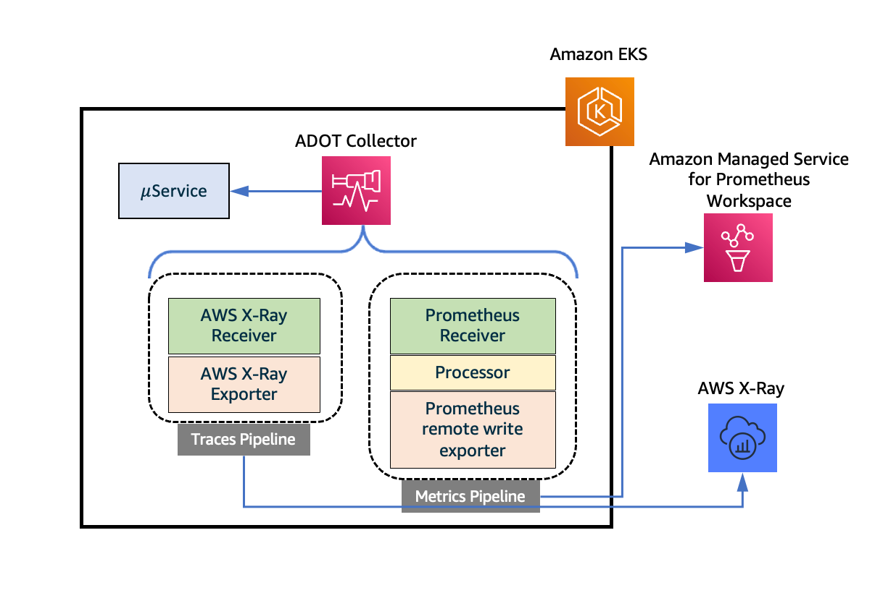
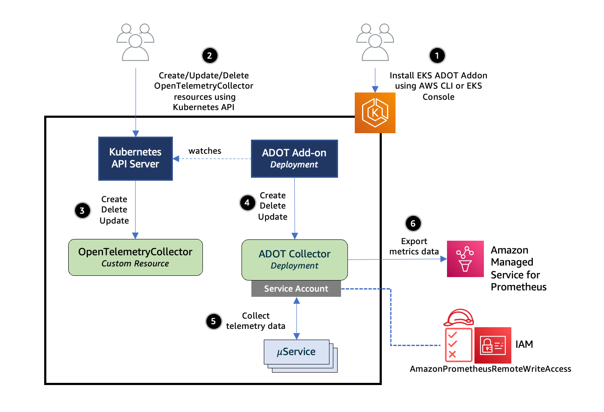
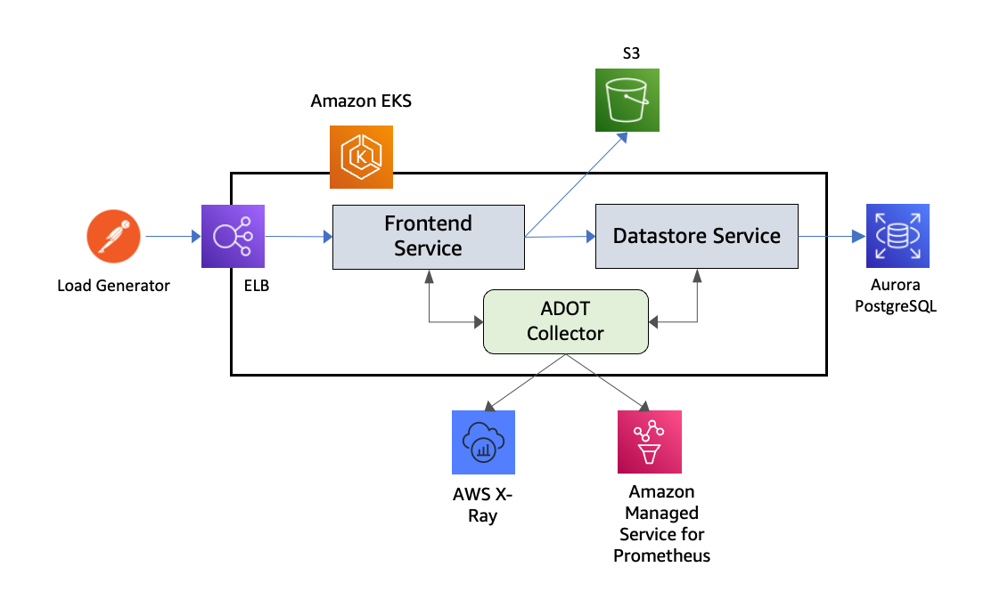
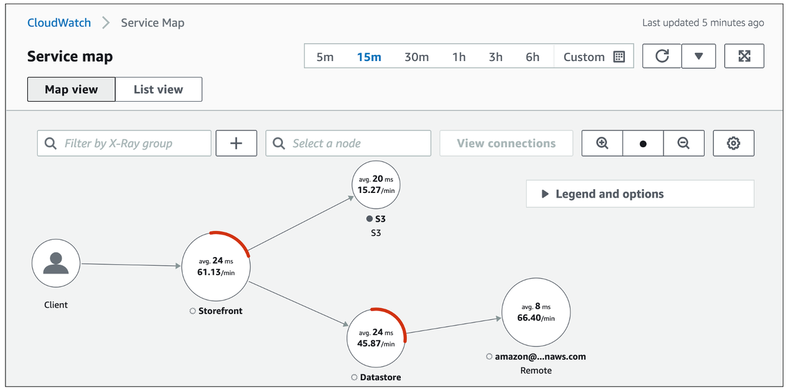

# AWS X-Ray によるコンテナトレーシング

このオブザーバビリティのベストプラクティスガイドのセクションでは、AWS X-Ray によるコンテナトレーシングに関連する次のトピックを深掘りします。

* AWS X-Ray の概要
* AWS Distro for OpenTelemetry の Amazon EKS アドオンを使用したトレースの収集
* まとめ

### はじめに

[AWS X-Ray](https://docs.aws.amazon.com/xray/latest/devguide/aws-xray.html) は、アプリケーションが処理するリクエストに関するデータを収集し、そのデータを表示、フィルタリング、洞察するためのツールを提供するサービスです。これにより、問題の特定と最適化の機会を見出すことができます。アプリケーションへのトレースされた任意のリクエストについて、リクエストとレスポンスに関する詳細な情報だけでなく、アプリケーションが下流の AWS リソース、マイクロサービス、データベース、Web API への呼び出しに関する情報も確認できます。

アプリケーションの計装には、着信リクエストと発信リクエストなど、アプリケーション内のイベントごとのトレースデータとメタデータを送信することが含まれます。多くの計装シナリオでは、構成変更のみが必要です。 たとえば、Java アプリケーションに対するすべての着信 HTTP リクエストと、アプリケーションが行う AWS サービスへのダウンストリーム呼び出しを計装できます。 アプリケーションの X-Ray トレースのための計装に使用できるいくつかの SDK、エージェント、ツールがあります。 詳細については、[アプリケーションの計装](https://docs.aws.amazon.com/xray/latest/devguide/xray-instrumenting-your-app.html) を参照してください。

AWS Distro for OpenTelemetry 用の Amazon EKS アドオンを使用して Amazon EKS クラスタからトレースを収集することによるコンテナ化アプリケーションのトレースについて学習します。

### Amazon EKS アドオン for AWS Distro for OpenTelemetry を使用したトレースの収集

[AWS X-Ray](https://aws.amazon.com/xray/) はアプリケーショントレーシング機能を提供し、デプロイされたすべてのマイクロサービスについて深い洞察を得ることができます。X-Ray を使用すると、関連するマイクロサービスを通過するにつれて、すべてのリクエストをトレースできます。これにより、DevOps チームはサービスがピアとどのように対話するかを理解し、問題をより高速に分析およびデバッグできる洞察を得ることができます。

[AWS Distro for OpenTelemetry(ADOT)](https://aws-otel.github.io/docs/introduction) は、セキュアで AWS サポートの OpenTelemetry プロジェクトのディストリビューションです。ユーザーはアプリケーションに一度インスツルメンテーションを適用するだけで、ADOT を使用して相関メトリクスとトレースを複数のモニタリングソリューションに送信できます。Amazon EKS では、クラスターがアップおよび実行された後いつでも、アドオンとして ADOT を有効にできるようになりました。ADOT アドオンには最新のセキュリティパッチとバグ修正が含まれており、Amazon EKS で動作することが AWS によって検証されています。

ADOT アドオンは Kubernetes Operator の実装であり、カスタムリソースを使用してアプリケーションとそのコンポーネントを管理する Kubernetes のソフトウェア拡張機能です。このアドオンは OpenTelemetryCollector という名前のカスタムリソースを監視し、カスタムリソースで指定された構成設定に基づいて ADOT Collector のライフサイクルを管理します。

ADOT Collector には、レシーバー、プロセッサー、エクスポーターという 3 つの主要なタイプのコンポーネントで構成されるパイプラインの概念があります。[レシーバー](https://opentelemetry.io/docs/collector/configuration/#receivers) は、Collector にデータが入る方法です。特定の形式のデータを受け入れ、内部形式に変換して、パイプラインで定義された [プロセッサー](https://opentelemetry.io/docs/collector/configuration/#processors) と [エクスポーター](https://opentelemetry.io/docs/collector/configuration/#exporters) に渡します。プルベースまたはプッシュベースのいずれかです。プロセッサーは、受信とエクスポートの間でデータに対してバッチ処理、フィルタリング、変換などのタスクを実行するために使用されるオプションのコンポーネントです。エクスポーターは、メトリクス、ログ、トレースを送信する宛先を決定するために使用されます。Collector アーキテクチャを使用すると、Kubernetes YAML マニフェストを介してそのようなパイプラインの複数のインスタンスを設定できます。

次の図は、AWS X-Ray にテレメトリデータを送信するトレースパイプラインで構成された ADOT Collector を示しています。トレースパイプラインは、[AWS X-Ray レシーバー](https://github.com/open-telemetry/opentelemetry-collector-contrib/tree/main/receiver/awsxrayreceiver) と [AWS X-Ray エクスポーター](https://github.com/open-telemetry/opentelemetry-collector-contrib/tree/main/exporter/awsxrayexporter) のインスタンスで構成され、トレースを AWS X-Ray に送信します。



*図: Amazon EKS アドオン for AWS Distro for OpenTelemetry を使用したトレースの収集*

EKS クラスターに ADOT アドオンをインストールする詳細と、ワークロードからテレメトリデータを収集する方法を見ていきましょう。ADOT アドオンをインストールする前に必要な前提条件のリストを以下に示します。

* Kubernetes バージョン 1.19 以降をサポートする EKS クラスター。EKS クラスターは、[こちらで概説されているアプローチ](https://docs.aws.amazon.com/eks/latest/userguide/create-cluster.html)のいずれかを使用して作成できます。
* クラスターにまだインストールされていない場合は [Certificate Manager](https://cert-manager.io/)。[このドキュメント](https://cert-manager.io/docs/installation/) に従ってデフォルトの構成でインストールできます。
* クラスターに ADOT アドオンをインストールするための EKS アドオン用の Kubernetes RBAC 権限。これは、kubectl などの CLI ツールを使用して、[この YAML](https://amazon-eks.s3.amazonaws.com/docs/addons-otel-permissions.yaml) ファイルの設定をクラスターに適用することで実行できます。

次のコマンドを使用して、EKS のさまざまなバージョンで有効になっているアドオンのリストを確認できます。

`aws eks describe-addon-versions`

JSON 出力には、以下に示すように、ADOT アドオンなどの他のアドオンがリストされる必要があります。EKS クラスターが作成されると、EKS アドオンはそれにアドオンをインストールしないことに注意してください。


```
{
   "addonName":"adot",
   "type":"observability",
   "addonVersions":[
      {
         "addonVersion":"v0.45.0-eksbuild.1",
         "architecture":[
            "amd64"
         ],
         "compatibilities":[
            {
               "clusterVersion":"1.22",
               "platformVersions":[
                  "*"
               ],
               "defaultVersion":true
            },
            {
               "clusterVersion":"1.21",
               "platformVersions":[
                  "*"
               ],
               "defaultVersion":true
            },
            {
               "clusterVersion":"1.20",
               "platformVersions":[
                  "*"
               ],
               "defaultVersion":true
            },
            {
               "clusterVersion":"1.19",
               "platformVersions":[
                  "*"
               ],
               "defaultVersion":true
            }
         ]
      }
   ]
}
```

次に、次のコマンドを使用して ADOT アドオンをインストールできます。

`aws eks create-addon --addon-name adot --addon-version v0.45.0-eksbuild.1 --cluster-name $CLUSTER_NAME `

バージョン文字列は、前述の出力の *addonVersion* フィールドの値と一致している必要があります。このコマンドの正常な実行からの出力は、次のようになります。

```
{
    "addon": {
        "addonName": "adot",
        "clusterName": "k8s-production-cluster",
        "status": "ACTIVE",
        "addonVersion": "v0.45.0-eksbuild.1",
        "health": {
            "issues": []
        },
        "addonArn": "arn:aws:eks:us-east-1:123456789000:addon/k8s-production-cluster/adot/f0bff97c-0647-ef6f-eecf-0b2a13f7491b",
        "createdAt": "2022-04-04T10:36:56.966000+05:30",
        "modifiedAt": "2022-04-04T10:38:09.142000+05:30",
        "tags": {}
    }
}
```

次のステップに進む前に、アドオンのステータスが ACTIVE になるまで待ちます。アドオンのステータスは、次のコマンドで確認できます。

`aws eks describe-addon --addon-name adot --cluster-name $CLUSTER_NAME`

#### ADOT Collector のデプロイ

ADOT アドオンは、Kubernetes Operator の実装であり、カスタムリソースを利用してアプリケーションとそのコンポーネントを管理する Kubernetes のソフトウェア拡張機能です。
このアドオンは OpenTelemetryCollector という名前のカスタムリソースを監視し、カスタムリソースで指定された設定に基づいて ADOT Collector のライフサイクルを管理します。
以下の図は、これがどのように機能するかを示したものです。



*図: ADOT Collector のデプロイ*

次に、ADOT Collector のデプロイ方法を見ていきましょう。
[こちらの YAML 設定ファイル](https://github.com/aws-observability/aws-o11y-recipes/blob/main/sandbox/eks-addon-adot/otel-collector-xray-prometheus-complete.yaml) は、OpenTelemetryCollector カスタムリソースを定義しています。
これを EKS クラスターにデプロイすると、上記の最初の図に示すように、トレースとメトリクスのパイプラインで構成される ADOT Collector をプロビジョニングするために、ADOT アドオンがトリガーされます。
Collector は `aws-otel-eks` ネームスペースに `${custom-resource-name}-collector` という名前の Kubernetes Deployment として起動されます。
同じ名前の ClusterIP サービスも起動されます。
この Collector のパイプラインを構成する個々のコンポーネントを見ていきましょう。

トレースパイプラインの AWS X-Ray Receiver は、[X-Ray Segment 形式](https://docs.aws.amazon.com/xray/latest/devguide/xray-api-segmentdocuments.html)のセグメントまたはスパンを受け入れます。これにより、X-Ray SDK で計装されたマイクロサービスから送信されたセグメントを処理できるようになります。
UDP ポート 2000 でトラフィックをリッスンするように設定されており、Cluster IP サービスとして公開されています。
この設定に従って、トレースデータをこの Receiver に送信したいワークロードは、環境変数 `AWS_XRAY_DAEMON_ADDRESS` を `observability-collector.aws-otel-eks:2000` に設定する必要があります。
エクスポーターは、これらのセグメントを [PutTraceSegments](https://docs.aws.amazon.com/xray/latest/api/API_PutTraceSegments.html) API を使用して直接 X-Ray に送信します。

ADOT Collector は、`aws-otel-collector` という名前の Kubernetes サービスアカウントの ID で起動するように設定されています。これには、[設定](https://github.com/aws-observability/aws-o11y-recipes/blob/main/sandbox/eks-addon-adot/otel-collector-xray-prometheus-complete.yaml) でも示されている ClusterRoleBinding と ClusterRole を使用して、これらのアクセス許可が付与されます。
エクスポーターは、X-Ray にデータを送信するための IAM アクセス許可が必要です。
これは、EKS でサポートされている [IAM roles for service accounts](https://docs.aws.amazon.com/eks/latest/userguide/iam-roles-for-service-accounts.html) 機能を使用して、サービスアカウントを IAM ロールに関連付けることによって実現されます。
IAM ロールは、AWSXRayDaemonWriteAccess などの AWS マネージドポリシーに関連付ける必要があります。
[こちらのヘルパースクリプト](https://github.com/aws-observability/aws-o11y-recipes/blob/main/sandbox/eks-addon-adot/adot-irsa.sh) は、CLUSTER_NAME と REGION の変数を設定した後、これらのアクセス許可を付与され、`aws-otel-collector` サービスアカウントに関連付けられた `EKS-ADOT-ServiceAccount-Role` という名前の IAM ロールを作成するために使用できます。

#### トレース収集のエンドツーエンドテスト

ここで、EKS クラスターにデプロイされたワークロードからのトレース収集をテストするために、これらすべてをまとめてみましょう。次のイラストは、このテストに使用されたセットアップを示しています。これは、一連の REST API を公開し、S3 およびデータストアサービスと対話するフロントエンドサービスで構成されています。データストアサービスは、Aurora PostgreSQL データベースのインスタンスと対話します。サービスは X-Ray SDK で計装されています。ADOT Collector は、前のセクションで説明した YAML マニフェストを使用して OpenTelemetryCollector カスタムリソースをデプロイすることにより、デプロイメントモードで起動されます。Postman クライアントは外部トラフィックジェネレータとして使用され、フロントエンドサービスを対象としています。



*図: トレース収集のエンドツーエンドテスト。*

次の画像は、サービスからキャプチャされたセグメントデータを使用して X-Ray によって生成されたサービスグラフを示しています。各セグメントの平均応答待ち時間も示されています。

  

*図: CloudWatch サービスマップコンソール。*

OTLP Receiver と AWS X-Ray Exporter を使用したトレースパイプラインの構成に関連する OpenTelemetryCollector カスタムリソース定義については、[Traces pipeline with OTLP Receiver and AWS X-Ray Exporter sending traces to AWS X-Ray](https://github.com/aws-observability/aws-otel-community/blob/master/sample-configs/operator/collector-config-xray.yaml) をご確認ください。ADOT Collector を AWS X-Ray と組み合わせて使用したいお客様は、これらの構成テンプレートから始め、プレースホルダー変数をターゲット環境に基づいて値に置き換え、EKS 向け ADOT アドオンを使用して Amazon EKS クラスターにコレクターをすばやくデプロイできます。

### EKS Blueprints を使用したコンテナートレーシングのための AWS X-Ray の設定

[EKS Blueprints](https://aws.amazon.com/blogs/containers/bootstrapping-clusters-with-eks-blueprints/) は、アカウントとリージョン間で一貫性のある、バッテリー同梱の EKS クラスターを設定およびデプロイするのに役立つ Infrastructure as Code (IaC) モジュールのコレクションです。EKS Blueprints を使用すると、[Amazon EKS アドオン](https://docs.aws.amazon.com/eks/latest/userguide/eks-add-ons.html)とともに、Prometheus、Karpenter、Nginx、Traefik、AWS Load Balancer Controller、Container Insights、Fluent Bit、Keda、Argo CD など、さまざまな一般的なオープンソース アドオンを備えた EKS クラスターを簡単にブートストラップできます。EKS Blueprints は、インフラストラクチャの自動化に役立つ 2 つの一般的な IaC フレームワークである [HashiCorp Terraform](https://github.com/aws-ia/terraform-aws-eks-blueprints) と [AWS Cloud Development Kit (AWS CDK)](https://github.com/aws-quickstart/cdk-eks-blueprints) で実装されています。

EKS Blueprints を使用した Amazon EKS クラスターの作成プロセスの一環として、AWS X-Ray をセットアップして、コンテナ化されたアプリケーションとマイクロサービスからのメトリクスとログを収集、集約、要約し、Amazon CloudWatch コンソールに出力する Day 2 運用ツールとして機能させることができます。

## 結論

オブザーバビリティのベストプラクティスガイドのこのセクションでは、Amazon EKS アドオン for AWS Distro for OpenTelemetry を使用したトレース収集により、Amazon EKS 上のアプリケーションのコンテナトレーシングに AWS X-Ray を使用する方法について学びました。 さらに学習するには、 [Amazon EKS アドオン for AWS Distro for OpenTelemetry を使用した Amazon Managed Service for Prometheus および Amazon CloudWatch へのメトリクスとトレースの収集](https://aws.amazon.com/blogs/containers/metrics-and-traces-collection-using-amazon-eks-add-ons-for-aws-distro-for-opentelemetry/) をご確認ください。 最後に、Amazon EKS クラスターの作成プロセス中に AWS X-Ray を使用したコンテナトレーシングの設定を容易にするための車両として、EKS ブループリントの使用について簡単に説明しました。 より深い解析のために、AWS の [One Observability ワークショップ](https://catalog.workshops.aws/observability/en-US) の **AWS ネイティブ** オブザーバビリティカテゴリー下の X-Ray トレース モジュールを実践することを強くおすすめします。
