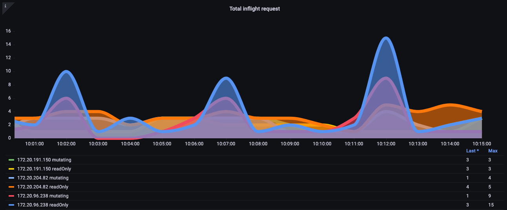
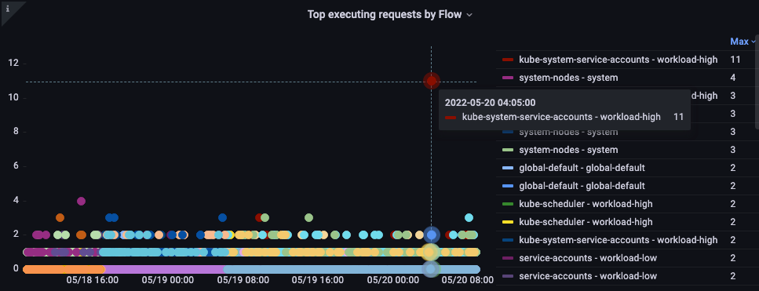
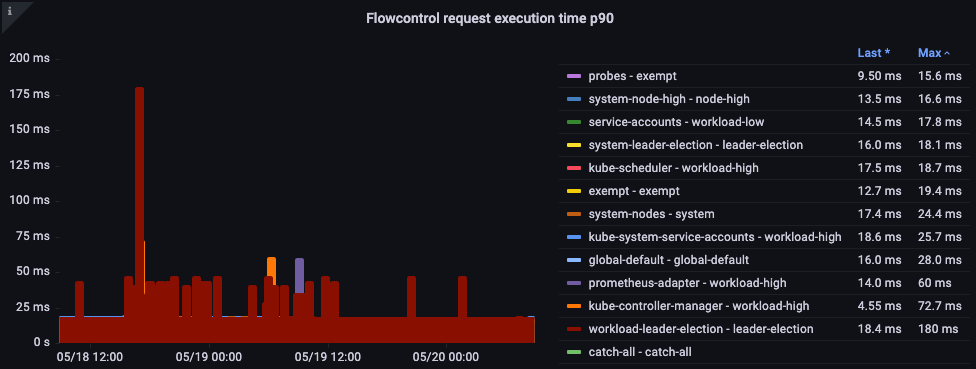
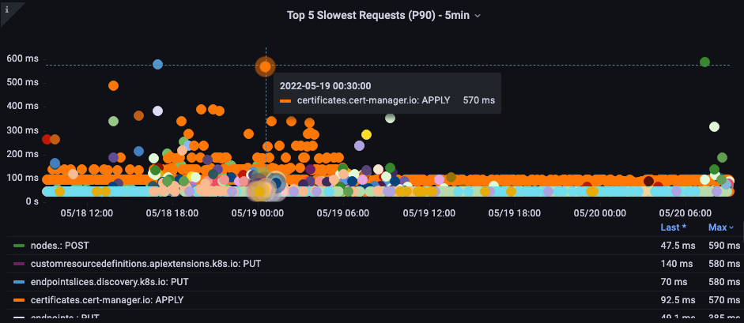
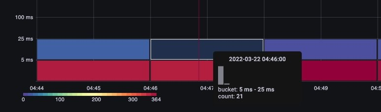
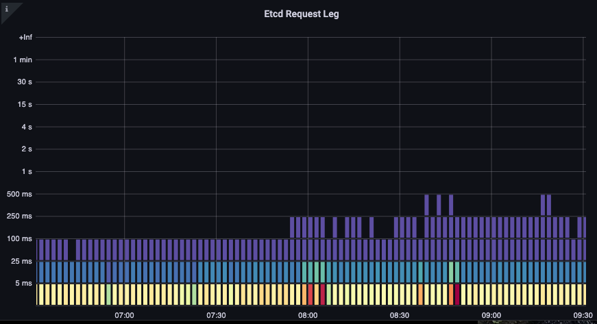

# Amazon EKS API サーバーのモニタリング

このオブザーバビリティのベストプラクティスガイドのセクションでは、API サーバーのモニタリングに関連する以下のトピックを深掘りします。

* Amazon EKS API サーバーのモニタリングの紹介
* API サーバー トラブルシューティング ダッシュボードの設定
* API トラブルシューティング ダッシュボードを使用した API サーバーの問題の理解 
* API サーバーへの無制限なリスト呼び出しの理解
* API サーバーへの不適切な動作の停止
* API の優先順位と公平性
* 最も遅い API 呼び出しと API サーバーのレイテンシの問題の特定

### はじめに

Amazon EKS で管理されるコントロールプレーンのモニタリングは、EKS クラスターのヘルスに関する問題を事前に特定するための非常に重要な Day 2 運用アクティビティです。Amazon EKS コントロールプレーンモニタリングにより、収集されたメトリクスに基づいて予防措置を講じることができます。これらのメトリクスは、API サーバーのトラブルシューティングと、内部の問題の特定に役立ちます。

このセクションでは、Amazon EKS API サーバーモニタリングのデモンストレーションに Amazon Managed Service for Prometheus(AMP)を、メトリクスの可視化に Amazon Managed Grafana(AMG)を使用します。Prometheus は、強力なクエリ機能を備え、さまざまなワークロードで広くサポートされている一般的なオープンソースのモニタリングツールです。Amazon Managed Service for Prometheus は、Amazon EKS、Amazon Elastic Container Service(Amazon ECS)、Amazon Elastic Compute Cloud(Amazon EC2)などの環境を安全かつ信頼性高くモニタリングするのに役立つ、完全マネージドの Prometheus 互換サービスです。Amazon Managed Grafana は、オープンソースの Grafana の完全マネージドかつセキュアなデータ可視化サービスで、アプリケーションの運用メトリクス、ログ、トレースを複数のデータソースから即座にクエリ、相関分析、可視化できます。

まず、Amazon Managed Service for Prometheus と Amazon Managed Grafana を使用してスターターダッシュボードを設定し、Prometheus で [Amazon Elastic Kubernetes Service(Amazon EKS)](https://aws.amazon.com/eks) API サーバーのトラブルシューティングを支援します。次のセクションでは、EKS API サーバーのトラブルシューティング時の問題の理解、API の優先順位と公平性、悪い動作の停止など、深く潜っていきます。最後に、最も遅い API 呼び出しと API サーバーレイテンシの問題を特定することで、Amazon EKS クラスターの状態を健全に保つためのアクションを取るのに役立ちます。

### API サーバートラブルシューティングダッシュボードの設定

AMP を使用して [Amazon Elastic Kubernetes Service(Amazon EKS)](https://aws.amazon.com/eks) API サーバのトラブルシューティングを支援するためのスターターダッシュボードを設定します。 これを使用して、実稼働 EKS クラスタのトラブルシューティング中にメトリクスを理解するのに役立ちます。 収集されたメトリクスに深く注目して、Amazon EKS クラスタのトラブルシューティング中にその重要性を理解します。

まず、[ADOT コレクタを設定して、Amazon EKS クラスタからメトリクスを Amazon Managed Service for Prometheus に収集します](https://aws.amazon.com/blogs/containers/metrics-and-traces-collection-using-amazon-eks-add-ons-for-aws-distro-for-opentelemetry/)。 この設定では、EKS がアップおよび実行された後いつでも ADOT をアドオンとして有効にできる EKS ADOT アドオンを使用します。 ADOT アドオンには最新のセキュリティパッチとバグ修正が含まれており、Amazon EKS で機能することが AWS によって検証されています。 この設定では、EKS クラスタで ADOT アドオンをインストールし、クラスタからメトリクスを収集するために使用する方法を示します。

次に、最初のステップで設定した AMP をデータソースとして使用して、[Amazon Managed Grafana ワークスペースを設定してメトリクスを可視化します](https://aws.amazon.com/blogs/mt/amazon-managed-grafana-getting-started/)。 最後に、[API トラブルシューターダッシュボード](https://github.com/RiskyAdventure/Troubleshooting-Dashboards/blob/main/api-troubleshooter.json) をダウンロードし、Amazon Managed Grafana に移動して、さらなるトラブルシューティングのためにメトリクスを可視化する API トラブルシューターダッシュボード json をアップロードします。

### API トラブルシューティングダッシュボードを使用して問題を理解する

クラスタにインストールしたい興味深いオープンソースプロジェクトを見つけたとします。その Operator は DaemonSet をクラスタにデプロイしますが、そこで不正なリクエストや必要以上に高頻度の LIST 呼び出しが発生したり、1,000 ノードのすべてで DaemonSet が1分ごとにクラスタ上の 50,000 Pod すべてのステータスを要求していたりする可能性があります。
こうしたことが本当に頻繁に起こるのでしょうか。はい、そうなのです。以下で、なぜそうなるのかを簡単に説明します。

#### LIST と WATCH の違いを理解する

クラスタ内のオブジェクトの状態を理解する必要があるアプリケーションがあります。
たとえば、マシンラーニング(ML)アプリケーションは、*Completed* ステータスでない Pod の数を理解することによってジョブのステータスを知りたいとします。
Kubernetes では、WATCH と呼ばれるものでこれを上手く行う方法があります。
また、クラスタ上のすべてのオブジェクトをリストアップして、それらの Pod の最新のステータスを見つけるというあまりうまくいかない方法もあります。

#### 適切に動作するWATCH

Kubernetesでプッシュモデルを使って更新を受信するには、WATCHや長期間生存する単一のコネクションを使うのが最もスケーラブルな方法です。
少し単純化して説明すると、システムの完全な状態を要求し、そのオブジェクトの変更が受信されたときにのみキャッシュ内のオブジェクトを更新し、更新を見逃していないことを確認するために定期的に再同期を実行します。

下の画像では、`apiserver_longrunning_gauge`を使用して、両方のAPIサーバー全体でこれらの長期間生存するコネクションの数を把握しています。

*図: `apiserver_longrunning_gauge` メトリクス*

この効率的なシステムであっても、良いことが過ぎることがあります。 
たとえば、非常に小さなノードを多数使用し、APIサーバーと通信する必要がある2つ以上のデーモンセットを使用している場合、システムのWATCHコールの数を不必要に劇的に増加させることが非常に簡単です。 
たとえば、8つのxlargeノードと1つの8xlargeノードの違いを見てみましょう。 
ここでは、システムのWATCHコールが8倍に増加しているのがわかります。

*図: 8つのxlargeノードのWATCHコール*

これらは効率的な呼び出しですが、前述した不適切な呼び出しであった場合はどうでしょうか?
1,000個のノードのそれぞれで上記のデーモンセットの1つが、クラスター内の合計50,000個のPodのそれぞれについて更新を要求していることを想像してみてください。
次のセクションでは、この無制限のリストコールのアイデアを探求していきます。

続ける前に、上記の例のようなコンソリデーションは細心の注意を払って行う必要があり、考慮しなければならない他の多くの要因があることを注意深く警告しておきます。 
システムのCPU数に対するスレッドの競合の遅延から、Podのチャーンレート、ノードが安全に処理できるボリュームアタッチの最大数など、あらゆるものがそうです。
しかし、問題が発生する前に対処できるアクション可能なステップにつながるメトリックに焦点を当てます。そして、設計についての新しい洞察を得ることができるかもしれません。

WATCHメトリクスはシンプルなものですが、WATCHの数を追跡および削減するために使用できます(これがあなたにとっての問題である場合)。
この数を減らすために検討できるいくつかのオプションがあります。

* Helmが作成するConfigMapの数を制限する
*  WATCHを使用しないImmutableなConfigMapとSecretを使用する
* 賢明なノードサイジングとコンソリデーション

### API サーバーへの無制限なリストコールの理解

これまで説明してきた LIST コールについてです。リストコールは、オブジェクトの状態を理解するたびに、Kubernetes オブジェクトの全履歴を取得するものです。このとき、キャッシュには何も保存されません。

これがどの程度の影響を与えるかは、エージェントの数、データ要求の頻度、要求データ量によって異なります。クラスタ全体を要求しているか、単一の名前空間のみを要求しているか。それが毎分、すべてのノードで発生するか。例として、ノードから送信されるすべてのログに Kubernetes のメタデータを追加するロギングエージェントがあるとします。これは、大規模なクラスタでは膨大なデータ量になる可能性があります。エージェントがリストコールを介してそのデータを取得する方法は多数ありますので、いくつかを見ていきましょう。

以下のリクエストは、特定の名前空間から Pod を要求しています。

`/api/v1/namespaces/my-namespace/pods`

次に、クラスタ上の全 50,000 個の Pod を要求しますが、500 個ずつのチャンクで要求します。 

`/api/v1/pods?limit=500`

次のコールが最も破壊的です。クラスタ全体の全 50,000 個の Pod を一度に取得します。

`/api/v1/pods`

これはフィールドでかなり一般的に見られ、ログに記録されます。

### API サーバーへの悪い動作の停止

このような悪い動作からクラスターをどのように保護できるでしょうか。Kubernetes 1.20 より前は、API サーバーは 1 秒あたり処理される *inflight* リクエストの数を制限することで自身を保護していました。etcd は一度に特定のパフォーマンスでリクエストを処理できる数に限界があるため、1 秒あたりのリクエスト数を etcd の読み書きレイテンシーを適切なバンド内に保つ値に制限する必要があります。残念ながら、この記事執筆時点では、これを動的に行う方法はありません。

下のチャートでは、読み取りリクエストの内訳を確認できます。デフォルトの最大 inflight リクエスト数は API サーバーあたり 400、デフォルトの最大同時書き込みリクエスト数は 200 です。デフォルトの EKS クラスターでは、API サーバーが 2 つあるため、読み取りが合計 800、書き込みが合計 400 となります。ただし、アップグレード後など、サーバーに非対称な負荷がかかる時があるため注意が必要です。

*図: 読み取りリクエストの内訳を示した Grafana チャート。*

上記の方式は完璧なものではないことが判明しました。例えば、今インストールしたこの悪い動作をする新しい operator が、ノードキープアライブメッセージなどの重要なリクエストを遅延させる可能性がある API サーバーのすべての inflight 書き込みリクエストを占有するのをどうやって阻止できるでしょうか。

### API の優先順位と公平性

1 秒間に開いている読み取り/書き込みリクエストの数を心配する代わりに、容量を 1 つの全体的な数値として扱い、クラスター上の各アプリケーションがその最大数の公平な割合またはシェアを得ることができたらどうでしょうか?

それを効果的に行うには、API サーバーにリクエストを送信したものを特定し、そのリクエストに名前タグのようなものを付ける必要があります。この新しい名前タグを使用することで、これらのリクエストがすべて、「Chatty」と呼ばれる新しいエージェントからのものであることがわかります。これで、Chatty のすべてのリクエストを、それらのリクエストが同じ DaemonSet からのものであることを識別する *フロー* と呼ばれるものにグループ化できるようになります。この概念により、この悪いエージェントを制限し、クラスター全体を消費しないようにすることができるようになります。

ただし、すべてのリクエストが同じではありません。クラスターを操作可能な状態に保つために必要なコントロールプレーントラフィックは、新しいオペレーターよりも優先度が高くする必要があります。ここで優先度レベルの概念が登場します。クリティカル、ハイ、ローの優先度トラフィックのための「バケット」またはキューがデフォルトでいくつかあるとしたらどうでしょうか? クリティカルなトラフィックキューでチャティエージェントフローが公平なシェアを得ることは望ましくありません。ただし、そのトラフィックを低優先度キューに入れることができます。その場合、そのフローはおそらく他のチャティエージェントと競合します。次に、各優先度レベルが、リクエストの遅延が大きくなりすぎないように、API サーバーが処理できる全体の最大数の適切なシェアまたはパーセンテージを持つことを確認する必要があります。

#### 優先順位と公平性の実践

これは比較的新しい機能なので、多くの既存のダッシュボードは、最大同時読み取り数と最大同時書き込み数の古いモデルを使用しています。なぜこれが問題になる可能性があるのか?

kube-system 名前空間のすべてに高い優先順位のタグを付けていたとしますが、重要な名前空間に不適切なエージェントをインストールしたり、単純にその名前空間に過剰にアプリケーションをデプロイした場合はどうなるでしょうか。回避しようとしたのと同じ問題が発生する可能性があります。したがって、このような状況を注意深く監視することが大切です。

この種の問題を追跡するのに私が最も興味深いと思うメトリクスをいくつか抽出しました。

* 優先順位グループのシェアの何パーセントが使用されているか?
* リクエストがキューで待機した最長時間はどれくらいか?  
* どのフローが最も多くのシェアを使用しているか?
* システムに予期しない遅延があるか?

#### 使用率のパーセント

ここでは、クラスター上のさまざまなデフォルトの優先度グループと、最大値の何パーセントが使用されているかを示しています。

*図: クラスター上の優先度グループ。*

#### キュー内のリクエスト時間

優先キュー内で処理されるまでリクエストが待機した秒数です。

*図: 優先キュー内のリクエスト時間*

#### フロー別の実行回数上位リクエスト

どのフローが最もシェアを占めているでしょうか。

*図: フロー別の実行回数上位リクエスト*

#### リクエスト実行時間

処理に意外な遅延はありませんか?

*図: フロー制御リクエスト実行時間。*

### 最も遅い API 呼び出しと API サーバーのレイテンシ問題の特定

API のレイテンシを引き起こす要因の性質を理解したので、一歩下がって全体像を見渡すことができます。ダッシュボードの設計は単に、調査すべき問題があるかどうかのスナップショットを取得しようとしていることを忘れてはいけません。詳細な分析には、Ad-hoc クエリで PromQL を使用するか、ログクエリを使用するのが望ましいでしょう。

高レベルのメトリクスで見たいアイデアは何でしょうか?

* 最も完了に時間のかかる API 呼び出しは何ですか?
    * その呼び出しは何をしているのですか? (オブジェクトの一覧表示、削除など)
    * その操作対象となっているオブジェクトは何ですか? (Pod、Secret、ConfigMap など)
* API サーバー自体にレイテンシの問題がありますか?
    * 優先キューの 1 つでリクエストのバックアップを引き起こす遅延がありますか?
* etcd サーバーがレイテンシを経験しているために、API サーバーが遅いように見えるだけですか?

#### 最も遅い API 呼び出し

以下のチャートでは、その期間で完了するのに最も時間がかかった API 呼び出しを探しています。この場合、05:40 の時間帯で最も待ち時間の長い呼び出しである LIST 関数をカスタムリソース定義(CRD)が呼び出していることがわかります。このデータを使って、CloudWatch Insights でその時間帯の監査ログから LIST リクエストを引き出し、どのアプリケーションかを確認できます。

*図: 上位5つの最も遅い API 呼び出し*

#### API リクエスト期間

この API レイテンシーチャートは、1 分のタイムアウト値に近づいているリクエストがあるかどうかを理解するのに役立ちます。以下の時間経過によるヒストグラム形式が好きです。線グラフでは隠れてしまうデータの外れ値が確認できるからです。

*図: API リクエスト期間のヒートマップ。*

バケットの上にカーソルを置くだけで、約 25 ミリ秒かかった呼び出しの正確な数が表示されます。
[Image: Image.jpg]*図: 25 ミリ秒以上かかった呼び出し。*

この概念は、リクエストをキャッシュする他のシステムで作業する場合に重要です。キャッシュリクエストは高速です。遅いリクエストのレイテンシとキャッシュリクエストのレイテンシをマージしたくありません。ここでは、キャッシュされたリクエストとキャッシュされていないリクエストの2つの明確なレイテンシーバンドが確認できます。

*図: レイテンシー、キャッシュされたリクエスト。*

#### ETCD リクエスト期間

Kubernetes のパフォーマンスにおいて、ETCD のレイテンシーは最も重要な要因の1つです。Amazon EKS では、`request_duration_seconds_bucket` メトリクスを見ることで、API サーバーの視点からこのパフォーマンスを確認できます。

*図 : `request_duration_seconds_bucket` メトリクス*

学んだことを組み合わせて、特定のイベントが相関しているかどうかを確認することで理解を深められます。下のチャートでは API サーバーのレイテンシーが表示されていますが、このレイテンシーの多くが etcd サーバーから発生していることも分かります。一目で正しい問題領域に移動できることが、ダッシュボードを強力にしています。

*図: ETCD リクエスト*

## まとめ

オブザーバビリティのベストプラクティスガイドのこのセクションでは、Amazon Managed Service for Prometheus と Amazon Managed Grafana を使用した[スターターダッシュボード](https://github.com/RiskyAdventure/Troubleshooting-Dashboards/blob/main/api-troubleshooter.json)を利用して、[Amazon Elastic Kubernetes Service(Amazon EKS)](https://aws.amazon.com/eks) API サーバのトラブルシューティングを支援しました。さらに、EKS API サーバのトラブルシューティング中に発生する問題の理解を深め、API の優先順位と公平性、悪い動作の停止について詳しく説明しました。最後に、最も遅い API 呼び出しと、Amazon EKS クラスタの状態を健全に保つためのアクションを取るのに役立つ API サーバのレイテンシの問題を特定することについて深く掘り下げました。さらなる掘り下げについては、AWS のネイティブなオブザーバビリティカテゴリのアプリケーションモニタリングモジュールを AWS の [One Observability Workshop](https://catalog.workshops.aws/observability/en-US) で実践することを強くおすすめします。
