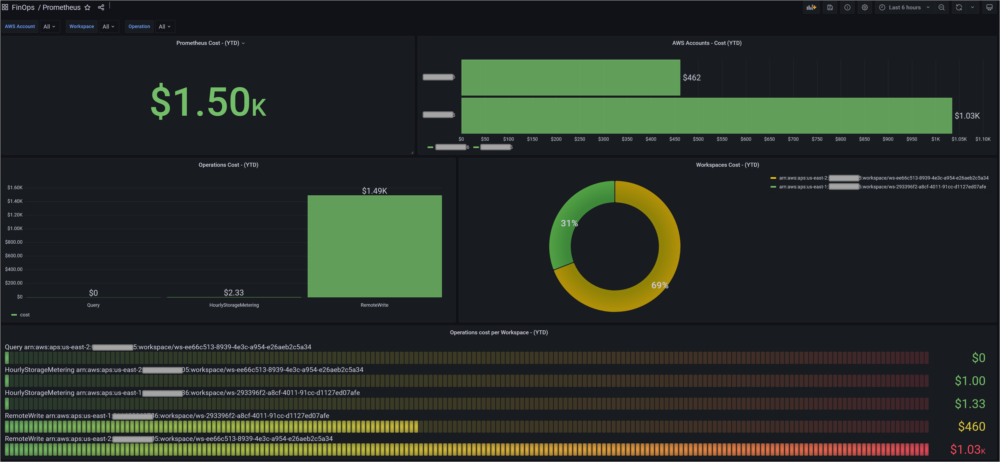

# Amazon Managed Service for Prometheus

Amazon Managed Service for Prometheus のコストと使用量のビジュアルにより、個々の AWS アカウント、AWS リージョン、特定の Prometheus ワークスペースインスタンスにおけるコストのほか、RemoteWrite、Query、HourlyStorageMetering などのオペレーションのインサイトを得ることができます。

コストと使用量データを視覚化および分析するには、カスタム Athena ビューを作成する必要があります。

1. 進める前に、[実装の概要][cid-implement] で言及されている CUR (ステップ #1) を作成し、AWS 構成テンプレート (ステップ #2) をデプロイしたことを確認してください。

2. 次に、以下のクエリを使用して、新しい Amazon Athena [ビュー][view] を作成します。このクエリは、組織内のすべての AWS アカウントにおける Amazon Managed Service for Prometheus のコストと使用量を取得します。

        CREATE OR REPLACE VIEW "prometheus_cost" AS
        SELECT
        line_item_usage_type
        , line_item_resource_id
        , line_item_operation
        , line_item_usage_account_id
        , month
        , year
        , "sum"(line_item_usage_amount) "Usage"
        , "sum"(line_item_unblended_cost) cost
        FROM
        database.tablename #replace database.tablename with your database and table name
        WHERE ("line_item_product_code" = 'AmazonPrometheus')
        GROUP BY 1, 2, 3, 4, 5, 6

## Amazon Managed Grafana ダッシュボードの作成

Amazon Managed Grafana を使用すると、Grafana ワークスペースコンソールの AWS データソース構成オプションを使用して、Athena をデータソースとして追加できます。この機能により、既存の Athena アカウントを検出し、Athena へのアクセスに必要な認証情報の構成を管理することで、Athena をデータソースとして追加することが簡単になります。Athena データソースを使用するための前提条件については、[前提条件][Prerequisites] を参照してください。

以下の **Grafana ダッシュボード** は、AWS Organization 内のすべての AWS アカウントにおける Amazon Managed Service for Prometheus のコストと使用量を、個々の Prometheus ワークスペースインスタンスのコストや RemoteWrite、Query、HourlyStorageMetering などのオペレーションとともに示しています。

Grafana のダッシュボードは JSON オブジェクトで表され、ダッシュボードのメタデータが格納されます。ダッシュボードのメタデータには、ダッシュボードのプロパティ、パネルのメタデータ、テンプレート変数、パネルクエリなどが含まれます。上記ダッシュボードの JSON テンプレートにアクセスするには、[こちら](AmazonPrometheus.json) を参照してください。

このダッシュボードを使用することで、Organization 内の AWS アカウントにおける Amazon Managed Service for Prometheus のコストと使用量を特定できるようになりました。要件に合わせてビジュアルを構築するために、他の Grafana の [ダッシュボードパネル][panels] を使用できます。

[Prerequisites]: https://docs.aws.amazon.com/grafana/latest/userguide/Athena-prereq.html
[view]: https://athena-in-action.workshop.aws/30-basics/303-create-view.html
[panels]: https://docs.aws.amazon.com/grafana/latest/userguide/Grafana-panels.html
[cid-implement]: ../../../guides/cost/cost-visualization/cost.md#implementation
