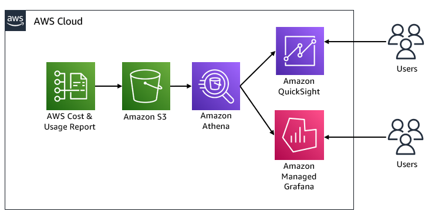

# AWS Observability サービスとコスト

オブザーバビリティスタックへの投資に伴い、定期的にオブザーバビリティ製品の**コスト**を監視することが重要です。これにより、必要なコストのみが発生していることと、不要なリソースに対する過剰な支出がないことを確認できます。

## コスト最適化のための AWS ツール

ほとんどの組織の主要な焦点は、クラウド上での IT インフラストラクチャのスケーリングに置かれていますが、通常、実際の、または差し迫ったクラウド支出を認識していない、準備ができていない、管理されていない状態です。時間の経過とともにコストを追跡、報告、分析するのに役立つように、AWS はいくつかのコスト最適化ツールを提供しています。

[AWS Cost Explorer][cost-explorer] - 時間の経過とともに AWS の支出パターンを確認し、将来のコストを予測し、さらなる調査が必要な領域を特定し、リザーブドインスタンスの利用状況を確認し、リザーブドインスタンスのカバレッジを確認し、リザーブドインスタンスの推奨を取得します。

[AWS Cost and Usage Report(CUR)][CUR] – アカウント間の時間単位の AWS 使用状況の詳細な生データファイルで、Do-It-Yourself(DIY)分析に使用されます。AWS Cost and Usage Report には、使用しているサービスに応じて入力される動的な列があります。

## アーキテクチャの概要: AWS コストと使用状況レポートの視覚化

Amazon Managed Grafana または Amazon QuickSight で、AWS のコストと使用状況のダッシュボードを構築できます。次のアーキテクチャ図は、両方のソリューションを示しています。

*アーキテクチャ図*

## クラウドインテリジェンスダッシュボード

[Cloud Intelligence Dashboards][cid] は、AWS コストと使用状況レポート (CUR) をベースに構築された [Amazon QuickSight][quicksight] ダッシュボードのコレクションです。これらのダッシュボードは、自身のコスト管理と最適化 (FinOps) ツールとして機能します。AWS の使用状況とコストの詳細なビューを取得するのに役立つ、詳細で粒度の細かい推奨駆動型のダッシュボードが得られます。

### 実装

1.	[Amazon Athena][amazon-athnea] インテグレーションを有効にした [CUR レポート][cur-report] を作成します。
*初期設定時に、AWS が Amazon S3 バケットにレポートの配信を開始するまでに最大 24 時間かかる場合があります。レポートは 1 日に 1 度配信されます。Athena インテグレーション用に設定した Cost and Usage Report を Athena と統合し、自動化するために、AWS はいくつかの主要なリソースとレポート用の AWS CloudFormation テンプレートを提供しています。*

2.	[AWS CloudFormation テンプレート][cloudformation] をデプロイします。
*このテンプレートには、AWS Glue クローラー、AWS Glue データベース、AWS Lambda イベントが含まれています。この時点で、Athena のテーブルを使用して CUR データにクエリを実行できるようになります。*

    - CUR データに直接 [Amazon Athena][athena-query] クエリを実行します。
*データに対して Athena クエリを実行するには、まず Athena コンソールを使用して AWS がデータの更新を行っているか確認し、次に Athena コンソールでクエリを実行します。*

3.	Cloud Intelligence ダッシュボードをデプロイします。
    - マニュアルデプロイの場合は、AWS Well-Architected の **[Cost Optimization ラボ][cost-optimization-lab]** を参照してください。
    - 自動デプロイの場合は、[GitHub リポジトリ][GitHub-repo] を参照してください。

Cloud Intelligence ダッシュボードは、財務チーム、経営陣、IT マネージャーにとって大変便利です。しかし、お客様からよくいただくご質問の 1 つが、Amazon CloudWatch、AWS X-Ray、Amazon Managed Service for Prometheus、Amazon Managed Grafana などの個々の AWS Observability 製品のコストについての洞察の得方です。

次のセクションでは、これらの製品のコストと使用状況を深く掘り下げます。あらゆる規模の企業が、この先取り的なアプローチをクラウドコスト最適化戦略に採用し、パフォーマンスへの影響や運用上のオーバーヘッドなしに、クラウドコスト分析とデータドリブンな意思決定を通じてビジネス効率を向上させることができます。

[cost-explorer]: https://docs.aws.amazon.com/awsaccountbilling/latest/aboutv2/ce-what-is.html
[CUR]: https://docs.aws.amazon.com/cur/latest/userguide/what-is-cur.html
[cid]: https://wellarchitectedlabs.com/cost/200_labs/200_cloud_intelligence/
[quicksight]: https://aws.amazon.com/quicksight/
[cur-report]: https://docs.aws.amazon.com/cur/latest/userguide/cur-create.html
[amazon-athnea]: https://aws.amazon.com/athena/
[cloudformation]: https://docs.aws.amazon.com/cur/latest/userguide/use-athena-cf.html
[athena-query]: https://docs.aws.amazon.com/cur/latest/userguide/cur-ate-run.html
[cost-optimization-lab]: https://www.wellarchitectedlabs.com/cost/200_labs/200_cloud_intelligence/
[GitHub-repo]: https://github.com/aws-samples/aws-cudos-framework-deployment
