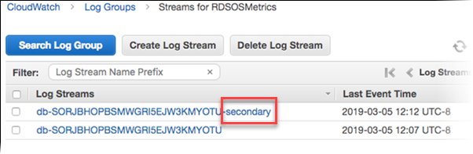
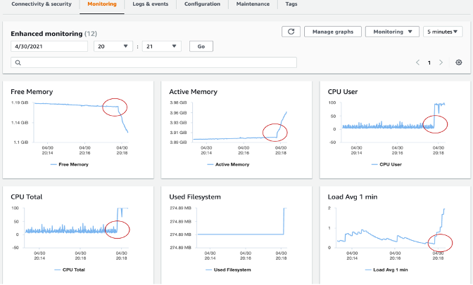
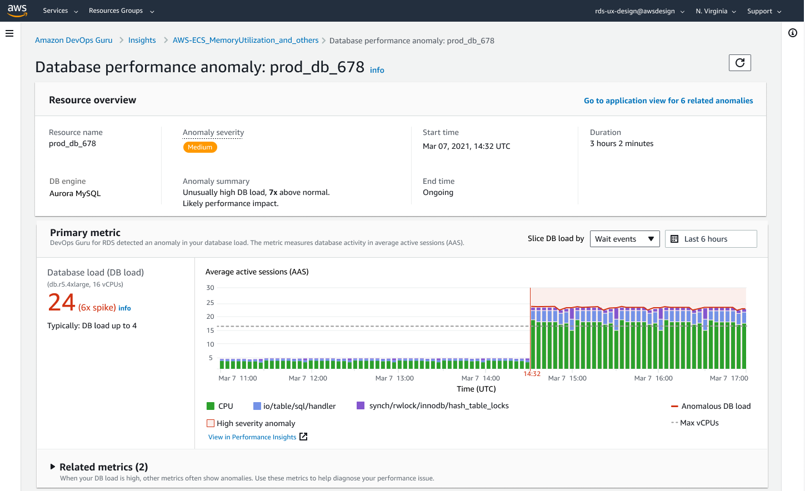

# Amazon RDS と Aurora データベースのモニタリング

モニタリングは、Amazon RDS と Aurora データベースクラスターの信頼性、可用性、パフォーマンスを維持するうえで欠かせない部分です。AWS には Amazon RDS と Aurora データベースリソースの正常性を監視し、重大な問題になる前に検知して、一貫したユーザーエクスペリエンスのためにパフォーマンスを最適化するいくつかのツールが用意されています。このガイドでは、データベースがスムーズに実行されていることを確認するためのオブザーバビリティのベストプラクティスを提供します。

## パフォーマンスガイドライン

ベストプラクティスとして、ワークロードのベースライン パフォーマンスを確立することから始めることをお勧めします。DB インスタンスをセットアップして一般的なワークロードで実行するときに、すべてのパフォーマンス メトリクスの平均値、最大値、最小値をキャプチャします。これをさまざまな間隔(たとえば、1 時間、24 時間、1 週間、2 週間など)で行うことができます。これにより、正常な状態がどのようなものかを把握できます。運用のピーク時間帯とオフピーク時間帯の両方の比較を取得すると役立ちます。この情報を使用して、パフォーマンスが標準レベルを下回っているときを特定できます。

## モニタリングオプション

### Amazon CloudWatch メトリクス

[Amazon CloudWatch](https://docs.aws.amazon.com/AmazonRDS/latest/UserGuide/monitoring-cloudwatch.html) は、[RDS](https://aws.amazon.com/rds/) および [Aurora](https://aws.amazon.com/rds/aurora/) データベースを監視および管理するための重要なツールです。データベースのパフォーマンスに関する貴重な洞察を提供し、問題の特定と迅速な解決に役立ちます。Amazon RDS と Aurora の両方のデータベースは、アクティブな各データベースインスタンスについて 1 分ごとの粒度でメトリクスを CloudWatch に送信します。監視はデフォルトで有効になっており、メトリクスは 15 日間利用できます。RDS と Aurora は、**AWS/RDS** ネームスペースにインスタンスレベルのメトリクスを Amazon CloudWatch に公開します。

CloudWatch メトリクスを使用することで、データベースのパフォーマンスの傾向やパターンを特定し、この情報を使用して構成を最適化し、アプリケーションのパフォーマンスを向上させることができます。ここでは、監視する主要なメトリクスを紹介します。

* **CPU 利用率** - 使用されているコンピュータ処理容量の割合。  
* **DB 接続** - DB インスタンスに接続されているクライアントセッションの数。インスタンスのパフォーマンスと応答時間の低下と合わせて、大量のユーザー接続が見られる場合は、データベース接続を制限することを検討してください。DB インスタンスにとって最適なユーザー接続数は、インスタンスクラスと実行される操作の複雑さによって異なります。データベース接続数を判断するには、DB インスタンスをパラメータグループに関連付けます。
* **空きメモリ** - DB インスタンスで利用できる RAM の量(メガバイト単位)。[監視] タブのメトリクスにおける赤線は、CPU、メモリ、ストレージ メトリクスについて 75% でマークされています。インスタンス メモリの消費が頻繁にその線を超える場合は、ワークロードを確認するかインスタンスをアップグレードする必要があることを示しています。 
* **ネットワークスループット** - DB インスタンスへの流入および DB インスタンスからの流出のネットワーク トラフィックの速度(秒あたりのバイト数)。
* **読み取り/書き込みレイテンシ** - 読み取りまたは書き込み操作の平均時間(ミリ秒)。
* **読み取り/書き込み IOPS** - ディスクの読み取りまたは書き込み操作の平均数(秒あたり)。
* **空きディスク容量** - 現在 DB インスタンスで使用されていないディスク領域の量(メガバイト)。使用済み領域が、合計ディスク領域の 85% を常に超えるかそれに近い場合は、ディスク領域の消費を調査してください。インスタンスからデータを削除したり、データをアーカイブしてシステムの領域を解放したりできるかどうかを確認してください。


パフォーマンス関連の問題をトラブルシューティングする場合、最初のステップは、最も頻繁に使用されている高コストなクエリのチューニングです。これらのクエリをチューニングして、システム リソースへのプレッシャーが下がるかどうかを確認します。詳細については、[クエリのチューニング](https://docs.aws.amazon.com/AmazonRDS/latest/UserGuide/CHAP_BestPractices.html#CHAP_BestPractices.TuningQueries) を参照してください。

クエリがチューニングされているにもかかわらず問題が続く場合は、データベース インスタンス クラスのアップグレードを検討してください。より多くのリソース(CPU、RAM、ディスク領域、ネットワーク帯域幅、I/O 容量)を備えたインスタンスにアップグレードできます。

その後、これらのメトリクスが重要なしきい値に達したときにアラートを設定し、発生した問題をできるだけ早く解決するためのアクションを実行できます。

CloudWatch メトリクスの詳細については、[Amazon RDS 用の Amazon CloudWatch メトリクス](https://docs.aws.amazon.com/ja_jp/AmazonRDS/latest/UserGuide/rds-metrics.html) および [CloudWatch コンソールと AWS CLI での DB インスタンス メトリクスの表示](https://docs.aws.amazon.com/ja_jp/AmazonRDS/latest/UserGuide/metrics_dimensions.html) を参照してください。

#### CloudWatch Logs Insights

[CloudWatch Logs Insights](https://docs.aws.amazon.com/AmazonCloudWatch/latest/logs/AnalyzingLogData.html) を使用すると、Amazon CloudWatch Logs のログデータを対話形式で検索および分析できます。クエリを実行することで、運用上の問題により効率的かつ効果的に対応できます。問題が発生した場合は、CloudWatch Logs Insights を使用して、潜在的な原因を特定し、導入済みの修正を検証できます。

RDS または Aurora データベースクラスターから CloudWatch にログをパブリッシュするには、[Publish logs for Amazon RDS or Aurora for MySQL instances to CloudWatch](https://repost.aws/knowledge-center/rds-aurora-mysql-logs-cloudwatch) を参照してください。

CloudWatch を使用した RDS または Aurora ログの監視の詳細については、[Monitoring Amazon RDS log file](https://docs.aws.amazon.com/AmazonRDS/latest/UserGuide/USER_LogAccess.html) を参照してください。

#### CloudWatch アラーム

データベースクラスターのパフォーマンスが低下した場合を特定するために、主要なパフォーマンスメトリクスを定期的に監視およびアラートする必要があります。[Amazon CloudWatch アラーム](https://docs.aws.amazon.com/ja_jp/AmazonCloudWatch/latest/monitoring/AlarmThatSendsEmail.html) を使用すると、指定した期間にわたって単一のメトリクスを監視できます。メトリクスが指定したしきい値を超えると、Amazon SNS トピックまたは AWS オートスケーリングポリシーに通知が送信されます。CloudWatch アラームは、特定の状態にあるという理由だけでアクションを起動するわけではありません。むしろ、状態が変更され、アラームをトリガーするために指定された期間中に維持されている必要があります。アラームは、アラームの状態変更が発生したときにのみアクションを起動します。アラーム状態であること自体では不十分です。

CloudWatch アラームを設定するには、

* AWS Management Console に移動し、[https://console.aws.amazon.com/rds/]() で Amazon RDS コンソールを開きます。
* ナビゲーションペインで [Databases] を選択し、DB インスタンスを選択します。
* [Logs & events] を選択します。

CloudWatch アラームセクションで、[Create alarm] を選択します。


* [Send notifications] で [Yes] を選択し、[Send notifications to] で [New email or SMS topic] を選択します。
* [Topic name] に通知の名前を入力し、[With these recipients] にカンマ区切りのメールアドレスと電話番号のリストを入力します。
* [Metric] でアラームの統計とメトリクスを選択します。  
* [Threshold] で、メトリクスがしきい値よりも大きいか、小さいか、等しいかを指定し、しきい値を指定します。
* [Evaluation period] で、アラームの評価期間を選択します。 [consecutive period(s) of] で、アラームをトリガーするためにしきい値に達していなければならない期間を選択します。
* [Name of alarm] にアラームの名前を入力します。
* [Create Alarm] を選択します。

アラームが CloudWatch アラームセクションに表示されます。

Multi-AZ DB クラスターレプリカの遅延の Amazon CloudWatch アラームを作成する例は[こちら](https://docs.aws.amazon.com/ja_jp/AmazonRDS/latest/UserGuide/multi-az-db-cluster-cloudwatch-alarm.html)をご覧ください。

#### データベース監査ログ

データベース監査ログは、RDS および Aurora データベースで実行されたすべてのアクションの詳細な記録を提供します。これにより、不正アクセス、データの変更、その他の潜在的に有害なアクティビティを監視できます。データベース監査ログのベストプラクティスを以下に示します。

* すべての RDS および Aurora インスタンスでデータベース監査ログを有効にし、関連するすべてのデータをキャプチャするよう設定します。
* Amazon CloudWatch Logs や Amazon Kinesis Data Streams などの集中ログ管理ソリューションを使用して、データベース監査ログを収集および分析します。 
* データベース監査ログを定期的に監視し、疑わしいアクティビティがあれば迅速に調査および解決するためのアクションを実行します。

データベース監査ログの設定方法の詳細は、[Configuring an Audit Log to Capture database activities for Amazon RDS and Aurora](https://aws.amazon.com/blogs/database/configuring-an-audit-log-to-capture-database-activities-for-amazon-rds-for-mysql-and-amazon-aurora-with-mysql-compatibility/) を参照してください。

#### データベースの遅いクエリとエラーログ

遅いクエリのログは、データベース内の低速なクエリを見つけるのに役立ち、遅さの理由を調査し、必要に応じてクエリをチューニングできます。エラーログは、クエリのエラーを見つけるのに役立ち、それらのエラーによるアプリケーションの変更を見つけるのにも役立ちます。

Amazon CloudWatch Logs Insights (Amazon CloudWatch Logs のログデータを対話的に検索および分析できる) を使用して、CloudWatch ダッシュボードを作成することで、遅いクエリログとエラーログを監視できます。

Amazon RDS のエラーログ、遅いクエリログ、一般ログを有効にして監視するには、[RDS MySQL の遅いクエリログと一般ログの管理](https://repost.aws/knowledge-center/rds-mysql-logs) を参照してください。Aurora PostgreSQL の遅いクエリログを有効にするには、[PostgreSQL 用の遅いクエリログの有効化](https://catalog.us-east-1.prod.workshops.aws/workshops/31babd91-aa9a-4415-8ebf-ce0a6556a216/en-US/postgresql-logs/enable-slow-query-log) を参照してください。

## パフォーマンスインサイトとオペレーティングシステムメトリクス

#### 強化モニタリング

[強化モニタリング](https://docs.aws.amazon.com/ja_jp/AmazonRDS/latest/UserGuide/USER_Monitoring.OS.html) を使用すると、DB インスタンスが実行されているオペレーティングシステム (OS) のリアルタイムの詳細なメトリクスを取得できます。

RDS は、強化モニタリングのメトリクスを Amazon CloudWatch Logs アカウントに配信します。デフォルトでは、これらのメトリクスは 30 日間保存され、Amazon CloudWatch の **RDSOSMetrics** ロググループに保存されます。1 秒から 60 秒の間で粒度を選択するオプションがあります。CloudWatch Logs から CloudWatch でカスタムメトリクスフィルタを作成し、CloudWatch ダッシュボード上にグラフを表示できます。



強化モニタリングには、OS レベルのプロセスリストも含まれます。現在、強化モニタリングは次のデータベースエンジンで利用できます。

* MariaDB
* Microsoft SQL Server  
* MySQL
* Oracle
* PostgreSQL

**CloudWatch と強化モニタリングの違い**

CloudWatch は、DB インスタンスのハイパーバイザから CPU 使用率に関するメトリクスを収集します。対照的に、強化モニタリングは、DB インスタンス上のエージェントからそのメトリクスを収集します。ハイパーバイザは仮想マシン (VM) を作成および実行します。ハイパーバイザを使用すると、インスタンスはメモリと CPU を仮想的に共有することにより、複数のゲスト VM をサポートできます。ハイパーバイザ層がわずかな処理を実行するため、CloudWatch と強化モニタリングの測定値に違いがある場合があります。DB インスタンスでより小さいインスタンスクラスを使用している場合、違いは大きくなる可能性があります。このシナリオでは、複数の仮想マシン (VM) が物理インスタンス上のハイパーバイザ層によって管理されている可能性が高くなります。


強化モニタリングで利用できるすべてのメトリクスの詳細については、[強化モニタリングの OS メトリクス](https://docs.aws.amazon.com/ja_jp/AmazonRDS/latest/UserGuide/USER_Monitoring-Available-OS-Metrics.html) を参照してください。




#### パフォーマンスインサイト

[Amazon RDS Performance Insights](https://aws.amazon.com/rds/performance-insights/) は、データベースの負荷をすばやく評価し、アクションを取る必要があるタイミングと場所を判断するのに役立つデータベースパフォーマンスチューニングおよびモニタリング機能です。Performance Insights ダッシュボードを使用すると、db クラスターのデータベース負荷を視覚化し、待ち時間、SQL ステートメント、ホスト、ユーザー別に負荷をフィルタリングできます。これにより、症状を追跡するのではなく、根本原因を特定できます。Performance Insights は、アプリケーションのパフォーマンスに影響を与えない軽量のデータ収集方法を使用し、どの SQL ステートメントが負荷の原因であるかと、なぜそうなのかを簡単に確認できるようにします。

Performance Insights は 7 日間の無料のパフォーマンス履歴保持を提供しており、料金を支払うことで最大 2 年間まで延長できます。Performance Insights は、RDS 管理コンソールまたは AWS CLI から有効にできます。Performance Insights はパブリック API も公開しているため、カスタマーやサードパーティは Performance Insights を独自のカスタムツールと統合できます。

!!! 注意
	現在、RDS Performance Insights は Aurora (PostgreSQL および MySQL 互換エディション)、Amazon RDS for PostgreSQL、MySQL、MariaDB、SQL Server、Oracle 専用です。

**DBLoad** は、平均アクティブセッション数を表す主要メトリクスです。Performance Insights では、このデータは **db.load.avg** メトリクスとしてクエリされます。


Aurora での Performance Insights の使用方法の詳細は、以下を参照してください。 [Amazon Aurora でのパフォーマンスインサイトを使用した DB 負荷のモニタリング](https://docs.aws.amazon.com/ja_jp/AmazonRDS/latest/AuroraUserGuide/USER_PerfInsights.html)。

## オープンソースのオブザーバビリティツール

#### Amazon Managed Grafana

[Amazon Managed Grafana](https://aws.amazon.com/grafana/) は、RDS および Aurora データベースからのデータを視覚化および分析するのが簡単な、完全マネージドサービスです。

Amazon CloudWatch の **AWS/RDS ネームスペース** には、Amazon RDS および Amazon Aurora で実行されているデータベースエンティティに適用される主要なメトリクスが含まれています。Amazon Managed Grafana で RDS/Aurora データベースの正常性と潜在的なパフォーマンスの問題を視覚化および追跡するには、CloudWatch データソースを活用できます。


現時点では、CloudWatch で利用できるのは基本的な Performance Insights メトリクスのみであり、データベースパフォーマンスを分析し、データベース内のボトルネックを特定するには不十分です。Amazon Managed Grafana で RDS Performance Insight メトリクスを視覚化し、シングルパネオブグラスの可視性を実現するには、カスタム Lambda 関数を使用してすべての RDS Performance insights メトリクスを収集し、カスタム CloudWatch メトリクスネームスペースに公開できます。これらのメトリクスが Amazon CloudWatch で利用できるようになったら、Amazon Managed Grafana で視覚化できます。

RDS Performance Insights メトリクスを収集するカスタム Lambda 関数をデプロイするには、次の GitHub リポジトリをクローンし、install.sh スクリプトを実行します。

```
$ git clone https://github.com/aws-observability/observability-best-practices.git
$ cd sandbox/monitor-aurora-with-grafana

$ chmod +x install.sh
$ ./install.sh
```

上記のスクリプトは、AWS CloudFormation を使用してカスタム Lambda 関数と IAM ロールをデプロイします。Lambda 関数は 10 分ごとに自動的にトリガーされ、RDS Performance Insights API を呼び出してカスタムメトリクスを /AuroraMonitoringGrafana/PerformanceInsights という名前のカスタムネームスペースにパブリッシュします。


カスタム Lambda 関数のデプロイと Grafana ダッシュボードの詳細な手順については、[Amazon Managed Grafana での Performance Insights](https://aws.amazon.com/blogs/mt/monitoring-amazon-rds-and-amazon-aurora-using-amazon-managed-grafana/) を参照してください。  

データベースで意図しない変更が発生した場合にすばやく特定し、アラートを使用して通知することで、サービス中断を最小限に抑えるためのアクションを実行できます。Amazon Managed Grafana は、SNS、Slack、PagerDuty など、アラート通知を送信できる複数の通知チャネルをサポートしています。[Grafana アラーティング](https://docs.aws.amazon.com/grafana/latest/userguide/alerts-overview.html) では、Amazon Managed Grafana でのアラートの設定方法の詳細を確認できます。


<figure class="video_container">
<iframe allow="accelerometer; autoplay; clipboard-write; encrypted-media; gyroscope; picture-in-picture; web-share" allowfullscreen="" frameborder="0" height="315" src="https://www.youtube.com/embed/Uj9UJ1mXwEA" title="YouTube video player" width="560"></iframe>
</figure>

## AIOps - マシンラーニングベースのパフォーマンスボトルネック検出

#### Amazon DevOps Guru for RDS

[Amazon DevOps Guru for RDS](https://aws.amazon.com/devops-guru/features/devops-guru-for-rds/) を使用すると、パフォーマンスのボトルネックや運用上の問題のためにデータベースを監視できます。Performance Insights メトリクスを使用し、機械学習(ML)で分析して、パフォーマンスの問題に関するデータベース固有の分析を提供し、修正アクションを推奨します。DevOps Guru for RDS は、ホストリソースの過剰利用、データベースのボトルネック、SQL クエリの誤動作など、さまざまなパフォーマンス関連のデータベースの問題を特定および分析できます。 問題または異常な動作が検出されると、DevOps Guru for RDS は DevOps Guru コンソールに調査結果を表示し、[Amazon EventBridge](https://aws.amazon.com/jp/eventbridge/) または [Amazon Simple Notification Service(SNS)](https://aws.amazon.com/jp/sns/) を使用して通知を送信するため、DevOps または SRE チームがパフォーマンスと運用上の問題に対してリアルタイムでアクションを実行し、顧客への影響が及ぶ前に対処できます。

DevOps Guru for RDS は、データベース メトリクスのベースラインを確立します。ベースラインの確立には、一定期間データベース パフォーマンス メトリクスを分析して、通常の動作を確立することが含まれます。Amazon DevOps Guru for RDS は、機械学習(ML)を使用して、確立されたベースラインに対する異常を検出します。ワークロード パターンが変更された場合、DevOps Guru for RDS は新しい通常動作に対して異常を検出するために使用される新しいベースラインを確立します。

!!! 注意
	新しいデータベース インスタンスの場合、Amazon DevOps Guru for RDS は、データベースの使用パターンの分析と通常の動作の確立が必要なため、最初のベースラインを確立するまでに最大 2 日かかります。





開始方法の詳細については、[機械学習を使用した Amazon Aurora 関連の問題の検出、診断、解決のための新しい Amazon DevOps Guru for RDS](https://aws.amazon.com/jp/blogs/news/new-amazon-devops-guru-for-rds-to-detect-diagnose-and-resolve-amazon-aurora-related-issues-using-ml/) をご覧ください。

<!-- blank line -->
<figure class="video_container">
<iframe allow="accelerometer; autoplay; clipboard-write; encrypted-media; gyroscope; picture-in-picture; web-share" allowfullscreen="" frameborder="0" height="315" src="https://www.youtube.com/embed/N3NNYgzYUDA" title="YouTube video player" width="560"></iframe>
</figure>
<!-- blank line -->

## 監査とガバナンス

#### AWS CloudTrail ログ

[AWS CloudTrail](https://docs.aws.amazon.com/awscloudtrail/latest/userguide/cloudtrail-user-guide.html) は、RDS でユーザー、ロール、AWS サービスによって実行されたアクションの記録を提供します。CloudTrail は、コンソールからの呼び出しや RDS API オペレーションへのコード呼び出しを含む、RDS のすべての API 呼び出しをイベントとしてキャプチャします。CloudTrail で収集した情報を使用することで、RDS に対して行われたリクエスト、そのリクエストが行われた IP アドレス、リクエストを行った人、いつリクエストが行われたかなどの詳細を確認できます。 詳細については、[AWS CloudTrail での Amazon RDS API 呼び出しのモニタリング](https://docs.aws.amazon.com/AmazonRDS/latest/UserGuide/logging-using-cloudtrail.html) を参照してください。

詳細は、[AWS CloudTrail での Amazon RDS API 呼び出しのモニタリング](https://docs.aws.amazon.com/AmazonRDS/latest/UserGuide/logging-using-cloudtrail.html)を参照してください。

## 詳細情報の参照

[ブログ - Amazon Managed Grafana を使用した RDS と Aurora データベースの監視](https://aws.amazon.com/blogs/mt/monitoring-amazon-rds-and-amazon-aurora-using-amazon-managed-grafana/)

[動画 - Amazon Managed Grafana を使用した RDS と Aurora データベースの監視](https://www.youtube.com/watch?v=Uj9UJ1mXwEA)

[ブログ - Amazon CloudWatch を使用した RDS と Aurora データベースの監視](https://aws.amazon.com/blogs/database/creating-an-amazon-cloudwatch-dashboard-to-monitor-amazon-rds-and-amazon-aurora-mysql/)

[ブログ - Amazon CloudWatch Logs、AWS Lambda、Amazon SNS を使用した Amazon RDS のプロアクティブなデータベース監視の構築](https://aws.amazon.com/blogs/database/build-proactive-database-monitoring-for-amazon-rds-with-amazon-cloudwatch-logs-aws-lambda-and-amazon-sns/)

[公式ドキュメント - Amazon Aurora 監視ガイド](https://docs.aws.amazon.com/AmazonRDS/latest/AuroraUserGuide/MonitoringOverview.html)

[ハンズオンワークショップ - Amazon Aurora での SQL パフォーマンスの観測と特定](https://awsauroralabsmy.com/provisioned/perf-observability/)
