# Amazon EC2 のモニタリングとオブザーバビリティ

## はじめに

継続的なモニタリングとオブザーバビリティは、クラウド環境の機動性を高め、顧客体験を改善し、リスクを軽減します。Wikipedia によると、[オブザーバビリティ](https://en.wikipedia.org/wiki/Observability) とは、システムの内部状態を外部出力の知識から推測できる程度のことをいいます。オブザーバビリティという用語自体は制御理論の分野から来ており、基本的にはシステムが生成している外部シグナル/出力を学習することによって、そのシステム内のコンポーネントの内部状態を推測できることを意味します。

モニタリングとオブザーバビリティの違いは、モニタリングはシステムが動作しているかどうかを教えてくれるのに対し、オブザーバビリティはシステムがなぜ動作しないのかを教えてくれることです。モニタリングは通常反応的な対策であるのに対し、オブザーバビリティの目的は主要業績評価指標を積極的に改善できるようにすることです。観測されない限り、システムを制御したり最適化したりすることはできません。メトリクス、ログ、トレースの収集を通じたワークロードの計装と、適切なモニタリングおよびオブザーバビリティ ツールを使用した意味のあるインサイトと詳細なコンテキストの取得により、お客様は環境を制御および最適化できます。

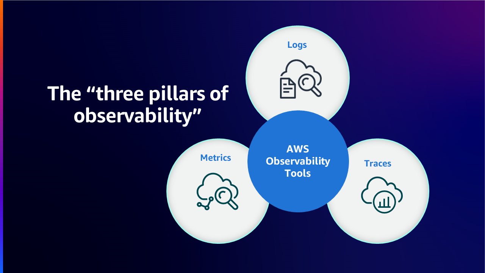

AWS では、お客様がモニタリングからオブザーバビリティへと変革し、エンドツーエンドのサービス可視性を得られるよう支援しています。この記事では、Amazon Elastic Compute Cloud (Amazon EC2) に焦点を当て、AWS クラウド環境における同サービスのモニタリングとオブザーバビリティを、AWS ネイティブおよびオープンソースのツールを通じて改善するためのベストプラクティスについて説明します。

## Amazon EC2

[Amazon Elastic Compute Cloud](https://aws.amazon.com/ec2/)(Amazon EC2) は、Amazon Web Services(AWS) クラウドにおける高度にスケーラブルなコンピューティングプラットフォームです。Amazon EC2 は前もってハードウェアへの投資の必要性をなくすので、顧客は使用した分のみを支払いながら、アプリケーションをより速く開発およびデプロイできます。EC2 が提供する主な機能には、インスタンスと呼ばれる仮想コンピューティング環境、Amazon マシンイメージと呼ばれるインスタンスの事前設定テンプレート、CPU、メモリ、ストレージ、ネットワーキング容量などのリソースの様々な構成がインスタンスタイプとして利用可能です。

## AWS ネイティブツールを使用したモニタリングとオブザーバビリティ

### Amazon CloudWatch

[Amazon CloudWatch](https://aws.amazon.com/cloudwatch/) は、AWS、ハイブリッド、オンプレミスのアプリケーションとインフラストラクチャリソースのためのデータと実行可能なインサイトを提供するモニタリングと管理サービスです。CloudWatch はログ、メトリクス、イベントの形式でモニタリングと運用データを収集します。また、AWS とオンプレミスのサーバーで実行される AWS リソース、アプリケーション、サービスの統合ビューを提供します。CloudWatch はシステム全体のリソース利用率、アプリケーションパフォーマンス、運用状態の可視化を支援します。

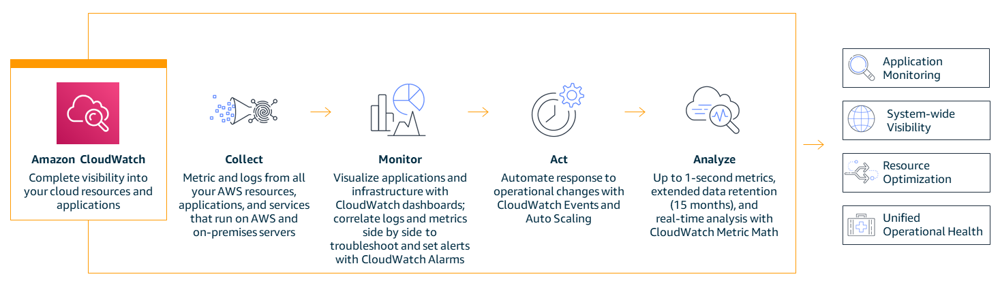

### Unified CloudWatch Agent

Unified CloudWatch Agent は、x86-64 と ARM64 アーキテクチャを利用したほとんどのオペレーティング システムをサポートする MIT ライセンスのオープンソース ソフトウェアです。CloudWatch Agent は、オペレーティング システム間のハイブリッド環境にある Amazon EC2 インスタンスとオンプレミスのサーバーからシステム レベルのメトリクスを収集したり、アプリケーションやサービスからカスタム メトリクスを取得したり、Amazon EC2 インスタンスとオンプレミスのサーバーからログを収集するのに役立ちます。

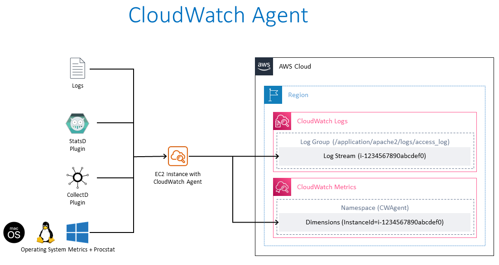

### Amazon EC2 インスタンスへの CloudWatch エージェントのインストール

#### コマンドラインによるインストール

CloudWatch エージェントは、[コマンドライン](https://docs.aws.amazon.com/ja_jp/AmazonCloudWatch/latest/monitoring/installing-cloudwatch-agent-commandline.html)を通じてインストールできます。さまざまなアーキテクチャとさまざまなオペレーティング システム向けの必要なパッケージは、[ダウンロード](https://docs.aws.amazon.com/ja_jp/AmazonCloudWatch/latest/monitoring/download-cloudwatch-agent-commandline.html) 用に用意されています。CloudWatch エージェントが Amazon EC2 インスタンスから情報を読み取り、CloudWatch に書き込むことを許可する必要な [IAM ロール](https://docs.aws.amazon.com/ja_jp/AmazonCloudWatch/latest/monitoring/create-iam-roles-for-cloudwatch-agent-commandline.html) を作成します。必要な IAM ロールが作成されたら、必要な Amazon EC2 インスタンス上で [CloudWatch エージェントをインストールして実行](https://docs.aws.amazon.com/ja_jp/AmazonCloudWatch/latest/monitoring/install-CloudWatch-Agent-commandline-fleet.html) できます。

!!! note "参考資料" 

    ドキュメント: [コマンドラインを使用した CloudWatch エージェントのインストール](https://docs.aws.amazon.com/ja_jp/AmazonCloudWatch/latest/monitoring/installing-cloudwatch-agent-commandline.html)

    AWS Observability ワークショップ: [CloudWatch エージェントのセットアップとインストール](https://catalog.workshops.aws/observability/ja-JP/aws-native/ec2-monitoring/install-ec2)

#### AWS Systems Manager を使用したインストール

CloudWatch エージェントは、[AWS Systems Manager](https://docs.aws.amazon.com/ja_jp/AmazonCloudWatch/latest/monitoring/installing-cloudwatch-agent-ssm.html) を使用してもインストールできます。CloudWatch エージェントが Amazon EC2 インスタンスから情報を読み取り、それを CloudWatch に書き込み、AWS Systems Manager と通信できるようにする必要な IAM ロールを作成します。EC2 インスタンスに CloudWatch エージェントをインストールする前に、必要な EC2 インスタンスで [SSM エージェントをインストールまたは更新](https://docs.aws.amazon.com/ja_jp/AmazonCloudWatch/latest/monitoring/download-CloudWatch-Agent-on-EC2-Instance-SSM-first.html#update-SSM-Agent-EC2instance-first) します。CloudWatch エージェントは AWS Systems Manager を通じてダウンロードできます。どのメトリクス(カスタムメトリクスを含む)とログを収集するかを指定する JSON 設定ファイルを作成できます。必要な IAM ロールが作成され、設定ファイルが作成されたら、必要な Amazon EC2 インスタンスで CloudWatch エージェントをインストールして実行できます。

!!! note "参考文献"

    参考文献:
    ドキュメント: [AWS Systems Manager を使用した CloudWatch エージェントのインストール](https://docs.aws.amazon.com/ja_jp/AmazonCloudWatch/latest/monitoring/installing-cloudwatch-agent-ssm.html)

    AWS Observability ワークショップ: [AWS Systems Manager を使用した CloudWatch エージェントのインストール - クイックセットアップ](https://catalog.workshops.aws/observability/ja-JP/aws-native/ec2-monitoring/install-ec2/ssm-quicksetup)

    関連ブログ記事: [AWS Systems Manager との統合による新しい Amazon CloudWatch エージェント – Linux と Windows の統一されたメトリクスとログの収集](https://aws.amazon.com/jp/blogs/news/new-amazon-cloudwatch-agent-with-aws-systems-manager-integration-unified-metrics-log-collection-for-linux-windows/)

    YouTube 動画: [CloudWatch エージェントで Amazon EC2 インスタンスからメトリクスとログを収集する](https://www.youtube.com/watch?v=vAnIhIwE5hY)

#### ハイブリッド環境でのオンプレミスサーバーへの CloudWatch エージェントのインストール

サーバーがオンプレミスとクラウドの両方に存在するハイブリッドなお客様の環境では、Amazon CloudWatch で統一されたオブザーバビリティを実現するために、同様のアプローチを取ることができます。CloudWatch エージェントは、Amazon S3 から直接ダウンロードするか、AWS Systems Manager を通じてダウンロードできます。オンプレミスのサーバーから Amazon CloudWatch にデータを送信するための IAM ユーザーを作成します。オンプレミスのサーバーにエージェントをインストールして起動します。

!!! note "参考"

    ドキュメント: [オンプレミスサーバーへの CloudWatch エージェントのインストール](https://docs.aws.amazon.com/ja_jp/AmazonCloudWatch/latest/monitoring/install-CloudWatch-Agent-on-premise.html)

### Amazon CloudWatch を使用した Amazon EC2 インスタンスのモニタリング

Amazon EC2 インスタンスとアプリケーションの信頼性、可用性、パフォーマンスを維持するための重要な点は、[継続的なモニタリング](https://catalog.workshops.aws/observability/ja-JP/aws-native/ec2-monitoring)です。必要な Amazon EC2 インスタンスに CloudWatch エージェントをインストールすることで、インスタンスの健全性とパフォーマンスをモニタリングし、安定した環境を維持する必要があります。基本的に、CPU 利用率、ネットワーク利用率、ディスクパフォーマンス、ディスクの読み書き、メモリ利用率、ディスクスワップ利用率、ディスク空き容量、ページファイル利用率、EC2 インスタンスのログ収集が推奨されます。

#### 基本と詳細モニタリング

Amazon CloudWatch は、Amazon EC2 からの生データを収集し、リアルタイムに近い読みやすいメトリクスに変換します。
デフォルトでは、Amazon EC2 はインスタンスの基本モニタリングとして、5 分ごとにメトリクスデータを CloudWatch に送信します。
インスタンスのメトリクスデータを 1 分ごとに CloudWatch に送信するには、インスタンスで[詳細モニタリング](https://docs.aws.amazon.com/ja_jp/AWSEC2/latest/UserGuide/using-cloudwatch-new.html) を有効にできます。

#### モニタリングの自動化ツールと手動ツール

AWS は、Amazon EC2 のモニタリングと問題が発生した場合の報告を支援する自動化ツールと手動ツールの 2 種類を提供しています。これらのツールの一部は少しの設定が必要で、いくつかは手動の介入が必要です。
[自動化モニタリングツール](https://docs.aws.amazon.com/AWSEC2/latest/UserGuide/monitoring_automated_manual.html#monitoring_automated_tools) には、AWS システムステータスチェック、インスタンスステータスチェック、Amazon CloudWatch アラーム、Amazon EventBridge、Amazon CloudWatch Logs、CloudWatch エージェント、Microsoft System Center Operations Manager 用 AWS Management Pack が含まれます。[手動モニタリング](https://docs.aws.amazon.com/AWSEC2/latest/UserGuide/monitoring_automated_manual.html#monitoring_manual_tools) ツールには、この記事で下の個別のセクションで詳しく見ていくダッシュボードが含まれます。

!!! note "参照"

    ドキュメント: [自動化および手動によるモニタリング](https://docs.aws.amazon.com/AWSEC2/latest/UserGuide/monitoring_automated_manual.html)

### CloudWatch エージェントを使用した Amazon EC2 インスタンスからのメトリクス

メトリクスは CloudWatch における基本的な概念です。メトリクスとは、CloudWatch に公開される時系列のデータポイントの集まりを表します。メトリクスを時間とともに値が変化する変数と考え、データポイントをその変数の値を時系列で表したものと考えることができます。たとえば、特定の EC2 インスタンスの CPU 使用率は、Amazon EC2 が提供するメトリクスの 1 つです。 

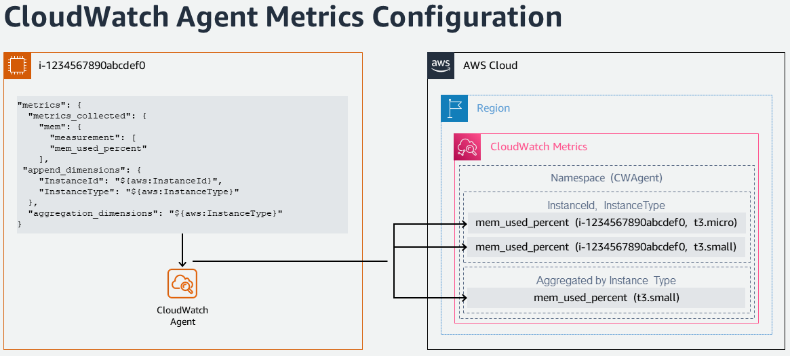

#### CloudWatch エージェントを使用したデフォルトメトリクス

Amazon CloudWatch は、Amazon EC2 インスタンスからメトリクスを収集します。これらのメトリクスは、AWS Management Console、AWS CLI、API を通じて表示できます。利用可能なメトリクスは、5 分間隔で収集される基本モニタリング、または詳細モニタリングが有効になっている場合は 1 分間隔で収集されるデータポイントです。

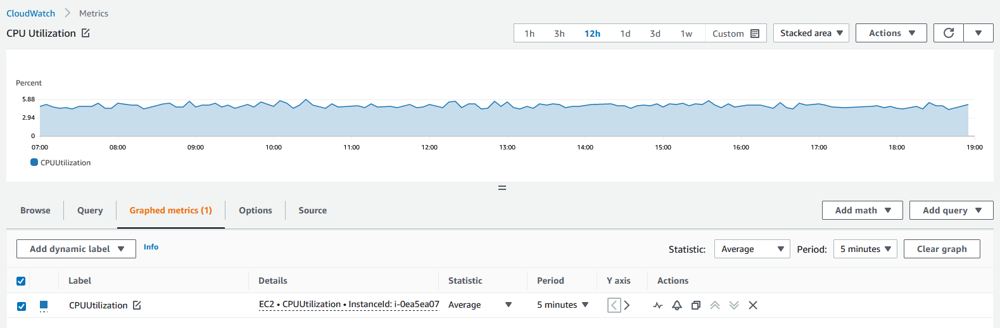

#### CloudWatch エージェントを使用したカスタムメトリクス

お客様は、API や CLI を通じて、標準の 1 分間隔の解像度または 1 秒間隔の高解像度のグラニュラリティを使用して、独自のカスタムメトリクスを CloudWatch に公開することもできます。
統合された CloudWatch エージェントは、[StatsD](https://docs.aws.amazon.com/AmazonCloudWatch/latest/monitoring/CloudWatch-Agent-custom-metrics-statsd.html) と [collectd](https://docs.aws.amazon.com/AmazonCloudWatch/latest/monitoring/CloudWatch-Agent-custom-metrics-collectd.html) を通じてカスタムメトリクスの取得をサポートしています。

アプリケーションやサービスからのカスタムメトリクスは、StatsD プロトコルを使用した CloudWatch エージェントで取得できます。StatsD は、さまざまなアプリケーションからメトリクスを収集できる一般的なオープンソースのソリューションです。StatsD は、Linux ベースおよび Windows ベースのサーバーの両方をサポートしている独自のメトリクスを計装するのに特に便利です。

アプリケーションやサービスからのカスタムメトリクスは、collectd プロトコルを使用した CloudWatch エージェントでも取得できます。これは、Linux サーバーでのみサポートされている一般的なオープンソースのソリューションで、さまざまなアプリケーションのシステム統計を収集できるプラグインがあります。CloudWatch エージェントがすでに収集できるシステムメトリクスと collectd からの追加メトリクスを組み合わせることで、システムとアプリケーションをより適切に監視、分析、トラブルシューティングできます。

#### CloudWatch エージェントを使用した追加のカスタムメトリクス

CloudWatch エージェントは、EC2 インスタンスからカスタムメトリクスを収集することをサポートしています。いくつかの一般的な例は以下のとおりです。

- Elastic Network Adapter(ENA)を使用する Linux 上で実行されている EC2 インスタンスのネットワークパフォーマンスメトリクス。
- Linux サーバーからの Nvidia GPU メトリクス。  
- Linux と Windows のサーバー上の個々のプロセスから procstat プラグインを使用したプロセスメトリクス。

### CloudWatch エージェントを使用した Amazon EC2 インスタンスからのログ

Amazon CloudWatch Logs は、既存のシステム、アプリケーション、カスタムのログファイルを使用して、システムとアプリケーションをほぼリアルタイムで監視およびトラブルシューティングするのに役立ちます。Amazon EC2 インスタンスやオンプレミスのサーバーから CloudWatch にログを収集するには、統合 CloudWatch エージェントをインストールする必要があります。最新の統合 CloudWatch エージェントが推奨されています。これはログと高度なメトリクスの両方を収集でき、さまざまなオペレーティングシステムをサポートしているためです。インスタンスがインスタンスメタデータサービスバージョン 2 (IMDSv2) を使用している場合は、統合エージェントが必要です。

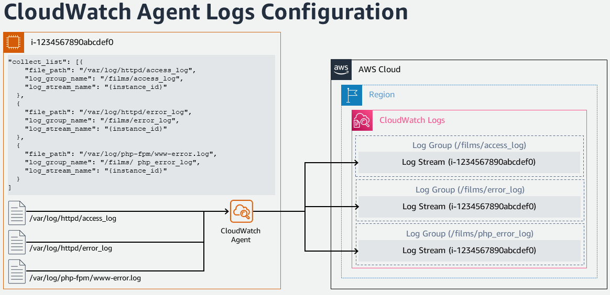

統合 CloudWatch エージェントによって収集されたログは、Amazon CloudWatch Logs で処理および保存されます。ログは Windows または Linux サーバー、および Amazon EC2 とオンプレミスの両方のサーバーから収集できます。CloudWatch エージェント構成ウィザードを使用して、CloudWatch エージェントの設定を定義する構成 JSON ファイルを設定できます。

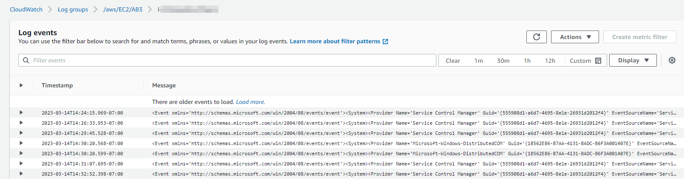

!!! note "参考"

    AWS Observability ワークショップ: [ログ](https://catalog.workshops.aws/observability/ja-JP/aws-native/logs)

### Amazon EC2 インスタンスイベント

イベントは、AWS 環境の変更を示します。AWS リソースとアプリケーションは、状態が変化したときにイベントを生成できます。CloudWatch Events は、AWS リソースとアプリケーションの変更を説明するシステムイベントの近リアルタイムストリームを提供します。たとえば、Amazon EC2 は EC2 インスタンスの状態が保留から実行中に変わるとイベントを生成します。カスタマーは、カスタムアプリケーションレベルのイベントを生成し、それらを CloudWatch Events に発行することもできます。

カスタマーは、[ステータスチェックとスケジュールされたイベントを表示することで、Amazon EC2 インスタンスのステータスを監視できます](https://docs.aws.amazon.com/ja_jp/AWSEC2/latest/UserGuide/monitoring-instances-status-check.html)。ステータスチェックは、Amazon EC2 によって実行された自動チェックの結果を提供します。これらの自動チェックは、特定の問題がインスタンスに影響を与えているかどうかを検出します。ステータスチェック情報は、Amazon CloudWatch が提供するデータと合わせて、各インスタンスの詳細な運用可視性を提供します。

#### Amazon EC2 インスタンスイベントの Amazon EventBridge ルール

Amazon CloudWatch Events は、Amazon EventBridge を使用してシステムイベントを自動化し、リソースの変更や問題などのアクションに自動的に対応できます。Amazon EC2 を含む AWS サービスからのイベントは、リアルタイムで CloudWatch Events に配信され、イベントがルールと一致したときに適切なアクションを実行するための EventBridge ルールを作成できます。
アクションとして、AWS Lambda 関数の呼び出し、Amazon EC2 Run Command の呼び出し、イベントの Amazon Kinesis Data Streams へのリレー、AWS Step Functions ステートマシンのアクティブ化、Amazon SNS トピックへの通知、Amazon SQS キューへの通知、インシデント対応アプリケーションや SIEM ツールへのパイプなどがあります。

!!! note "参照"

    AWS Observability ワークショップ: [インシデント対応 - EventBridge ルール](https://catalog.workshops.aws/observability/ja-JP/aws-native/ec2-monitoring/incident-response/create-eventbridge-rule)

#### Amazon EC2 インスタンスの Amazon CloudWatch アラーム

Amazon [CloudWatch アラーム](https://docs.aws.amazon.com/ja_jp/AmazonCloudWatch/latest/monitoring/AlarmThatSendsEmail.html) は、指定した期間にわたってメトリクスを監視し、メトリクスの値に対する指定したしきい値を超えた回数に基づいて、1つ以上のアクションを実行できます。アラームは状態が変化したときにのみアクションを呼び出します。アクションは、Amazon SNS トピックや Amazon EC2 オートスケーリングへの通知の送信、[EC2 インスタンスの停止、終了、再起動、復旧などの適切なアクション](https://docs.aws.amazon.com/ja_jp/AmazonCloudWatch/latest/monitoring/UsingAlarmActions.html)の実行が可能です。

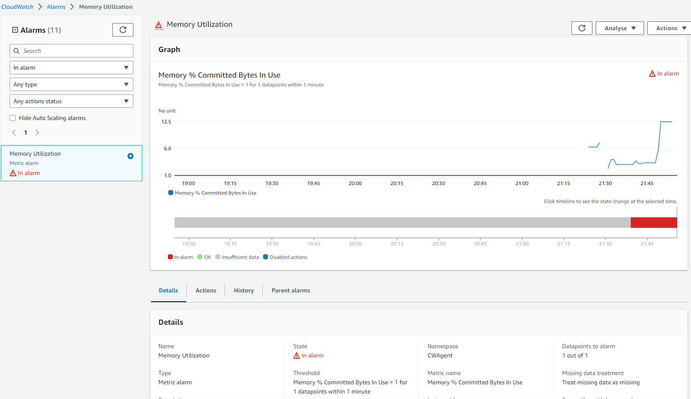

アラームがトリガーされると、アクションとして SNS トピックに E メール通知が送信されます。

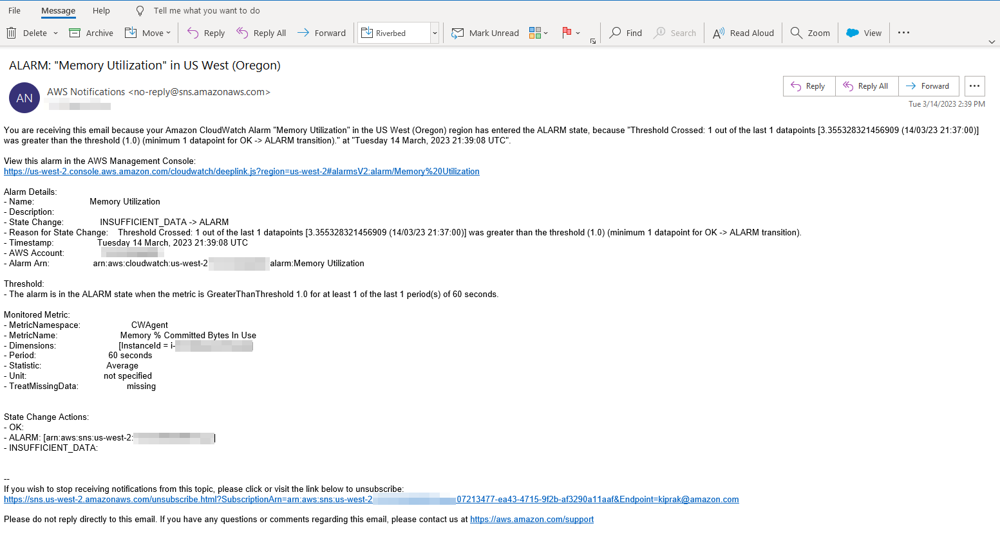

#### オートスケーリングインスタンスのモニタリング

Amazon EC2 Auto Scaling は、アプリケーションの負荷に対応できるように、適切な数の Amazon EC2 インスタンスが利用できることをお客様に保証します。[Amazon EC2 Auto Scaling メトリクス](https://docs.aws.amazon.com/ja_jp/autoscaling/ec2/userguide/ec2-auto-scaling-cloudwatch-monitoring.html) は、Auto Scaling グループに関する情報を収集し、AWS/AutoScaling 名前空間にあります。Auto Scaling インスタンスからの CPU やその他の使用データを表す Amazon EC2 インスタンス メトリクスは、AWS/EC2 名前空間にあります。

### CloudWatch でのダッシュボード

AWS アカウントのリソースのインベントリの詳細、リソースのパフォーマンス、正常性の確認は、安定したリソース管理にとって重要です。[Amazon CloudWatch ダッシュボード](https://docs.aws.amazon.com/AmazonCloudWatch/latest/monitoring/CloudWatch_Dashboards.html) は、CloudWatch コンソールのカスタマイズ可能なホームページで、リージョンをまたいだリソースであっても、1 つのビューでリソースを監視するために使用できます。利用可能な Amazon EC2 インスタンスの良いビューと詳細を取得する方法があります。

#### CloudWatch の自動ダッシュボード

自動ダッシュボードは、すべての AWS リージョンで利用できます。これにより、Amazon EC2 インスタンスを含むすべての AWS リソースの正常性とパフォーマンスを集約的に表示できます。これにより、お客様は監視の開始、メトリクスとアラームのリソースベースの表示、パフォーマンスの問題の根本原因の特定が容易になります。自動ダッシュボードは、AWS サービスの推奨 [ベストプラクティス](https://docs.aws.amazon.com/prescriptive-guidance/latest/implementing-logging-monitoring-cloudwatch/cloudwatch-dashboards-visualizations.html) に基づいて構築されており、リソースを意識した状態を維持し、重要なパフォーマンス メトリクスの最新の状態を動的に反映するように更新されます。

#### CloudWatch のカスタムダッシュボード

[カスタムダッシュボード](https://docs.aws.amazon.com/ja_jp/AmazonCloudWatch/latest/monitoring/create_dashboard.html) を使用すると、お客様は必要な数の追加のダッシュボードを異なるウィジェットで作成し、適宜カスタマイズできます。ダッシュボードはクロスリージョンおよびクロスアカウント表示のために構成でき、お気に入りリストに追加できます。

#### CloudWatch のリソースヘルスダッシュボード

CloudWatch ServiceLens のリソースヘルスは、お客様がアプリケーション全体の [Amazon EC2 ホストのヘルスとパフォーマンスを自動的に発見、管理、視覚化](https://aws.amazon.com/blogs/mt/introducing-cloudwatch-resource-health-monitor-ec2-hosts/)できる、完全マネージドなソリューションです。お客様は CPU やメモリなどのパフォーマンス次元でホストのヘルスを可視化し、インスタンスタイプ、インスタンス状態、セキュリティグループなどのフィルタを使用して、単一のビューで数百のホストをスライスアンドダイスできます。EC2 ホストのグループを並列で比較できるほか、個々のホストへの詳細な洞察も可能です。

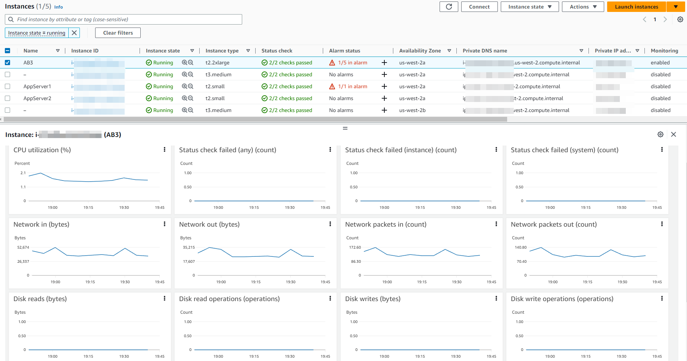

## オープンソースツールを使用したモニタリングとオブザーバビリティ

### AWS Distro for OpenTelemetry を使用した Amazon EC2 インスタンスのモニタリング

[AWS Distro for OpenTelemetry(ADOT)](https://aws.amazon.com/otel) は、セキュアで実稼働レベルの AWS サポート付きの OpenTelemetry プロジェクトディストリビューションです。Cloud Native Computing Foundation の一部である OpenTelemetry は、アプリケーションモニタリングのための分散トレースとメトリクスを収集するためのオープンソース API、ライブラリ、エージェントを提供します。AWS Distro for OpenTelemetry を使用すると、お客様はアプリケーションに一度だけインスツルメントを適用して、相関メトリクスとトレースを複数の AWS およびパートナーモニタリングソリューションに送信できます。

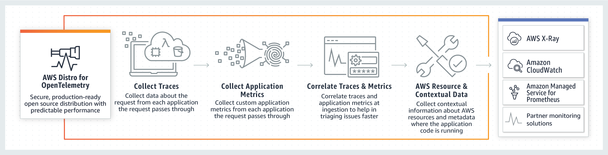

AWS Distro for OpenTelemetry(ADOT) は、アプリケーションのパフォーマンスと正常性を監視して相関データを簡単に相関付けることができる分散型モニタリングフレームワークを提供します。これは、より高いサービス可視性とメンテナンスに不可欠です。

ADOT の主なコンポーネントは、SDK、自動インスツルメンテーション エージェント、コレクター、バックエンドサービスにデータを送信するエクスポーターです。

[OpenTelemetry SDK](https://github.com/aws-observability): AWS リソース固有のメタデータの収集を可能にするために、X-Ray トレースフォーマットとコンテキストのサポートを OpenTelemetry SDK に追加します。OpenTelemetry SDK は、AWS X-Ray および CloudWatch からインジェストされたトレースおよびメトリクス データを相関付けます。

[自動インスツルメンテーション エージェント](https://aws-otel.github.io/docs/getting-started/java-sdk/trace-auto-instr): AWS SDK および AWS X-Ray トレースデータ用の OpenTelemetry Java 自動インスツルメンテーションエージェントのサポートを追加しました。

[OpenTelemetry Collector](https://github.com/open-telemetry/opentelemetry-collector): このディストリビューションのコレクターは、アップストリームの OpenTelemetry コレクターを使用して構築されています。 アップストリームコレクターに、AWS X-Ray、Amazon CloudWatch、Amazon Managed Service for Prometheus を含む AWS サービスにデータを送信する AWS 専用のエクスポーターを追加しました。

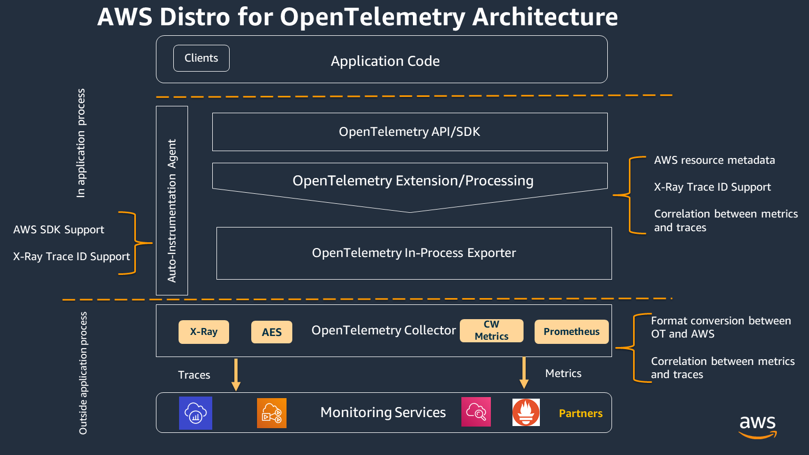

#### ADOT CollectorとAmazon CloudWatchによるメトリクスとトレース

AWS Distro for OpenTelemetry (ADOT) CollectorとCloudWatchエージェントは、Amazon EC2インスタンス上に並列してインストールできます。OpenTelemetry SDKを使用して、Amazon EC2インスタンス上で実行されているワークロードからアプリケーショントレースとメトリクスを収集できます。

OpenTelemetryメトリクスをAmazon CloudWatchでサポートするために、[AWS EMF Exporter for OpenTelemetry Collector](https://github.com/open-telemetry/opentelemetry-collector-contrib/tree/main/exporter/awsemfexporter) は、OpenTelemetry形式のメトリクスをCloudWatch Embedded Metric Format(EMF)に変換します。これにより、OpenTelemetryメトリクスに統合されたアプリケーションが、高基数のアプリケーションメトリクスをCloudWatchに送信できるようになります。 [The X-Ray exporter](https://aws-otel.github.io/docs/getting-started/x-ray#configuring-the-aws-x-ray-exporter) を使用すると、OTLPフォーマットで収集されたトレースを [AWS X-ray](https://aws.amazon.com/xray/) にエクスポートできます。

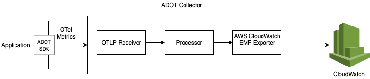

Amazon EC2上のADOT Collectorは、AWS CloudFormationを通じて、または[AWS Systems Manager Distributor](https://catalog.workshops.aws/observability/en-US/aws-managed-oss/ec2-monitoring/configure-adot-collector)を使用してインストールできます。これにより、アプリケーションメトリクスを収集できます。

### Prometheus を使用した Amazon EC2 インスタンスのモニタリング

[Prometheus](https://prometheus.io/) はシステム監視とアラートのためのスタンドアロンのオープンソースプロジェクトで、独立してメンテナンスされています。Prometheus は時系列データとしてメトリクスを収集および保存する。つまり、メトリクス情報は、記録されたタイムスタンプとともに、ラベルと呼ばれるオプションのキーバリューのペアで保存されます。

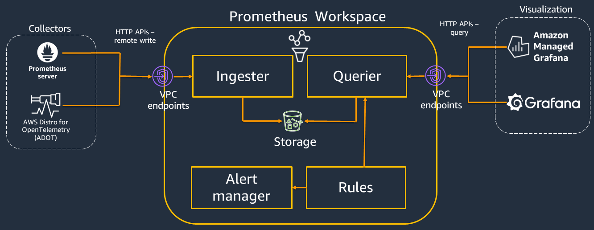

Prometheus はコマンドラインフラグを介して構成され、すべての構成詳細は prometheus.yaml ファイルで維持されます。構成ファイル内の 'scrape_config' セクションは、スクレイプのターゲットとパラメータを指定します。 [Prometheus サービスディスカバリー](https://github.com/prometheus/prometheus/tree/main/discovery) (SD) は、メトリクスのスクレイプするエンドポイントを見つける方法論です。Amazon EC2 サービスディスカバリー構成により、AWS EC2 インスタンスからスクレイプターゲットを取得できます。これらは `ec2_sd_config` で構成されます。

#### PrometheusとAmazon CloudWatchによるメトリクス

EC2インスタンス上のCloudWatchエージェントは、Prometheusとともにインストールおよび構成でき、CloudWatchでの監視のためのメトリクスをスクレイプできます。これは、EC2上のコンテナワークロードを好むお客様で、オープンソースのPrometheus監視と互換性のあるカスタムメトリクスが必要な場合に役立ちます。CloudWatchエージェントのインストールは、上記の以前のセクションで説明されている手順に従うことで実行できます。PrometheusメトリクスをスクレイプするCloudWatchエージェントには、2つの構成が必要です。1つはPrometheusのドキュメントの'scrape_config'に記載されている標準的なPrometheus構成です。もう1つは、[CloudWatchエージェントの構成](https://docs.aws.amazon.com/ja_jp/AmazonCloudWatch/latest/monitoring/CloudWatch-Agent-PrometheusEC2.html#CloudWatch-Agent-PrometheusEC2-configure)です。

#### PrometheusとADOT Collectorを通じたメトリクス

お客様は、オブザーバビリティのニーズのために、オープンソースのセットアップを選択できます。 
これについては、AWS Distro for OpenTelemetry (ADOT) Collectorを設定して、Prometheusで計測されたアプリケーションからスクレイプし、メトリクスをPrometheus Serverに送信できます。 
このフローには、Prometheus Receiver、Prometheus Remote Write Exporter、Sigv4 Authentication Extensionの3つのOpenTelemetryコンポーネントが関与しています。
Prometheus Receiverは、Prometheusフォーマットのメトリックデータを受信します。
Prometheus Exporterは、Prometheusフォーマットでデータをエクスポートします。
Sigv4 Authenticator拡張機能は、AWSサービスへのリクエストにSigv4認証を提供します。

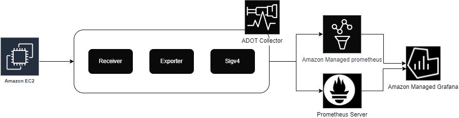

#### Prometheus Node Exporter

[Prometheus Node Exporter](https://github.com/prometheus/node_exporter) は、クラウド環境用のオープンソースの時系列モニタリングおよびアラートシステムです。Amazon EC2 インスタンスは Node Exporter で計装でき、ノードレベルのメトリクスを時系列データとして収集および保存し、タイムスタンプを記録することができます。Node exporter は、URL http://localhost:9100/metrics 経由でさまざまなホストメトリクスを公開できる Prometheus エクスポーターです。 

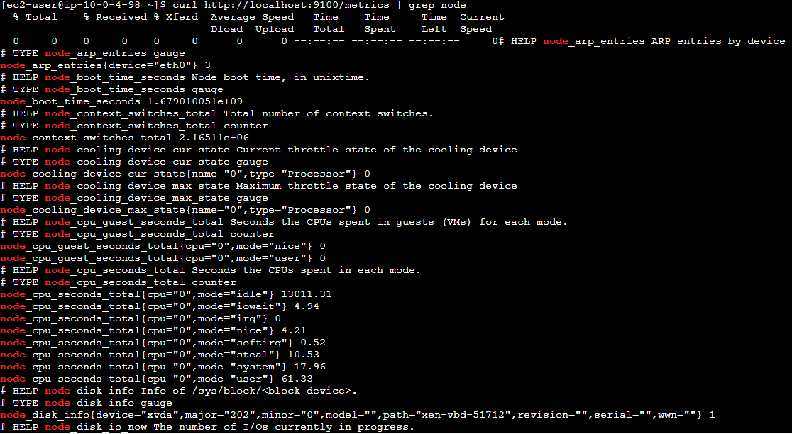

メトリクスが作成されると、[Amazon Managed Prometheus](https://aws.amazon.com/prometheus/) に送信できます。

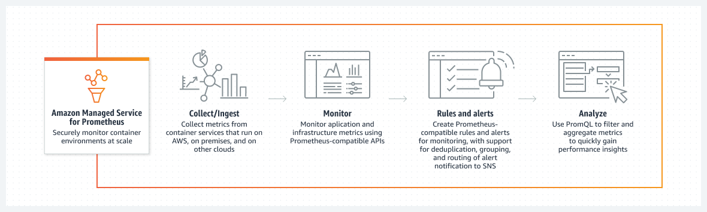

### Fluent Bit プラグインを使用した Amazon EC2 インスタンスからのストリーミングログ

[Fluent Bit](https://fluentbit.io/) は、スケールでのデータ収集、様々な情報源からの多様なデータ形式、データの信頼性、セキュリティ、フレキシブルなルーティング、複数のデスティネーションを扱うためのオープンソースおよびマルチプラットフォームなログ処理ツールです。

Fluent Bit は、Amazon EC2 からのログを Amazon CloudWatch などの AWS サービスにストリーミングするための簡単な拡張ポイントを作成するのに役立ちます。ログの保持と分析には Amazon CloudWatch を使用します。新しくリリースされた [Fluent Bit プラグイン](https://github.com/aws/amazon-cloudwatch-logs-for-fluent-bit#new-higher-performance-core-fluent-bit-plugin) は、ログを Amazon CloudWatch にルーティングできます。

### Amazon Managed Grafana によるダッシュボード

[Amazon Managed Grafana](https://aws.amazon.com/grafana/) は、オープンソースの Grafana プロジェクトに基づいた、完全マネージドなサービスで、メトリクス、ログ、トレースに対するクエリ、相関分析、分析、モニタリング、アラームをすぐに行うのに役立つ、リッチでインタラクティブかつセキュアなデータ可視化を提供します。 複数のデータソースにまたがって。 お客様はインタラクティブなダッシュボードを作成し、自動スケーリング、高可用性、エンタープライズレベルのセキュリティを備えたサービスを使用して、組織内の誰とでも共有できます。 Amazon Managed Grafana を使用すると、AWS アカウント、AWS リージョン、データソース全体でダッシュボードへのユーザーとチームのアクセスを管理できます。

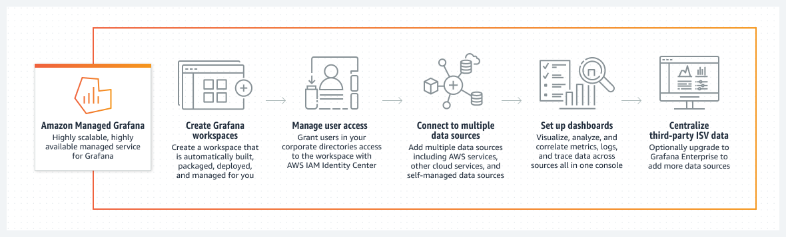

Grafana ワークスペースコンソールの AWS データソース構成オプションを使用して、Amazon CloudWatch をデータソースとして Amazon Managed Grafana に追加できます。 この機能により、既存の CloudWatch アカウントを検出し、CloudWatch へのアクセスに必要な認証情報の構成を管理することで、CloudWatch をデータソースとして追加するプロセスが簡略化されます。 Amazon Managed Grafana は、[Prometheus データソース](https://docs.aws.amazon.com/grafana/latest/userguide/prometheus-data-source.html)もサポートしています。つまり、セルフマネージドの Prometheus サーバーと Amazon Managed Service for Prometheus ワークスペースの両方がデータソースとして機能します。

Amazon Managed Grafana には、さまざまなパネルが用意されているため、適切なクエリを構築し、表示プロパティをカスタマイズして必要なダッシュボードを作成することが簡単です。

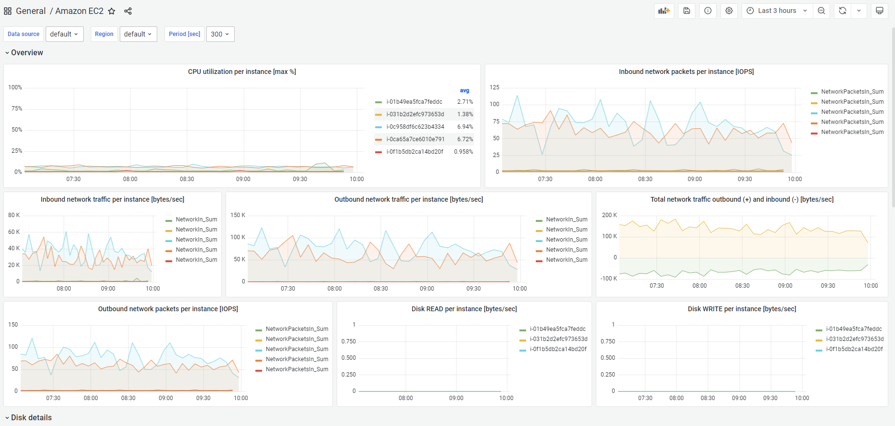

## まとめ

モニタリングにより、システムが適切に機能しているかどうかを把握できます。オブザーバビリティを利用することで、システムが適切に機能していない理由を理解できます。優れたオブザーバビリティにより、把握する必要があることだと気づいていなかった疑問に答えることができます。モニタリングとオブザーバビリティは、システムの内部状態をその出力から推測するための方法を提供します。

マイクロサービス、サーバーレス、非同期アーキテクチャ上のクラウドで実行されるモダンアプリケーションは、メトリクス、ログ、トレース、イベントなど、大量のデータを生成します。Amazon CloudWatch は、Amazon Distro for OpenTelemetry、Amazon Managed Prometheus、Amazon Managed Grafana などのオープンソースツールとともに、このデータを統合プラットフォーム上で収集、アクセス、相関付けできるようにします。データサイロを壊し、システム全体の可視性を容易に得て、問題を迅速に解決できるようお客様を支援します。
