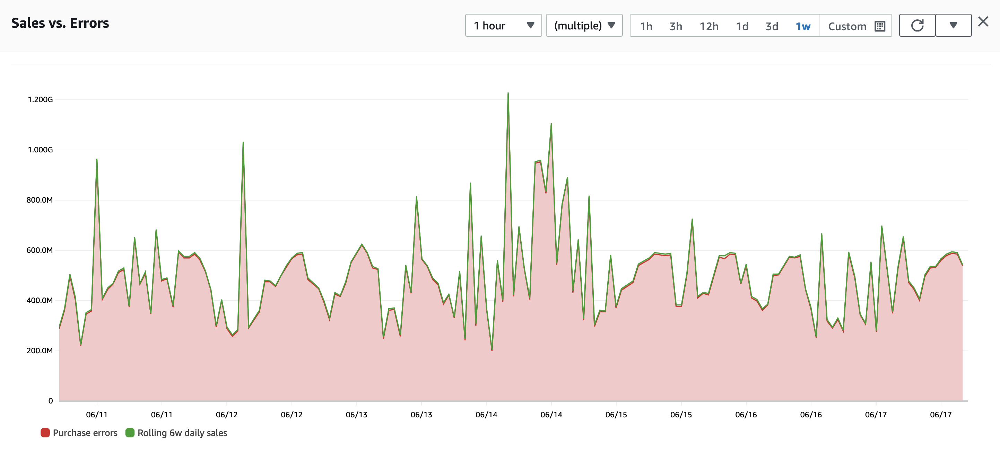

# ベストプラクティスの概要

オブザーバビリティは、成熟したツールのランドスケープを持つ広範なトピックです。
しかし、すべてのツールがすべてのソリューションに適しているわけではありません。
オブザーバビリティの要件、構成、最終的なデプロイを円滑に進めるために、
オブザーバビリティ戦略の意思決定プロセスに情報を提供する 5 つの主要なベストプラクティスを要約しました。

## 重要なものを監視する

オブザーバビリティで最も重要なのは、サーバー、ネットワーク、アプリケーション、顧客ではありません。重要なのは、あなた、あなたのビジネス、プロジェクト、ユーザーにとって重要なものです。

まず最初に、成功基準が何かを特定します。たとえば、eコマースアプリケーションを運用している場合、成功基準は過去1時間の購入数ということがあります。非営利団体の場合は、月間の目標に対する寄付金ということがあります。決済処理業者は取引処理時間を監視したいと考える一方、大学は学生の出席を測定したいと考えるでしょう。 

!!! tip
	成功の指標は誰にとっても異なります!ここでは eコマースアプリケーションを例に説明していますが、プロジェクトによっては非常に異なる指標があるかもしれません。しかし、アドバイスの本質は同じです。「良い」状態がどういう状態かを知り、それを測定することです。

アプリケーションの種類に関わらず、重要なメトリクスを特定することから始める必要があります。次に、*逆算[^1]* して、アプリケーションやインフラストラクチャの観点からそれに影響を与えるものを確認します。たとえば、Web サーバーの高い CPU 使用率が顧客満足度を損ない、ひいては売上に影響する場合、CPU 使用率を監視することが重要です。

#### 目標を知り、それを測定しましょう!

重要なトップレベルの KPI を特定したら、次の仕事はそれらを追跡し測定する自動化された方法を用意することです。重要な成功要因は、ワークロードの運用を監視するのと同じシステムで行うことです。Eコマースのワークロードの例では、次のことを意味します。

* 売上データを[*時系列*](https://en.wikipedia.org/wiki/Time_series)に公開する
* この同じシステムでユーザー登録を追跡する
* 顧客が Web ページにどのくらい滞在するかを測定し、(再び)このデータを時系列にプッシュする

ほとんどのお客様はこのデータをすでに持っていますが、オブザーバビリティの観点から必ずしも適切な場所にはありません。売上データは通常、ユーザー登録とともにリレーショナルデータベースやビジネスインテリジェンスレポーティングシステムで見つけることができます。また、訪問期間のデータはログや [Real User Monitoring](../tools/rum) から抽出できます。 

メトリックデータの元の場所やフォーマットに関係なく、[*時系列*](https://en.wikipedia.org/wiki/Time_series)として維持されている必要があります。ビジネス、個人、学術、その他の目的のために最も重要なすべての主要なメトリクスは、他のオブザーバビリティデータ(時には*信号*または*テレメトリ*と呼ばれる)と相関付けるために、時系列フォーマットでなければなりません。

*図 1: 時系列の例*

## コンテキストの伝播とツールの選択

ツールの選択は重要であり、問題の操作と修復の方法に深刻な違いをもたらします。 しかし、サブオプティマルなツールを選択することよりもっと悪いのは、すべての基本的な信号タイプのツール化です。 たとえば、ワークロードから基本的な [ログ](../signals/logs) を収集するが、トランザクショントレースが欠落していると、ギャップが生じます。 その結果、アプリケーションエクスペリエンス全体の断片的なビューになってしまいます。 すべての最新のオブザーバビリティのアプローチは、アプリケーショントレースで「点と点をつなぐ」ことに依存しています。

健全性と運用の完全な画像には、[ログ](../signals/logs)、[メトリクス](../signals/metrics)、[トレース](../signals/traces)を収集するツールが必要であり、次に相関分析、[異常検知](../signals/anomalies)、[ダッシュボード](../tools/dashboards)、[アラーム](../tools/alarms)などを実行する必要があります。

!!! info
	一部のオブザーバビリティソリューションには上記のすべてが含まれているとは限りませんが、既存のシステムを拡張、拡大、または付加価値を与えることを目的としています。 すべてのケースで、ツールの相互運用性と拡張性は、オブザーバビリティプロジェクトを開始する際の重要な考慮事項です。

#### すべてのワークロードは異なりますが、共通のツールが結果を速めます

すべてのワークロードで共通のツールセットを使用することには、運用の摩擦とトレーニングを減らすなどのメリットがあり、通常、ツールやベンダーの数を減らすことを目指すべきです。これにより、既存の可観測性ソリューションを新しい環境やワークロードに迅速に展開でき、問題が発生したときの解決時間が短縮されます。

ツールは、基本的なインフラ、アプリケーション、Web サイト、その間のすべての層のワークロードを観察できるほど幅広いものである必要があります。1つのツールでは不可能な場所では、オープンスタンダードでオープンソースであるものを使用するのがベストプラクティスであり、そのために最も幅広いクロスプラットフォーム統合の可能性があります。

#### 既存のツールやプロセスとの統合

車輪の再発明は避けましょう。「丸」という形状はすでに最適な形状です。データサイロではなく、協調的でオープンなシステムを常に構築する必要があります。

* 既存の ID プロバイダー(Active Directory、SAML ベースの ID プロバイダーなど)と統合します。
* 既存の IT 障害追跡システム(JIRA、ServiceNow など)がある場合は、発生した問題をすばやく管理できるように統合します。  
* すでに導入済みの場合は既存のワークロード管理ツールやエスカレーションツール(PagerDuty、OpsGenie など)を使用します。
* Ansible、SaltStack、CloudFormation、Terraform、CDK などのインフラストラクチャ as コードツールはすべて優れたツールです。これらのツールを使用してオブザーバビリティを含むすべてのインフラストラクチャを管理し、既に使用している同じインフラストラクチャ as コードツールでオブザーバビリティソリューションを構築します([初期段階からのオブザーバビリティの組み込み](#include-observability-from-day-one)を参照)。

#### 自動化と機械学習を利用する

コンピュータはパターンを見つけるのが得意で、データがパターンに*従わない*場合も見つけることができます。監視するデータポイントが数百、数千、さらには数百万個ある場合、それらすべての正常なしきい値を理解することは不可能です。しかし、多くのオブザーバビリティソリューションには、データのベースラインを管理するための異常検知や機械学習の機能があります。 

これを「正常な状態がどう見えるかを知る」と呼びます。ワークロードを十分に負荷テストしていれば、これらの正常なパフォーマンスメトリクスはすでにわかっているかもしれませんが、複雑な分散アプリケーションの場合、すべてのメトリクスに対してベースラインを作成することは大変です。ここで異常検知、自動化、機械学習が不可欠となります。

アプリケーションのヘルス状態のベースラインとアラートを自動で管理するツールを活用することで、目標に集中し[監視するべきことに注力](#monitor-what-matters)できます。

## ワークロードのすべてのティアからテレメトリを収集する

アプリケーションは孤立して存在せず、ネットワークインフラ、クラウドプロバイダー、インターネットサービスプロバイダー、SaaSパートナー、および統制内外の他のコンポーネントとの対話は、結果に影響を与える可能性があります。 ワークロード全体の包括的なビューを持つことが重要です。

#### インテグレーションに焦点を当てる

計測する領域を1つ選ぶ必要がある場合、疑いなくコンポーネント間のインテグレーションが選択肢になります。これがオブザーバビリティの力が最も顕著に表れる場所です。原則として、1つのコンポーネントまたはサービスが別のコンポーネントやサービスを呼び出すたびに、少なくとも次のデータポイントが測定されている必要があります。

1. リクエストとレスポンスの期間
2. レスポンスのステータス

そして、オブザーバビリティが必要とする統合的で全体的なビューを作成するには、収集されたシグナルにリクエストチェーン全体の[一意の識別子](../signals/traces)が含まれている必要があります。

#### エンドユーザー体験を忘れないで

ワークロードの完全なビューを得るには、エンドユーザーの体験を含め、すべてのレイヤーで理解する必要があります。
ユーザーエクスペリエンスの低下によって目標がリスクにさらされるときを測定、定量化、理解することは、ディスクスペースや CPU 使用率を監視することと同じくらい、もしくはそれ以上に重要です。

ワークロードが Web サイトやモバイルアプリなどの形でエンドユーザーと直接対話するものである場合、[リアルユーザーモニタリング](../tools/rum)は、ユーザーへの「ラストワンマイル」の配信だけでなく、アプリケーションの実際の体験も監視します。
結局のところ、ユーザーがサービスを実際に利用できない場合、可観測性への取り組みは意味がありません。

## データは力だが、些細なことにこだわるな

アプリケーションの規模によっては、信号を収集するコンポーネントが非常に多数あるかもしれません。
そうした信号の収集は重要で力になりますが、努力の対効果が薄れることもあります。
このため、ベストプラクティスは、[重要なものをモニタリングする](#monitor-what-matters)ことから始め、これを使って重要なインテグレーションと重要なコンポーネントをマッピングし、適切な詳細に焦点を当てることです。

## 最初からオブザーバビリティを含める

セキュリティと同様に、オブザーバビリティは開発や運用の後付けであってはなりません。ベストプラクティスは、セキュリティと同様に、計画の早い段階でオブザーバビリティを取り入れることです。これにより、人々が働くためのモデルが作成され、アプリケーションの不透明な部分が削減されます。メジャーな開発作業が完了した後で[自動計測](../../tools/traces)を追加するには時間がかかります。労力のリターンははるかに大きいです! しかし、開発サイクルの後半でこれを行うと、いくらかの再作業が必要になる場合があります。

後からワークロードにオブザーバビリティをボルト留めするよりも、作業を*加速*するのに役立ててください。適切な[ログ](../signals/logs)、[メトリクス](../signals/metrics)、[トレース](../signals/traces)の収集により、アプリケーション開発がより迅速になり、ベストプラクティスが育成され、今後の迅速な問題解決の基盤が築かれます。

[^1]: Amazon はお客様とその成果にこだわるために、*ワーキングバックワード*プロセスを広く使用しています。オブザーバビリティソリューションに取り組む人は誰でも、同じ方法で自分の目的から逆算することを強くおすすめします。*ワーキングバックワード*の詳細は、[Werner Vogels のブログ](https://www.allthingsdistributed.com/2006/11/working_backwards.html)をご覧ください。
