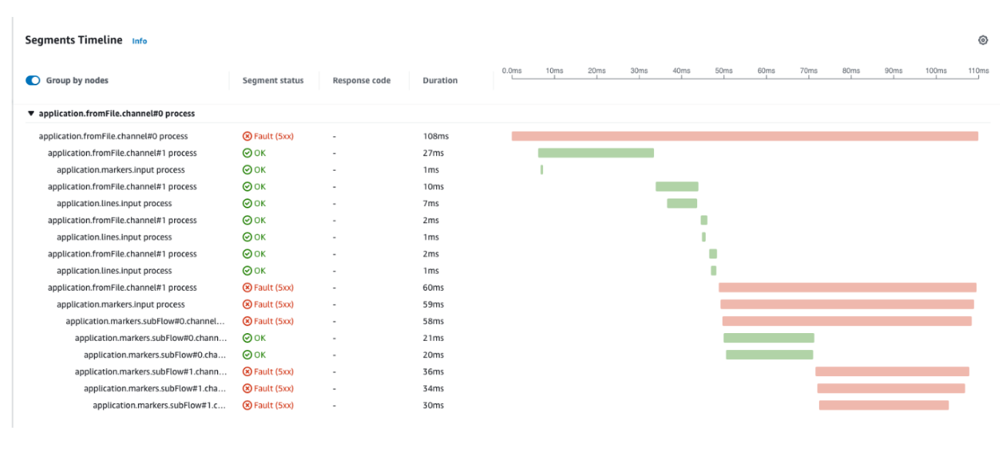

# Java Spring Integration アプリケーションの計装

この記事では、[Open Telemetry](https://opentelemetry.io/) と [X-ray](https://aws.amazon.com/xray/) を利用した [Spring-Integration](https://docs.spring.io/spring-integration/reference/html/overview.html) アプリケーションの手動計装のアプローチについて説明します。

Spring-Integration フレームワークは、イベント駆動アーキテクチャやメッセージ指向アーキテクチャの統合ソリューションの開発を可能にするように設計されています。一方、OpenTelemetry は HTTP リクエストを使用してサービス間で通信と調整を行うマイクロサービスアーキテクチャに焦点を当てる傾向があります。したがって、このガイドでは OpenTelemetry API を使用した手動計装による Spring-Integration アプリケーションの計装方法の例を提供します。

## 背景情報

### トレーシングとは

[OpenTelemetry のドキュメント](https://opentelemetry.io/docs/concepts/signals/traces/)からの以下の引用は、トレースの目的について良い概要を示しています。

!!! quote
    トレースにより、アプリケーションへのリクエストが行われたときに何が起こるかの全体像がわかります。アプリケーションが単一のデータベースを持つモノリスであれ、精巧なサービスのメッシュであれ、トレースはアプリケーション内のリクエストがたどる完全な「パス」を理解するうえで不可欠です。

トレーシングの主なメリットの 1 つが、リクエストのエンドツーエンドの可視性であることを考えると、トレースがリクエストの発信元からバックエンドまで適切にリンクされていることが重要です。OpenTelemetry ではこれを実現する一般的な方法は、[ネストされたスパン](https://opentelemetry.io/docs/instrumentation/java/manual/#create-nested-spans) を利用することです。これは、スパンがサービスからサービスへと渡され、最終的な宛先に到達するまでの、マイクロサービスアーキテクチャで機能します。Spring Integration アプリケーションでは、リモートでもローカルでも作成されたスパン間の親子関係を作成する必要があります。

## コンテキスト伝播を利用したトレーシング

コンテキスト伝播を利用したアプローチをデモンストレーションします。このアプローチは通常、ローカルおよびリモートの場所で作成されたスパン間の親子関係を作成する必要がある場合に使用されますが、Spring Integration Application の場合に使用されます。なぜならコードを簡素化し、アプリケーションのスケールを可能にするからです。メッセージを複数のスレッドで並列に処理できるようになり、ホスト間でメッセージを処理する必要がある場合は水平方向にスケールできます。

これを実現するには、次のことが必要です。

- ```ChannelInterceptor``` を作成し、```GlobalChannelInterceptor``` として登録することで、すべてのチャネル間で送信されるメッセージをキャプチャできるようにする。

- ```ChannelInterceptor``` で:
  - ```preSend``` メソッドで:
    - 上流で生成された前のメッセージからコンテキストを読み取ることを試みる。これにより、上流のメッセージからスパンを接続できます。コンテキストが存在しない場合、新しいトレースが開始されます(これは OpenTelemetry SDK によって行われます)。
    - その操作を識別する一意の名前を持つ Span を作成する。これは、このメッセージが処理されているチャネルの名前にできます。 
    - 現在のコンテキストをメッセージに保存する。
    - コンテキストとスコープを thread.local に格納して、後でクローズできるようにする。
    - メッセージが下流に送信される際にコンテキストを注入する。
  - ```afterSendCompletion``` で:
    - コンテキストとスコープを thread.local から復元する。
    - コンテキストからスパンを再作成する。
    - メッセージ処理中に発生した例外を登録する。
    - スコープをクローズする。
    - スパンを終了する。

これは必要なことの簡略化された説明です。Spring Integration フレームワークを使用した機能サンプルアプリケーションを提供しています。このアプリケーションのコードは[こちら](https://github.com/rapphil/spring-integration-samples/tree/rapphil-5.5.x-otel/applications/file-split-ftp) にあります。

アプリケーションの計装のために実装された変更のみを表示するには、この[diff](https://github.com/rapphil/spring-integration-samples/compare/30e01ce9eefd8dae288eca44013810afa8c1a585..6f056a76350340a9658db0cad7fc12dbda505437) をご覧ください。

### このサンプルアプリケーションを実行するには次を使用します:

``` bash
# build and run
mvn spring-boot:run
# create sample input file to trigger flow
echo 'testcontent\nline2content\nlastline' > /tmp/in/testfile.txt
```

このサンプルアプリケーションを試すには、アプリケーションと同じマシンで次のような構成の [ADOT コレクター](https://aws-otel.github.io/docs/getting-started/collector) を実行する必要があります: 

``` yaml
receivers:
  otlp:
    protocols:
      grpc: 
        endpoint: 0.0.0.0:4317
      http:
        endpoint: 0.0.0.0:4318
processors:
  batch/traces:
    timeout: 1s
    send_batch_size: 50
  batch/metrics:
    timeout: 60s
exporters:
  aws xray: region:us-west-2
  aws emf:
    region: us-west-2
service:
  pipelines:
    traces:
      receivers: [otlp]
      processors: [batch/traces]
      exporters: [awsxray]
    metrics:
      receivers: [otlp]
      processors: [batch/metrics]
      exporters: [awsemf]
```

## 結果

サンプルアプリケーションを実行し、次のコマンドを実行すると、次のような結果が得られます。

``` bash
echo 'foo123\nbar123\nfoo1234' > /tmp/in/testfile.txt
```



上記のセグメントは、サンプルアプリケーションで説明されているワークフローと一致していることがわかります。一部のメッセージの処理時に例外が発生することが予想されるため、適切に登録されており、X-Ray でトラブルシューティングできることがわかります。

## よくある質問

### ネストされたスパンはどのように作成しますか?

OpenTelemetryには、スパンを接続するために使用できる3つのメカニズムがあります。

##### 明示的に

親スパンを子スパンが作成される場所に渡し、次のように両方をリンクする必要があります。

``` java
    Span childSpan = tracer.spanBuilder("child")
    .setParent(Context.current().with(parentSpan)) 
    .startSpan();
```

##### 暗黙的に

スパンコンテキストは内部的に thread.local に保存されます。
同じスレッドでスパンを作成していることが確実な場合に、この方法が示されます。

``` java
    void parentTwo() {
        Span parentSpan = tracer.spanBuilder("parent").startSpan(); 
        try(Scope scope = parentSpan.makeCurrent()) {
            childTwo(); 
        } finally {
        parentSpan.end(); 
        }
    }
    void childTwo() {
        Span childSpan = tracer.spanBuilder("child")
            // NOTE: setParent(...) is not required;
            // `Span.current()` is automatically added as the parent 
            .startSpan();
        try(Scope scope = childSpan.makeCurrent()) { 
            // do stuff
        } finally {
            childSpan.end();
        } 
    }
```

##### コンテキストの伝播

この方法では、コンテキストをどこか(HTTP ヘッダやメッセージなど)に保存して、子スパンが作成されるリモートの場所に転送できるようにします。リモートの場所であることは厳密な要件ではありません。同じプロセスでも使用できます。

### OpenTelemetry のプロパティは X-Ray のプロパティにどのように変換されるのか

関係を見るには、次の[ガイド](https://opentelemetry.io/docs/instrumentation/java/manual/#context-propagation)を参照してください。
