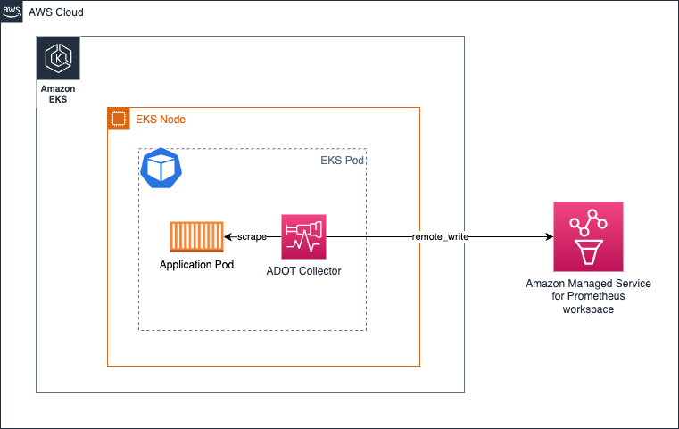
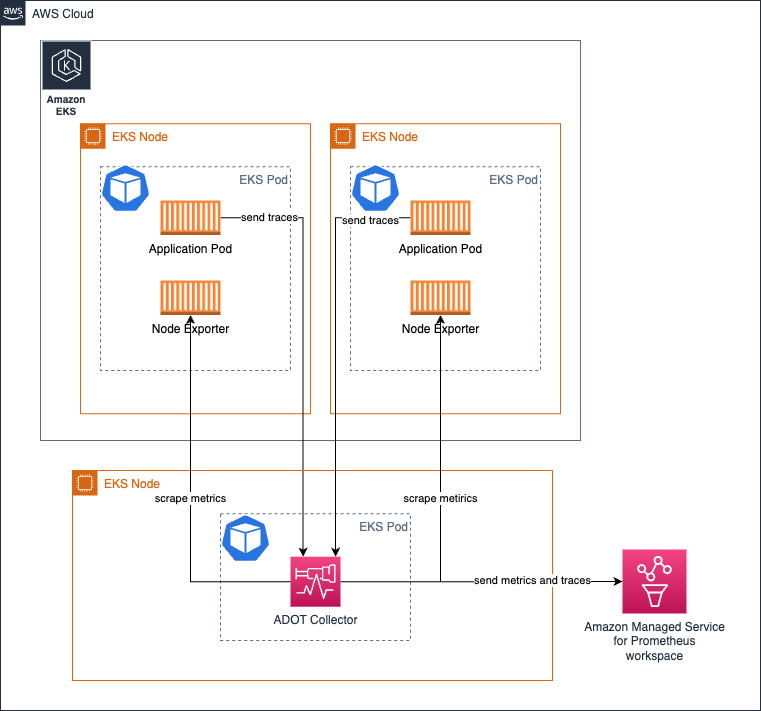
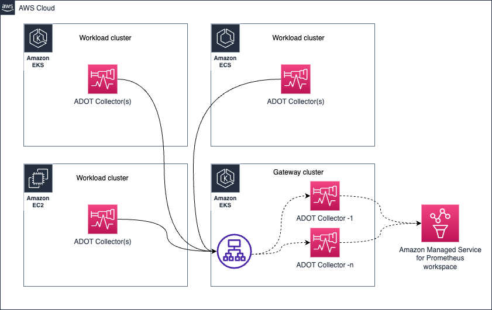
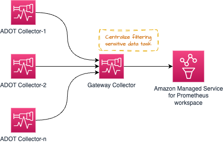
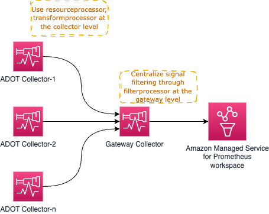
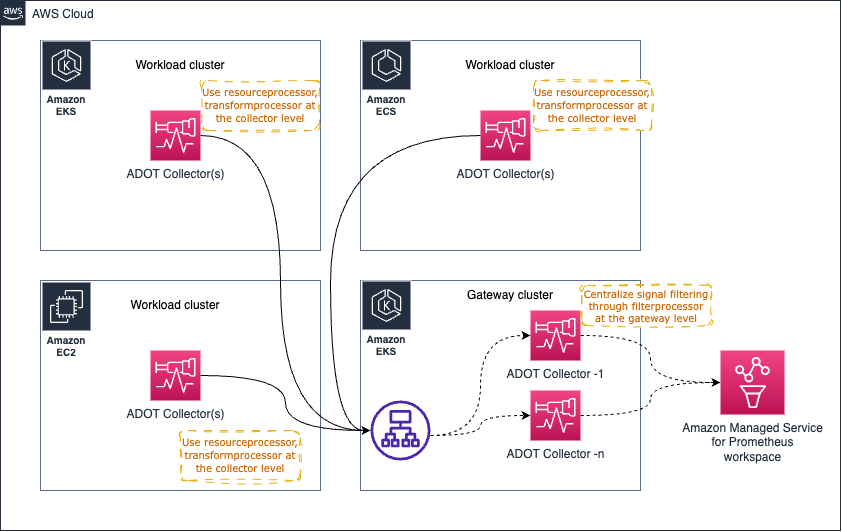
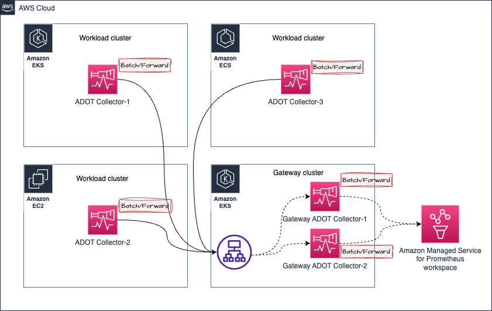

# AWS Distro for OpenTelemetry(ADOT) Collector の運用

[ADOT Collector](https://aws-otel.github.io/) は、[CNCF](https://www.cncf.io/) のオープンソースの [OpenTelemetry Collector](https://opentelemetry.io/docs/collector/) のダウンストリームディストリビューションです。

お客様は、ADOT Collector を使用して、オンプレミス、AWS、他のクラウド プロバイダーなど、さまざまな環境からメトリクスやトレースなどのシグナルを収集できます。

実際の運用環境や大規模な環境で ADOT Collector を運用するには、オペレーターはコレクターの健全性を監視し、必要に応じてスケールする必要があります。このガイドでは、本番環境で ADOT Collector を運用するためのアクションについて学習します。

## デプロイアーキテクチャ

要件に応じて、検討したいデプロイオプションがいくつかあります。

* コレクタなし
* エージェント
* ゲートウェイ


!!! tip
    これらの概念の詳細については、[OpenTelemetry のドキュメント](https://opentelemetry.io/docs/collector/deployment/)をご確認ください。

### コレクタなし
このオプションは、基本的にコレクタを方程式から完全に省略します。ご存知かもしれませんが、OTEL SDK から直接デスティネーションサービスへの API 呼び出しを行い、シグナルを送信することが可能です。アプリケーションプロセスから直接 AWS X-Ray の [PutTraceSegments](https://docs.aws.amazon.com/xray/latest/api/API_PutTraceSegments.html) API を呼び出す代わりに、ADOT Collector などのアウトオブプロセスエージェントにスパンを送信することを考えてみてください。

このアプローチに対するガイダンスを変更する AWS 固有の側面はないため、詳細については上流のドキュメントの[セクション](https://opentelemetry.io/docs/collector/deployment/no-collector/)を参照することを強くおすすめします。


### エージェント
このアプローチでは、コレクターを分散させて実行し、シグナルをデスティネーションに収集します。 
`No Collector` オプションとは異なり、ここでは懸念事項を分離し、リモート API 呼び出しを行うためにリソースを使用する必要があるアプリケーションから切り離します。代わりに、ローカルでアクセス可能なエージェントと通信します。

基本的には、Amazon EKS 環境で **Kubernetes サイドカーとしてコレクターを実行する**場合は、以下のようになります。



上記のアーキテクチャでは、コレクターがアプリケーションコンテナと同じ Pod で実行されているため、`localhost` からターゲットをスクレイプすることになるため、スクレイプ構成でサービス検出メカニズムを実際に使用する必要がほとんどありません。

同じアーキテクチャはトレースの収集にも適用されます。単に、[ここで示す](https://aws-otel.github.io/docs/getting-started/x-ray#sample-collector-configuration-putting-it-together) OTEL パイプラインを作成する必要があります。

##### 長所と短所
* この設計を推奨する1つの論拠は、コレクターが自身の仕事を行うために特別な量のリソース(CPU、メモリ)を割り当てる必要がないことです。ターゲットがローカルホストソースに限定されているためです。

* このアプローチを使用することの短所は、クラスター上で実行しているアプリケーションの数に比例して、コレクターポッドの構成の変更点の数が直接増加することです。 
これは、ポッドで予測されるワークロードに応じて、各ポッドの CPU、メモリ、その他のリソース割り当てを個別に管理する必要があることを意味します。これを注意深く行わないと、コレクターポッドのリソースが過剰または不足し、パフォーマンスが低下したり、ノード内の他のポッドで使用できるはずの CPU サイクルとメモリがロックされたりする結果になります。

ニーズに応じて、コレクターをデプロイメント、デーモンセット、ステートフルセットなどの他のモデルでもデプロイできます。

#### Amazon EKS 上でコレクターをデーモンセットとして実行する

コレクターの負荷(スクレイピングとメトリクスの Amazon Managed Service for Prometheus ワークスペースへの送信)を EKS ノード全体で均等に分散したい場合は、コレクターを [デーモンセット](https://kubernetes.io/docs/concepts/workloads/controllers/daemonset/)として実行することを選択できます。


コレクターが自ホスト/ノードのターゲットのみをスクレイプする `keep` アクションがあることを確認してください。

参考のために以下のサンプルをご覧ください。その他の構成の詳細は[こちら](https://aws-otel.github.io/docs/getting-started/adot-eks-add-on/config-advanced#daemonset-collector-configuration)をご覧ください。

```yaml
scrape_configs:
    - job_name: kubernetes-apiservers
    bearer_token_file: /var/run/secrets/kubernetes.io/serviceaccount/token
    kubernetes_sd_configs:
    - role: endpoints
    relabel_configs:
    - action: keep
        regex: $K8S_NODE_NAME
        source_labels: [__meta_kubernetes_endpoint_node_name]
    scheme: https
    tls_config:
        ca_file: /var/run/secrets/kubernetes.io/serviceaccount/ca.crt
        insecure_skip_verify: true
```

同じアーキテクチャをトレースの収集にも使用できます。この場合、コレクターがエンドポイントにアクセスして Prometheus メトリクスをスクレイプする代わりに、アプリケーションポッドからトレーススパンがコレクターに送信されます。

##### 長所と短所
**長所**

* スケーリングに関する懸念が最小限
* 高可用性の設定が難しい
* Collector のコピーが多すぎる
* ログのサポートが容易

**短所**

* リソース利用の最適化に関して最適ではない
* リソース割り当てが均衡を欠く

#### Amazon EC2 でコレクターを実行する

EC2 でコレクターを実行する際にサイドカー方式はないため、EC2 インスタンス上でエージェントとしてコレクターを実行します。以下のような静的スクレイプ設定を行い、インスタンス内のターゲットを発見してメトリクスをスクレイプできます。

以下の設定は、localhost のポート `9090` と `8081` のエンドポイントをスクレイプします。

このトピックのハンズオン体験を深めるには、 [Observability ワークショップの EC2 に焦点を当てたモジュール](https://catalog.workshops.aws/observability/ja-JP/aws-managed-oss/ec2-monitoring) を進めてください。

```yaml
global:
  scrape_interval: 15s # By default, scrape targets every 15 seconds.

scrape_configs:
- job_name: 'prometheus'
  static_configs:
  - targets: ['localhost:9090', 'localhost:8081']
```

#### Amazon EKS 上でデプロイメントとしてコレクターを実行する

デプロイメントとしてコレクターを実行すると、コレクターの高可用性も提供できるので特に便利です。ターゲットの数、スクレイプできるメトリクスの可用性などに応じて、コレクターのリソースを調整して、コレクターが飢餓状態にならず、信号収集に問題が発生しないようにする必要があります。

[このトピックの詳細は、こちらのガイドをご覧ください。](/docs/ja/guides/containers/oss/eks/best-practices-metrics-collection.md)

次のアーキテクチャは、メトリクスとトレースを収集するために、ワークロード ノードとは別のノードでデプロイされたコレクターを示しています。



メトリクス収集の高可用性を設定するには、[高可用性の設定方法を詳細に説明したドキュメント](https://docs.aws.amazon.com/ja/prometheus/latest/userguide/Send-high-availability-prom-community.ja.html) をご覧ください。

#### Amazon ECS でのメトリクス収集のためのコレクターを中心的なタスクとして実行する

[ECS Observer 拡張機能](https://github.com/open-telemetry/opentelemetry-collector-contrib/tree/main/extension/observer/ecsobserver) を使用して、ECS クラスター内のさまざまなタスクやクラスター間で Prometheus メトリクスを収集できます。


拡張機能のコレクターの構成例:

```yaml
extensions:
  ecs_observer:
    refresh_interval: 60s # format is https://golang.org/pkg/time/#ParseDuration
    cluster_name: 'Cluster-1' # cluster name need manual config
    cluster_region: 'us-west-2' # region can be configured directly or use AWS_REGION env var
    result_file: '/etc/ecs_sd_targets.yaml' # the directory for file must already exists
    services:
      - name_pattern: '^retail-.*$'
    docker_labels:
      - port_label: 'ECS_PROMETHEUS_EXPORTER_PORT'
    task_definitions:
      - job_name: 'task_def_1'
        metrics_path: '/metrics'
        metrics_ports:
          - 9113
          - 9090
        arn_pattern: '.*:task-definition/nginx:[0-9]+'
```

##### メリットとデメリット
* このモデルの利点は、自分で管理しなければならないコレクターと構成が少ないことです。
* クラスターがかなり大きく、スクレイプするターゲットが数千個ある場合は、負荷がコレクター全体に均等に分散されるよう注意深くアーキテクチャを設計する必要があります。これに加えて、HAの理由から同じコレクターの近似クローンを実行する必要がある場合、運用上の問題を回避するために注意深く行う必要があります。

### ゲートウェイ



## コレクターのヘルス状態の管理
OTEL コレクターは、ヘルス状態とパフォーマンスを把握するためのいくつかのシグナルを公開しています。コレクターのヘルス状態を密接に監視することは、次のような修正アクションを実行するために不可欠です。

* コレクターの水平スケーリング
* コレクターが望ましい動作をするために、コレクターに追加リソースをプロビジョニングする

### コレクターからのヘルスメトリクスの収集

OTEL コレクターは、`service` パイプラインに `telemetry` セクションを追加するだけで、Prometheus Exposition Format でメトリクスを公開するように構成できます。コレクターは、自身のログを stdout に公開することもできます。

テレメトリ構成の詳細は、[OpenTelemetry のドキュメント](https://opentelemetry.io/docs/collector/configuration/#service) で確認できます。

コレクターのサンプルテレメトリ構成です。

```yaml
service:
  telemetry:
    logs:
      level: debug
    metrics:
      level: detailed
      address: 0.0.0.0:8888
```

構成すると、コレクターは `http://localhost:8888/metrics` で以下のようなメトリクスのエクスポートを開始します。

```bash
# HELP otelcol_exporter_enqueue_failed_spans Number of spans failed to be added to the sending queue.
# TYPE otelcol_exporter_enqueue_failed_spans counter
otelcol_exporter_enqueue_failed_spans{exporter="awsxray",service_instance_id="523a2182-539d-47f6-ba3c-13867b60092a",service_name="aws-otel-collector",service_version="v0.25.0"} 0

# HELP otelcol_process_runtime_total_sys_memory_bytes Total bytes of memory obtained from the OS (see 'go doc runtime.MemStats.Sys')
# TYPE otelcol_process_runtime_total_sys_memory_bytes gauge
otelcol_process_runtime_total_sys_memory_bytes{service_instance_id="523a2182-539d-47f6-ba3c-13867b60092a",service_name="aws-otel-collector",service_version="v0.25.0"} 2.4462344e+07

# HELP otelcol_process_memory_rss Total physical memory (resident set size)
# TYPE otelcol_process_memory_rss gauge
otelcol_process_memory_rss{service_instance_id="523a2182-539d-47f6-ba3c-13867b60092a",service_name="aws-otel-collector",service_version="v0.25.0"} 6.5675264e+07

# HELP otelcol_exporter_enqueue_failed_metric_points Number of metric points failed to be added to the sending queue.
# TYPE otelcol_exporter_enqueue_failed_metric_points counter
otelcol_exporter_enqueue_failed_metric_points{exporter="awsxray",service_instance_id="d234b769-dc8a-4b20-8b2b-9c4f342466fe",service_name="aws-otel-collector",service_version="v0.25.0"} 0
otelcol_exporter_enqueue_failed_metric_points{exporter="logging",service_instance_id="d234b769-dc8a-4b20-8b2b-9c4f342466fe",service_name="aws-otel-collector",service_version="v0.25.0"} 0
```

上記のサンプル出力では、送信キューに追加できなかったスパン数を示す `otelcol_exporter_enqueue_failed_spans` というメトリクスがコレクターによって公開されているのがわかります。このメトリクスは、コレクターがトレースデータの送信先への送信に問題があるかどうかを理解するために注目する必要があるものです。この場合、`exporter` ラベルの値 `awsxray` は、使用中のトレースの送信先を示しています。

もう一つのメトリクス `otelcol_process_runtime_total_sys_memory_bytes` は、コレクターが使用しているメモリ量の指標です。このメモリが `otelcol_process_memory_rss` メトリクスの値に非常に近づいた場合、それはコレクターがプロセスに割り当てられたメモリを使い果たしつつあることを示していて、コレクターへのメモリの割り当て量を増やすなどのアクションを取る必要があることを意味します。

同様に、リモートの送信先に送信できなかったメトリクス数を示す `otelcol_exporter_enqueue_failed_metric_points` というカウンターメトリクスがあることがわかります。

#### コレクターの健全性チェック
コレクターにはライブネスプローブがあり、コレクターが稼働しているかどうかを確認できます。このエンドポイントを定期的にチェックして、コレクターの可用性を確認することをおすすめします。

[`healthcheck`](https://github.com/open-telemetry/opentelemetry-collector-contrib/tree/main/extension/healthcheckextension) 拡張機能を使用すると、コレクターがエンドポイントを公開できます。以下にサンプルの構成を示します。

```yaml
extensions:
  health_check:
    endpoint: 0.0.0.0:13133
```

構成オプションの詳細は、[こちらの GitHub リポジトリ](https://github.com/open-telemetry/opentelemetry-collector-contrib/tree/main/extension/healthcheckextension)を参照してください。

```bash
❯ curl -v http://localhost:13133
*   Trying 127.0.0.1:13133...
* Connected to localhost (127.0.0.1) port 13133 (#0)
> GET / HTTP/1.1
> Host: localhost:13133
> User-Agent: curl/7.79.1
> Accept: */*
>
* Mark bundle as not supporting multiuse
< HTTP/1.1 200 OK
< Date: Fri, 24 Feb 2023 19:09:22 GMT
< Content-Length: 0
<
* Connection #0 to host localhost left intact
```

#### 破滅的な障害を防ぐための制限の設定

どのような環境でもリソース(CPU、メモリ)は有限であるため、予期せぬ状況による障害を避けるためにコレクタコンポーネントに制限を設定する必要があります。

とくに、Prometheus メトリクスを収集するために ADOT コレクターを運用する場合に重要です。
次のようなシナリオを考えてみましょう - あなたは DevOps チームに所属し、Amazon EKS クラスター内に ADOT コレクターをデプロイおよび運用する責任があります。アプリケーションチームはいつでも自由にアプリケーション Pod をドロップでき、Pod から公開されるメトリクスが Amazon Managed Service for Prometheus ワークスペースに収集されることを期待しています。

ここで、このパイプラインを問題なく動作させることがあなたの責任です。この問題を高レベルで解決する方法は 2 つあります。

* コレクターを無制限にスケールして(必要に応じてクラスターにノードを追加して)この要件をサポートする
* メトリック収集の上限を設定し、アプリケーションチームに上限しきい値を通知する

両方のアプローチには長所と短所があります。コストやオーバーヘッドを考慮せずに成長し続けるビジネスニーズを完全にサポートすることをコミットしている場合は、オプション 1 を選択することができます。無制限に成長し続けるビジネスニーズをサポートすることは、「クラウドは無制限のスケーラビリティを実現する」という観点から見ると魅力的に思えるかもしれませんが、これは多大な運用上のオーバーヘッドをもたらし、無制限の時間とリソースを注ぎ込まなければ、より破滅的な状況に陥る可能性があり、ほとんどのケースでは現実的ではありません。

はるかに実際的で節約できるアプローチは、オプション 2 を選択し、あらゆる時点で運用の境界線が明確になるように上限を設定(およびニーズに応じて段階的に上限を引き上げ)することです。

ADOT コレクターの Prometheus レシーバーを使用してこれを実現する方法の例を以下に示します。

Prometheus の [scrape_config](https://prometheus.io/docs/prometheus/latest/configuration/configuration/#relabel_config) では、特定のスクレイプジョブについていくつかの制限を設定できます。以下の制限を設定できます。

* スクレイプ本体のサイズの合計
* 受け入れるラベルの数の制限(この制限を超えるとスクレイプは破棄され、コレクターログで確認できます)  
* スクレイプするターゲットの数の制限
* その他

使用可能なすべてのオプションは、[Prometheus のドキュメント](https://prometheus.io/docs/prometheus/latest/configuration/configuration/#relabel_config)を参照してください。

##### メモリ使用量の制限
Collector パイプラインは、[`memorylimiterprocessor`](https://github.com/open-telemetry/opentelemetry-collector/tree/main/processor/memorylimiterprocessor) を使用して、プロセッサコンポーネントが使用するメモリ量を制限するように構成できます。 複雑な操作を必要とする Collector に対して、お客様が強力なメモリと CPU 要件を要求されるのをよく見受けます。

[`redactionprocessor`](https://github.com/open-telemetry/opentelemetry-collector-contrib/tree/main/processor/redactionprocessor) や [`filterprocessor`](https://github.com/open-telemetry/opentelemetry-collector-contrib/tree/main/processor/filterprocessor)、[`spanprocessor`](https://github.com/open-telemetry/opentelemetry-collector-contrib/tree/main/processor/spanprocessor) などのプロセッサは魅力的で非常に便利ですが、プロセッサは一般にデータ変換タスクを扱うもので、タスクを完了するためにデータをメモリに保持する必要があることに注意する必要があります。 これにより、特定のプロセッサが Collector 全体を壊したり、Collector 自体のヘルスメトリクスを公開するのに十分なメモリがない状態になる可能性があります。

これを回避するには、 [`memorylimiterprocessor`](https://github.com/open-telemetry/opentelemetry-collector/tree/main/processor/memorylimiterprocessor) を利用して、Collector が使用できるメモリ量を制限します。 これに対する推奨事項は、ヘルスメトリクスの公開やその他のタスクの実行に Collector が利用できるようにバッファメモリを提供することです。これにより、プロセッサが割り当てられたすべてのメモリを占有することがなくなります。

たとえば、EKS Pod のメモリ制限が `10Gi` の場合、`memorylimitprocessor` を `10Gi` 未満の `9Gi` などに設定することで、ヘルスメトリクスの公開、レシーバおよびエクスポータタスクなど、他の操作を実行するために `1Gi` のバッファを使用できます。

#### バックプレッシャー管理

以下に示すようなゲートウェイパターンなどの特定のアーキテクチャパターンを使用して、(これらに限定されませんが) 信号データから機密データをフィルタリングしてコンプライアンス要件を満たすなどの運用タスクを集中化できます。



ただし、ゲートウェイコレクターに多すぎるこのような _処理_ タスクを投入すると、問題が発生する可能性があります。推奨されるアプローチは、個々のコレクターとゲートウェイの間でプロセス/メモリ集中型のタスクを分散させ、ワークロードを共有することです。

たとえば、[`resourceprocessor`](https://github.com/open-telemetry/opentelemetry-collector-contrib/tree/main/processor/resourceprocessor) を使用してリソース属性を処理し、信号データの収集が発生した直後に個々のコレクター内から信号データを変換するために [`transformprocessor`](https://github.com/open-telemetry/opentelemetry-collector-contrib/tree/main/processor/transformprocessor) を使用できます。

次に、[`filterprocessor`](https://github.com/open-telemetry/opentelemetry-collector-contrib/tree/main/processor/filterprocessor) を使用して信号データの特定部分をフィルタリングし、[`redactionprocessor`](https://github.com/open-telemetry/opentelemetry-collector-contrib/tree/main/processor/redactionprocessor) を使用してクレジットカード番号などの機密情報を編集できます。

高レベルのアーキテクチャ図は、次のようになります。



すでにお気づきの通り、ゲートウェイコレクターはすぐに単一障害点になる可能性があります。ここで明白な選択肢の 1 つは、ゲートウェイコレクターを複数起動し、以下に示すように [AWS Application Load Balancer (ALB)](https://aws.amazon.com/elasticloadbalancing/application-load-balancer/) のようなロードバランサーを介してリクエストをプロキシすることです。



##### Prometheus メトリクス収集における順不同サンプルの処理

以下のアーキテクチャのシナリオを考えてみましょう。



1. Amazon EKS クラスター内の **ADOT Collector-1** からのメトリクスがゲートウェイ クラスターに送信され、**Gateway ADOT Collector-1** にリダイレクトされているとします
2. しばらくすると、同じ **ADOT Collector-1** (同じターゲットを収集しているため、同じメトリクス サンプルが処理されている) からのメトリクスが **Gateway ADOT Collector-2** に送信されます
3. このとき、**Gateway ADOT Collector-2** がメトリクスを Amazon Managed Service for Prometheus ワークスペースに先に配信し、その後で同じメトリクス シリーズの古いサンプルを含む **Gateway ADOT Collector-1** が配信した場合、Amazon Managed Service for Prometheus から `順不同のサンプル` エラーが発生します。

以下にエラーの例を示します。

```bash
Error message:
 2023-03-02T21:18:54.447Z        error   exporterhelper/queued_retry.go:394      Exporting failed. The error is not retryable. Dropping data.    {"kind": "exporter", "data_type": "metrics", "name": "prometheusremotewrite", "error": "Permanent error: Permanent error: remote write returned HTTP status 400 Bad Request; err = %!w(<nil>): user=820326043460_ws-5f42c3b6-3268-4737-b215-1371b55a9ef2: err: out of order sample. timestamp=2023-03-02T21:17:59.782Z, series={__name__=\"otelcol_exporter_send_failed_metric_points\", exporter=\"logging\", http_scheme=\"http\", instance=\"10.195.158.91:28888\", ", "dropped_items": 6474}
go.opentelemetry.io/collector/exporter/exporterhelper.(*retrySender).send
        go.opentelemetry.io/collector@v0.66.0/exporter/exporterhelper/queued_retry.go:394
go.opentelemetry.io/collector/exporter/exporterhelper.(*metricsSenderWithObservability).send
        go.opentelemetry.io/collector@v0.66.0/exporter/exporterhelper/metrics.go:135
go.opentelemetry.io/collector/exporter/exporterhelper.(*queuedRetrySender).start.func1
        go.opentelemetry.io/collector@v0.66.0/exporter/exporterhelper/queued_retry.go:205
go.opentelemetry.io/collector/exporter/exporterhelper/internal.(*boundedMemoryQueue).StartConsumers.func1
        go.opentelemetry.io/collector@v0.66.0/exporter/exporterhelper/internal/bounded_memory_queue.go:61
```

</nil>

###### 順不同のサンプルエラーの解決

この特定のセットアップで順不同のサンプルエラーを解決する方法がいくつかあります。

* スティッキーロードバランサーを使用して、特定のソースからのリクエストを IP アドレスに基づいて同じターゲットにルーティングします。

詳細については、[こちらのリンク](https://aws.amazon.com/premiumsupport/knowledge-center/elb-route-requests-with-source-ip-alb/)を参照してください。

* 別のオプションとして、ゲートウェイコレクタに外部ラベルを追加してメトリックシリーズを区別し、Amazon Managed Service for Prometheus がこれらのメトリクスを個別のメトリックシリーズとみなすようにできます。

!!! warning
    このソリューションを使用すると、セットアップ内のゲートウェイコレクタに比例してメトリックシリーズが増加する結果になります。これは、[`アクティブな時系列の制限`](https://docs.aws.amazon.com/prometheus/latest/userguide/AMP_quotas.html)などの制限を超えてしまう可能性があります。

#### Open Agent Management Protocol (OpAMP)

OpAMP は、HTTP および WebSockets を介した通信をサポートするクライアント/サーバープロトコルです。 OpAMP は OTel Collector に実装されているため、OTel Collector 自体を含む OpAMP をサポートする他のエージェントを管理するためのコントロールプレーンの一部として、サーバーとして OTel Collector を使用できます。 ここでの「管理」部分には、コレクターの構成を更新したり、ヘルスを監視したり、コレクターをアップグレードしたりする機能が含まれます。

このプロトコルの詳細は、アップストリームの OpenTelemetry ウェブサイトで十分に[文書化されています。](https://opentelemetry.io/docs/collector/management/)

### 参考文献

* [https://opentelemetry.io/docs/collector/deployment/]()
* [https://opentelemetry.io/docs/collector/management/]()  
* [https://github.com/aws-observability/aws-otel-collector]()
* [https://aws-observability.github.io/terraform-aws-observability-accelerator/]()
* [https://catalog.workshops.aws/observability/ja-JP/aws-managed-oss/adot]()
* [https://aws.amazon.com/blogs/opensource/setting-up-amazon-managed-grafana-cross-account-data-source-using-customer-managed-iam-roles/]()
* [https://aws.amazon.com/blogs/opensource/set-up-cross-region-metrics-collection-for-amazon-managed-service-for-prometheus-workspaces/]()
