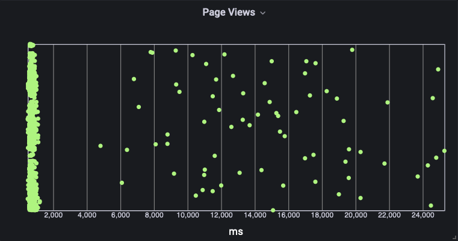
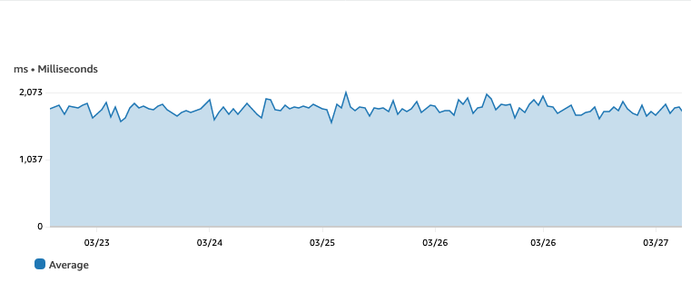
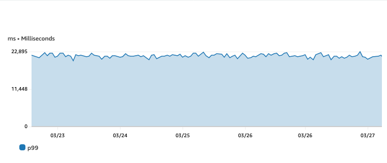
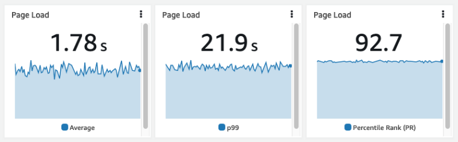

# パーセンタイルの重要性

パーセンタイルは、平均値だけに依存するのではなく、データ分布のより詳細で正確な見方を提供するため、モニタリングとレポートでは重要です。平均値は時には、パフォーマンスやユーザーエクスペリエンスに大きな影響を与える可能性のある、外れ値やデータの変動などの重要な情報を隠してしまうことがあります。一方、パーセンタイルはこれらの隠された詳細を明らかにし、データがどのように分布しているかをよりよく理解するのに役立ちます。 

[Amazon CloudWatch](https://aws.amazon.com/cloudwatch/) では、パーセンタイルを使用して、アプリケーションとインフラストラクチャ全体のレスポンスタイム、レイテンシ、エラーレートなど、さまざまなメトリクスをモニタリングおよびレポートすることができます。パーセンタイルにアラームを設定することで、特定のパーセンタイル値がしきい値を超えたときにアラートを受け取り、より多くの顧客に影響を与える前にアクションを実行できます。 

[CloudWatch でパーセンタイルを使用する](https://docs.aws.amazon.com/AmazonCloudWatch/latest/monitoring/cloudwatch_concepts.html#Percentiles) には、CloudWatch コンソールの **All metrics** でメトリクスを選択し、既存のメトリクスを使用して**統計** を **p99** に設定します。その後、p の後の値を編集して、必要なパーセンタイルに変更できます。次に、パーセンタイルグラフを表示したり、[CloudWatch ダッシュボード](https://docs.aws.amazon.com/AmazonCloudWatch/latest/monitoring/CloudWatch_Dashboards.html) に追加したり、これらのメトリクスにアラームを設定したりできます。 たとえば、レスポンスタイムの 95 パーセンタイルが特定のしきい値を超えたときに通知するアラームを設定できます。これは、多数のユーザーが遅いレスポンスタイムを経験していることを示しています。

以下のヒストグラムは、[Amazon Managed Grafana](https://aws.amazon.com/grafana/) で作成されており、[CloudWath Logs Insights](https://docs.aws.amazon.com/AmazonCloudWatch/latest/logs/AnalyzingLogData.html) からのクエリを使用しています。[CloudWatch RUM](https://docs.aws.amazon.com/AmazonCloudWatch/latest/monitoring/CloudWatch-RUM.html) ログです。 使用したクエリは以下の通りです。

```
fields @timestamp, event_details.duration
| filter event_type = "com.amazon.rum.performance_navigation_event"
| sort @timestamp desc
```

このヒストグラムは、ページの読み込み時間をミリ秒単位でプロットしています。この表示では、外れ値を明確に確認できます。平均を使用すると、このデータは隠されます。



CloudWatch で平均値を使用して同じデータを表示すると、ページの読み込みに 2 秒未満かかっていることが示されます。上記のヒストグラムから、ほとんどのページが実際には 1 秒未満で読み込まれており、外れ値があることがわかります。



同じデータを再びパーセンタイル(p99)を使用すると、問題があることが示されます。CloudWatch のグラフは現在、99%のページ読み込みが 23 秒未満であることを示しています。



これをより視覚的に表すために、以下のグラフは平均値と 99 パーセンタイルを比較しています。この場合、ターゲットのページ読み込み時間は 2 秒であり、代替の [CloudWatch 統計](https://docs.aws.amazon.com/AmazonCloudWatch/latest/monitoring/Statistics-definitions.html#Percentile-versus-Trimmed-Mean) と [メトリック数式](https://docs.aws.amazon.com/AmazonCloudWatch/latest/monitoring/using-metric-math.html) を使用して他の計算を行うことができます。 この場合、パーセンタイルランク(PR) が統計量 **PR(:2000)** とともに使用されており、92.7%のページ読み込みが 2000ms というターゲット内で発生していることを示しています。



CloudWatch でパーセンタイルを使用することで、システムのパフォーマンスについてより深い洞察を得たり、問題を早期に検出したり、そうでなければ隠されてしまう外れ値を特定することで顧客のエクスペリエンスを改善できます。
