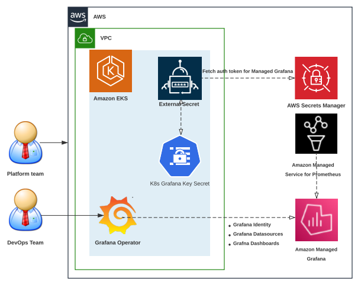
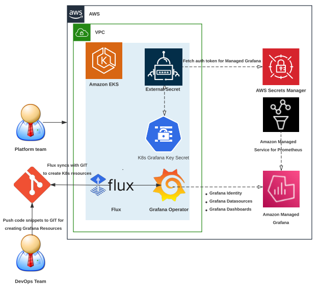

# Amazon Managed Grafana で GitOps と Grafana Operator を使用する

## このガイドの使い方

このオブザーバビリティのベストプラクティスガイドは、[grafana-operator](https://github.com/grafana-operator/grafana-operator#:~:text=The%20grafana%2Doperator%20is%20a,an%20easy%20and%20scalable%20way.) を Amazon EKS クラスターの Kubernetes オペレータとして使用して、Kubernetes ネイティブの方法で Amazon Managed Grafana の Grafana リソースと Grafana ダッシュボードのライフサイクルを作成および管理する方法を理解したい開発者およびアーキテクトを対象としています。

## はじめに

お客様は、オープンソースの分析および監視ソリューションのためのオブザーバビリティプラットフォームとして Grafana を使用しています。Amazon EKS でワークロードを実行しているお客様が、ワークロード重力に焦点を移し、Kubernetes ネイティブのコントローラーに依存して、Cloud リソースなどの外部リソースのライフサイクルをデプロイおよび管理することを目指していることがわかりました。お客様は、AWS サービスを作成、デプロイ、管理するために [AWS Controllers for Kubernetes (ACK)](https://aws-controllers-k8s.github.io/community/docs/community/overview/) をインストールしていることがわかりました。最近では、多くのお客様が Prometheus と Grafana の実装をマネージドサービスにオフロードすることを選択しており、AWS の場合、これらのサービスはワークロードの監視に[Amazon Managed Service for Prometheus](https://docs.aws.amazon.com/prometheus/?icmpid=docs_homepage_mgmtgov) と [Amazon Managed Grafana](https://docs.aws.amazon.com/grafana/?icmpid=docs_homepage_mgmtgov) です。

Grafana を使用する際にお客様が直面する一般的な課題の 1 つは、Kubernetes クラスタから Amazon Managed Grafana などの外部 Grafana インスタンスでの Grafana リソースと Grafana ダッシュボードのライフサイクルを作成および管理することです。お客様は、Amazon Managed Grafana での Grafana リソースの作成も含め、Git ベースのワークフローを使用してシステム全体のインフラストラクチャとアプリケーションのデプロイを完全に自動化および管理する方法を見つけることに課題を感じています。このオブザーバビリティのベストプラクティスガイドでは、次のトピックに焦点を当てます。

* Grafana Operator の概要 - Kubernetes クラスタから外部の Grafana インスタンスを管理するための Kubernetes Operator
* GitOps の概要 - Git ベースのワークフローを使用してインフラストラクチャを作成および管理するための自動メカニズム  
* Amazon EKS での Grafana Operator を使用した Amazon Managed Grafana の管理
* Amazon EKS での Flux を使用した GitOps による Amazon Managed Grafana の管理

## Grafana Operator の概要

[grafana-operator](https://github.com/grafana-operator/grafana-operator#:~:text=The%20grafana%2Doperator%20is%20a,an%20easy%20and%20scalable%20way.) は、Kubernetes 内の Grafana インスタンスを管理するのに役立つ Kubernetes Operator です。Grafana Operator を使用すると、ダッシュボード、データソースなどを複数のインスタンス間で宣言的に管理および作成できるようになり、容易かつスケーラブルな方法が実現します。Grafana Operator は現在、Amazon Managed Grafana のような外部環境でホストされているダッシュボード、データソースなどのリソースの管理をサポートしています。これにより、[Flux](https://fluxcd.io/) などの CNCF プロジェクトを使用した GitOps メカニズムを利用して、Amazon EKS クラスタから Amazon Managed Grafana のリソースのライフサイクルを作成および管理できるようになります。

## GitOps の概要

### GitOps とは

GitOps は、Git をデプロイ設定の真実の情報源として利用するソフトウェア開発および運用の方法論です。
アプリケーションまたはインフラストラクチャの目的の状態を Git リポジトリに保持し、Git ベースのワークフローを利用して変更を管理およびデプロイすることを含みます。
GitOps は、システム全体を Git リポジトリで宣言的に記述するアプリケーションおよびインフラストラクチャのデプロイを管理する方法です。
バージョン管理、イミュータブルなアーティファクト、自動化のベストプラクティスを活用して、複数の Kubernetes クラスタの状態を管理する機能を提供します。

Flux は、Kubernetes 上のアプリケーションの自動デプロイを実現する GitOps ツールです。
Git リポジトリの状態を継続的に監視し、クラスタにあらゆる変更を適用することで機能します。
Flux は、GitHub、[GitLab](https://dzone.com/articles/auto-deploy-spring-boot-app-using-gitlab-cicd)、Bitbucket などのさまざまな Git プロバイダと統合されています。
リポジトリに変更が加えられると、Flux がそれを自動的に検出し、クラスタを適切に更新します。

### Flux を使用する利点

* **自動デプロイ**: Flux はデプロイプロセスを自動化し、手動のエラーを減らし、開発者が他のタスクに集中できるようにします。
* **Git ベースのワークフロー**: Flux は Git を真実の情報源として利用し、変更の追跡と巻き戻しを容易にします。
* **宣言的な構成**: Flux はクラスタの望ましい状態を定義するために [Kubernetes](https://dzone.com/articles/kubernetes-full-stack-example-with-kong-ingress-co) マニフェストを使用し、管理と変更の追跡を容易にします。

### Flux の採用における課題

* **限定的なカスタマイズ**: Flux は限定的なカスタマイズのみをサポートしており、すべてのユースケースに適しているとは限りません。
* **学習曲線が急峻**: Flux は新規ユーザーにとって学習曲線が急峻で、Kubernetes と Git の深い理解が必要です。

## Amazon Managed Grafana のリソースを管理するために Amazon EKS で Grafana Operator を使用する

前のセクションで説明したように、Grafana Operator を使用すると、Kubernetes ネイティブの方法で Amazon Managed Grafana のリソースのライフサイクルを作成および管理するために Kubernetes クラスタを使用できます。 以下のアーキテクチャ図は、Grafana Operator を使用して AMG とのアイデンティティの設定、Amazon Managed Service for Prometheus のデータソースとしての追加、Kubernetes ネイティブの方法で Amazon EKS クラスタから Amazon Managed Grafana へのダッシュボードの作成を示しています。

Amazon Managed Grafana を管理するために Kubernetes クラスタでオープンソースの Grafana Operator を使用する方法の詳細なデモンストレーションは、[Using Open Source Grafana Operator on your Kubernetes cluster to manage Amazon Managed Grafana](https://aws.amazon.com/blogs/mt/using-open-source-grafana-operator-on-your-kubernetes-cluster-to-manage-amazon-managed-grafana/) を参照してください。

## Flux を使用した Amazon EKS での GitOps による Amazon Managed Grafana のリソース管理

上記で説明したように、Flux は Kubernetes 上のアプリケーションのデプロイを自動化します。 
Flux は GitHub などの Git リポジトリの状態を継続的に監視し、リポジトリに変更が加えられると、Flux がそれを自動的に検出してクラスタを適切に更新します。 
以下のアーキテクチャでは、Kubernetes クラスタから Grafana Operator を使用し、Flux を使用した GitOps メカニズムで Amazon Managed Service for Prometheus をデータソースとして追加し、Kubernetes ネイティブの方法で Amazon Managed Grafana にダッシュボードを作成する方法をデモンストレーションします。

EKS クラスター上に次のような必要な「Day 2」運用ツールを設定するワークショップモジュールを参照してください。

* [External Secrets Operator](https://github.com/external-secrets/external-secrets/tree/main/deploy/charts/external-secrets) は、AWS シークレットマネージャから Amazon Managed Grafana のシークレットを読み取るために正常にインストールされます
* [Prometheus Node Exporter](https://github.com/prometheus/node_exporter) はメモリ、ディスク、CPU 利用率などのさまざまなマシンリソースを測定するために使用されます
* [Grafana Operator](https://github.com/grafana-operator/grafana-operator) は、Kubernetes ネイティブな方法で Amazon Managed Grafana のリソースのライフサイクルを作成および管理するために Kubernetes クラスタを使用します
* [Flux](https://fluxcd.io/) は、GitOps メカニズムを使用して Kubernetes 上のアプリケーションのデプロイを自動化します

## まとめ

オブザーバビリティのベストプラクティスガイドのこのセクションでは、Amazon Managed Grafana での Grafana Operator と GitOps の使用について学びました。GitOps と Grafana Operator の概要から始まり、Amazon EKS 上の Grafana Operator を使用して Amazon Managed Grafana のリソースを管理し、Amazon EKS クラスタからの Kubernetes ネイティブの方法で Amazon Managed Grafana に AWS データソースを追加するために Amazon EKS 上の Flux で GitOps を使用して Amazon Managed Grafana のリソースを管理する方法に焦点を当てました。
