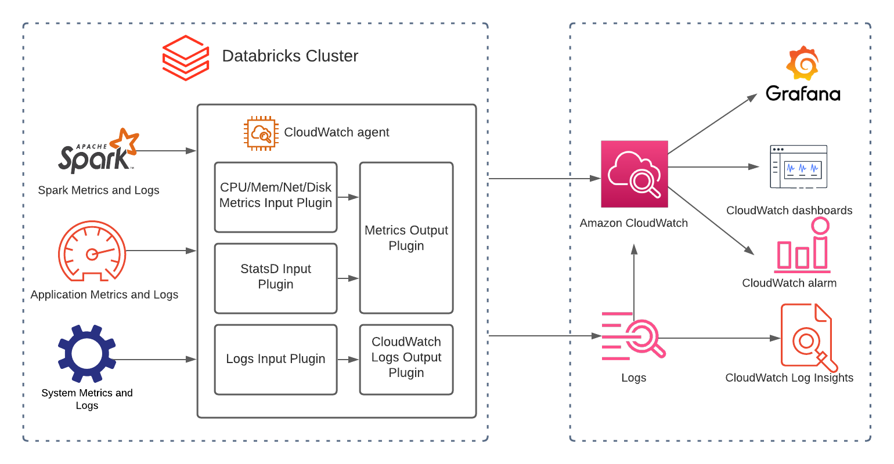
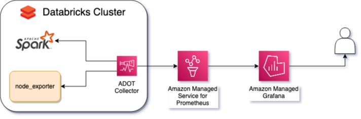

# AWS における Databricks のモニタリングとオブザーバビリティのベストプラクティス

Databricks は、データ分析や AI/ML ワークロードを管理するためのプラットフォームです。このガイドは、[AWS 上の Databricks](https://aws.amazon.com/solutions/partners/databricks/) を実行しているお客様が、オブザーバビリティのための AWS ネイティブサービスやオープンソースのマネージドサービスを使用してこれらのワークロードをモニタリングするのを支援することを目的としています。

## Databricks を監視する理由  

Databricks クラスタを管理する運用チームは、ワークロードのステータス、エラー、パフォーマンスのボトルネックを追跡するための統合されカスタマイズされたダッシュボード;時間経過に伴うリソース使用量合計やエラー発生率などの望ましくない動作に対するアラート;根本原因分析のための集中ログや、追加のカスタムメトリクスの抽出などの恩恵を受けます。

## 監視する項目

Databricks はクラスターインスタンスで Apache Spark を実行します。Spark にはメトリクスを公開するネイティブ機能があります。これらのメトリクスは、ドライバー、ワーカー、クラスターで実行されているワークロードに関する情報を提供します。

Spark を実行しているインスタンスには、ストレージ、CPU、メモリ、ネットワークに関する追加の有用な情報があります。Databricks クラスターのパフォーマンスに影響を与え得る外部要因を理解することが重要です。インスタンスの多いクラスターの場合、ボトルネックと全体的な健全性を理解することも同様に重要です。

## モニタリングの方法

コレクタとその依存関係をインストールするには、Databricks の init スクリプトが必要です。 これらは、Databricks クラスタの各インスタンスのブート時に実行されるスクリプトです。

Databricks クラスターは、インスタンスプロファイルを使用してメトリクスとログを送信する許可も必要です。

最後に、クラスタを適切に参照する `testApp` を置き換えることにより、Databricks クラスターの Spark 構成でメトリクス名前空間を構成することがベストプラクティスです。

*図 1: メトリクス名前空間の Spark 構成の例*

## データブリックスに適したオブザーバビリティソリューションの主要部分

**1) メトリクス:** メトリクスとは、一定期間に測定されたアクティビティや特定のプロセスを記述する数値です。データブリックスには次のような種類のメトリクスがあります。

システムリソースレベルのメトリクス(CPU、メモリ、ディスク、ネットワークなど)
Custom Metrics Source、StreamingQueryListener、QueryExecutionListener を使用したアプリケーションメトリクス
MetricsSystem によって公開される Spark メトリクス

**2) ログ:** ログは発生した一連のイベントを表しており、それらについて線形的なストーリーを伝えます。データブリックスには次のような種類のログがあります。

- イベントログ
- 監査ログ
- ドライバーログ: stdout、stderr、log4j カスタムログ(構造化ロギングを有効化)
- エグゼキューターログ: stdout、stderr、log4j カスタムログ(構造化ロギングを有効化)

**3) トレース:** スタックトレースはエンドツーエンドの可視性を提供し、ステージ全体のフローを示します。これはエラーやパフォーマンスの問題を引き起こしているステージ/コードを特定するためのデバッグに役立ちます。

**4) ダッシュボード:** ダッシュボードは、アプリケーション/サービスの重要なメトリクスのすばらしい概要表示を提供します。

**5) アラート:** アラートは、注意が必要な条件についてエンジニアに通知します。

## AWS ネイティブのオブザーバビリティオプション

Ganglia UIやLog Deliveryなどのネイティブソリューションは、システムメトリクスの収集やApache SparkTMメトリクスのクエリには最適なソリューションです。しかし、改善の余地がある領域もあります。

- Ganglia はアラートをサポートしていません。 
- Ganglia はログから導出されたメトリクス(例: ERRORログの成長率)をサポートしていません。
- SLO(Service Level Objectives)やSLI(Service Level Indicators)に関連するデータ正確性、データ新鮮度、エンドツーエンドのレイテンシを追跡するためのカスタムダッシュボードを作成し、Gangliaで視覚化することができません。

[Amazon CloudWatch](https://aws.amazon.com/cloudwatch/) は、AWS上のDatabricksクラスターを監視および管理するための重要なツールです。 クラスターのパフォーマンスに関する貴重な洞察を提供し、問題をすばやく特定および解決するのに役立ちます。 Databricks と CloudWatch の統合および構造化ロギングの有効化により、これらの領域を改善できます。 CloudWatch Application Insights は、ログに含まれるフィールドを自動的に検出するのに役立ち、CloudWatch Logs Insights は、より高速なデバッグと分析のための目的構築型クエリ言語を提供します。

*図2: Databricks CloudWatchアーキテクチャ*

CloudWatchを使用してDatabricksを監視する方法の詳細については、以下を参照してください。 
[How to Monitor Databricks with Amazon CloudWatch](https://aws.amazon.com/blogs/mt/how-to-monitor-databricks-with-amazon-cloudwatch/)

## オープンソースのオブザーバビリティオプション

[Amazon Managed Service for Prometheus](https://aws.amazon.com/prometheus/) は、プロメテウス互換のマネージドサーバーレスなモニタリングサービスで、メトリクスの保存とこれらのメトリクス上に作成されたアラートの管理を担当します。Prometheus は人気のオープンソースモニタリングテクノロジーで、Kubernetes に次いで Cloud Native Computing Foundation に属する 2 番目のプロジェクトです。

[Amazon Managed Grafana](https://aws.amazon.com/grafana/) は Grafana のマネージドサービスです。Grafana は時系列データの可視化のためのオープンソーステクノロジーで、オブザーバビリティに一般的に使用されています。Grafana を使用して、Amazon Managed Service for Prometheus、Amazon CloudWatch など、いくつかのソースからのデータを可視化できます。Databricks のメトリクスとアラートの可視化に使用されます。

[AWS Distro for OpenTelemetry](https://aws-otel.github.io/) は OpenTelemetry プロジェクトの AWS 対応ディストリビューションで、トレースとメトリクスの収集のためのオープンソース標準、ライブラリ、サービスを提供します。OpenTelemetry を通じて、Prometheus や StatsD などのさまざまなオブザーバビリティデータ形式を収集し、このデータをエンリッチして、CloudWatch や Amazon Managed Service for Prometheus などのさまざまなデスティネーションに送信できます。

### ユースケース

AWS ネイティブサービスは、Databricks クラスターを管理するために必要なオブザーバビリティを提供しますが、オープンソースのマネージドサービスを使用するのが最良の選択肢であるシナリオもあります。

Prometheus と Grafana は非常に人気のあるテクノロジーであり、すでに多くの企業で使用されています。オブザーバビリティのための AWS オープンソースサービスを使用すると、運用チームは同じ既存のインフラ、同じクエリ言語、既存のダッシュボードとアラートを使用して、これらのサービスインフラ、スケーラビリティ、パフォーマンスを管理する大変な作業なしに、Databricks ワークロードを監視できます。

ADOT は、CloudWatch と Prometheus などの異なるデスティネーションにメトリクスとトレースを送信したり、OTLP と StatsD などの異なるタイプのデータソースと連携したりする必要があるチームにとって最良の選択肢です。

最後に、Amazon Managed Grafana は CloudWatch と Prometheus を含むさまざまなデータソースをサポートしており、複数のツールを使用することを決定したチームのデータの相関を支援します。これにより、すべての Databricks クラスタのオブザーバビリティを可能にするテンプレートの作成と、インフラストラクチャとしてのコードを介したプロビジョニングと構成を可能にする強力な API が実現します。

*図 3: Databricks オープンソース オブザーバビリティ アーキテクチャ*

AWS Managed Open Source Services for Observability を使用して Databricks クラスターからのメトリクスを観測するには、メトリクスとアラートの両方を可視化する Amazon Managed Grafana ワークスペースと、Amazon Managed Grafana ワークスペースでデータソースとして構成されている Amazon Managed Service for Prometheus ワークスペースが必要です。

Spark メトリクスとノード メトリクスの 2 つの重要な種類のメトリクスを収集する必要があります。

Spark メトリクスには、クラスター内の現在のワーカー数やエグゼキュータ数などの情報が含まれます。シャッフルは、ノードが処理中にデータを交換するときに発生します。スピルは、データが RAM からディスクへ、ディスクから RAM へ移動するときに発生します。これらのメトリクスを公開するには、Spark 3.0 以降で利用できるネイティブ Prometheus を Databricks 管理コンソールを介して有効にし、`init_script` を介して構成する必要があります。

ディスク使用量、CPU 時間、メモリ、ストレージパフォーマンスなどのノードメトリクスを追跡するには、`node_exporter` を使用します。これは追加の構成なしで使用できますが、重要なメトリクスのみを公開する必要があります。

各ノードに ADOT Collector をインストールする必要があります。これにより、Spark と `node_exporter` によって公開されたメトリクスがスクレイピングされ、`cluster_name` などのメタデータが挿入され、Prometheus ワークスペースに送信されます。

ADOT Collector と `node_exporter` は両方とも `init_script` を介してインストールおよび構成する必要があります。

Databricks クラスターは、Prometheus ワークスペースにメトリクスを書き込む権限を持つ IAM ロールで構成する必要があります。

## ベストプラクティス

### 価値のあるメトリクスを優先する

Spark と node_exporter はともに、監視とインシデント対応に役立つメトリクスをフィルタリングせずに、いくつかのメトリクスと同じメトリクスのいくつかのフォーマットを公開します。 問題を検出する平均時間が増加し、サンプルを保存するコストが増加し、価値のある情報が見つけられて理解されにくくなります。 OpenTelemetry プロセッサを使用すると、価値のあるメトリクスのみをフィルタリングして保持したり、意味のないメトリクスをフィルタリングしたり、AMP に送信する前にメトリクスを集計および計算したりすることができます。

### アラート疲れを避ける

価値のあるメトリクスが AMP に取り込まれると、アラートの設定が不可欠です。
ただし、すべてのリソース使用量のバーストに対してアラートを出すと、アラート疲れを引き起こす可能性があります。
つまり、ノイズが多すぎるとアラートの重要度に対する信頼性が低下し、重要なイベントが検出されなくなるのです。
AMP のアラートルールグループ機能を使用して、あいまいさを避ける必要があります。
つまり、複数の関連するアラートで個別の通知が生成されるのを避ける必要があります。
また、アラートには適切な重要度を割り当てる必要があり、ビジネスの優先事項を反映する必要があります。

### Amazon Managed Grafana ダッシュボードの再利用

Amazon Managed Grafana は、Grafana のネイティブテンプレート機能を利用して、すべての既存および新しい Databricks クラスターのダッシュボードを作成できます。これにより、各クラスターごとに視覚化を手動で作成および保守する必要がなくなります。この機能を使用するには、クラスターごとにメトリクスをグループ化するために、メトリクスに正しいラベルが付いていることが重要です。ここでも、OpenTelemetry プロセッサを使用することができます。

## 参考文献とその他の情報

- [Amazon Managed Service for Prometheus ワークスペースの作成](https://docs.aws.amazon.com/prometheus/latest/userguide/AMP-onboard-create-workspace.html)
- [Amazon Managed Grafana ワークスペースの作成](https://docs.aws.amazon.com/grafana/latest/userguide/Amazon-Managed-Grafana-create-workspace.html)
- [Amazon Managed Service for Prometheus データソースの設定](https://docs.aws.amazon.com/grafana/latest/userguide/prometheus-data-source.html)
- [Databricks 初期化スクリプト](https://docs.databricks.com/clusters/init-scripts.html)
