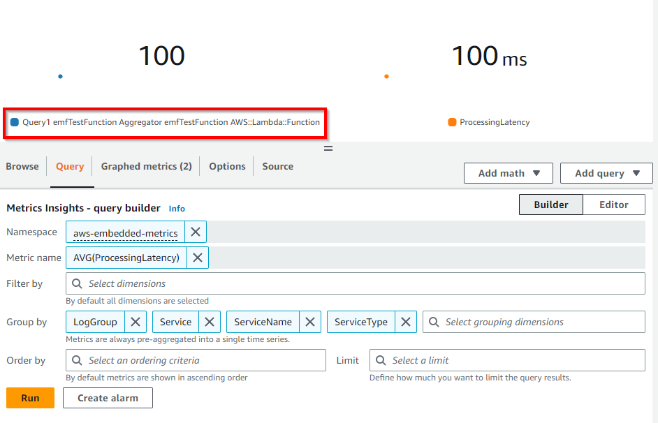
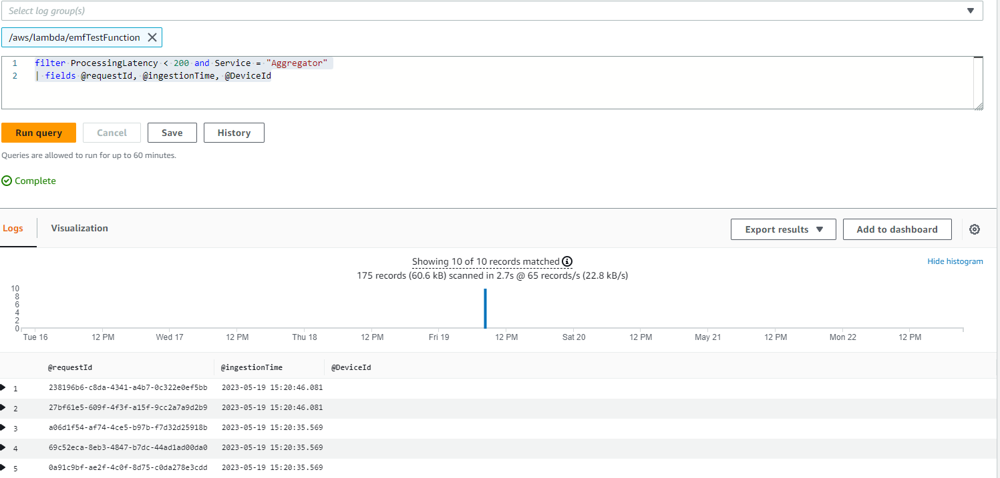

# CloudWatch Embedded Metric Format

## はじめに

CloudWatch Embedded Metric Format(EMF) を使用すると、ログの形式で複雑な高基数アプリケーションデータを Amazon CloudWatch にインジェストし、実行可能なメトリクスを生成できます。Embedded Metric Format を使用することで、複雑なアーキテクチャに依存したり、サードパーティのツールを使用したりすることなく、環境の洞察を得ることができます。この機能はすべての環境で使用できますが、AWS Lambda 関数や Amazon Elastic Container Service(Amazon ECS)、Amazon Elastic Kubernetes Service(Amazon EKS)、EC2 上の Kubernetes などのエフェメラルリソースを持つワークロードで特に役立ちます。 Embedded Metric Format を使用することで、お客様はコードの計装やメンテナンスを行うことなく、ログデータからパワフルな分析機能を得ながら、カスタムメトリクスを簡単に作成できます。

## 埋め込みメトリックフォーマット(EMF)ログの仕組み

Amazon EC2、オンプレミスサーバー、Amazon Elastic Container Service(Amazon ECS)のコンテナ、Amazon Elastic Kubernetes Service(Amazon EKS)、EC2 上の Kubernetes などのコンピュート環境は、CloudWatch エージェントを通じて埋め込みメトリックフォーマット(EMF)ログを生成し、Amazon CloudWatch に送信できます。

AWS Lambda を使用すると、カスタムコードの記述やネットワーク呼び出しのブロック、サードパーティソフトウェアに依存することなく、簡単にカスタムメトリクスを生成できます。これにより、Amazon CloudWatch に埋め込みメトリックフォーマット(EMF)ログを生成および取り込むことができます。

お客様は、構造化ログを公開する際に特別なヘッダー宣言を提供する必要がなく、[EMF 仕様](https://docs.aws.amazon.com/AmazonCloudWatch/latest/monitoring/CloudWatch_Embedded_Metric_Format_Specification.html)に合わせて、詳細なログイベントデータとともにカスタムメトリクスを非同期的に埋め込むことができます。CloudWatch はカスタムメトリクスを自動的に抽出するので、お客様はメトリクスの可視化やリアルタイムのインシデント検知のためのアラーム設定ができます。抽出されたメトリクスに関連付けられた詳細なログイベントと高基数コンテキストは、CloudWatch Logs Insights を使用してクエリできるので、運用イベントの根本原因について深い洞察を得ることができます。 

[Fluent Bit](https://docs.fluentbit.io/manual/pipeline/outputs/cloudwatch) 向け Amazon CloudWatch 出力プラグインを使用すると、[埋め込みメトリックフォーマット](https://github.com/aws/aws-for-fluent-bit)(EMF) をサポートしたメトリクスとログデータを Amazon CloudWatch サービスに取り込むことができます。


## Embedded Metric Format(EMF)ログを使用するタイミング

従来、モニタリングは3つのカテゴリに分類されてきました。1つ目のカテゴリは、アプリケーションのクラシックなヘルスチェックです。2つ目のカテゴリは「メトリクス」で、カウンター、タイマー、ゲージなどのモデルを使用してアプリケーションにインスツルメンテーションを適用するものです。3つ目のカテゴリは「ログ」で、アプリケーションの全体的な可観測性にとって不可欠なものです。ログは、アプリケーションの動作について継続的な情報を顧客に提供します。 
今では、データの粒度や豊富さを犠牲にすることなく、アプリケーションのすべてのインスツルメンテーションを統一および簡素化しながら、Embedded Metric Format(EMF)ログを通じて信じられないほどの分析機能を得ることで、アプリケーションの観測方法を大幅に改善する方法が顧客にはあります。

[Embedded Metric Format(EMF)ログ](https://aws.amazon.com/blogs/mt/enhancing-workload-observability-using-amazon-cloudwatch-embedded-metric-format/)は、EMFログの一部として高基数アプリケーションデータを生成できる環境に理想的です。これにより、メトリクスのディメンションを増やさずに、アプリケーションデータをスライスおよびダイスできます。CloudWatch Logs InsightsとCloudWatch Metrics Insightsを使用してEMFログをクエリすることで、すべての属性をメトリクスディメンションとして設定する必要がなくなります。

[何百万ものテレコムまたはIoTデバイスからのテレメトリデータを集計](https://aws.amazon.com/blogs/mt/how-bt-uses-amazon-cloudwatch-to-monitor-millions-of-devices/)する顧客は、デバイスのパフォーマンスとデバイスが報告する一意のテレメトリに迅速に深掘りする機能が必要です。また、膨大なデータを掘り下げることなく、問題をより簡単かつ高速にトラブルシューティングする必要があります。Embedded Metric Format(EMF)ログを使用することで、メトリクスとログを1つのエンティティに組み合わせることで大規模な可観測性を実現し、コスト効率とパフォーマンスの向上によりトラブルシューティングを改善できます。

## 埋め込みメトリックフォーマット(EMF)ログの生成

次の方法を使用して、埋め込みメトリックフォーマットログを生成できます。

1. オープンソースのクライアントライブラリを使用して、エージェント([CloudWatch](https://docs.aws.amazon.com/AmazonCloudWatch/latest/monitoring/CloudWatch_Embedded_Metric_Format_Generation_CloudWatch_Agent.html) や Fluent-Bit、Firelens) を介して EMF ログを生成および送信します。

   - 以下の言語でオープンソースのクライアントライブラリが利用でき、これを使用して EMF ログを作成できます。
     - [Node.Js](https://github.com/awslabs/aws-embedded-metrics-node)
     - [Python](https://github.com/awslabs/aws-embedded-metrics-python)
     - [Java](https://github.com/awslabs/aws-embedded-metrics-java)
     - [C#](https://github.com/awslabs/aws-embedded-metrics-dotnet)
   - AWS Distro for OpenTelemetry(ADOT)を使用して、EMF ログを生成できます。ADOT は、Cloud Native Computing Foundation(CNCF)の一部である OpenTelemetry プロジェクトのセキュアで本番稼働可能な AWS 対応ディストリビューションです。OpenTelemetry は、アプリケーションモニタリングのための分散トレース、ログ、メトリクスを収集するための API、ライブラリ、エージェントを提供するオープンソースイニシアチブであり、ベンダー固有のフォーマット間の境界と制限を取り除きます。これには、OpenTelemetry に準拠したデータソースと、[CloudWatch EMF](https://aws-otel.github.io/docs/getting-started/cloudwatch-metrics#cloudwatch-emf-exporter-awsemf) ログで使用するように有効化された [ADOT Collector](https://github.com/open-telemetry/opentelemetry-collector-contrib/tree/main/exporter/awsemfexporter) の 2 つのコンポーネントが必要です。

2. [定義された仕様](https://docs.aws.amazon.com/AmazonCloudWatch/latest/monitoring/CloudWatch_Embedded_Metric_Format_Specification.html)に準拠する JSON 形式の手動構築ログを、[CloudWatch エージェント](https://docs.aws.amazon.com/AmazonCloudWatch/latest/monitoring/CloudWatch_Embedded_Metric_Format_Generation_CloudWatch_Agent.html)または [PutLogEvents API](https://docs.aws.amazon.com/AmazonCloudWatch/latest/monitoring/CloudWatch_Embedded_Metric_Format_Generation_PutLogEvents.html) を介して CloudWatch に送信できます。

## CloudWatch コンソールで Embedded Metric Format ログを表示する

メトリクスを抽出する Embedded Metric Format (EMF) ログを生成した後、お客様は [CloudWatch コンソールの](https://docs.aws.amazon.com/ja_jp/AmazonCloudWatch/latest/monitoring/CloudWatch_Embedded_Metric_Format_View.html) メトリクス下でそれらを表示できます。埋め込みメトリクスには、ログ生成時に指定されたディメンションがあります。クライアントライブラリを使用して生成された埋め込みメトリクスには、ServiceType、ServiceName、LogGroup がデフォルトのディメンションとして設定されます。

- **ServiceName**: サービス名は上書きされますが、サービス名を推測できないサービス(EC2 上で実行されている Java プロセスなど)の場合、明示的に設定されていない限り、デフォルト値の Unknown が使用されます。

- **ServiceType**: サービスタイプは上書きされますが、タイプを推測できないサービス(EC2 上で実行されている Java プロセスなど)の場合、明示的に設定されていない限り、デフォルト値の Unknown が使用されます。

- **LogGroupName**: エージェントベースのプラットフォームの場合、お客様はオプションでメトリクスを配信する必要がある宛先ロググループを構成できます。この値はライブラリからエージェントに Embedded Metric ペイロードで渡されます。LogGroup が指定されていない場合、デフォルト値はサービス名から導出されます: -metrics

- **LogStreamName**: エージェントベースのプラットフォームの場合、お客様はオプションでメトリクスを配信する必要がある宛先ログストリームを構成できます。この値はライブラリからエージェントに Embedded Metric ペイロードで渡されます。LogStreamName が指定されていない場合、デフォルト値はエージェントによって導出されます(これはおそらくホスト名になります)。

- **NameSpace**: CloudWatch の名前空間をオーバーライドします。設定されていない場合、デフォルト値の aws-embedded-metrics が使用されます。

CloudWatch コンソールのログ内の EMF ログのサンプルは次のようになります。

```json
2023-05-19T15:20:39.391Z 238196b6-c8da-4341-a4b7-0c322e0ef5bb INFO
{
    "LogGroup": "emfTestFunction",
    "ServiceName": "emfTestFunction",
    "ServiceType": "AWS::Lambda::Function",
    "Service": "Aggregator",
    "AccountId": "XXXXXXXXXXXX",
    "RequestId": "422b1569-16f6-4a03-b8f0-fe3fd9b100f8",
    "DeviceId": "61270781-c6ac-46f1-baf7-22c808af8162",
    "Payload": {
        "sampleTime": 123456789,
        "temperature": 273,
        "pressure": 101.3
    },
    "executionEnvironment": "AWS_Lambda_nodejs18.x",
    "memorySize": "256",
    "functionVersion": "$LATEST",
    "logStreamId": "2023/05/19/[$LATEST]f3377848231140c185570caa9f97abc8",
    "_aws": {
        "Timestamp": 1684509639390,
        "CloudWatchMetrics": [
            {
                "Dimensions": [
                    [
                        "LogGroup",
                        "ServiceName",
                        "ServiceType",
                        "Service"
                    ]
                ],
                "Metrics": [
                    {
                        "Name": "ProcessingLatency",
                        "Unit": "Milliseconds"
                    }
                ],
                "Namespace": "aws-embedded-metrics"
            }
        ]
    },
    "ProcessingLatency": 100
}
```

同じ EMF ログの場合、抽出されたメトリクスは以下のようになり、**CloudWatch メトリクス** でクエリできます。



お客様は、**CloudWatch Logs Insights** を使用して、抽出されたメトリクスに関連付けられている詳細なログイベントをクエリすることで、運用イベントの根本原因について深い洞察を得ることができます。EMF ログからメトリクスを抽出するメリットの 1 つは、お客様が一意のメトリクス(メトリクス名と一意のディメンションセット)とメトリクス値でログをフィルタリングし、集計されたメトリクス値に寄与したイベントのコンテキストを取得できることです。

上記で説明した同じ EMF ログの場合、ProcessingLatency をメトリクスとして、Service をディメンションとして、影響を受けたリクエスト ID やデバイス ID を取得するサンプルクエリを、CloudWatch Logs Insights のサンプルクエリとして以下に示します。

```json
filter ProcessingLatency < 200 and Service = "Aggregator"
| fields @requestId, @ingestionTime, @DeviceId
```



## EMF ログで作成したメトリクスのアラーム

[EMF によって生成されたメトリクスのアラームの作成](https://docs.aws.amazon.com/ja_jp/AmazonCloudWatch/latest/monitoring/CloudWatch_Embedded_Metric_Format_Alarms.html) は、他のメトリクスのアラームの作成と同じパターンに従います。ここで注意すべき重要な点は、EMF メトリクスの生成はログのパブリッシング フローに依存していることです。これは、CloudWatch Logs が EMF ログを処理し、メトリクスに変換するためです。したがって、アラームが評価される期間内にメトリクス データポイントが作成されるように、タイムリーにログをパブリッシュすることが重要です。

上記の同じ EMF ログを使用して、ProcessingLatency メトリクスをデータポイントとし、しきい値を設定したアラームの例を以下に示します。


## EMF ログの最新機能

お客様は [PutLogEvents API](https://docs.aws.amazon.com/AmazonCloudWatch/latest/monitoring/CloudWatch_Embedded_Metric_Format_Generation_PutLogEvents.html) を使用して EMF ログを CloudWatch Logs に送信できます。オプションで HTTP ヘッダー `x-amzn-logs-format: json/emf` を含めることで、CloudWatch Logs にメトリクスを抽出するよう指示できましたが、これはもう必要ありません。

Amazon CloudWatch は、構造化ログから Embedded Metric Format (EMF) を使用して、最大 1 秒の粒度で[高解像度メトリクス抽出](https://aws.amazon.com/about-aws/whats-new/2023/02/amazon-cloudwatch-high-resolution-metric-extraction-structured-logs/)をサポートしています。 お客様は EMF 仕様ログ内にオプションの [StorageResolution](https://docs.aws.amazon.com/AmazonCloudWatch/latest/monitoring/cloudwatch_concepts.html#Resolution_definition) パラメータを指定できます。これに 1 または 60 (デフォルト) の値を設定することで、メトリクスの希望解像度 (秒単位) を示すことができます。 お客様は EMF を介して標準解像度 (60 秒) と高解像度 (1 秒) の両方のメトリクスを公開できるため、アプリケーションの正常性とパフォーマンスを詳細に可視化できます。

Amazon CloudWatch は、Embedded Metric Format (EMF) でのエラーの[可視性を強化](https://aws.amazon.com/about-aws/whats-new/2023/01/amazon-cloudwatch-enhanced-error-visibility-embedded-metric-format-emf/)しました。これには 2 つのエラーメトリクス ([EMFValidationErrors と EMFParsingErrors](https://docs.aws.amazon.com/AmazonCloudWatch/latest/logs/CloudWatch-Logs-Monitoring-CloudWatch-Metrics.html)) が含まれています。この可視性の強化により、お客様は EMF を活用した際のエラーをすばやく特定および修正できるため、計装プロセスが簡略化されます。

現代のアプリケーションの管理の複雑さが増すにつれ、お客様はカスタムメトリクスの定義と分析においてより柔軟性が必要となっています。 そのため、メトリクスのディメンションの最大数が 10 から 30 に増えました。 お客様は [最大 30 のディメンションを持つ EMF ログを使用して](https://aws.amazon.com/about-aws/whats-new/2022/08/amazon-cloudwatch-metrics-increases-throughput/) カスタムメトリクスを作成できます。

## 参考資料

- NodeJS ライブラリを使用した AWS Lambda 関数での[埋め込みメトリックフォーマット](https://catalog.workshops.aws/observability/ja/aws-native/metrics/emf/clientlibrary) の One Observability ワークショップのサンプル
- 非同期メトリックスに関する Serverless Observability ワークショップの[埋め込みメトリックフォーマット(EMF) を使用](https://serverless-observability.workshop.aws/ja/030_cloudwatch/async_metrics_emf.html)
- CloudWatch Logs に EMF ログを送信するために [PutLogEvents API を使用した Java コードサンプル](https://catalog.workshops.aws/observability/ja/aws-native/metrics/emf/putlogevents)
- ブログ記事: [Amazon CloudWatch 埋め込みカスタムメトリクスでコスト削減と顧客重視](https://aws.amazon.com/blogs/mt/lowering-costs-and-focusing-on-our-customers-with-amazon-cloudwatch-embedded-custom-metrics/)
