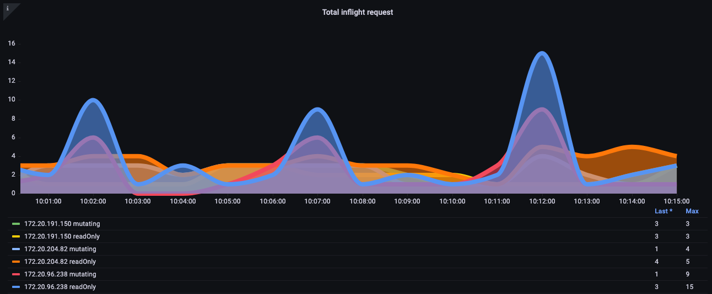

# Amazon EKS API サーバーのモニタリング

Observability ベストプラクティスガイドのこのセクションでは、API サーバーのモニタリングに関する以下のトピックについて詳しく説明します。

* Amazon EKS API サーバーのモニタリングの概要
* API サーバートラブルシューターダッシュボードのセットアップ
* API トラブルシューターダッシュボードを使用した API サーバーの問題の理解
* API サーバーへの無制限のリストコールの理解
* API サーバーへの不正な動作の停止
* API の優先順位とフェアネス
* 最も遅い API コールと API サーバーの待ち時間の問題の特定

### はじめに

Amazon EKS 管理コントロールプレーンを監視することは、EKS クラスターの正常性に関する問題を積極的に特定するための非常に重要な Day 2 の運用活動です。Amazon EKS コントロールプレーンの監視により、収集されたメトリクスに基づいて積極的な対策を講じることができます。これらのメトリクスは、API サーバーのトラブルシューティングを支援し、内部の問題を特定するのに役立ちます。

このセクションでは、Amazon EKS API サーバーの監視に Amazon Managed Service for Prometheus (AMP) を、メトリクスの可視化に Amazon Managed Grafana (AMG) を使用してデモンストレーションを行います。Prometheus は、強力なクエリ機能を備え、さまざまなワークロードに幅広くサポートされている人気のオープンソースモニタリングツールです。Amazon Managed Service for Prometheus は、Amazon EKS、[Amazon Elastic Container Service (Amazon ECS)](https://aws.amazon.com/jp/ecs)、[Amazon Elastic Compute Cloud (Amazon EC2)](https://aws.amazon.com/jp/ec2) などの環境を安全かつ確実に監視できるよう設計された、完全マネージド型の Prometheus 互換サービスです。[Amazon Managed Grafana](https://aws.amazon.com/jp/grafana/) は、オープンソース Grafana の完全マネージド型でセキュアなデータ可視化サービスで、お客様がさまざまなデータソースからアプリケーションの運用メトリクス、ログ、トレースを即座にクエリ、相関、可視化できるようにします。

最初に、Amazon Managed Service for Prometheus と Amazon Managed Grafana を使用して、[Amazon Elastic Kubernetes Service (Amazon EKS)](https://aws.amazon.com/jp/eks) API サーバーのトラブルシューティングを支援するスターターダッシュボードを設定します。次に、EKS API サーバーのトラブルシューティング時の問題の理解、API の優先順位と公平性、悪影響の行動の停止について詳しく説明します。最後に、最も遅い API 呼び出しと API サーバーの待ち時間の問題を特定することに深く掘り下げ、Amazon EKS クラスターの状態を健全に保つための対策を講じます。

### API サーバートラブルシューターダッシュボードの設定

AMP を使用して [Amazon Elastic Kubernetes Service (Amazon EKS)](https://aws.amazon.com/jp/eks) API サーバーのトラブルシューティングを支援するスターターダッシュボードを設定します。これを使用して、本番の EKS クラスターのトラブルシューティング中にメトリクスを理解するのに役立ちます。収集されたメトリクスに深く焦点を当て、Amazon EKS クラスターのトラブルシューティング時の重要性を理解します。

まず、[ADOT コレクターを設定して、Amazon EKS クラスターからメトリクスを Amazon Managed Service for Prometheus に収集します](https://aws.amazon.com/jp/blogs/news/metrics-and-traces-collection-using-amazon-eks-add-ons-for-aws-distro-for-opentelemetry/)。このセットアップでは、EKS ADOT アドオンを使用します。これにより、ユーザーは EKS クラスターが起動した後、いつでも ADOT をアドオンとして有効にできます。ADOT アドオンには最新のセキュリティパッチとバグ修正が含まれており、AWS によって Amazon EKS との動作が検証されています。このセットアップでは、EKS クラスターに ADOT アドオンをインストールし、それを使ってクラスターからメトリクスを収集する方法を示します。

次に、[Amazon Managed Grafana ワークスペースを設定し、最初のステップで設定した AMP をデータソースとしてメトリクスを可視化します](https://aws.amazon.com/jp/blogs/news/amazon-managed-grafana-getting-started/)。最後に、[API トラブルシューターダッシュボード](https://github.com/RiskyAdventure/Troubleshooting-Dashboards/blob/main/api-troubleshooter.json)をダウンロードし、Amazon Managed Grafana に移動して、API トラブルシューターダッシュボード JSON をアップロードし、さらなるトラブルシューティングのためにメトリクスを可視化します。

### API Troubleshooter ダッシュボードを使用して問題を理解する

オープンソースプロジェクトを見つけ、クラスターにインストールしたいと思ったとしましょう。そのオペレーターは、不正な形式のリクエストを使用したり、不必要に多くの LIST 呼び出しを行ったり、あるいは 1,000 ノードすべてのデーモンセットが 1 分ごとにクラスター上の 50,000 個のポッドのステータスを要求するデーモンセットをクラスターにデプロイするかもしれません。
このようなことは本当によくあるのでしょうか? はい、そうです。どのようにしてそのようなことが起こるのか、簡単に説明しましょう。

#### LIST と WATCH の違いを理解する

クラスター内のオブジェクトの状態を把握する必要があるアプリケーションがあります。例えば、機械学習 (ML) アプリケーションは、*Completed* 以外のステータスの Pod がいくつあるかを把握することで、ジョブのステータスを知りたいと考えています。Kubernetes では、WATCH と呼ばれるものを使って適切な方法でこれを行うことができますが、クラスター上のすべてのオブジェクトを一覧表示して、それらの Pod の最新のステータスを見つける、あまり適切ではない方法もあります。

#### 適切に動作する WATCH

WATCH や単一の長期接続を使用して、プッシュモデルで更新を受信することは、Kubernetes で更新を行う最もスケーラブルな方法です。簡単に言えば、システムの完全な状態を要求し、その後、オブジェクトの変更を受信したときにのみキャッシュ内のオブジェクトを更新し、定期的に再同期を実行して更新が見落とされていないことを確認します。

以下の画像では、`apiserver_longrunning_gauge` を使用して、両方の API サーバーにわたるこれらの長期接続の数を把握しています。

*図: `apiserver_longrunning_gauge` メトリクス*

この効率的なシステムでも、良いものが過剰になる可能性があります。たとえば、API サーバーと通信する必要がある 2 つ以上の DaemonSet を使用する非常に小さなノードを多数使用すると、システム上の WATCH 呼び出しの数が不必要に大幅に増加する可能性があります。たとえば、8 つの xlarge ノードと 1 つの 8xlarge ノードの違いを見てみましょう。ここでは、システム上の WATCH 呼び出しが 8 倍に増えていることがわかります。

*図: 8 つの xlarge ノード間の WATCH 呼び出し。*

これらは効率的な呼び出しですが、前述の不適切な呼び出しだったらどうでしょうか? クラスター内の合計 50,000 個の Pod に対して、1,000 ノードそれぞれ上の上記の DaemonSet の 1 つが更新を要求していると想像してみてください。次のセクションでは、この無制限のリスト呼び出しのアイデアについて検討します。

続ける前に注意点を一言。上記の例のような統合は、非常に慎重に行わなければならず、考慮すべき多くの他の要因があります。システム上の限られた数の CPU を競合する多数のスレッドの遅延から、Pod の変更率、ノードが安全に処理できる最大のボリューム接続数まで、さまざまな要因があります。しかし、私たちの焦点は、問題が発生するのを防ぎ、おそらく設計に新しい洞察を与えてくれるアクションを起こすきっかけとなるメトリクスにあります。

WATCH メトリクスはシンプルですが、WATCH の数を追跡し、それが問題である場合は削減するために使用できます。この数を減らすために検討できるいくつかのオプションは次のとおりです。

* Helm が履歴を追跡するために作成する ConfigMap の数を制限する
* WATCH を使用しない不変の ConfigMap と Secret を使用する
* 適切なノードサイズと統合

### API サーバーへの無制限のリスト呼び出しを理解する

これまで話してきたリスト呼び出しについて説明します。リスト呼び出しは、オブジェクトの状態を把握する必要がある度に、Kubernetes オブジェクトの完全な履歴を取得しています。今回はキャッシュに保存されていません。

これがどの程度影響があるかは、データを要求するエージェントの数、要求の頻度、要求するデータ量によって異なります。クラスター全体のデータを要求しているのか、単一の名前空間のデータだけなのか。それが毎分、すべてのノードで行われるのか。ノードから送信されるすべてのログに Kubernetes メタデータを追加するロギングエージェントの例を使ってみましょう。大規模なクラスターでは、これは膨大な量のデータになる可能性があります。エージェントがそのデータを取得する方法はリスト呼び出しを使うことですが、いくつか例を見てみましょう。

以下の要求は、特定の名前空間からポッドを要求しています。

`/api/v1/namespaces/my-namespace/pods`

次に、クラスター上の 50,000 個のポッドをすべて要求しますが、1 回に 500 個のポッドずつ取得します。

`/api/v1/pods?limit=500`

次の呼び出しが最も破壊的です。クラスター全体の 50,000 個のポッドを一度に取得しています。

`/api/v1/pods`

これは現場でよく起こり、ログでも確認できます。

### API サーバーへの不正な動作を停止する

このような不正な動作からクラスターを保護するにはどうすればよいでしょうか? Kubernetes 1.20 以前では、API サーバーは 1 秒あたりに処理する *inflight* リクエストの数を制限することで自身を保護していました。etcd は一度に処理できるリクエストの数に制限があり、パフォーマンスを維持するためには、etcd の読み書きの待ち時間が適切な範囲内に収まるようにリクエスト数を制限する必要があります。残念ながら、この記事を書いている時点では、これを動的に行う方法はありません。

以下のチャートでは、読み取りリクエストの内訳を示しています。デフォルトでは、API サーバーごとに最大 400 の inflight 読み取りリクエストと、最大 200 の同時書き込みリクエストが許可されています。デフォルトの EKS クラスターでは、2 つの API サーバーが存在するため、合計で 800 の読み取りと 400 の書き込みが可能です。ただし、アップグレード直後など、サーバーの負荷が非対称になる可能性があるため、注意が必要です。

*図: 読み取りリクエストの内訳を示す Grafana チャート*

上記の方式は完全ではありませんでした。たとえば、新しくインストールしたオペレーターが不正な動作をして、API サーバーの inflight 書き込みリクエストをすべて占有し、ノードの Keep Alive メッセージなどの重要なリクエストが遅延する可能性はどうすれば防げるでしょうか?

### API の優先順位とフェアネス

1 秒あたりの読み取り/書き込みリクエストの数を気にするのではなく、容量を 1 つの合計数として扱い、クラスター上の各アプリケーションがその最大数の公平な割合または共有を得るとしたらどうでしょうか。

それを効果的に行うには、API サーバーにリクエストを送信したものを特定し、そのリクエストに名前タグのようなものを付ける必要があります。この新しい名前タグを使えば、これらのリクエストが「Chatty」と呼ぶ新しいエージェントから来ているのがわかります。これで、Chatty のすべてのリクエストを、同じ DaemonSet から来ているリクエストを識別する「フロー」と呼ばれるものにグループ化できます。このコンセプトにより、この問題のあるエージェントを制限し、クラスター全体を消費しないようにする能力が得られます。

ただし、すべてのリクエストが同じわけではありません。クラスターの運用に必要な制御プレーントラフィックは、新しいオペレーターよりも優先度が高くなければなりません。ここで優先度レベルの考え方が登場します。デフォルトで、クリティカル、高、低の優先度トラフィック用に複数の「バケット」またはキューがあったらどうでしょうか。Chatty エージェントフローがクリティカルトラフィックキューでフェアな割合のトラフィックを得るのは望ましくありません。しかし、そのトラフィックを低優先度キューに入れれば、他の Chatty エージェントと競合することになります。そして、各優先度レベルが API サーバーが処理できる全体の最大値の適切な割合または共有を持つようにすれば、リクエストが遅延しすぎることはありません。

#### 優先度と公平性の実際の動作

これは比較的新しい機能なので、多くの既存のダッシュボードでは、最大インフライト読み取りと最大インフライト書き込みの古いモデルが使用されています。なぜこれが問題になる可能性があるのでしょうか?

kube-system 名前空間内のすべてに高い優先度の名前タグを付けていたとしても、その重要な名前空間に悪いエージェントをインストールしたり、単にその名前空間にアプリケーションを多すぎるデプロイしてしまうと、避けようとしていた問題と同じ問題が発生する可能性があります。そのような状況には注意深く目を配る必要があります。

このような問題を追跡するのに最も興味深いメトリクスをいくつか抜粋しました。

* 優先度グループのシェアのうち、何パーセントが使用されていますか?
* リクエストがキューで待機した最長時間はどのくらいですか?
* どのフローが最もシェアを使用していますか?
* システムに予期しない遅延はありませんか?

#### 使用率 (パーセント)

ここでは、クラスター上の異なるデフォルトの優先度グループと、最大値に対してどのくらいの割合が使用されているかを確認できます。

*図: クラスター上の優先度グループ。*

#### リクエストがキューに入っていた時間

リクエストが処理される前に優先度キューに入っていた時間(秒)。

*図: リクエストが優先度キューに入っていた時間。*

#### フローごとの最も実行された要求

どのフローが最も多くのリソースを消費していますか?

*図: フローごとの最も実行された要求。*

#### リクエスト実行時間

処理に予期せぬ遅延はありませんか?

*図: フロー制御リクエスト実行時間。*

### 最も遅い API 呼び出しと API サーバーの待ち時間の問題を特定する

API の待ち時間の原因となるものの性質を理解したので、一歩下がって全体像を見てみましょう。ダッシュボードの設計は、調査すべき問題があるかどうかを素早くスナップショットで把握することを目的としていることを忘れないでください。詳細な分析には、PromQL での臨時クエリ (あるいはさらに良いのはログクエリ) を使用します。

高レベルで確認したいメトリクスのアイデアは次のようなものがあります。

* 完了までに最も時間がかかる API 呼び出しは何ですか?
    * その呼び出しは何をしていますか? (オブジェクトの一覧表示、削除など)
    * どのオブジェクトに対してその操作を試みていますか? (Pod、シークレット、ConfigMap など)
* API サーバー自体に待ち時間の問題はありませんか?
    * 優先度キューの 1 つで遅延が発生し、リクエストがバックアップしていませんか?
* etcd サーバーで待ち時間が発生しているため、API サーバーが遅いように見えるだけですか?

#### 最も遅い API 呼び出し

以下のチャートでは、その期間中に完了するのに最も時間がかかった API 呼び出しを探しています。この場合、05:40 の時間枠で最も遅延の大きい呼び出しは、カスタムリソース定義 (CRD) から LIST 関数を呼び出しているものです。このデータを手がかりに、CloudWatch Insights を使って、その時間枠の監査ログから LIST リクエストを引っ張り、どのアプリケーションに関係しているかを確認できます。

*図: 最も遅い上位 5 つの API 呼び出し。*

#### API リクエスト時間

この API レイテンシーチャートは、リクエストがタイムアウト値の 1 分に近づいているかどうかを理解するのに役立ちます。私は以下のヒストグラム形式を好んでいます。なぜなら、線グラフでは隠れてしまうデータの外れ値を確認できるからです。

*図: API リクエスト時間のヒートマップ。*

バケットの上にカーソルを合わせると、約 25 ミリ秒かかったコールの正確な数が表示されます。
[Image: Image.jpg]*図: 25 ミリ秒を超えるコール。*

この概念は、他のシステムでリクエストをキャッシュする際に重要です。キャッシュされたリクエストは高速です。高速なリクエストレイテンシーと遅いリクエストレイテンシーを合わせたくありません。ここでは、レイテンシーの 2 つの明確なバンドを確認できます。キャッシュされたリクエストと、キャッシュされていないリクエストです。

*図: レイテンシー、キャッシュされたリクエスト。*

#### ETCD リクエスト期間

ETCD の待ち時間は、Kubernetes のパフォーマンスにおいて最も重要な要因の 1 つです。Amazon EKS では、`request_duration_seconds_bucket` メトリクスを見ることで、API サーバーの観点からこのパフォーマンスを確認できます。

*図: `request_duration_seconds_bucket` メトリクス*

ここで、特定のイベントが相関しているかどうかを確認するために、これまで学んだことを組み合わせることができます。以下のチャートでは、API サーバーの待ち時間を確認できますが、この待ち時間の多くが ETCD サーバーから発生していることもわかります。一目で問題の領域に素早く移動できることが、ダッシュボードの強力な点です。

*図: ETCD リクエスト*

## 結論

このオブザーバビリティのベストプラクティスガイドのセクションでは、Amazon Managed Service for Prometheus と Amazon Managed Grafana を使用して [スターターダッシュボード](https://github.com/RiskyAdventure/Troubleshooting-Dashboards/blob/main/api-troubleshooter.json) を活用し、[Amazon Elastic Kubernetes Service (Amazon EKS)](https://aws.amazon.com/jp/eks) API サーバーのトラブルシューティングを支援しました。さらに、EKS API サーバーのトラブルシューティング時の問題の理解、API の優先順位とフェアネス、悪い動作の停止について深く掘り下げました。最後に、最も遅い API 呼び出しと API サーバーの待ち時間の問題を特定し、Amazon EKS クラスターの健全性を維持するための対策を講じることができました。さらに深く掘り下げるには、AWS の [One Observability ワークショップ](https://catalog.workshops.aws/observability/en-US) の AWS ネイティブオブザーバビリティカテゴリにある Application Monitoring モジュールを実践することを強くお勧めします。
