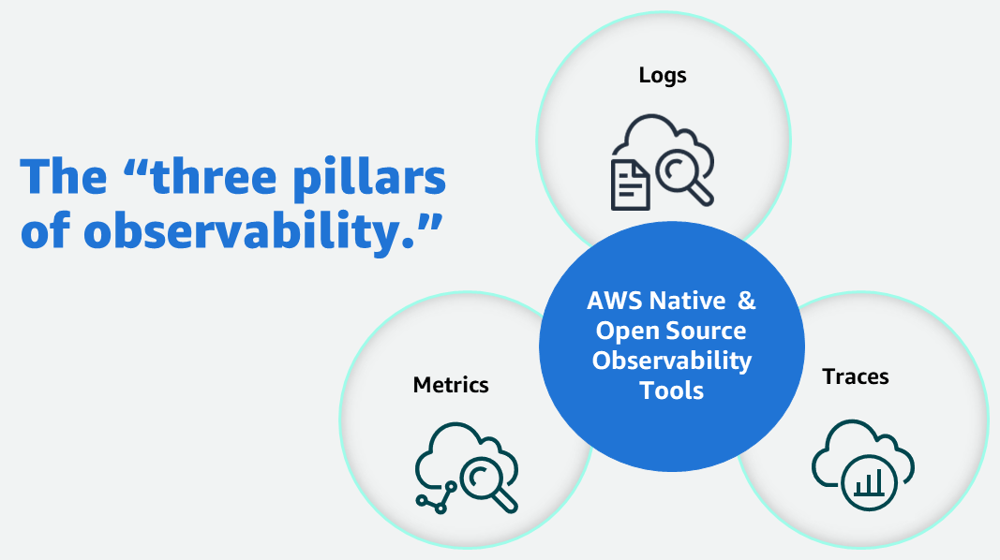
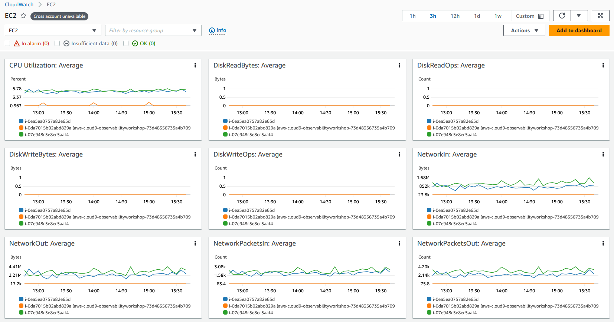
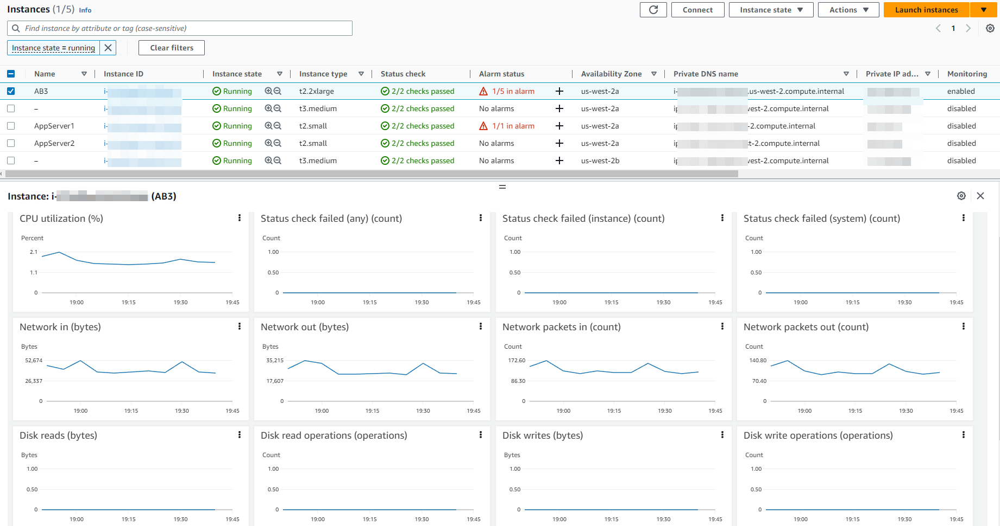
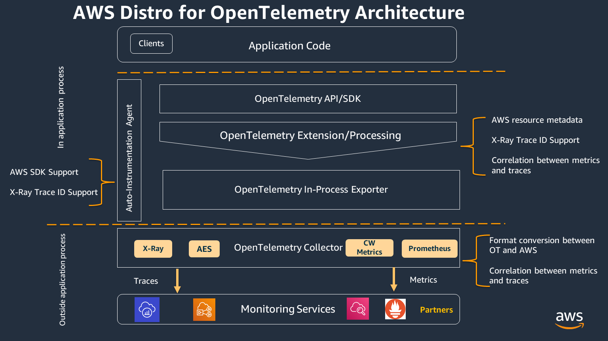
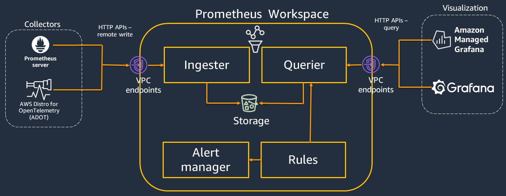

# Amazon EC2 のモニタリングとオブザーバビリティ

## はじめに

継続的なモニタリングとオブザーバビリティは、クラウド環境のアジリティを高め、顧客体験を改善し、リスクを軽減します。Wikipedia によると、[オブザーバビリティ](https://en.wikipedia.org/wiki/Observability)とは、システムの外部出力から内部状態を推測できる程度を示す尺度です。オブザーバビリティという用語自体は制御理論の分野に由来しており、基本的にはシステムが生成する外部シグナル/出力から、システムコンポーネントの内部状態を推測できることを意味します。

モニタリングとオブザーバビリティの違いは、モニタリングはシステムが機能しているかどうかを示すのに対し、オブザーバビリティはシステムが機能していない理由を示すことです。モニタリングは通常、対症療法的な対策ですが、オブザーバビリティの目的は、主要パフォーマンス指標を積極的に改善することです。システムを制御または最適化するには、観測する必要があります。メトリクス、ログ、トレースの収集によるワークロードの計装と、適切なモニタリングおよびオブザーバビリティツールを使用した意味のある洞察と詳細なコンテキストの取得により、顧客は環境を制御および最適化できます。

AWS では、顧客がエンドツーエンドのサービス可視性を確保できるように、モニタリングからオブザーバビリティへの変革を可能にしています。この記事では、Amazon Elastic Compute Cloud (Amazon EC2) と、AWS クラウド環境における AWS ネイティブおよびオープンソースツールを使用したサービスのモニタリングとオブザーバビリティの改善に関するベストプラクティスに焦点を当てています。

## Amazon EC2

[Amazon Elastic Compute Cloud](https://aws.amazon.com/jp/ec2/) (Amazon EC2) は、Amazon Web Services (AWS) クラウド上で高い拡張性を持つコンピューティングプラットフォームです。Amazon EC2 を使えば、ハードウェアへの前払い投資が不要になり、お客様はアプリケーションの開発とデプロイを従量課金制で素早く行えます。EC2 が提供する主な機能には、インスタンスと呼ばれる仮想コンピューティング環境、Amazon Machine Image と呼ばれるインスタンスの事前設定テンプレート、CPU、メモリ、ストレージ、ネットワーキング容量などのリソース構成をインスタンスタイプとして提供することなどがあります。

## AWS ネイティブツールを使用した監視とオブザーバビリティ

### Amazon CloudWatch

[Amazon CloudWatch](https://aws.amazon.com/jp/cloudwatch/) は、AWS、ハイブリッド、オンプレミスのアプリケーションとインフラストラクチャリソースのデータと実行可能な洞察を提供するモニタリングおよび管理サービスです。CloudWatch はログ、メトリクス、イベントの形式でモニタリングおよび運用データを収集します。また、AWS 上とオンプレミスサーバー上で実行される AWS リソース、アプリケーション、サービスの統合ビューを提供します。CloudWatch を使用すると、リソース使用率、アプリケーションのパフォーマンス、運用の健全性に関するシステム全体の可視性を得ることができます。

### 統合された CloudWatch エージェント

統合された CloudWatch エージェントは、MIT ライセンスのオープンソースソフトウェアで、x86-64 および ARM64 アーキテクチャを利用するほとんどのオペレーティングシステムをサポートしています。CloudWatch エージェントは、オペレーティングシステムを横断したハイブリッド環境の Amazon EC2 インスタンスとオンプレミスサーバーからシステムレベルのメトリクスを収集し、アプリケーションやサービスからカスタムメトリクスを取得し、Amazon EC2 インスタンスとオンプレミスサーバーからログを収集するのに役立ちます。

### Amazon EC2 インスタンスへの CloudWatch エージェントのインストール

#### コマンドラインインストール

CloudWatch エージェントは [コマンドライン](https://docs.aws.amazon.com/ja_jp/AmazonCloudWatch/latest/monitoring/installing-cloudwatch-agent-commandline.html) からインストールできます。
さまざまなアーキテクチャとオペレーティングシステム向けの必要なパッケージは [ダウンロード](https://docs.aws.amazon.com/ja_jp/AmazonCloudWatch/latest/monitoring/download-cloudwatch-agent-commandline.html) できます。
CloudWatch エージェントに Amazon EC2 インスタンスから情報を読み取り、CloudWatch に書き込む権限を与える [IAM ロール](https://docs.aws.amazon.com/ja_jp/AmazonCloudWatch/latest/monitoring/create-iam-roles-for-cloudwatch-agent-commandline.html) を作成します。
必要な IAM ロールを作成したら、必要な Amazon EC2 インスタンスで CloudWatch エージェントを [インストールして実行](https://docs.aws.amazon.com/ja_jp/AmazonCloudWatch/latest/monitoring/install-CloudWatch-Agent-commandline-fleet.html) できます。

!!! note "参考資料"

    ドキュメント: [コマンドラインを使用した CloudWatch エージェントのインストール](https://docs.aws.amazon.com/ja_jp/AmazonCloudWatch/latest/monitoring/installing-cloudwatch-agent-commandline.html)

    AWS Observability ワークショップ: [CloudWatch エージェントのセットアップとインストール](https://catalog.workshops.aws/observability/en-US/aws-native/ec2-monitoring/install-ec2)

#### AWS Systems Manager を通したインストール

CloudWatch エージェントは [AWS Systems Manager](https://docs.aws.amazon.com/ja_jp/AmazonCloudWatch/latest/monitoring/installing-cloudwatch-agent-ssm.html) を通してもインストールできます。CloudWatch エージェントに Amazon EC2 インスタンスから情報を読み取り、CloudWatch に書き込む権限と、AWS Systems Manager と通信する権限を与える必要がある IAM ロールを作成します。EC2 インスタンスに CloudWatch エージェントをインストールする前に、必要な EC2 インスタンスに [SSM エージェントをインストールまたは更新](https://docs.aws.amazon.com/ja_jp/AmazonCloudWatch/latest/monitoring/download-CloudWatch-Agent-on-EC2-Instance-SSM-first.html) します。CloudWatch エージェントは AWS Systems Manager からダウンロードできます。収集するメトリクス (カスタムメトリクスを含む) やログを指定する JSON 設定ファイルを作成できます。必要な IAM ロールと設定ファイルを作成したら、必要な Amazon EC2 インスタンスに CloudWatch エージェントをインストールして実行できます。

!!! note "参考資料"

    参考資料:
    ドキュメント: [AWS Systems Manager を使用した CloudWatch エージェントのインストール](https://docs.aws.amazon.com/ja_jp/AmazonCloudWatch/latest/monitoring/installing-cloudwatch-agent-ssm.html)

    AWS Observability ワークショップ: [AWS Systems Manager Quick Setup を使用した CloudWatch エージェントのインストール](https://catalog.workshops.aws/observability/en-US/aws-native/ec2-monitoring/install-ec2/ssm-quicksetup)

    関連ブログ記事: [Amazon CloudWatch Agent with AWS Systems Manager Integration – Unified Metrics & Log Collection for Linux & Windows](https://aws.amazon.com/jp/blogs/news/new-amazon-cloudwatch-agent-with-aws-systems-manager-integration-unified-metrics-log-collection-for-linux-windows/)

    YouTube 動画: [Amazon EC2 インスタンスから CloudWatch エージェントを使用してメトリクスとログを収集する](https://www.youtube.com/watch?v=vAnIhIwE5hY)

#### ハイブリッド環境のオンプレミスサーバーへの CloudWatch エージェントのインストール

オンプレミスサーバーとクラウドサーバーの両方を使用するハイブリッド環境では、Amazon CloudWatch での統合オブザーバビリティを実現するために同様のアプローチを取ることができます。CloudWatch エージェントは Amazon S3 から直接ダウンロードするか、AWS Systems Manager を通してダウンロードできます。オンプレミスサーバーから Amazon CloudWatch にデータを送信するための IAM ユーザーを作成します。オンプレミスサーバーにエージェントをインストールし、起動します。

!!! note "参考資料"

    Documentation: [オンプレミスサーバーへの CloudWatch エージェントのインストール](https://docs.aws.amazon.com/ja_jp/AmazonCloudWatch/latest/monitoring/install-CloudWatch-Agent-on-premise.html)

### Amazon CloudWatch を使用した Amazon EC2 インスタンスのモニタリング

Amazon EC2 インスタンスとアプリケーションの信頼性、可用性、パフォーマンスを維持する上で重要な側面は、[継続的なモニタリング](https://catalog.workshops.aws/observability/en-US/aws-native/ec2-monitoring)です。必要な Amazon EC2 インスタンスに CloudWatch エージェントをインストールすることで、インスタンスの正常性とパフォーマンスを監視する必要があります。ベースラインとして、CPU 使用率、ネットワーク使用率、ディスクパフォーマンス、ディスク読み取り/書き込み、メモリ使用率、ディスクスワップ使用率、ディスク空き容量、ページファイル使用率、EC2 インスタンスのログ収集などの項目を監視することをおすすめします。

#### 基本モニタリングと詳細モニタリング

Amazon CloudWatch は、Amazon EC2 から生のデータを収集し、リアルタイムに近いメトリクスに加工します。デフォルトでは、Amazon EC2 はインスタンスの基本モニタリングとして、5 分ごとにメトリクスデータを CloudWatch に送信します。インスタンスのメトリクスデータを 1 分ごとに CloudWatch に送信するには、[詳細モニタリング](https://docs.aws.amazon.com/ja_jp/AWSEC2/latest/UserGuide/using-cloudwatch-new.html) をインスタンスで有効にできます。

#### 自動化ツールと手動ツールによるモニタリング

AWS では、Amazon EC2 をモニタリングし、問題が発生したときに報告するための自動化ツールと手動ツールの 2 種類のツールを提供しています。これらのツールの一部は少し設定が必要で、一部は手動での介入が必要です。
[自動化モニタリングツール](https://docs.aws.amazon.com/ja_jp/AWSEC2/latest/UserGuide/monitoring_automated_manual.html)には、AWS システムステータスチェック、インスタンスステータスチェック、Amazon CloudWatch アラーム、Amazon EventBridge、Amazon CloudWatch Logs、CloudWatch エージェント、AWS Management Pack for Microsoft System Center Operations Manager があります。[手動モニタリングツール](https://docs.aws.amazon.com/ja_jp/AWSEC2/latest/UserGuide/monitoring_automated_manual.html)には、この記事の後半で詳しく説明するダッシュボードがあります。

!!! note "参考資料"

    ドキュメント: [自動化と手動によるモニタリング](https://docs.aws.amazon.com/ja_jp/AWSEC2/latest/UserGuide/monitoring_automated_manual.html)

### CloudWatch エージェントを使用した Amazon EC2 インスタンスからのメトリクス

メトリクスは CloudWatch における基本的な概念です。メトリクスは、CloudWatch に公開される時系列データポイントのセットを表します。メトリクスをモニタリングする変数と考え、データポイントはその変数の時間経過に伴う値を表します。たとえば、特定の EC2 インスタンスの CPU 使用率は、Amazon EC2 が提供するメトリクスの 1 つです。

#### CloudWatch エージェントを使用したデフォルトメトリクス

Amazon CloudWatch は、Amazon EC2 インスタンスからメトリクスを収集し、AWS マネジメントコンソール、AWS CLI、または API から確認できます。利用可能なメトリクスは、基本モニタリングでは 5 分間隔、詳細モニタリングでは 1 分間隔 (有効にした場合) のデータポイントです。

#### CloudWatch エージェントを使用したカスタムメトリクス

お客様は、API または CLI を使用して、1 分の粒度または 1 秒間隔までの高解像度の粒度で、独自のカスタムメトリクスを CloudWatch に公開することもできます。統合された CloudWatch エージェントは、[StatsD](https://docs.aws.amazon.com/ja_jp/AmazonCloudWatch/latest/monitoring/CloudWatch-Agent-custom-metrics-statsd.html) と [collectd](https://docs.aws.amazon.com/ja_jp/AmazonCloudWatch/latest/monitoring/CloudWatch-Agent-custom-metrics-collectd.html) を通じてカスタムメトリクスの取得をサポートしています。

アプリケーションやサービスからのカスタムメトリクスは、StatsD プロトコルを使用して CloudWatch エージェントで取得できます。StatsD は、さまざまなアプリケーションからメトリクスを収集できる人気のあるオープンソースソリューションです。StatsD は、Linux と Windows ベースのサーバーの両方をサポートしているため、独自のメトリクスを計装するのに特に役立ちます。

アプリケーションやサービスからのカスタムメトリクスは、collectd プロトコルを使用して CloudWatch エージェントで取得することもできます。collectd は、さまざまなアプリケーションのシステム統計を収集できるプラグインを備えた、Linux サーバーでのみサポートされている人気のあるオープンソースソリューションです。CloudWatch エージェントがすでに収集できるシステムメトリクスと、collectd からの追加のメトリクスを組み合わせることで、システムとアプリケーションをより適切に監視、分析、トラブルシューティングできます。

#### CloudWatch エージェントを使用した追加のカスタムメトリクス

CloudWatch エージェントは、EC2 インスタンスからカスタムメトリクスを収集することをサポートしています。よく使われる例をいくつか挙げると:

- Elastic Network Adapter (ENA) を使用する Linux 上の EC2 インスタンスのネットワークパフォーマンスメトリクス。
- Linux サーバーの Nvidia GPU メトリクス。
- Linux および Windows サーバー上の個々のプロセスからの procstat プラグインを使用したプロセスメトリクス。

### CloudWatch エージェントを使用した Amazon EC2 インスタンスからのログ収集

Amazon CloudWatch Logs は、既存のシステム、アプリケーション、カスタムログファイルを使用して、システムとアプリケーションをほぼリアルタイムで監視およびトラブルシューティングできるようにします。Amazon EC2 インスタンスとオンプレミスサーバーから CloudWatch にログを収集するには、統合された CloudWatch エージェントをインストールする必要があります。最新の統合 CloudWatch エージェントが推奨されています。これは、ログと高度なメトリクスの両方を収集できるためです。また、さまざまなオペレーティングシステムをサポートしています。インスタンスが Instance Metadata Service Version 2 (IMDSv2) を使用している場合は、統合エージェントが必要です。

統合 CloudWatch エージェントによって収集されたログは、処理され、Amazon CloudWatch Logs に保存されます。Windows または Linux サーバー、Amazon EC2 インスタンスとオンプレミスサーバーの両方からログを収集できます。CloudWatch エージェント構成ウィザードを使用して、CloudWatch エージェントのセットアップを定義する構成 JSON ファイルを設定できます。

!!! note "参考資料"

    AWS Observability Workshop: [Logs](https://catalog.workshops.aws/observability/en-US/aws-native/logs)

### Amazon EC2 インスタンスイベント

イベントは、AWS 環境の変更を示します。AWS リソースやアプリケーションは、状態が変わるとイベントを生成します。CloudWatch Events は、AWS リソースやアプリケーションの変更を記述するシステムイベントのリアルタイムストリームを提供します。たとえば、Amazon EC2 は、EC2 インスタンスの状態が pending から running に変わるとイベントを生成します。顧客は、カスタムのアプリケーションレベルのイベントを生成し、CloudWatch Events に公開することもできます。

顧客は、[ステータスチェックとスケジュールされたイベントを表示することで Amazon EC2 インスタンスのステータスを監視できます](https://docs.aws.amazon.com/ja_jp/AWSEC2/latest/UserGuide/monitoring-instances-status-check.html)。ステータスチェックは、Amazon EC2 によって実行された自動チェックの結果を提供します。これらの自動チェックは、インスタンスに特定の問題が発生していないかを検出します。ステータスチェック情報と Amazon CloudWatch が提供するデータを組み合わせることで、各インスタンスの運用状況を詳細に把握できます。

#### Amazon EC2 インスタンスイベントのための Amazon EventBridge ルール

Amazon CloudWatch Events は、Amazon EventBridge を使用して、リソースの変更や問題などのシステムイベントを自動化し、自動的に対応できます。Amazon EC2 を含む AWS サービスからのイベントは、ほぼリアルタイムで CloudWatch Events に配信され、お客様は EventBridge ルールを作成して、イベントがルールに一致したときに適切なアクションを実行できます。
アクションには、AWS Lambda 関数の呼び出し、Amazon EC2 Run Command の呼び出し、Amazon Kinesis Data Streams へのイベントの転送、AWS Step Functions ステートマシンのアクティブ化、Amazon SNS トピックへの通知、Amazon SQS キューへの通知、内部または外部のインシデント対応アプリケーションや SIEM ツールへのパイプ処理などがあります。

#### Amazon EC2 インスタンスの Amazon CloudWatch アラーム

Amazon [CloudWatch アラーム](https://docs.aws.amazon.com/ja_jp/AmazonCloudWatch/latest/monitoring/AlarmThatSendsEmail.html)は、指定した期間にわたってメトリクスを監視し、一定の閾値に対するメトリクスの値に基づいて 1 つ以上のアクションを実行できます。アラームは、アラームの状態が変化したときにのみアクションを呼び出します。アクションとしては、Amazon Simple Notification Service (Amazon SNS) トピックへの通知の送信、Amazon EC2 Auto Scaling の実行、または [EC2 インスタンスの停止、終了、再起動、復旧](https://docs.aws.amazon.com/ja_jp/AmazonCloudWatch/latest/monitoring/UsingAlarmActions.html)などの適切なアクションを行うことができます。

アラームがトリガーされると、アクションとして Email 通知が SNS トピックに送信されます。

#### Auto Scaling インスタンスのモニタリング

Amazon EC2 Auto Scaling は、アプリケーションの負荷に対応するために適切な数の Amazon EC2 インスタンスが利用可能であることを確実にするのに役立ちます。[Amazon EC2 Auto Scaling メトリクス](https://docs.aws.amazon.com/ja_jp/autoscaling/ec2/userguide/ec2-auto-scaling-cloudwatch-monitoring.html)は Auto Scaling グループに関する情報を収集し、AWS/AutoScaling 名前空間にあります。Auto Scaling インスタンスの CPU やその他の使用状況データを表す Amazon EC2 インスタンスメトリクスは、AWS/EC2 名前空間にあります。

### CloudWatch でのダッシュボード

AWS アカウントのリソースの在庫詳細、リソースのパフォーマンス、ヘルスチェックを把握することは、安定したリソース管理に重要です。[Amazon CloudWatch ダッシュボード](https://docs.aws.amazon.com/ja_jp/AmazonCloudWatch/latest/monitoring/CloudWatch_Dashboards.html)は、CloudWatch コンソールのカスタマイズ可能なホームページで、さまざまなリージョンに分散しているリソースでも、単一のビューでモニタリングできます。Amazon EC2 インスタンスの詳細を適切に表示する方法があります。

#### CloudWatch の自動ダッシュボード

自動ダッシュボードは、すべての AWS パブリックリージョンで利用可能で、CloudWatch 下の Amazon EC2 インスタンスを含むすべての AWS リソースの正常性とパフォーマンスの集約ビューを提供します。これにより、お客様はモニタリングを素早く開始し、リソースベースのメトリクスとアラームを確認し、パフォーマンス問題の根本原因を簡単に掘り下げることができます。自動ダッシュボードは、AWS サービスの推奨される[ベストプラクティス](https://docs.aws.amazon.com/ja_jp/prescriptive-guidance/latest/implementing-logging-monitoring-cloudwatch/cloudwatch-dashboards-visualizations.html)に基づいて事前構築されており、リソースを認識し、重要なパフォーマンスメトリクスの最新の状態を反映するように動的に更新されます。

#### CloudWatch のカスタムダッシュボード

[カスタムダッシュボード](https://docs.aws.amazon.com/ja_jp/AmazonCloudWatch/latest/monitoring/create_dashboard.html)を使えば、お客様は必要な数だけ追加のダッシュボードを作成でき、ウィジェットをカスタマイズできます。ダッシュボードは複数リージョンやアカウントにまたがる表示に設定でき、お気に入りリストに追加できます。

#### CloudWatch の Resource Health ダッシュボード

CloudWatch ServiceLens の Resource Health は、完全マネージド型のソリューションで、お客様はこれを使用して、アプリケーション全体の [Amazon EC2 ホストの正常性とパフォーマンスを自動的に検出、管理、可視化](https://aws.amazon.com/blogs/mt/introducing-cloudwatch-resource-health-monitor-ec2-hosts/) できます。お客様は、CPU やメモリなどのパフォーマンス次元でホストの正常性を可視化でき、インスタンスタイプ、インスタンス状態、セキュリティグループなどのフィルターを使用して、単一ビューで数百のホストを切り分けて表示できます。これにより、EC2 ホストのグループを並べて比較でき、個々のホストの詳細な洞察を得ることができます。

## オープンソースツールを使用した監視とオブザーバビリティ

### AWS Distro for OpenTelemetry を使用した Amazon EC2 インスタンスの監視

[AWS Distro for OpenTelemetry (ADOT)](https://aws.amazon.com/jp/otel) は、OpenTelemetry プロジェクトの安全で、本番環境に対応した、AWS がサポートする配布版です。Cloud Native Computing Foundation の一部であるOpenTelemetry は、アプリケーションモニタリングのための分散トレースとメトリクスを収集するためのオープンソース API、ライブラリ、エージェントを提供します。AWS Distro for OpenTelemetry を使用すると、お客様はアプリケーションを一度インストルメント化するだけで、関連付けられたメトリクスとトレースを複数の AWS およびパートナーのモニタリングソリューションに送信できます。

AWS Distro for OpenTelemetry (ADOT) は、アプリケーションのパフォーマンスと正常性を簡単に相関させてモニタリングできる分散モニタリングフレームワークを提供します。これは、より優れたサービス可視性と保守のために重要です。

ADOT の主要コンポーネントは、SDK、自動インストルメンテーションエージェント、コレクター、バックエンドサービスにデータを送信するエクスポーターです。

[OpenTelemetry SDK](https://github.com/aws-observability): AWS リソース固有のメタデータの収集を可能にし、X-Ray トレース形式とコンテキストに対する OpenTelemetry SDK のサポートを提供します。OpenTelemetry SDK は、AWS X-Ray と CloudWatch から取り込まれたトレースとメトリクスデータを相関させます。

[自動インストルメンテーションエージェント](https://aws-otel.github.io/docs/getting-started/java-sdk/auto-instr): OpenTelemetry Java 自動インストルメンテーションエージェントに、AWS SDK と AWS X-Ray トレースデータのサポートが追加されています。

[OpenTelemetry Collector](https://github.com/open-telemetry/opentelemetry-collector): 配布版のコレクターは、アップストリームの OpenTelemetry コレクターを使用して構築されています。アップストリームコレクターに AWS 固有のエクスポーターを追加し、AWS X-Ray、Amazon CloudWatch、Amazon Managed Service for Prometheus などの AWS サービスにデータを送信できるようになりました。

#### ADOT コレクターと Amazon CloudWatch を通じたメトリクスとトレース

AWS Distro for OpenTelemetry (ADOT) コレクターと CloudWatch エージェントは、Amazon EC2 インスタンス上で併設してインストールでき、OpenTelemetry SDK を使用して Amazon EC2 インスタンス上で実行されているワークロードからアプリケーショントレースとメトリクスを収集できます。

Amazon CloudWatch で OpenTelemetry メトリクスをサポートするために、[AWS EMF Exporter for OpenTelemetry Collector](https://github.com/open-telemetry/opentelemetry-collector-contrib/tree/main/exporter/awsemfexporter) は OpenTelemetry 形式のメトリクスを CloudWatch Embedded Metric Format (EMF) に変換します。これにより、OpenTelemetry メトリクスに統合されたアプリケーションが、高い基数のアプリケーションメトリクスを CloudWatch に送信できるようになります。[X-Ray エクスポーター](https://aws-otel.github.io/docs/getting-started/x-ray#configuring-the-aws-x-ray-exporter) は、OTLP 形式で収集されたトレースを [AWS X-Ray](https://aws.amazon.com/jp/xray/) にエクスポートできるようにします。

Amazon EC2 上の ADOT コレクターは、AWS CloudFormation または [AWS Systems Manager Distributor](https://catalog.workshops.aws/observability/en-US/aws-managed-oss/ec2-monitoring/configure-adot-collector) を使用してアプリケーションメトリクスを収集するためにインストールできます。

### Prometheus を使用した Amazon EC2 インスタンスのモニタリング

[Prometheus](https://prometheus.io/) は、システムのモニタリングとアラートのためのスタンドアロンのオープンソースプロジェクトで、独立して維持されています。Prometheus はメトリクスを時系列データとして収集・保存します。つまり、メトリクス情報は記録された時刻のタイムスタンプとともに、オプションのキーバリューペアである「ラベル」と共に保存されます。

Prometheus はコマンドラインフラグで設定され、すべての設定詳細は prometheus.yaml ファイルに保持されます。設定ファイル内の 'scrape_config' セクションでは、スクレイピングするターゲットとパラメータが指定されます。[Prometheus Service Discovery](https://github.com/prometheus/prometheus/tree/main/discovery) (SD) は、メトリクスをスクレイピングするエンドポイントを見つける手法です。Amazon EC2 サービスディスカバリー設定では、AWS EC2 インスタンスからスクレイピングターゲットを取得するように `ec2_sd_config` で設定されています。

#### Prometheus と Amazon CloudWatch を通じたメトリクス

EC2 インスタンス上の CloudWatch エージェントは、Prometheus と統合して構成することができ、CloudWatch でのモニタリング用にメトリクスを収集できます。これは、EC2 上のコンテナワークロードを好む顧客で、オープンソースの Prometheus モニタリングと互換性のあるカスタムメトリクスが必要な場合に役立ちます。CloudWatch エージェントのインストールは、前述のセクションで説明した手順に従って行うことができます。Prometheus モニタリングを使用する CloudWatch エージェントには、Prometheus メトリクスを収集するための 2 つの構成が必要です。1 つは Prometheus ドキュメントの 'scrape_config' に記載されている標準的な Prometheus 構成です。もう 1 つは [CloudWatch エージェントの構成](https://docs.aws.amazon.com/ja_jp/AmazonCloudWatch/latest/monitoring/CloudWatch-Agent-PrometheusEC2.html) です。

#### Prometheus と ADOT Collector を通じたメトリクス

お客様は、オブザーバビリティのニーズに対して、オープンソースのセットアップを選択できます。その場合、AWS Distro for OpenTelemetry (ADOT) Collector を Prometheus で計装されたアプリケーションからメトリクスをスクレイピングするように設定し、メトリクスを Prometheus Server に送信できます。このフローには、Prometheus Receiver、Prometheus Remote Write Exporter、Sigv4 Authentication Extension の 3 つの OpenTelemetry コンポーネントが関与しています。Prometheus Receiver は Prometheus 形式のメトリクスデータを受信します。Prometheus Exporter は Prometheus 形式のデータをエクスポートします。Sigv4 Authenticator 拡張機能は、AWS サービスへのリクエストに対して Sigv4 認証を提供します。

#### Prometheus Node Exporter

[Prometheus Node Exporter](https://github.com/prometheus/node_exporter) は、クラウド環境向けのオープンソースの時系列監視およびアラート通知システムです。Amazon EC2 インスタンスに Node Exporter を導入すると、ノードレベルのメトリクスを時系列データとして収集および保存できます。これにより、タイムスタンプ付きの情報が記録されます。Node Exporter は Prometheus エクスポーターで、URL http://localhost:9100/metrics を介してさまざまなホストメトリクスを公開できます。

メトリクスが作成されると、[Amazon Managed Prometheus](https://aws.amazon.com/jp/prometheus/) に送信できます。

### Amazon EC2 インスタンスから Fluent Bit プラグインを使ってログをストリーミングする

[Fluent Bit](https://fluentbit.io/) は、大規模なデータ収集を処理するためのオープンソースでマルチプラットフォームのログプロセッサツールです。さまざまな情報源、さまざまなデータ形式、データの信頼性、セキュリティ、柔軟なルーティング、複数の宛先に対応するための、多様なデータの収集と集約を行います。

Fluent Bit は、Amazon EC2 からログを AWS サービスにストリーミングするための簡単な拡張ポイントを作成するのに役立ちます。これには、ログの保持と分析のための Amazon CloudWatch が含まれます。新しく発表された [Fluent Bit プラグイン](https://github.com/aws/amazon-cloudwatch-logs-for-fluent-bit#new-higher-performance-core-fluent-bit-plugin) は、ログを Amazon CloudWatch にルーティングできます。

### Amazon Managed Grafana によるダッシュボーディング

[Amazon Managed Grafana](https://aws.amazon.com/jp/grafana/) は、オープンソースの Grafana プロジェクトに基づく完全マネージドサービスで、豊富なインタラクティブで安全なデータ可視化機能を備えています。これにより、お客様は複数のデータソースにまたがるメトリクス、ログ、トレースを即座にクエリ、相関、分析、監視、アラームを行うことができます。お客様はインタラクティブなダッシュボードを作成し、自動的にスケーリングされ、高可用性で企業向けのセキュアなサービスを使って、組織内の誰とでも共有できます。Amazon Managed Grafana を使えば、AWS アカウント、AWS リージョン、データソースを横断してユーザーやチームのダッシュボードへのアクセスを管理できます。

Amazon Managed Grafana には、Grafana ワークスペースコンソールの AWS データソース設定オプションを使って Amazon CloudWatch をデータソースとして追加できます。この機能により、既存の CloudWatch アカウントを検出し、CloudWatch にアクセスするために必要な認証情報の設定を管理することで、CloudWatch をデータソースとして追加するプロセスが簡素化されます。Amazon Managed Grafana は [Prometheus データソース](https://docs.aws.amazon.com/ja_jp/grafana/latest/userguide/prometheus-data-source.html) もサポートしており、セルフマネージドの Prometheus サーバーと Amazon Managed Service for Prometheus ワークスペースの両方をデータソースとして使用できます。

Amazon Managed Grafana には様々なパネルが用意されており、適切なクエリを構築し、表示プロパティをカスタマイズしやすくなっているため、お客様が必要とするダッシュボードを作成できます。

## 結論

モニタリングは、システムが適切に機能しているかどうかを知らせてくれます。一方、オブザーバビリティは、システムが適切に機能していない理由を理解することができます。適切なオブザーバビリティがあれば、気づかなければならなかった質問に答えることができます。モニタリングとオブザーバビリティは、システムの出力から推測できる内部状態を測定する道を開きます。

クラウド上のマイクロサービス、サーバーレス、非同期アーキテクチャで実行されるモダンなアプリケーションは、メトリクス、ログ、トレース、イベントの形で大量のデータを生成します。Amazon CloudWatch と Amazon Distro for OpenTelemetry、Amazon Managed Prometheus、Amazon Managed Grafana などのオープンソースツールを組み合わせることで、お客様はこれらのデータを統合プラットフォームで収集、アクセス、相関させることができます。これにより、データサイロを解体し、システム全体の可視性を簡単に得て、問題をすばやく解決できるようになります。
