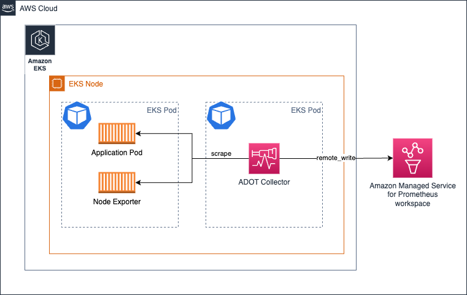

# AWS Distro for OpenTelemetry (ADOT) コレクターの運用

[ADOT コレクター](https://aws-otel.github.io/)は、[CNCF](https://www.cncf.io/)によるオープンソースの[OpenTelemetry Collector](https://opentelemetry.io/docs/collector/)のダウンストリーム配布版です。

お客様は ADOT コレクターを使用して、オンプレミス、AWS、他のクラウドプロバイダーなど、さまざまな環境からメトリクスやトレースなどのシグナルを収集できます。

実際の環境やスケールでADOT コレクターを運用するには、オペレーターはコレクターの正常性を監視し、必要に応じてスケーリングする必要があります。このガイドでは、本番環境で ADOT コレクターを運用するための対処方法について学びます。

## デプロイメントアーキテクチャ

要件によっては、検討したい複数のデプロイメントオプションがあります。

* コレクターなし
* エージェント
* ゲートウェイ

!!! tip
    これらの概念の詳細については、[OpenTelemetry のドキュメント](https://opentelemetry.io/docs/collector/deployment/)を参照してください。

### コレクターなし
このオプションでは、コレクターを完全に省略します。ご存知の通り、OTEL SDK から直接宛先サービスの API を呼び出し、シグナルを送信することが可能です。アプリケーションプロセスから AWS X-Ray の [PutTraceSegments](https://docs.aws.amazon.com/ja_jp/xray/latest/api/API_PutTraceSegments.html) API を直接呼び出し、ADOT コレクターのようなプロセス外のエージェントにスパンを送信する代わりに考えてみてください。

この手法に関するガイダンスは AWS 固有の側面による変更はありませんので、上流のドキュメントの[セクション](https://opentelemetry.io/docs/collector/deployment/no-collector/)を参照することを強くお勧めします。


### エージェント
このアプローチでは、コレクターを分散的に実行し、シグナルを宛先に収集します。`No Collector` オプションとは異なり、ここでは関心の分離を行い、アプリケーションからリモート API 呼び出しを行うリソースを分離し、代わりにローカルにアクセス可能なエージェントと通信します。

本質的には、Amazon EKS 環境で **コレクターを Kubernetes サイドカーとして実行する** 場合、以下のようになります。


上記のアーキテクチャでは、コレクターがアプリケーションコンテナと同じ Pod で実行されているため、スクレイプ構成でサービスディスカバリメカニズムを使用する必要はほとんどありません。

同じアーキテクチャがトレースの収集にも適用されます。単に、[ここに示されている](https://aws-otel.github.io/docs/getting-started/x-ray#sample-collector-configuration-putting-it-together) ように OTEL パイプラインを作成する必要があります。

##### 長所と短所
* この設計を支持する議論の 1 つは、ターゲットがローカルホストのソースに限定されているため、Collector がその仕事を行うために特別な量の リソース (CPU、メモリ) を割り当てる必要がないことです。

* このアプローチを使用する欠点は、Collector Pod の構成のさまざまな構成の数が、クラスター上で実行されているアプリケーションの数に比例することです。
つまり、Pod に予想されるワークロードに応じて、CPU、メモリ、およびその他のリソース割り当てを個別に管理する必要があります。これを注意深く行わないと、Collector Pod のリソースを過剰に割り当てるか、不足させてしまい、パフォーマンスが低下するか、CPU サイクルとメモリをロックしてしまい、それ以外の Pod で使用できなくなる可能性があります。

必要に応じて、Deployment、DaemonSet、StatefulSet などの他のモデルで Collector をデプロイすることもできます。

#### Amazon EKS 上で Daemonset としてコレクターを実行する

コレクターの負荷 (スクレイピングと Amazon Managed Service for Prometheus ワークスペースへのメトリクス送信) を EKS ノード間で均等に分散させたい場合は、[Daemonset](https://kubernetes.io/docs/concepts/workloads/controllers/daemonset/) としてコレクターを実行することができます。



コレクターが自身のホスト/ノードからのターゲットのみをスクレイピングするように、`keep` アクションを確実に設定してください。

参考として、以下にサンプルを示します。より詳細な設定については、[こちら](https://aws-otel.github.io/docs/getting-started/adot-eks-add-on/config-advanced#daemonset-collector-configuration) を参照してください。

```yaml
scrape_configs:
    - job_name: kubernetes-apiservers
    bearer_token_file: /var/run/secrets/kubernetes.io/serviceaccount/token
    kubernetes_sd_configs:
    - role: endpoints
    relabel_configs:
    - action: keep
        regex: $K8S_NODE_NAME
        source_labels: [__meta_kubernetes_endpoint_node_name]
    scheme: https
    tls_config:
        ca_file: /var/run/secrets/kubernetes.io/serviceaccount/ca.crt
        insecure_skip_verify: true
```

同じアーキテクチャはトレースの収集にも使用できます。この場合、コレクターが Prometheus メトリクスをスクレイピングするためにエンドポイントに到達するのではなく、アプリケーション Pod からトレーススパンがコレクターに送信されます。

##### 長所と短所
**長所**

* スケーリングの心配が最小限
* 高可用性の設定が難しい
* コレクターのコピーが多すぎる
* ログのサポートが簡単になる可能性がある

**短所**

* リソース活用の観点から最適ではない
* リソースの割り当てが不均等

#### Amazon EC2 上でコレクターを実行する
EC2 上でコレクターを実行する場合、サイドカーアプローチはありません。そのため、EC2 インスタンス上でコレクターをエージェントとして実行する必要があります。以下のような静的なスクレイプ設定を行うことで、インスタンス内のターゲットを検出し、メトリクスを収集できます。

以下の設定では、ローカルホストのポート `9090` と `8081` のエンドポイントをスクレイプします。

この分野の実践的な深掘り体験は、[One Observability Workshop の EC2 フォーカスモジュール](https://catalog.workshops.aws/observability/en-US/aws-managed-oss/ec2-monitoring) を通して得られます。

```yaml
global:
  scrape_interval: 15s # By default, scrape targets every 15 seconds.

scrape_configs:
- job_name: 'prometheus'
  static_configs:
  - targets: ['localhost:9090', 'localhost:8081']
```

#### Amazon EKS 上でデプロイメントとしてコレクターを実行する

デプロイメントとしてコレクターを実行すると、コレクターの高可用性も提供できるため便利です。スクレイピング対象、利用可能なメトリクスの数などによっては、コレクターがリソース不足にならず、シグナル収集に問題が発生しないように、コレクターのリソースを調整する必要があります。

この話題の詳細については、[こちらのガイド](/observability-best-practices/ja/guides/containers/oss/eks/best-practices-metrics-collection)をお読みください。

次の図は、メトリクスとトレースを収集するために、ワークロードノードとは別のノードにコレクターをデプロイする方法を示しています。


メトリクス収集の高可用性を設定するには、[詳細な手順が記載されたドキュメント](https://docs.aws.amazon.com/ja_jp/prometheus/latest/userguide/Send-high-availability-prom-community.html)をお読みください。

#### Amazon ECS でメトリクス収集のための中央タスクとしてコレクターを実行する

[ECS Observer 拡張機能](https://github.com/open-telemetry/opentelemetry-collector-contrib/tree/main/extension/observer/ecsobserver)を使用して、ECS クラスター内または複数のクラスター間で Prometheus メトリクスを収集できます。


この拡張機能のコレクター設定例:

```yaml
extensions:
  ecs_observer:
    refresh_interval: 60s # format is https://golang.org/pkg/time/#ParseDuration
    cluster_name: 'Cluster-1' # cluster name need manual config
    cluster_region: 'us-west-2' # region can be configured directly or use AWS_REGION env var
    result_file: '/etc/ecs_sd_targets.yaml' # the directory for file must already exists
    services:
      - name_pattern: '^retail-.*$'
    docker_labels:
      - port_label: 'ECS_PROMETHEUS_EXPORTER_PORT'
    task_definitions:
      - job_name: 'task_def_1'
        metrics_path: '/metrics'
        metrics_ports:
          - 9113
          - 9090
        arn_pattern: '.*:task-definition/nginx:[0-9]+'
```

##### 長所と短所
* このモデルの利点は、自分で管理する必要があるコレクターと設定が少ないことです。
* クラスターが大規模で、スクレイピングする対象が数千ある場合は、負荷がコレクター間で均等に分散されるようにアーキテクチャを慎重に設計する必要があります。さらに、HA (高可用性) のために同じコレクターの近似コピーを実行する必要があり、運用上の問題を避けるために慎重に行う必要があります。

### ゲートウェイ


## コレクターの健全性管理
OTEL コレクターは、その健全性とパフォーマンスを監視するためのいくつかのシグナルを公開しています。コレクターの健全性を密に監視することは不可欠で、以下のような是正措置を講じる必要があります。

* コレクターの水平スケーリング
* コレクターが期待どおりに機能するための追加リソースのプロビジョニング

### コレクターからヘルスメトリクスを収集する

OTEL コレクターは、`service` パイプラインに `telemetry` セクションを追加するだけで、Prometheus Exposition 形式でメトリクスを公開するように構成できます。コレクターは、自身のログを stdout に出力することもできます。

テレメトリー構成の詳細は、[OpenTelemetry のドキュメントをご覧ください。](https://opentelemetry.io/docs/collector/configuration/#service)

コレクターのテレメトリー構成のサンプルです。

```yaml
service:
  telemetry:
    logs:
      level: debug
    metrics:
      level: detailed
      address: 0.0.0.0:8888
```
構成すると、コレクターは `http://localhost:8888/metrics` で以下のようなメトリクスを出力し始めます。

```bash
# HELP otelcol_exporter_enqueue_failed_spans Number of spans failed to be added to the sending queue.
# TYPE otelcol_exporter_enqueue_failed_spans counter
otelcol_exporter_enqueue_failed_spans{exporter="awsxray",service_instance_id="523a2182-539d-47f6-ba3c-13867b60092a",service_name="aws-otel-collector",service_version="v0.25.0"} 0

# HELP otelcol_process_runtime_total_sys_memory_bytes Total bytes of memory obtained from the OS (see 'go doc runtime.MemStats.Sys')
# TYPE otelcol_process_runtime_total_sys_memory_bytes gauge
otelcol_process_runtime_total_sys_memory_bytes{service_instance_id="523a2182-539d-47f6-ba3c-13867b60092a",service_name="aws-otel-collector",service_version="v0.25.0"} 2.4462344e+07

# HELP otelcol_process_memory_rss Total physical memory (resident set size)
# TYPE otelcol_process_memory_rss gauge
otelcol_process_memory_rss{service_instance_id="523a2182-539d-47f6-ba3c-13867b60092a",service_name="aws-otel-collector",service_version="v0.25.0"} 6.5675264e+07

# HELP otelcol_exporter_enqueue_failed_metric_points Number of metric points failed to be added to the sending queue.
# TYPE otelcol_exporter_enqueue_failed_metric_points counter
otelcol_exporter_enqueue_failed_metric_points{exporter="awsxray",service_instance_id="d234b769-dc8a-4b20-8b2b-9c4f342466fe",service_name="aws-otel-collector",service_version="v0.25.0"} 0
otelcol_exporter_enqueue_failed_metric_points{exporter="logging",service_instance_id="d234b769-dc8a-4b20-8b2b-9c4f342466fe",service_name="aws-otel-collector",service_version="v0.25.0"} 0
```yaml
extensions:
  health_check:
    endpoint: 0.0.0.0:13133
```yaml
extensions:
  health_check:
    endpoint: 0.0.0.0:13133
```bash
❯ curl -v http://localhost:13133
*   Trying 127.0.0.1:13133...
* Connected to localhost (127.0.0.1) port 13133 (#0)
> GET / HTTP/1.1
> Host: localhost:13133
> User-Agent: curl/7.79.1
> Accept: */*
>
* Mark bundle as not supporting multiuse
&lt; HTTP/1.1 200 OK
&lt; Date: Fri, 24 Feb 2023 19:09:22 GMT
&lt; Content-Length: 0
&lt;
* Connection #0 to host localhost left intact
```bash
❯ curl -v http://localhost:13133
*   Trying 127.0.0.1:13133...
* Connected to localhost (127.0.0.1) port 13133 (#0)
> GET / HTTP/1.1
> Host: localhost:13133
> User-Agent: curl/7.79.1
> Accept: */*
>
* Mark bundle as not supporting multiuse
< HTTP/1.1 200 OK
< Date: Fri, 24 Feb 2023 19:09:22 GMT
< Content-Length: 0
<
* Connection #0 to host localhost left intact
```bash
Error message:
 2023-03-02T21:18:54.447Z        error   exporterhelper/queued_retry.go:394      Exporting failed. The error is not retryable. Dropping data.    {"kind": "exporter", "data_type": "metrics", "name": "prometheusremotewrite", "error": "Permanent error: Permanent error: remote write returned HTTP status 400 Bad Request; err = %!w(<nil>): user=820326043460_ws-5f42c3b6-3268-4737-b215-1371b55a9ef2: err: out of order sample. timestamp=2023-03-02T21:17:59.782Z, series={__name__=\"otelcol_exporter_send_failed_metric_points\", exporter=\"logging\", http_scheme=\"http\", instance=\"10.195.158.91:28888\", ", "dropped_items": 6474}
go.opentelemetry.io/collector/exporter/exporterhelper.(*retrySender).send
        go.opentelemetry.io/collector@v0.66.0/exporter/exporterhelper/queued_retry.go:394
go.opentelemetry.io/collector/exporter/exporterhelper.(*metricsSenderWithObservability).send
        go.opentelemetry.io/collector@v0.66.0/exporter/exporterhelper/metrics.go:135
go.opentelemetry.io/collector/exporter/exporterhelper.(*queuedRetrySender).start.func1
        go.opentelemetry.io/collector@v0.66.0/exporter/exporterhelper/queued_retry.go:205
go.opentelemetry.io/collector/exporter/exporterhelper/internal.(*boundedMemoryQueue).StartConsumers.func1
        go.opentelemetry.io/collector@v0.66.0/exporter/exporterhelper/internal/bounded_memory_queue.go:61
```bash
Error message:
 2023-03-02T21:18:54.447Z        error   exporterhelper/queued_retry.go:394      Exporting failed. The error is not retryable. Dropping data.    {"kind": "exporter", "data_type": "metrics", "name": "prometheusremotewrite", "error": "Permanent error: Permanent error: remote write returned HTTP status 400 Bad Request; err = %!w(<nil>): user=820326043460_ws-5f42c3b6-3268-4737-b215-1371b55a9ef2: err: out of order sample. timestamp=2023-03-02T21:17:59.782Z, series={__name__=\"otelcol_exporter_send_failed_metric_points\", exporter=\"logging\", http_scheme=\"http\", instance=\"10.195.158.91:28888\", ", "dropped_items": 6474}
go.opentelemetry.io/collector/exporter/exporterhelper.(*retrySender).send
        go.opentelemetry.io/collector@v0.66.0/exporter/exporterhelper/queued_retry.go:394
go.opentelemetry.io/collector/exporter/exporterhelper.(*metricsSenderWithObservability).send
        go.opentelemetry.io/collector@v0.66.0/exporter/exporterhelper/metrics.go:135
go.opentelemetry.io/collector/exporter/exporterhelper.(*queuedRetrySender).start.func1
        go.opentelemetry.io/collector@v0.66.0/exporter/exporterhelper/queued_retry.go:205
go.opentelemetry.io/collector/exporter/exporterhelper/internal.(*boundedMemoryQueue).StartConsumers.func1
        go.opentelemetry.io/collector@v0.66.0/exporter/exporterhelper/internal/bounded_memory_queue.go:61
```yaml
            relabel_configs:
            - action: keep
              regex: $K8S_NODE_NAME
        
    - [ADOT Add-On 高度な設定](https://aws-otel.github.io/docs/getting-started/adot-eks-add-on/add-on-configuration) - EKS 用の ADOT Add-On を使って ADOT Collector を高度な設定でデプロイする方法を学びます。
    - [ADOT Collector のデプロイ戦略](https://aws-otel.github.io/docs/getting-started/adot-eks-add-on/installation#deploy-the-adot-collector) - 大規模に ADOT Collector をデプロイする方法と、それぞれのアプローチの利点について学びます。

#### Open Agent Management Protocol (OpAMP)

OpAMP は HTTP と WebSocket 上での通信をサポートするクライアント/サーバープロトコルです。OpAMP は OTel Collector に実装されているため、OTel Collector は OpAMP をサポートする他のエージェント (OTel Collector 自体など) を管理するコントロールプレーンの一部としてサーバーとして使用できます。ここでの「管理」とは、コレクターの設定を更新したり、ヘルスをモニタリングしたり、コレクターをアップグレードしたりすることを意味します。

このプロトコルの詳細は、アップストリームの OpenTelemetry ウェブサイトで[文書化されています](https://opentelemetry.io/docs/collector/management/)。

### 水平スケーリング
ワークロードに応じて、ADOT Collector の水平スケーリングが必要になる場合があります。水平スケーリングが必要かどうかは、使用事例、Collector の設定、テレメトリのスループットによって完全に異なります。

Collector には、他のアプリケーションと同様に、プラットフォーム固有の水平スケーリング手法を適用できます。ただし、ステートフル、ステートレス、スクレイパーの Collector コンポーネントに注意する必要があります。

ほとんどの Collector コンポーネントは `ステートレス` です。つまり、メモリ内にステートを保持しないか、保持していても、スケーリングの目的では関係ありません。ステートレスの Collector は、アプリケーションロードバランサーの背後で追加のレプリカをスケールアウトできます。

`ステートフル` の Collector コンポーネントは、そのコンポーネントの動作に不可欠な情報をメモリ内に保持するコンポーネントです。

ADOT Collector におけるステートフルコンポーネントの例には、以下が含まれますが、これらに限定されません。

* [Tail Sampling Processor](https://github.com/open-telemetry/opentelemetry-collector-contrib/tree/main/processor/tailsamplingprocessor) - 正確なサンプリング決定を行うために、トレース内のすべてのスパンが必要です。高度なサンプリングのスケーリング手法は [ADOT 開発者ポータル](https://aws-otel.github.io/docs/getting-started/advanced-sampling) に記載されています。
* [AWS EMF Exporter](https://github.com/open-telemetry/opentelemetry-collector-contrib/tree/main/exporter/awsemfexporter) - 一部のメトリクスタイプで累積値からデルタ値への変換を行います。この変換には、前回のメトリクス値をメモリに保存する必要があります。
* [Cummulative to Delta Processor](https://github.com/open-telemetry/opentelemetry-collector-contrib/tree/main/processor/cumulativetodeltaprocessor#cumulative-to-delta-processor) - 累積値からデルタ値への変換には、前回のメトリクス値をメモリに保存する必要があります。

`スクレイパー` は、テレメトリデータを受動的に受信するのではなく、能動的に取得する Collector コンポーネントです。現在、[Prometheus receiver](https://github.com/open-telemetry/opentelemetry-collector-contrib/tree/main/receiver/prometheusreceiver) が ADOT Collector 内で唯一のスクレイパータイプのコンポーネントです。Prometheus レシーバーを含む Collector 設定を水平にスケールする場合は、スクレイピングジョブを Collector ごとに分割し、2 つの Collector が同じエンドポイントをスクレイピングしないようにする必要があります。これを怠ると、Prometheus のサンプルの順序が正しくない場合があります。

Collector のスケーリングのプロセスと手法については、[OpenTelemetry の Web サイト](https://opentelemetry.io/docs/collector/scaling/) に詳しく記載されています。

### 参考資料

* [https://opentelemetry.io/docs/collector/deployment/]()
* [https://opentelemetry.io/docs/collector/management/]()
* [https://opentelemetry.io/docs/collector/scaling/]()
* [https://github.com/aws-observability/aws-otel-collector]()
* [https://aws-observability.github.io/terraform-aws-observability-accelerator/]()
* [https://catalog.workshops.aws/observability/en-US/aws-managed-oss/adot]()
* [https://aws.amazon.com/blogs/opensource/setting-up-amazon-managed-grafana-cross-account-data-source-using-customer-managed-iam-roles/]()
* [https://aws.amazon.com/blogs/opensource/set-up-cross-region-metrics-collection-for-amazon-managed-service-for-prometheus-workspaces/]()
