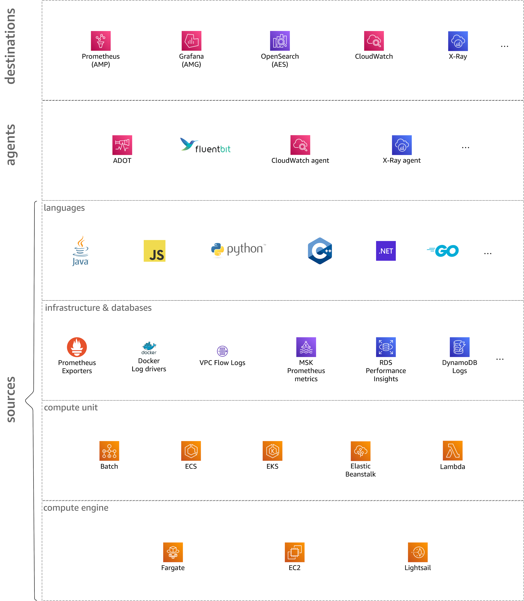
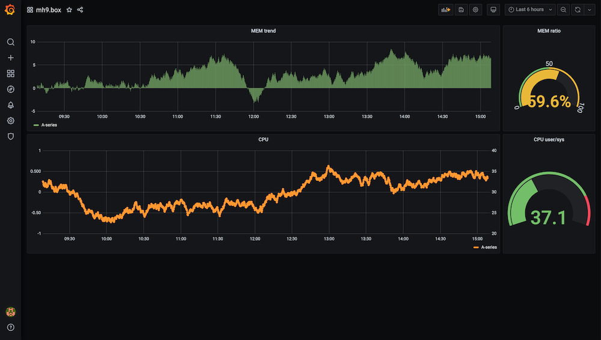

# ディメンション

このサイトのコンテキストでは、オブザーバビリティ空間を 6 つのディメンションに沿って考えます。
各ディメンションを独立して見ることは、合成的な視点から有益です。つまり、特定のワークロードに対して具体的なオブザーバビリティ ソリューションを構築しようとしている場合には、使用されるプログラミング言語などの開発者関連の側面と、コンテナや Lambda 関数などのランタイム環境などの運用上のトピックの両方を網羅しています。

!!! question "シグナルとは何ですか?"
    ここで言うシグナルとは、ログエントリ、メトリクス、トレースを含むあらゆる種類のオブザーバビリティデータとメタデータのポイントを意味します。より具体的である必要がある場合やそうしたい場合を除き、「シグナル」という用語を使用し、コンテキストからどのような制限が適用される可能性があるかが明らかである必要があります。

それでは、6つのディメンションのそれぞれを一つずつ見ていきましょう。

## デスティネーション

このディメンションでは、長期ストレージやグラフィカルインターフェイスなど、
すべての種類のシグナルデスティネーションを考慮します。これにより、シグナルを消費できます。
開発者として、サービスのトラブルシューティングのためにシグナルを発見、検索、相関付けできる UI や API にアクセスしたいと考えています。
インフラストラクチャまたはプラットフォームの役割では、インフラストラクチャの状態を理解するためにシグナルを管理、発見、検索、相関付けできる UI や API にアクセスしたいと考えています。

最終的に、このディメンションは人間の視点から最も興味深いものです。
ただし、メリットを享受できるようになるためには、まず少し作業を投資する必要があります。
ソフトウェアと外部依存関係を計装化し、シグナルをデスティネーションに取り込む必要があります。

では、シグナルはどのようにしてデスティネーションに到達するのでしょうか。
では次の通り説明します。

## エージェント

シグナルがどのように収集され、分析にルーティングされるか。シグナルは2つのソースから来る可能性があります。1つはアプリケーションのソースコード([言語](#language)セクションも参照)、もう1つはデータストアで管理される状態やVPCなどのインフラストラクチャなど、アプリケーションが依存するものです([インフラとデータ](#infra-data)セクションも参照)。

エージェントは、シグナルを収集および取り込むために使用する[テレメトリ](../telemetry)の一部です。もう一方の部分は、データベースなどの計装化されたアプリケーションおよびインフラです。

## 言語

この次元は、サービスやアプリケーションを記述するために使用するプログラミング言語に関係しています。
ここでは、[X-Ray SDK][xraysdks]やOpenTelemetryが[インスツルメンテーション][otelinst]のコンテキストで提供しているものなどのSDKやライブラリを扱っています。
ログやメトリクスなどの特定のシグナルタイプについて、o11yソリューションが選択したプログラミング言語をサポートしていることを確認する必要があります。

## インフラストラクチャとデータベース

この次元では、サービスが実行されている VPC などのインフラストラクチャや、RDS、DynamoDB、SQS などのデータストアを意味します。

!!! tip "共通点"
    この次元のすべてのソースが共通しているのは、アプリケーション(およびアプリケーションが実行されるコンピュート環境)の外部に位置しており、不透明なボックスとして扱わなければならないことです。

この次元には以下が含まれますが、これらに限定されません。

- AWS インフラストラクチャー、例えば [VPC フローログ][vpcfl] など。 
- [Kubernetes コントロールプレーンログ][kubecpl] などのセカンダリ API。
- [S3][s3mon]、[RDS][rdsmon]、[SQS][sqstrace] などのデータストアからのシグナル。

## コンピュートユニット

コードをパッケージ化、スケジュール設定、実行する方法です。 たとえば、Lambda では関数がそのユニットで、[ECS][ecs] と [EKS][eks] では、それぞれタスク(ECS)またはポッド(EKS)内で実行されるコンテナがそのユニットです。 Kubernetes のようなコンテナ化された環境では、テレメトリのデプロイについて次の2つのオプションがよくあります。サイドカーとして、またはノード(インスタンス)ごとのデーモンプロセスとしてです。

## コンピュートエンジン

このディメンションは、ベースとなるランタイム環境を指します。
EC2 インスタンスの場合のように、プロビジョニングおよびパッチ適用がお客様の責任である場合もあれば、Fargate や Lambda などのサーバーレスオファリングの場合のようにそうでない場合もあります。
使用するコンピュートエンジンに応じて、テレメトリの部分はすでにオファリングの一部となっている場合があります。
たとえば、[Fargate 上の EKS][firelensef] には Fluent Bit を介したログルーティングが統合されています。

[aes]: https://aws.amazon.com/elasticsearch-service/ "Amazon Elasticsearch Service"
[adot]: https://aws-otel.github.io/ "AWS Distro for OpenTelemetry"
[amg]: https://aws.amazon.com/grafana/ "Amazon Managed Grafana"
[amp]: https://aws.amazon.com/prometheus/ "Amazon Managed Service for Prometheus"
[batch]: https://aws.amazon.com/batch/ "AWS Batch"
[beans]: https://aws.amazon.com/elasticbeanstalk/ "AWS Elastic Beanstalk"
[cw]: https://aws.amazon.com/cloudwatch/ "Amazon CloudWatch"
[dimensions]: ../dimensions
[ec2]: https://aws.amazon.com/ec2/ "Amazon EC2"
[ecs]: https://aws.amazon.com/ecs/ "Amazon Elastic Container Service"
[eks]: https://aws.amazon.com/eks/ "Amazon Elastic Kubernetes Service"
[fargate]: https://aws.amazon.com/fargate/ "AWS Fargate"
[fluentbit]: https://fluentbit.io/ "Fluent Bit"
[firelensef]: https://aws.amazon.com/blogs/containers/fluent-bit-for-amazon-eks-on-aws-fargate-is-here/ "Fluent Bit for Amazon EKS on AWS Fargate is here"
[jaeger]: https://www.jaegertracing.io/ "Jaeger"
[kafka]: https://kafka.apache.org/ "Apache Kafka"
[kubecpl]: https://docs.aws.amazon.com/eks/latest/userguide/control-plane-logs.html "Amazon EKS control plane logging"
[lambda]: https://aws.amazon.com/lambda/ "AWS Lambda"
[lightsail]: https://aws.amazon.com/lightsail/ "Amazon Lightsail"
[otel]: https://opentelemetry.io/ "OpenTelemetry"
[otelinst]: https://opentelemetry.io/docs/concepts/instrumenting/
[promex]: https://prometheus.io/docs/instrumenting/exporters/ "Prometheus exporters and integrations"
[rdsmon]: https://docs.aws.amazon.com/AmazonRDS/latest/UserGuide/Overview.LoggingAndMonitoring.html "Logging and monitoring in Amazon RDS"
[s3]: https://aws.amazon.com/s3/ "Amazon S3"
[s3mon]: https://docs.aws.amazon.com/AmazonS3/latest/userguide/s3-incident-response.html "Logging and monitoring in Amazon S3"
[sqstrace]: https://docs.aws.amazon.com/xray/latest/devguide/xray-services-sqs.html "Amazon SQS and AWS X-Ray"
[vpcfl]: https://docs.aws.amazon.com/vpc/latest/userguide/flow-logs.html "VPC Flow Logs"
[xray]: https://aws.amazon.com/xray/ "AWS X-Ray"
[xraysdks]: https://docs.aws.amazon.com/xray/index.html
