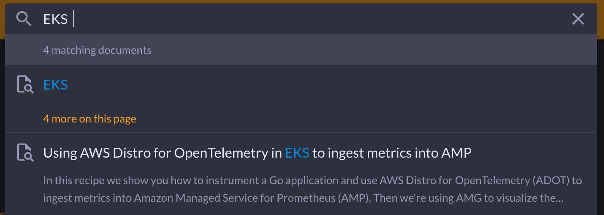

# レシピ

ここでは、オブザーバビリティ(o11y) をさまざまなユースケースに適用するのに役立つ、厳選されたガイダンス、ハウツー、その他のリソースへのリンクを見つけることができます。これには、[Amazon Managed Service for Prometheus][amp] や [Amazon Managed Grafana][amg] などのマネージドサービスや、[OpenTelemetry][otel] や [Fluent Bit][fluentbit] などのエージェントが含まれます。ただし、コンテンツは AWS ツールに限定されず、多くのオープンソースプロジェクトがここで参照されています。

開発者とインフラ担当者のニーズに均等に対応するために、レシピの多くが「幅広い対象」となっています。探索して、あなたが達成しようとしていることに最適なソリューションを見つけることをお勧めします。 

!!! info
    ここにあるコンテンツは、ソリューションアーキテクト、プロフェッショナルサービス、および他のお客様からのフィードバックによる実際の顧客エンゲージメントから派生しています。ここで見つけることができるものはすべて、実際のお客様が自分の環境で実装したものです。

オブザーバビリティ領域を次のように考えています。
[6 つの次元][dimensions]に分解し、それらを組み合わせて特定のソリューションに到達できます。

| 次元 | 例 |
|---------------|--------------|
| デスティネーション | [Prometheus][amp] · [Grafana][amg] · [OpenSearch][aes] · [CloudWatch][cw] · [Jaeger][jaeger] |  
| エージェント | [ADOT][adot] · [Fluent Bit][fluentbit] · CW エージェント · X-Ray エージェント |
| 言語 | [Java][java] · Python · .NET · [JavaScript][nodejs] · Go · Rust |
| インフラとデータベース | [RDS][rds] · [DynamoDB][dynamodb] · [MSK][msk] |
| コンピュートユニット | [Batch][batch] · [ECS][ecs] · [EKS][eks] · [AEB][beans] · [Lambda][lambda] · [AppRunner][apprunner] |
| コンピュートエンジン | [Fargate][fargate] · [EC2][ec2] · [Lightsail][lightsail] |  

!!! question "例となるソリューション要件"
    EKS on Fargate で実行している Python アプリのロギングソリューションが必要です。ログを S3 バケットに格納してさらに消費することが目的です。

このニーズを満たすスタックの 1 つは、次のとおりです。

1. *デスティネーション*: データのさらなる消費のための S3 バケット
1. *エージェント*: EKS からログデータを送信する FluentBit  
1. *言語*: Python
1. *インフラとデータベース*: 該当なし
1. *コンピュートユニット*: Kubernetes (EKS)  
1. *コンピュートエンジン*: EC2

すべての次元を指定する必要はなく、時にはどこから始めればいいか判断しにくいこともあります。さまざまなパスを試し、特定のレシピの長所と短所を比較してください。

ナビゲーションを簡素化するために、6つの次元を以下のカテゴリにグループ化しています。

- **By Compute**: コンピュートエンジンとユニットをカバー
- **By Infra & Data**: インフラとデータベースをカバー  
- **By Language**: 言語をカバー
- **By Destination**: テレメトリと分析をカバー
- **Tasks**: 異常検知、アラート、トラブルシューティングなどをカバー

[次元の詳細を見る...](dimensions/)

## 使い方

トップナビゲーションメニューを使用して、概略的な選択から始めて、特定のインデックスページを参照できます。
例えば、「By Compute」 -> 「EKS」 -> 「Fargate」 -> 「Logs」です。

あるいは、`/` キーまたは `s` キーを押してサイト内を検索できます。

!!! info "ライセンス"
	このサイトで公開されているすべてのレシピは、[MIT-0][mit0]ライセンスを介して利用できます。これは、帰属の必要性を除去した通常の MIT ライセンスの変更です。

## 貢献の仕方

計画していることについて[ディスカッション][discussion]を開始し、そこから始めましょう。

## 詳細を知る

このサイトのレシピは、ベストプラクティスのコレクションです。
加えて、レシピで使用しているオープンソースプロジェクトとマネージドサービスのステータスを知ることができる場所がいくつかあります。

- [observability @ aws][o11yataws] AWS の人々がプロジェクトやサービスについて話すプレイリストです。
- [AWS オブザーバビリティ ワークショップ][workshops] オファリングを体系的に試すことができます。  
- [AWS モニタリングとオブザーバビリティ][o11yhome] ホームページ。ケーススタディやパートナーへのリンクがあります。

[aes]: aes.md "Amazon Elasticsearch Service"
[adot]: https://aws-otel.github.io/ "AWS Distro for OpenTelemetry"  
[amg]: amg.md "Amazon Managed Grafana"
[amp]: amp.md "Amazon Managed Service for Prometheus"
[batch]: https://aws.amazon.com/batch/ "AWS Batch"
[beans]: https://aws.amazon.com/elasticbeanstalk/ "AWS Elastic Beanstalk"
[cw]: cw.md "Amazon CloudWatch"
[dimensions]: dimensions.md
[dynamodb]: dynamodb.md "Amazon DynamoDB"  
[ec2]: https://aws.amazon.com/ec2/ "Amazon EC2"
[ecs]: ecs.md "Amazon Elastic Container Service"
[eks]: eks.md "Amazon Elastic Kubernetes Service"
[fargate]: https://aws.amazon.com/fargate/ "AWS Fargate"
[fluentbit]: https://fluentbit.io/ "Fluent Bit"
[jaeger]: https://www.jaegertracing.io/ "Jaeger"
[kafka]: https://kafka.apache.org/ "Apache Kafka"  
[apprunner]: apprunner.md "AWS App Runner"
[lambda]: lambda.md "AWS Lambda"
[lightsail]: https://aws.amazon.com/lightsail/ "Amazon Lightsail"
[otel]: https://opentelemetry.io/ "OpenTelemetry"
[java]: java.md
[nodejs]: nodejs.md
[rds]: rds.md "Amazon Relational Database Service"
[msk]: msk.md "Amazon Managed Streaming for Apache Kafka"
[mit0]: https://github.com/aws/mit-0 "MIT-0"
[discussion]: https://github.com/aws-observability/observability-best-practices/discussions "Discussions"
[o11yataws]: https://www.youtube.com/playlist?list=PLaiiCkpc1U7Wy7XwkpfgyOhIf_06IK3U_ "Observability @ AWS YouTube playlist"  
[o11yhome]: https://aws.amazon.com/products/management-and-governance/use-cases/monitoring-and-observability/ "AWS Observability home"
