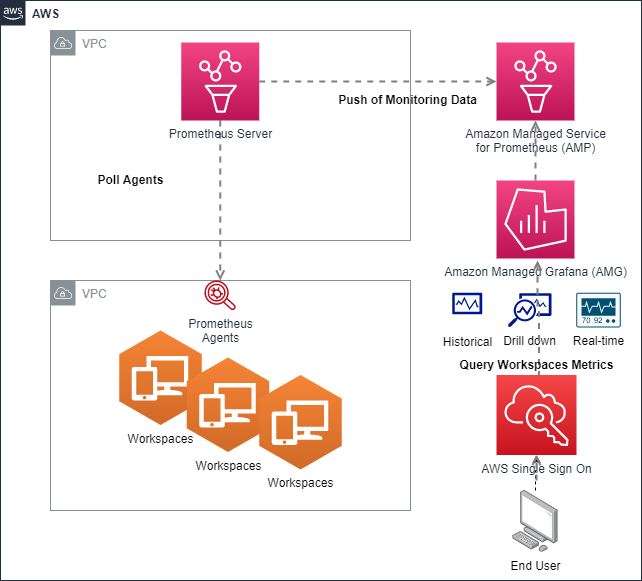

[Amazon Workspaces](https://docs.aws.amazon.com/workspaces/latest/adminguide/amazon-workspaces.html) を仮想クラウドベースのデスクトップとして採用し始めた組織があります。これは、ラップトップやデスクトップのメンテナンスコストと労力をクラウドのペイアズユーゴー型モデルに移行するために、既存の従来のデスクトップソリューションを置き換えるソリューション (DAAS) です。
Amazon Workspaces を使用している組織では、これらのマネージドサービスのサポートが必要になります。それは、デイ 2 オペレーションの Workspaces 環境を監視するためです。 
Amazon Managed Service for Prometheus や Amazon Managed Grafana などのクラウドベースのマネージドオープンソースモニタリングソリューションは、コスト削減のために迅速にモニタリングソリューションの設定と運用を支援します。
Amazon Workspace からの CPU、メモリ、ネットワーク、ディスクアクティビティの監視により、Amazon Workspaces 環境のトラブルシューティング時の推測が不要になります。

Amazon Workspaces 環境でのマネージドモニタリングソリューションにより、次のような組織的メリットが得られます。

* サービスデスクスタッフは、Amazon Managed Service for Prometheus や Amazon Managed Grafana などのマネージドモニタリングサービスを活用することで、調査が必要な Amazon Workspace の問題を推測することなく迅速に特定および詳細調査できます。
* サービスデスクスタッフは、Amazon Managed Service for Prometheus の履歴データを使用して、イベント後に Amazon Workspace の問題を調査できます。
* Amazon Workspaces の問題についてビジネスユーザーに時間を無駄にする長いコールを排除します。

このブログ記事では、Amazon Workspaces のモニタリングソリューションを提供するために、Amazon Managed Service for Prometheus、Amazon Managed Grafana、Amazon Elastic Compute Cloud(EC2) 上の Prometheus サーバーを設定します。 
Active Directory グループポリシーオブジェクト(GPO)を使用して、新しい Amazon Workspace への Prometheus エージェントの自動デプロイを行います。

**ソリューションアーキテクチャ**

次の図は、Amazon Managed Service for Prometheus や Amazon Managed Grafana などの AWS ネイティブマネージドサービスを使用して Amazon Workspaces 環境を監視するソリューションを示しています。
このソリューションでは、Amazon Elastic Compute Cloud(EC2)インスタンス上に Prometheus サーバーをデプロイします。Prometheus サーバーは定期的に Amazon Workspace 上の prometheus エージェントをポーリングし、メトリクスを Amazon Managed Service for Prometheus にリモートライトします。 
Amazon Workspaces インフラストラクチャ上のメトリクスをクエリおよび可視化するために、Amazon Managed Grafana を使用します。

