# SAMLを使用したAmazon Managed GrafanaでのGoogle Workspace認証の設定

このガイドでは、SAML 2.0プロトコルを使用して、Google WorkspaceをAmazon Managed GrafanaのIDプロバイダー(IdP)として設定する方法を説明します。

このガイドに従うには、[Amazon Managed Grafanaワークスペース][amg-ws]に加えて、有料の[Google Workspace][google-workspaces]アカウントを作成する必要があります。

### Amazon Managed Grafana ワークスペースの作成

Amazon Managed Grafana コンソールにログインし、**Create workspace** をクリックします。次の画面で、以下のようにワークスペース名を指定します。その後 **Next** をクリックします:

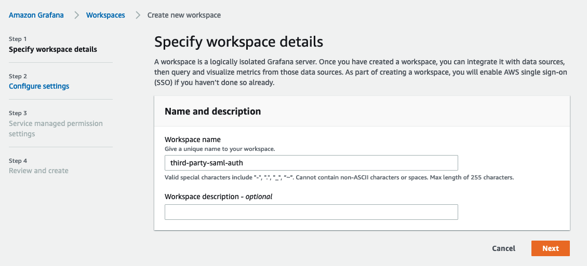

**Configure settings** ページで、ユーザーがログインするための SAML ベースのアイデンティティプロバイダを設定できるように **Security Assertion Markup Language (SAML)** オプションを選択します:

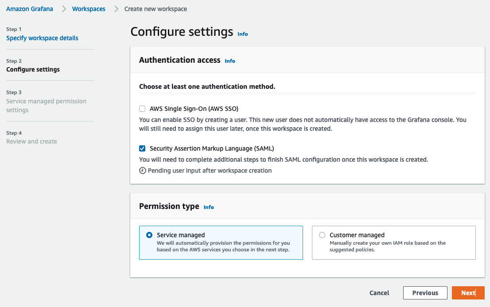

使用したいデータソースを選択し、**Next** をクリックします:

**Review and create** 画面で **Create workspace** ボタンをクリックします:
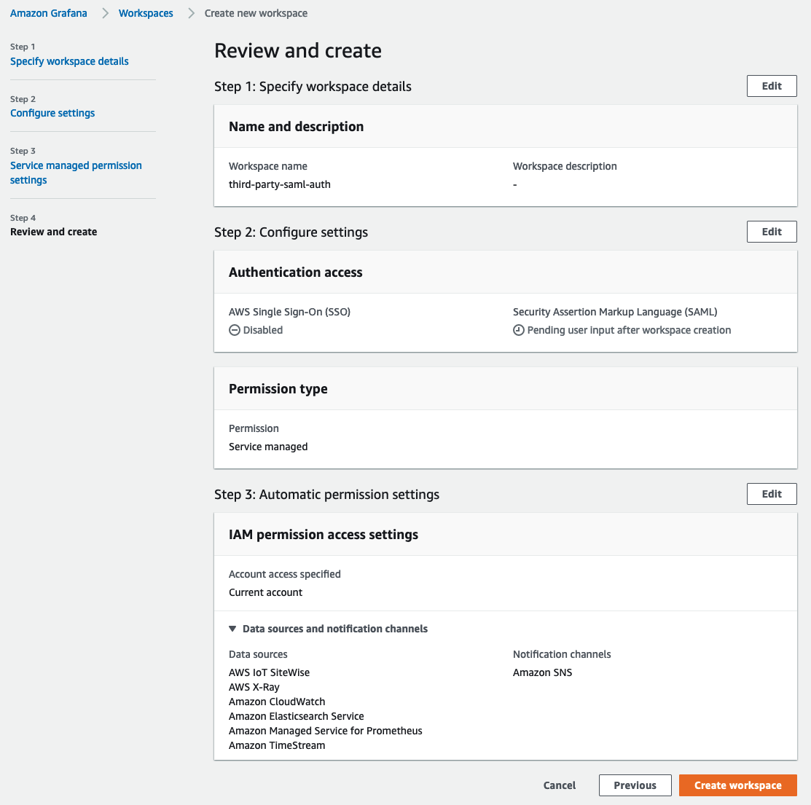

これにより、以下のような新しい Amazon Managed Grafana ワークスペースが作成されます:

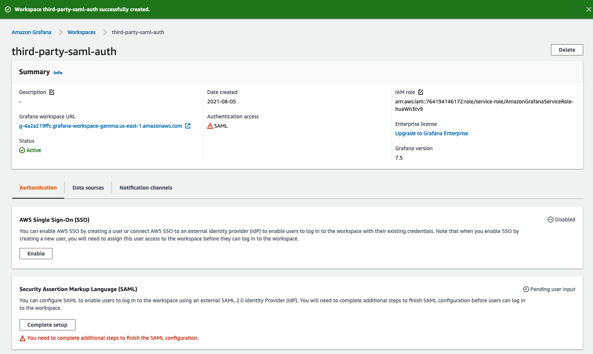

### Google ワークスペースの設定

Google ワークスペースにスーパーアドミンのアクセス許可でログインし、**アプリ**セクションの**Web とモバイル アプリ**に移動します。そこで、**アプリの追加**をクリックし、**カスタム SAML アプリの追加**を選択します。以下のようにアプリの名前を付けます。**続行**をクリックします。

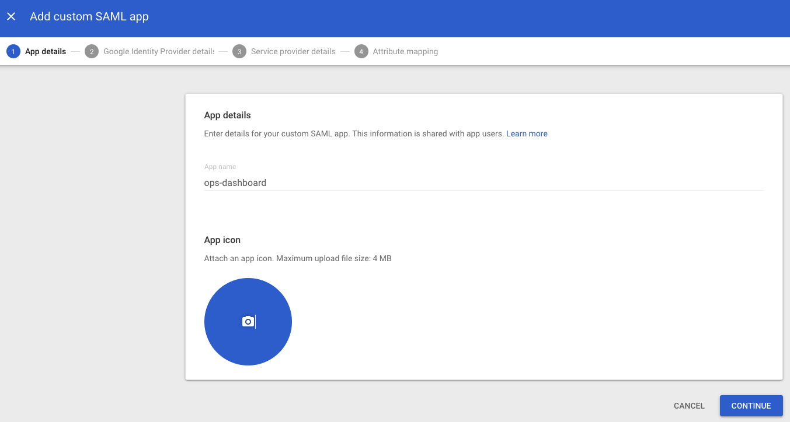

次の画面で、**メタデータのダウンロード**ボタンをクリックして、SAML メタデータファイルをダウンロードします。**続行**をクリックします。

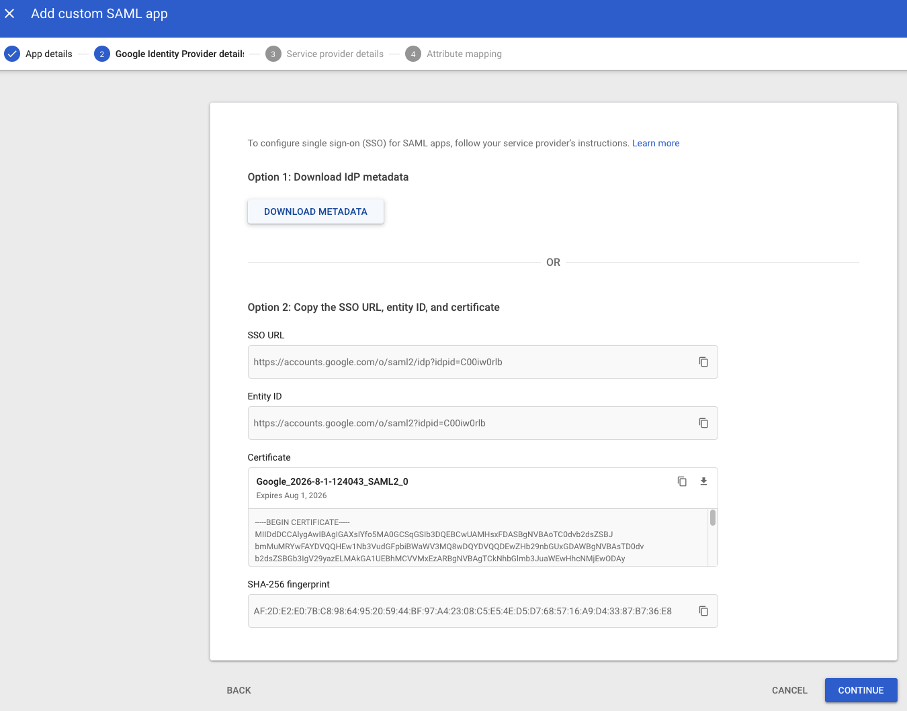

次の画面に、ACS URL、エンティティ ID、開始 URL フィールドが表示されます。
これらのフィールドの値は、Amazon Managed Grafana コンソールから取得できます。

**名前 ID 形式**のドロップダウンから **EMAIL** を選択し、**名前 ID** フィールドで **Basic Information > Primary email** を選択します。

**続行**をクリックします。
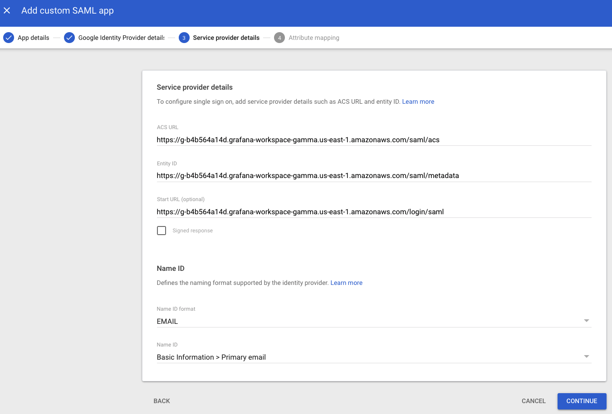

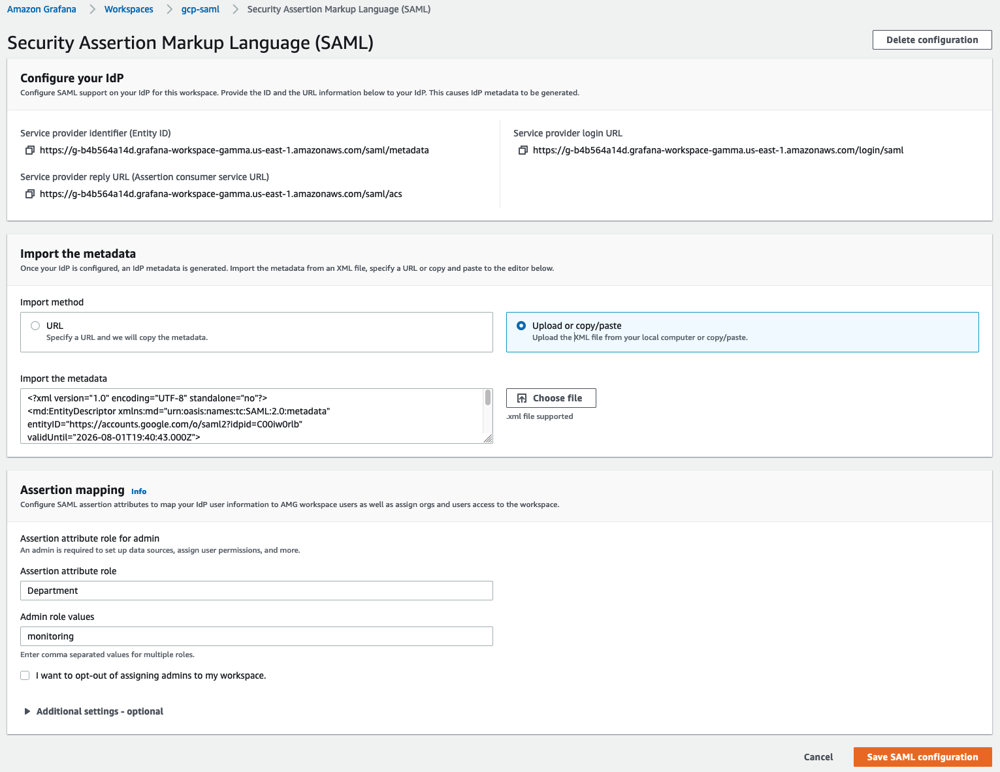

**属性マッピング** 画面で、以下のスクリーンショットのように **Google ディレクトリ属性** と **アプリ属性** 間のマッピングを行います。

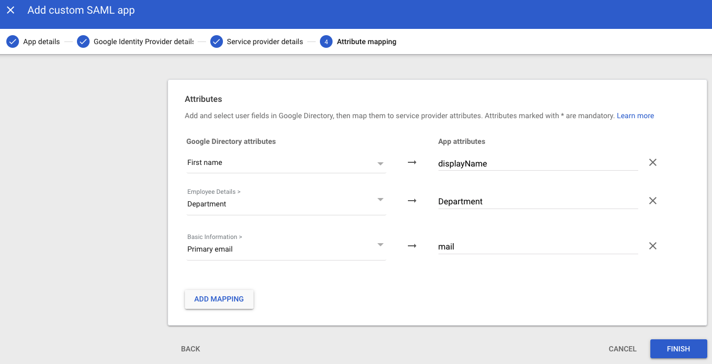

Google 認証でログインしたユーザーが **Amazon Managed Grafana** で **Admin** 権限を持つためには、**部署**フィールドの値を ***monitoring*** に設定します。 これには任意のフィールドと値を選択できます。Google ワークスペース側で何を選択するかに関わらず、Amazon Managed Grafana の SAML 設定でそのマッピングを反映するようにしてください。

### Amazon Managed GrafanaにSAMLメタデータをアップロードする

Amazon Managed Grafanaコンソールで、**Upload or copy/paste** オプションをクリックし、**Choose file** ボタンを選択して、先ほどGoogle WorkspaceからダウンロードしたSAMLメタデータファイルをアップロードします。

**Assertion mapping** セクションの **Assertion attribute role** フィールドに **Department** と入力し、**Admin role values** フィールドに **monitoring** と入力します。
これにより、**Department** が **monitoring** としてログインするユーザーは、Grafanaで**Admin**権限を持つことができるため、ダッシュボードやデータソースの作成などの管理者タスクを実行できます。

以下のスクリーンショットに示すように、**Additional settings - optional** セクションの値を設定します。 **Save SAML configuration** をクリックします。

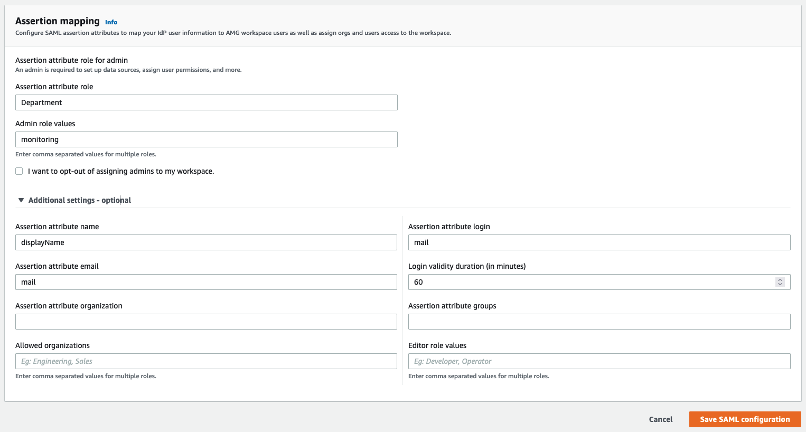

これで、Amazon Managed GrafanaはGoogle Workspaceを使用してユーザーを認証するように設定されました。

ユーザーがログインすると、次のようにGoogleログインページにリダイレクトされます:

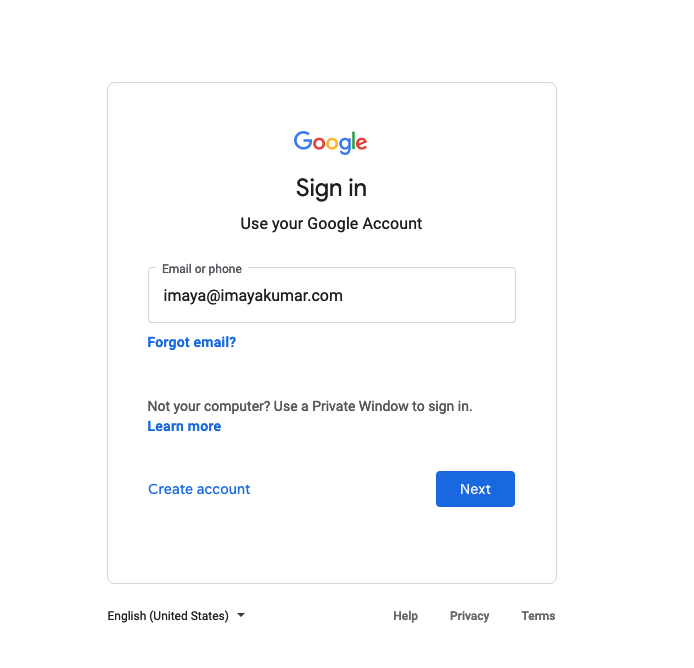

資格情報を入力すると、以下のスクリーンショットのようにGrafanaにログインされます。
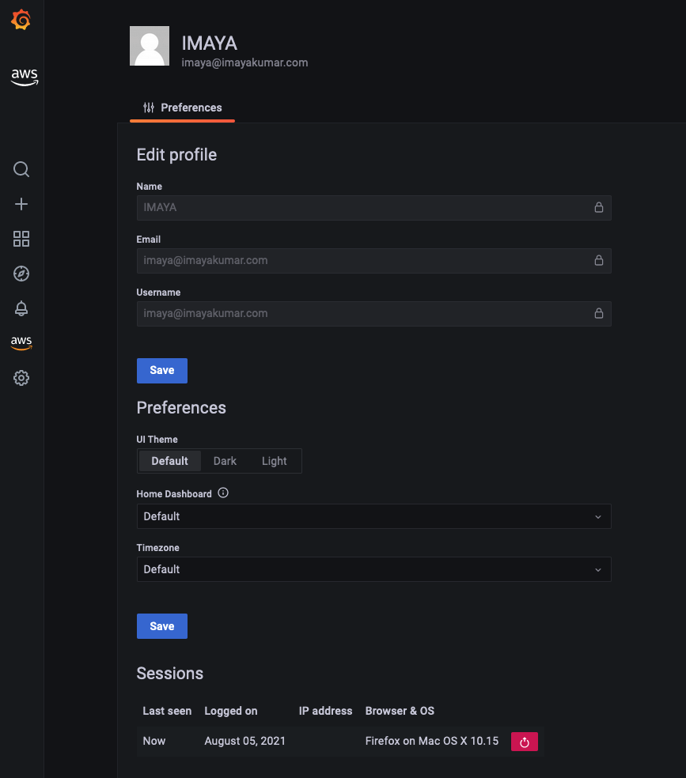

ご覧のとおり、ユーザーはGoogle Workspace認証を使用してGrafanaに正常にログインできました。

[google-workspaces]: https://workspace.google.com/
[amg-ws]: https://docs.aws.amazon.com/grafana/latest/userguide/getting-started-with-AMG.html#AMG-getting-started-workspace
