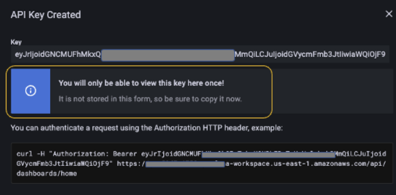
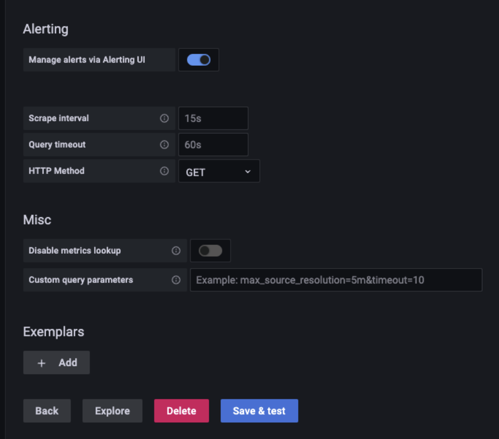

# Amazon EKS Observability Accelerator のご紹介

オブザーバビリティは、あらゆるアプリケーションやシステムの動作とパフォーマンスを理解するうえで欠かせません。パフォーマンスの低下や障害の検知と修復には時間と労力が必要です。お客様は設定ファイルの作成に多くの時間を費やし、アプリケーションのエンドツーエンドの監視を実現するために相当な労力を費やしています。AWS の [CloudFormation](https://docs.aws.amazon.com/cloudformation/index.html)、[Terraform](https://www.terraform.io/)、[Ansible](https://www.ansible.com/) などのインフラストラクチャーアズコード(IaC)ツールは、管理者と開発者が設定ファイルを使用してインフラストラクチャをインスタンス化するのを支援し、手動作業を軽減します。

[Amazon Elastic Kubernetes Service(Amazon EKS)](https://docs.aws.amazon.com/eks/index.html) は、コンテナ化されたアプリケーションを大規模にデプロイおよび管理できるようにする、強力で拡張性の高いコンテナオーケストレーションテクノロジーです。利用可能なツールと設計の選択肢の幅広い中からカスタマイズされた [Amazon EKS](https://docs.aws.amazon.com/eks/index.html) クラスターを構築し、アプリケーションの特定のニーズを満たすことはかなりの時間がかかります。この状況は、アプリケーションのパフォーマンスを分析するうえで欠かせないオブザーバビリティを実装する場合、さらに面倒になります。

お客様からは、Amazon EKS 上でのさまざまなオープンソースツールの統合や、特定のアプリケーション要件に対するベストプラクティスを組み込んだオブザーバビリティソリューションの構成を示すサンプルの要望がありました。2022年5月17日に、AWS は Terraform モジュールを使用して、Amazon EKS クラスター上にワークロード固有の目的構築型オブザーバビリティソリューションを構成およびデプロイするために使用される EKS Observability Accelerator を発表しました。このソリューションを使用することで、お客様は単一のコマンドの実行でアプリケーションの監視を開始できる [Amazon Managed Service for Prometheus](https://docs.aws.amazon.com/prometheus/)、[AWS Distro for OpenTelemetry](https://aws.amazon.com/otel/?otel-blogs.sort-by=item.additionalFields.createdDate&otel-blogs.sort-order=desc)、[Amazon Managed Grafana](https://aws.amazon.com/grafana/) を利用できます。

Terraform モジュールは、以下のワークロードの Amazon EKS クラスターでのオブザーバビリティの有効化を可能にするために構築されています。

* Java/JMX
* NGINX  
* Memcached
* HAProxy

AWS は今後もさらに多くのワークロードのサンプルを追加していきます。

この記事では、[EKS Observability Accelerator](https://github.com/aws-ia/terraform-aws-eks-blueprints/tree/main/examples/observability) を使用して Amazon EKS クラスターを構築し、特定のワークロード(Java/JMX アプリケーション)を監視するための意見主導型のオブザーバビリティコンポーネントを構成する手順を説明します。

## 前提条件

このソリューションを進める前に、前提条件を満たしてください。

* [Terraform のインストール](https://learn.hashicorp.com/tutorials/terraform/install-cli)
* [Kubectl のインストール](https://docs.aws.amazon.com/eks/latest/userguide/install-kubectl.html)
* [docker のインストール](https://docs.aws.amazon.com/AmazonECS/latest/developerguide/create-container-image.html#:~:text=the%20Docker%20CLI.-,Installing%20Docker%20on%20Amazon%20Linux%202,-Create%20a%20Docker)
* [AWS Command Line Interface (AWS CLI) バージョン 2](https://docs.aws.amazon.com/cli/latest/userguide/install-cliv2.html)
* [jq](https://stedolan.github.io/jq/download/)
* [AWS アカウント](https://aws.amazon.com/)
* [AWS CLI での認証情報の設定](https://docs.aws.amazon.com/cli/latest/userguide/cli-configure-files.html#:~:text=refreshes%20the%20credentials.-,Set%20and%20view%20configuration%20settings,-There%20are%20several)
* [既存の Amazon Managed Grafana ワークスペース](https://aws.amazon.com/blogs/mt/amazon-managed-grafana-getting-started/)

## デプロイ手順

自分が Kubernetes のオペレーターで、組織の Kubernetes 環境のプロビジョニングを担当していることを想像してください。 チームからの要件は多様で、Kubernetes 環境のプロビジョニングとそれらの構成の取り込みにかなりの時間を費やす必要がある場合があります。 新しいリクエストが来るたびに時計がリセットされるので、車輪の再発明が続きます。

これを簡素化し、作業時間を短縮するために、[EKS Blueprints](https://github.com/aws-ia/terraform-aws-eks-blueprints) を考案しました。 EKS Blueprints は、お客様が Amazon EKS を採用し、一般的なワークロードのデプロイを開始するのをより簡単かつ迅速にすることを目的とした Terraform モジュールのコレクションです。 これはオープンソースで、ワークロードをデプロイおよび運用するために必要な運用ソフトウェアで完全にブートストラップされた完全な Amazon EKS クラスターを構成および管理するために誰でも使用できます。

EKS Blueprints リポジトリには、Amazon EKS Observability Accelerator モジュールが含まれています。 これを使用して、Amazon EKS クラスターにデプロイされた Java/JMX アプリケーションの可観測性を構成します。

### ステップ 1: リポジトリのクローン

まず、EKS ブループリントが含まれるリポジトリをクローンします。

```
git clone https://github.com/aws-ia/terraform-aws-eks-blueprints.git
```

### ステップ 2: Grafana API キーの生成

Terraform モジュールをデプロイする前に、Grafana API キーを作成し、Terraform の変数ファイルを設定して、ダッシュボードをデプロイするためにそのキーを使用します。 既存の Amazon Managed Grafana ワークスペースを使用し、API キーを設定するためにワークスペースの URL にログインする必要があります。

キーの作成手順は次のとおりです。

* SAML/SSO 資格情報を使用して、Amazon Managed Grafana ワークスペースにログインします。
* 左側のコントロールパネルにカーソルを合わせ、歯車アイコンの下の API キータブを選択します。


* [追加]をクリックし、名前フィールドに名前を入力し、ロールを [管理者] に設定します。
* [有効期限] フィールドに入力します。これは API キーの有効期間です。 例えば、1 日後にキーの有効期限が切れるように 1d と入力します。 サポートされている単位は、s、m、h、d、w、M、y です。


* [追加] をクリックします
* API キーをコピーして安全な場所に保管します。次のステップでこのキーを使用します




### ステップ 3: 環境の設定

次に、EKS クラスター、AWS OTEL Operator、Amazon Managed Service for Prometheus をプロビジョニングするための Terraform モジュールをデプロイするように環境を設定します。

Terraform モジュールのデプロイには、以下のステップが含まれます。

* **Plan**: Terraform plan は実行計画を作成し、インフラストラクチャの変更をプレビューします。 
* **Apply**: Terraform はプランのアクションを実行し、環境を変更します。

次に、変数ファイルの作成または環境変数の設定によって環境を設定します。

「.tfvars」ファイルは、「-var」フラグまたは環境変数を使用する代替手段です。このファイルは、スクリプトで使用される変数値を定義します。

このブログ記事では、新しいファイル「dev.tfvars」を ~/terraform-aws-eks-blueprints/examples/observability/adot-amp-grafana-for-java の下に作成します。

対応する Grafana ワークスペースエンドポイントと Grafana API キーで dev.tfvars ファイルを編集することを確認してください。また、設定をカスタマイズしたい場合は、必要な変数を dev.tfvars ファイルに追加します。

```
cd ~/terraform-aws-eks-blueprints/examples/observability/adot-amp-grafana-for-java
```

```
vi dev.tfvars
```

```
grafana_endpoint=”<Your Grafana workspace endpoint>"
grafana_api_key=”Your Grafana API Key>"
```

!!! note
API_KEY - 作成したキーです
Grafana_Endpoint - Grafana ワークスペースの URL です。

「https://」を含めることを確認してください。さもないと、Terraform モジュールが失敗します。

</your>

### ステップ 4: Terraform モジュールのデプロイ

最初のステップは、terraform init コマンドを使用してワーキングディレクトリを初期化することです。これにより、Terraform 設定ファイルを含むワーキングディレクトリが初期化されます。このコマンドは、新しい Terraform 構成を記述した後や、バージョン管理から既存の構成を複製した後に実行します。

```
terraform init
```

このコマンドは、Terraform での使用に備えて現在のワーキングディレクトリの初期化ステップを実行します。初期化が完了すると、次の通知が表示されます。


さらに、terraform validate コマンドを実行して、ディレクトリ内の構成ファイルを評価できます。Validate は、提供された変数や既存の状態に関係なく、構成が構文的に有効で内部的に一貫しているかどうかを検証するチェックを実行します。

```
terraform validate
```


次のステップは、terraform plan コマンドを実行して実行計画を作成することです。これにより、Terraform インフラストラクチャの変更をプレビューできます。デフォルトでは、terraform がプランを作成するときに以下を行います。

* 既存のリモートオブジェクトを読み取って、Terraform の状態が最新であることを確認します。
* 現在の構成と初期状態を比較し、差分を報告します。
* リモートオブジェクトを構成と一致させるために必要な変更アクションのセットを提案します。

plan コマンドだけでは、提案された変更は適用されません。したがって、このコマンドを使用して、提案された変更が期待したものと一致するかどうかを変更の適用前に確認したり、チームと共有してより広範なレビューにかけたりできます。

```
terraform plan -var-file=./dev.tfvars
```


最後に、`terraform apply` コマンドを実行してリソースをプロビジョニングします。これには約 20 分かかります。このコマンドは、以下のリソースをデプロイします。

```
terraform apply -var-file=./dev.tfvars -auto-approve
```


1. `aws001-preprod-dev-eks` という名前の Amazon EKS クラスターを作成します
2. `amp-ws-aws001-preprod-dev-eks` という名前の Amazon Managed Service for Prometheus ワークスペースを作成します
3. `opentelemetry-operator-system`、`adot-collector-java` という名前の Kubernetes 名前空間を作成します
4. Java/JMX ワークロードのメトリクスを収集する構成で AWS ADOT コレクターを名前空間にデプロイします
5. 既存の Amazon Managed Grafana ワークスペース内に Java/JMX メトリクスを可視化するダッシュボードを構築し、Amazon Managed Service for Prometheus ワークスペースをデータソースとして構成します

EKS クラスターのプロビジョニング後、Amazon EKS クラスターエンドポイントを kubeconfig に追加し、リソースが正常にプロビジョニングされたことを確認します。

```
aws eks --region $AWS_REGION update-kubeconfig --name aws001-preprod-dev-eks
```

次のコマンドを実行して、Amazon Managed Service for Prometheus ワークスペースと ADOT コレクターの作成を確認します。

```
aws amp list-workspaces | jq -r '.workspaces[] | select(.alias=="amp-ws-aws001-preprod-dev-eks").workspaceId'
```

クラスター内のすべての Pod を一覧表示します

```
kubectl get pods -A
```


Amazon Managed Grafana と Amazon Managed Prometheus 間の接続を、構成ページに移動してデフォルトのデータソースを確認することで検証できます。


* `amp` という名前のデータソースを選択します
* 下にスクロールして `Save & test` を選択します



次のような成功メッセージが表示されるはずです


### ステップ 5: サンプル Java/JMX アプリケーションのデプロイ

サンプルの Java/JMX アプリケーションをデプロイし、JMX メトリクスのスクレイピングを開始します。このサンプルアプリケーションは、JVM メモリプール、JVM メモリ使用量、スレッドなどの JMX メトリクスを生成し、Prometheus フォーマットでエクスポートします。最終的に可視化するために、広範囲のメトリクスを取得するロードジェネレータとバッドロードジェネレータをデプロイします。

EKS Observability Accelerator は、AWS OTEL オペレータのデプロイメントのメトリクスを収集します。ADOT Exporter はこれらのメトリクスを Amazon Managed Service for Prometheus ワークスペースにインジェストします。

AWS OpenTelemetry コレクター [リポジトリ](https://github.com/aws-observability/aws-otel-collector/blob/main/docs/developers/container-insights-eks-jmx.md) から例を再利用します。

```
# Switch to home directory

cd ~/

#Clone the git repository

git clone https://github.com/aws-observability/aws-otel-test-framework.git

#Setup environment variables
export AWS_ACCOUNT_ID=`aws sts get-caller-identity --query Account --output text`

#Login to registry
aws ecr get-login-password --region $AWS_REGION | docker login --username AWS --password-stdin $AWS_ACCOUNT_ID.dkr.ecr.$AWS_REGION.amazonaws.com

#Create ECR Repository
aws ecr create-repository --repository-name prometheus-sample-tomcat-jmx \
--image-scanning-configuration scanOnPush=true \
--region $AWS_REGION

#Build Docker image and push to ECR

cd ~/aws-otel-test-framework/sample-apps/jmx

docker build -t $AWS_ACCOUNT_ID.dkr.ecr.$AWS_REGION.amazonaws.com/prometheus-sample-tomcat-jmx:latest .

docker push $AWS_ACCOUNT_ID.dkr.ecr.$AWS_REGION.amazonaws.com/prometheus-sample-tomcat-jmx:latest

#Deploy the sample application

export SAMPLE_TRAFFIC_NAMESPACE=javajmx-sample

curl https://raw.githubusercontent.com/aws-observability/aws-otel-test-framework/terraform/sample-apps/jmx/examples/prometheus-metrics-sample.yaml > metrics-sample.yaml

sed -e "s/{{aws_account_id}}/$AWS_ACCOUNT_ID/g" metrics-sample.yaml -i
sed -e "s/{{region}}/$AWS_REGION/g" metrics-sample.yaml -i
sed -e "s/{{namespace}}/$SAMPLE_TRAFFIC_NAMESPACE/g" metrics-sample.yaml -i

kubectl apply -f metrics-sample.yaml

#Verify the application

kubectl get pods -n $SAMPLE_TRAFFIC_NAMESPACE
```


### ステップ 6: Amazon Managed Grafana で JMX メトリクスを視覚化する

AWS ADOT オペレータによって収集された JMX メトリクスを視覚化するには、Grafana ワークスペースにログインします。

* [Dashboards] を選択し、[Manage] を選択します


* [Observability] フォルダを選択し、[EKS Accelerator – Observability – Java/JMX] という名前のダッシュボードを選択します


Terraform モジュールは、Amazon Managed Service for Prometheus ワークスペースをデフォルトのデータソースとして追加し、メトリクスを視覚化するためのカスタムダッシュボードを作成しました。


NGINX、HAProxy、Memcached のサンプルアプリケーションもデプロイできます。

## クリーンアップ

以下のコマンドを実行して、Terraform モジュールによってプロビジョニングされたリソースを削除します。

```
terraform destroy -var-file=./dev.tfvars -auto-approve
```

## 結論

お客様は現在、EKS Observability Acceleratorを利用して、時間をかけずにリソースを手動でデプロイしたり、エージェントを設定してメトリクスをスクレイピングしたりすることなく、意見のある EKS クラスタをデプロイし、特定のワークロードのためのオブザーバビリティを設定することができます。さらに、このソリューションは Amazon Managed Prometheus ワークスペースを Amazon Managed Grafana と接続し、アラートと通知を設定する拡張性を提供します。
