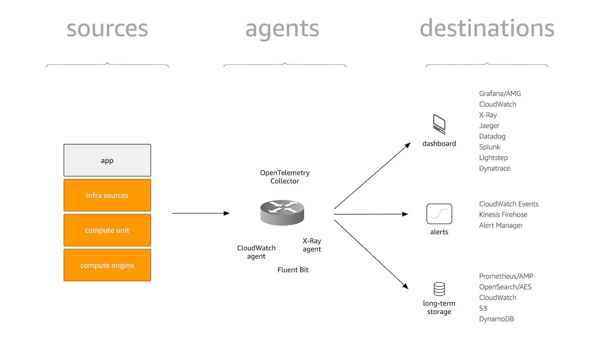

# テレメトリ

テレメトリは、自身のアプリやインフラを含むさまざまなソースからのシグナルを収集し、
それらが消費される場所にルーティングする方法についてです。

!!! success
    各種テレメトリのベストプラクティスの詳細な内訳については、[データタイプ](../signals/logs)のセクションを参照してください。

上記の図で紹介した概念についてさらに掘り下げていきましょう。

## ソース

ソースとは、シグナルが発生するものです。ソースには次の2つのタイプがあります。

1. 自分でコントロールできるもの。つまり、インスツルメンテーションを通じたアプリケーションのソースコードです。
2. 直接的なコントロール下にないマネージドサービスなど、使用可能なその他のものです。
   このタイプのソースは通常、API を介してシグナルを公開する AWS によって提供されます。

## エージェント

ソースからデスティネーションへシグナルを輸送するには、エージェントと呼ばれる中間的なものが必要です。これらのエージェントは、ソースからシグナルを受信またはプルし、通常は構成を介して、シグナルがどこに送信されるべきかを判断します。オプションでフィルタリングと集約をサポートします。

!!! question "エージェント? ルーティング? シッピング? インジェスチョン?"
    ルーティング、シッピング、アグリゲーション、インジェスチョンなど、ソースからデスティネーションへのシグナルの取得プロセスを指すために人々が使用する用語がたくさんあります。それらは少し異なる意味を持つ可能性がありますが、ここでは互換性があると見なします。正式には、それらの中間トランスポートコンポーネントをエージェントと呼びます。

## デスティネーション

最終的にシグナルがたどり着く場所です。後で消費するためにシグナルを保存したい場合でも、ダッシュボード化したい場合でも、特定の条件が真である場合にアラートを設定したい場合でも、シグナルを相関付けたい場合でも、エンドユーザーとして役立つすべてのコンポーネントがデスティネーションです。
