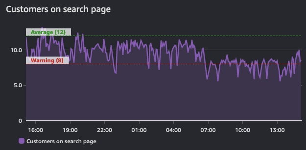
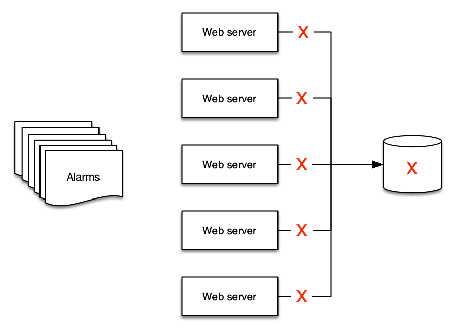
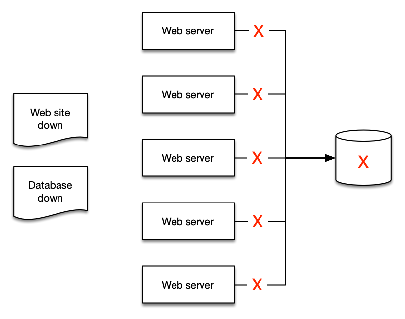

# アラーム

アラームとは、プローブ、モニター、または特定のしきい値を超えたり下回ったりする値の変化の状態を指します。
典型的な例は、ディスクが満杯になったときや Web サイトがダウンしたときにメールを送信するアラームです。
より高度なアラームは完全にプログラムで制御されており、オートスケーリングやサーバークラスタの作成などの複雑な対話を駆動するために使用されます。

ただし、ユースケースに関係なく、アラームはメトリクスの現在の*状態*を示します。 
この状態は、システムによって `OK`、`WARNING`、`ALERT`、`NO DATA` のいずれかになります。

アラームはこの状態を一定期間反映し、タイムシリーズの上に構築されます。 
したがって、それらはタイムシリーズ*から*導出されます。 
以下のグラフは、2つのアラームを示しています。1つは警告しきい値のアラームで、もう1つはこのタイムシリーズ全体の平均値を示すアラームです。 
このグラフが示すトラフィック量でわかるように、警告しきい値のアラームは、定義された値を下回ると違反状態になる必要があります。

!!! info
    アラームの目的は、アクション(人間またはプログラム)をトリガーするか、情報提供(しきい値の違反)のいずれかです。
    アラームはメトリクスのパフォーマンスの洞察を提供します。

## アクション可能なものに対するアラートの設定

アラート疲労とは、人々があまりにも多くのアラートを受信するためにそれらを無視することを学習してしまうことです。これは、適切に監視されているシステムの兆候ではありません。むしろ、これはアンチパターンです。

!!! success
	アクション可能なものに対してアラームを作成し、常に[目的](../../guides/#monitor-what-matters)から逆算してください。

たとえば、高速なレスポンスタイムが必要な Web サイトを運用している場合は、レスポンスタイムが特定のしきい値を超えたときにアラートが配信されるように設定してください。また、パフォーマンスの低下が高い CPU 使用率と関連していることを特定した場合は、このデータポイントに対して問題が発生する前に *プロアクティブに* アラートを設定してください。ただし、アウトカムを *危険にさらさない* 場合には、環境内の *すべての* CPU 使用率に対してアラートを設定する必要はないかもしれません。

!!! success
	アラームがアラートを必要とせず、自動プロセスをトリガーしない場合、アラートを受信する必要はありません。不要なアラームから通知を削除する必要があります。

## 「すべてOKアラーム」に注意

同様に、一般的なパターンとして、オペレーターが絶え間なくアラートを受信することに慣れてしまい、突然静かになったときだけ気づく「すべてOKアラーム」があります。これは非常に危険な運用モードであり、[運用上の卓越性](../../faq/#運用上の卓越性とは)に反するパターンです。 

!!! warning
	「すべてOKアラーム」は通常、人間による解釈が必要です。これにより、セルフヒーリングアプリケーションなどのパターンが不可能になります。[^1]

## 集約によるアラーム疲労の軽減

オブザーバビリティは技術的な問題ではなく、*人間*の問題です。そのため、アラーム戦略はより多くのアラートを作成するのではなく、アラートを減らすことに焦点を当てるべきです。テレメトリ収集を実装するにつれて、環境からのアラートが自然に増えていきます。ただし、[アクション可能なものに対してのみアラートを出す](../../signals/alarms/#alert-on-things-that-are-actionable)ことに注意が必要です。アラートの原因となった条件がアクション可能でない場合、それを報告する必要はありません。

これは、例を示すのが最もよい方法です。バックエンドに単一のデータベースを使用する 5 つの Web サーバーがある場合、データベースがダウンしたときに Web サーバーに何が起こるでしょうか。多くの人の答えは、*少なくとも 6 個*のアラートが発生するというものです。Web サーバーに*5 個*、データベースに*1 個*のアラートが発生します。

しかし、配信する意味のあるアラートは 2 つだけです。

1. Web サイトがダウンしている
2. データベースが原因である

!!! success
    アラートを集約することで、人々が理解しやすくなり、次に実行ブックや自動化を作成しやすくなります。

## 既存の ITSM とサポートプロセスを利用する

監視およびオブザーバビリティプラットフォームに関係なく、それらは現在のツールチェーンと統合する必要があります。

!!! success
	アラートからこれらのツールへのプログラムによる統合を使用してトラブルチケットと問題を作成し、人為的な作業を削減し、プロセスを効率化します。

これにより、[DORA メトリクス](https://en.wikipedia.org/wiki/DevOps)などの重要な運用データを導出できます。

[^1]: このパターンの詳細については、 https://aws.amazon.com/blogs/apn/building-self-healing-infrastructure-as-code-with-dynatrace-aws-lambda-and-aws-service-catalog/ を参照してください。
