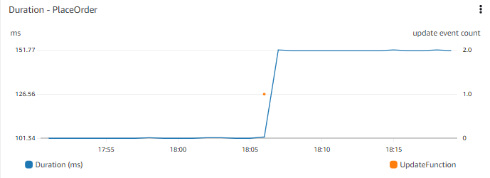
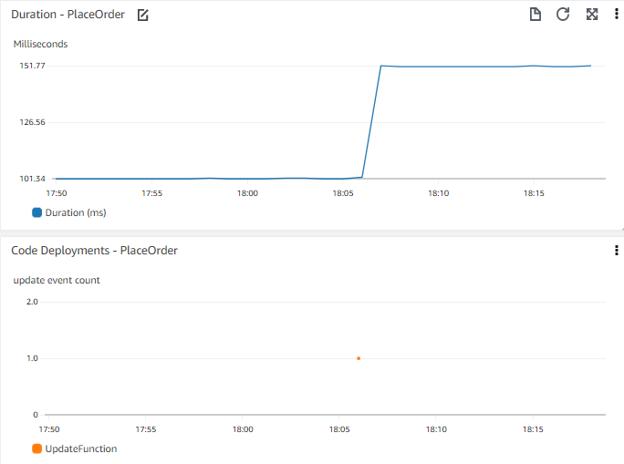

# イベント

## イベントとは何を意味しているのでしょうか

最近の多くのアーキテクチャはイベント駆動型です。イベント駆動型アーキテクチャでは、イベントは異なるシステムからの信号であり、これをキャプチャして他のシステムに渡します。イベントは通常、状態の変化や更新を意味します。

例えば、eコマースシステムでは、商品がカートに追加されたときにイベントが発生する場合があります。このイベントはキャプチャされ、システムのショッピングカート部分に渡されて、商品数、カートのコストが商品の詳細とともに更新されます。

!!! info
	ある顧客にとって、イベントは*マイルストーン*のようなものかもしれません。つまり、購入の完了などのワークフローの結論の総括的瞬間です。ワークフローの結論をイベントとして扱うことには一理あるでしょうが、今回の目的では、マイルストーン自体をイベントとは考えません。

## イベントが役立つ理由
イベントがオブザーバビリティソリューションで役立つ主な2つの方法があります。1つは他のデータとのコンテキストでイベントを視覚化すること、もう1つはイベントに基づいてアクションを実行できることです。

!!! success
	イベントは、ワークロードの変更やアクションについて、人やマシンのどちらかに価値のある情報を提供することを目的としています。

## イベントの可視化
アプリケーションから直接発生しているものではないが、アプリケーションのパフォーマンスに影響を与えたり、根本原因の洞察を提供したりする可能性のある多くのイベント・シグナルがあります。ダッシュボードはイベントを可視化するための最も一般的なメカニズムですが、分析ツールやビジネスインテリジェンス・ツールの一部もこのコンテキストで機能します。電子メールやインスタントメッセージング・アプリケーションでも可視化を容易に受信できます。

たとえば、Web フロントエンドで注文を処理するまでの時間など、アプリケーションのパフォーマンスの時系列を考えてみましょう。時系列グラフを見ると、数日前に応答時間が大きく変化していることがわかります。最近のデプロイがあったかどうかを知ることが役立つかもしれません。最近のデプロイの時系列を隣に表示したり、同じグラフに重ねて表示したりできないか考えてみましょう。

!!! tip
	広いコンテキストを理解するのに役立つイベントはどれかを考えてみましょう。コードのデプロイ、インフラストラクチャの変更イベント、新しいデータの追加(新しい商品の公開やユーザーの一括追加など)、機能の変更や追加(カートに商品を追加する方法の変更など)など、あなたにとって重要なイベントがあるかもしれません。

!!! success
	他の重要なメトリック・データとともにイベントを可視化することで、[イベントと運用メトリックを相関付ける](../../signals/metrics/#correlate-with-operational-metric-data)ことができます。

## イベントへの対応
オブザーバビリティの世界では、アラームの発生は一般的なイベントです。このイベントには、アラームの識別子、アラームの状態(``IN ALARM`` や ``OK`` など)、発生のトリガーとなった詳細が含まれることが考えられます。多くの場合、このアラームイベントが検出され、電子メール通知が送信されます。これは、アラームへのアクションの例です。

アラーム通知はオブザーバビリティにとって極めて重要です。これは、問題が発生したことを適切な人に知らせる方法です。しかし、イベントへの対応がオブザーバビリティソリューションで成熟するにつれて、人為的な介入なしに問題を自動的に修復できるようになります。

### ただし、どのようなアクションを取るべきか?

問題の緩和に役立つアクションをまず理解することなく、アクションを自動化することはできません。
オブザーバビリティの旅の始まりでは、これがしばしば明白でない場合があります。
しかし、問題の修復に経験を積むほど、既知のアクションがある領域をキャッチするためにアラームを微調整できるようになります。
使用しているアラームサービスに組み込まれたアクションがあるかもしれませんし、アラームイベント自体をキャプチャして解決策をスクリプト化する必要があるかもしれません。

!!! info
	[水平 Pod オートスケーリング](https://kubernetes.io/docs/tasks/run-application/horizontal-pod-autoscale/)などの自動スケーリングシステムは、この原則の実装です。Kubernetes はこの自動化を抽象化しているだけです。

アラームの頻度と解決に関するデータにアクセスできれば、自動化の可能性があるかどうかを判断するのに役立ちます。
問題の症状に基づく広いスコープのアラームは問題のキャッチには優れていますが、自動修復にリンクするためにはより具体的な基準が必要になることがあります。

これを行う際は、インシデント管理/チケット/ITSM ツールとの統合を検討してください。
多くの組織がインシデントと、関連する解決策や平均修復時間 (MTTR) などのメトリクスを追跡しています。
これを行う場合は、*自動化された* 解決策も同様の方法でキャプチャすることを検討してください。
これにより、自動的に修復される問題の種類と割合を理解できますが、基礎となるパターンと問題も調べることができます。

!!! tip
	誰かが手動で問題を修正する必要がなかったからといって、根本原因を調べる必要がないわけではありません。

たとえば、サーバーが応答しなくなったときに再起動することを考えてみましょう。
再起動によりシステムの機能が維持されますが、応答しなくなる原因は何でしょうか。
これがどのくらい頻繁に発生するか、パターンがあるかどうか(たとえばレポート生成、高負荷、システムバックアップと一致するなど)によって、根本原因の理解と修正に注ぐ優先順位とリソースが決まります。 

!!! success
	[key performance indicators](../../signals/metrics/#know-your-key-performance-indicatorskpis-and-measure-them) に関連する*すべての* イベントのメッセージバスへの配信を検討してください。
明示的な構成要件なしにこれを透過的に行うオブザーバビリティソリューションもあることに注意してください。

## オブザーバビリティプラットフォームへのイベントの取り込み
重要なイベントを特定したら、次にそれらをオブザーバビリティプラットフォームに取り込む最適な方法を検討する必要があります。
プラットフォームにはイベントをキャプチャする特定の方法がある場合があります。あるいは、ログやメトリクスデータとしてそれらを取り込む必要があるかもしれません。

!!! note
	シンプルな取り込み方法の 1 つは、イベントをログファイルに書き込み、他のログイベントと同じ方法でインジェストすることです。

これらのイベントをどのように視覚化できるかを調べてください。アプリケーションに関連するイベントを特定できますか? データを 1 つのチャートに組み合わせることができますか? 特定のものがなくても、少なくとも他のデータと並行してタイムチャートを作成し、視覚的に相関付けることができるはずです。時間軸を同じに保ち、簡単に比較できるように垂直に重ねてプロットすることを検討してください。

