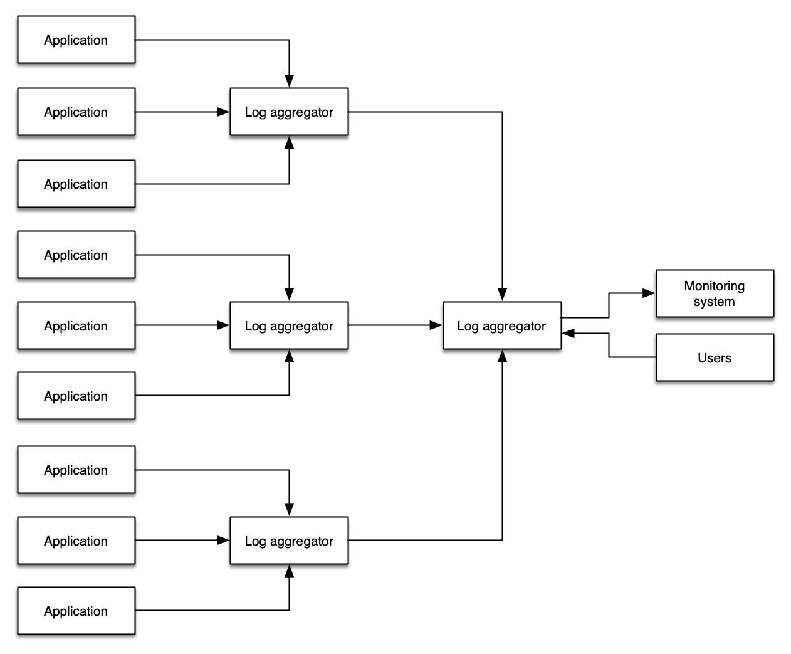

# ログ

ログは、イベントまたはアプリケーションの正常性に関する 1 行以上の詳細を表すメッセージのシリーズで、アプリケーションまたはアプライアンスによって送信されます。通常、ログはファイルに記録されますが、時には分析や集計を実行するコレクタに送信されることもあります。メガバイト/日からテラバイト/時間までのあらゆるボリュームのログデータを生成、取り込み、管理するための多機能なログアグリゲータ、フレームワーク、製品が数多く存在します。

ログは一度に 1 つのアプリケーションから発行され、通常その *1 つのアプリケーション* の範囲に関連しています。ただし、開発者はログを任意の複雑さとニュアンスで作成できます。当社では、ログを[トレース](../../signals/traces)と基本的に異なるシグナルと見なしています。トレースは複数のアプリケーションまたはサービスからのイベントで構成され、レスポンス待ち時間、サービス障害、リクエストパラメータなどのサービス間のコンテキストに関するものです。

ログ内のデータは、一定期間にわたって集計することもできます。たとえば、統計情報(過去 1 分間に処理されたリクエスト数など)である可能性があります。構造化されている可能性もあれば、フリーフォーマットで詳細である可能性もあり、任意の言語で書かれている可能性もあります。

ログの主なユースケースは次のとおりです。

* イベント自体、そのステータスと期間、およびその他の重要な統計情報の記述
* そのイベントに関連するエラーや警告(スタックトレース、タイムアウトなど) 
* アプリケーションの起動、開始、シャットダウンメッセージ

!!! note
	ログは *不変* であることを目的としており、多くのログ管理システムには、ログデータの変更を防止および検出するメカニズムが含まれています。

ログに対する要件は何であれ、特定したベストプラクティスがあります。

## 構造化ログが成功の鍵

多くのシステムは半構造化形式でログを出力します。 たとえば、Apache Web サーバーは、各行が 1 つの Web リクエストに対応するように、このようにログを書き込む場合があります。

	192.168.2.20 - - [28/Jul/2006:10:27:10 -0300] "GET /cgi-bin/try/ HTTP/1.0" 200 3395
	127.0.0.1 - - [28/Jul/2006:10:22:04 -0300] "GET / HTTP/1.0" 200 2216

一方、Java のスタックトレースは、複数行にまたがる 1 つのイベントで、構造化されていない場合があります。

	Exception in thread "main" java.lang.NullPointerException
        at com.example.myproject.Book.getTitle(Book.java:16)
        at com.example.myproject.Author.getBookTitles(Author.java:25)
        at com.example.myproject.Bootstrap.main(Bootstrap.java:14)

Python のエラーログイベントは、次のようになる場合があります。

	Traceback (most recent call last):
	  File "e.py", line 7, in <module>
	    raise TypeError("Again !?!")
	TypeError: Again !?!

これら 3 つの例のうち、人間とログ集約システムの両方で簡単に解析できるのは最初の例だけです。 構造化ログを使用すると、ログデータをすばやく効果的に処理できるため、人間とマシンの両方が即座に探しているものを見つけるために必要なデータが得られます。

最も一般的に理解されているログ形式は JSON で、イベントの各コンポーネントがキー/値のペアとして表されます。 JSON では、上記の Python の例は次のように書き換えることができます。

	{
		"level": "ERROR"
		"file": "e.py",
		"line": 7,
		"error": "TypeError(\"Again !?!\")"
	}

構造化ログを使用すると、データを一つのログシステムから別のログシステムに転送できるようになり、開発が簡素化され、運用診断がより速く(エラーも少なく)行えるようになります。 また、JSON を使用すると、実際のデータとともにログメッセージのスキーマが埋め込まれるため、高度なログ分析システムがメッセージを自動的にインデックス化できるようになります。

</module>

## ログレベルを適切に使用する

ログには、*レベル* を持つものと、一連のイベントから成るものの2種類があります。レベルを持つものは、成功したログ戦略にとって極めて重要なコンポーネントです。ログレベルはフレームワークによって若干異なりますが、概して次の構造に従います。

| レベル | 説明 |
| ----- | ----------- |
| `DEBUG` | アプリケーションのデバッグに最も役立つ詳細な情報イベント。これらは通常、開発者にとって価値があり、非常に詳細です。 |
| `INFO` | アプリケーションの進捗を粗く示す情報メッセージ。 |
| `WARN` | アプリケーションへのリスクを示す、潜在的に有害な状況。これらはアプリケーション内のアラームをトリガーできます。 | 
| `ERROR` | アプリケーションの実行を継続できる可能性のあるエラーイベント。これらは注意が必要なアラームをトリガーする可能性が高いです。 |
| `FATAL` | アプリケーションのアボートを引き起こすと思われる非常に重大なエラーイベント。 |

!!! info
	明示的なレベルを持たない暗黙的なログは、`INFO` と見なされる場合がありますが、この動作はアプリケーションによって異なる場合があります。

その他の一般的なログレベルには `CRITICAL` と `NONE` があり、ニーズ、プログラミング言語、フレームワークによって異なります。`ALL` と `NONE` も一般的ですが、すべてのアプリケーションスタックで見つかるわけではありません。

ログレベルは、環境の健全性についてモニタリングおよび可観測性ソリューションに重要な情報を提供するために不可欠であり、ログデータは論理値を使用してこのデータを簡単に表現できる必要があります。

!!! tip
	`WARN` で大量のデータをログに記録すると、限定的な価値しかないデータでモニタリングシステムが溢れ、メッセージの膨大な量の中で重要なデータを失う可能性があります。

  

!!! success
	標準化されたログレベル戦略を使用することで自動化が容易になり、開発者が問題の根本原因をすばやく特定できるようになります。 

!!! warning
	ログレベルに対する標準的なアプローチがない場合、[ログのフィルタリング](#filter-logs-close-to-the-source) は大きな課題となります。

## ログはできるだけソース近くでフィルタリングする

可能であれば、ログ量をできるだけソース近くで減らしてください。このベストプラクティスを守る理由は次の通りです。

* ログの取り込みには常に時間、コスト、リソースがかかります。 
* ダウンストリームのシステムから機密データ(個人を特定できるデータなど)をフィルタリングすることで、データ漏洩からのリスクエクスポージャーを減らすことができます。
* ダウンストリームのシステムは、データソースと同じ運用上の関心事を持っているとは限りません。 たとえば、アプリケーションからの`INFO`ログは、`CRITICAL`または`FATAL`メッセージを監視する監視およびアラートシステムにとって関心の対象ではない場合があります。
* ログシステムやネットワークが不要なストレスやトラフィックにさらされる必要はありません。

!!! success
	ソース近くでログをフィルタリングすることでコストを下げ、データ露出のリスクを減らし、各コンポーネントを[重要なもの](../../guides/#monitor-what-matters)に集中させることができます。
	
!!! tip
	アーキテクチャによっては、インフラストラクチャ as コード(IaC)を使用して、アプリケーションと環境の両方の変更を1つの操作でデプロイすることをお勧めします。このアプローチにより、アプリケーションと同じ厳格さと扱いでログフィルタパターンをデプロイできます。

## 二重取り込みのアンチパターンを避ける

管理者がしばしば追求するパターンは、すべてのログデータを単一のシステムにコピーし、すべてのログを単一の場所からクエリできるようにすることです。これには手動のワークフロー上のいくつかの利点がありますが、このパターンは追加のコスト、複雑さ、障害点、運用上のオーバーヘッドをもたらします。

  

!!! success
	可能な限り、[ログレベル](#use-log-levels-appropriately)と[ログフィルタリング](#filter-logs-close-to-the-source)の組み合わせを使用して、環境からのログデータの大量転送を避けてください。

!!! info 
	一部の組織やワークロードでは、規制要件を満たしたり、ログを安全な場所に保存したり、否認防止を提供したり、その他の目的を達成するために[ログ出荷](https://en.wikipedia.org/wiki/Log_shipping)が必要です。これはログデータを再取り込む一般的なユースケースです。適切な[ログレベル](#use-log-levels-appropriately)と[ログフィルタリング](#filter-logs-close-to-the-source)の適用は、これらのログアーカイブに入る不要なデータの量を減らす上でも適していることに注意してください。

## ログからメトリックデータを収集する

ログには、収集を待っている[メトリクス](../../signals/metrics/)が含まれています。
自分で書いていない ISV ソリューションやアプリケーションでも、そのログには全体的なワークロードの正常性について意味のある洞察を引き出せる貴重なデータが発行されます。
一般的な例としては以下があります。

* データベースからの遅いクエリ時間  
* Web サーバーからのアップタイム  
* トランザクション処理時間
* 時間経過とともにの `ERROR` または `WARNING` イベントのカウント
* アップグレード可能なパッケージの生のカウント

!!! tip
	このデータは、静的なログファイルにロックされているとあまり役に立ちません。
	ベストプラクティスは、重要なメトリックデータを特定し、それをメトリックシステムにパブリッシュすることで、他のシグナルと相関付けできるようにすることです。

## `stdout` にログ出力

可能な場合は、アプリケーションはファイルやソケットなどの固定の場所ではなく、`stdout` にログ出力する必要があります。これにより、ログ エージェントがあなたの可観測性ソリューションにとって意味のあるルールに基づいて、ログ イベントを収集およびルーティングできるようになります。すべてのアプリケーションで可能というわけではありませんが、これがコンテナ化ワークロードにおけるベスト プラクティスです。 

!!! note
	アプリケーションは、ロギング ソリューションから緩やかに結合された状態を保ちながら、ロギングの実践において汎用的でシンプルである必要がありますが、ログ データの送信には、`stdout` からファイルへのデータ送信のために[ログ コレクター](../../tools/logs/)が必要です。重要な概念は、アプリケーションとビジネス ロジックがロギング インフラストラクチャに依存しないようにすることです。つまり、懸念事項を分離する必要があります。

!!! success
	アプリケーションとログ管理を切り離すことで、コード変更を必要とせずにソリューションを適応および進化させることができ、それによって環境への変更による[ブラスト半径](../../faq/#what-is-a-blast-radius)の可能性を最小限に抑えることができます。
