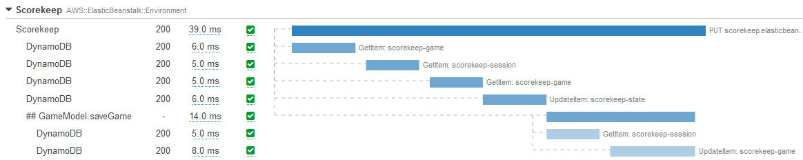
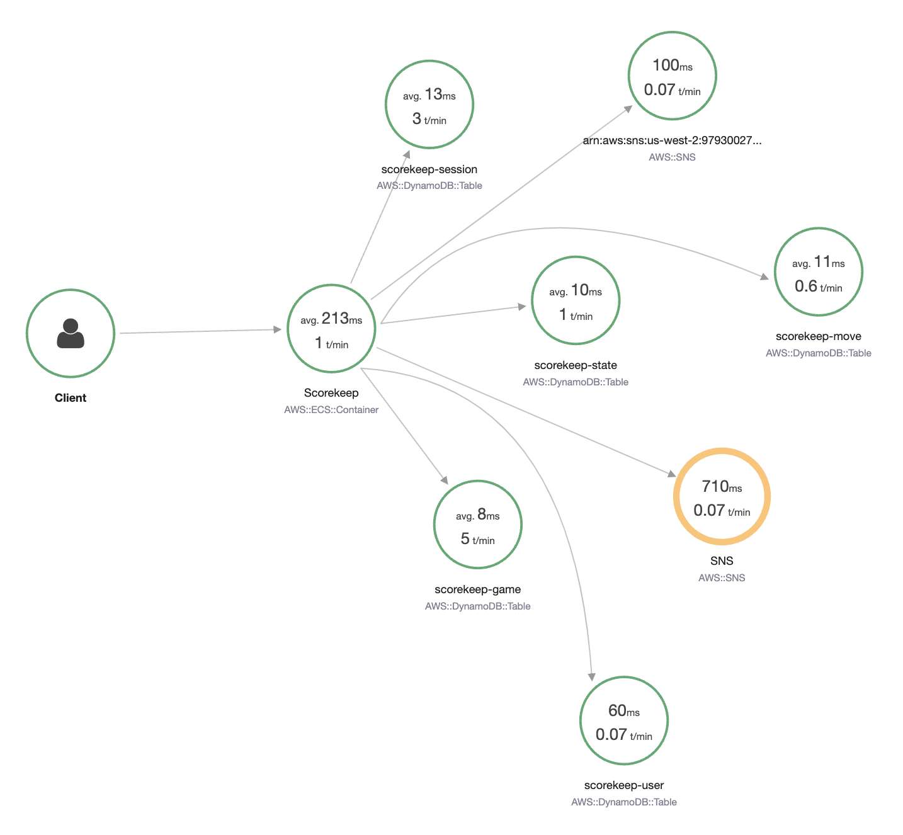

# トレース

トレースは、アプリケーションのさまざまなコンポーネントを通過する要求の全体的な流れを表しています。

ログやメトリクスとは異なり、*トレース* は複数のアプリケーションやサービスからのイベントで構成されており、レスポンス待ち時間、サービス障害、要求パラメータ、メタデータなどのサービス間の接続に関するコンテキストが含まれています。

!!! tip
    [ログ](../../signals/logs/)とトレースの間には概念的な類似点がありますが、トレースはサービス間のコンテキストで考慮されることを意図しているのに対し、ログは通常、単一のサービスまたはアプリケーションの実行に限定されます。

今日の開発者は、モジュール型および分散型アプリケーションの構築に傾倒しています。一部の人はこれらを [サービス指向アーキテクチャ](https://en.wikipedia.org/wiki/Service-oriented_architecture)と呼び、他の人は [マイクロサービス](https://aws.amazon.com/microservices/) と呼ぶでしょう。名称の違いに関わらず、これらの緩やかに結合されたアプリケーションで何か問題が発生した場合、ログやイベントだけを見ても、インシデントの根本原因を追跡するのに十分ではない場合があります。 要求フローを完全に可視化することが不可欠であり、これがトレースが価値をもたらす場面です。 エンドツーエンドの要求フローを描写する一連の因果関係のあるイベントを通じて、トレースはその可視性を高めるのに役立ちます。

トレースは、システムへの要求の流入と流出の基本情報を提供するため、オブザーバビリティの基本的な柱です。

!!! tip
    トレースの一般的なユースケースには、パフォーマンスプロファイリング、本番環境の問題のデバッグ、障害の根本原因分析などがあります。

## すべての統合ポイントにインスツルメンテーションを適用する

ワークロードの機能とコードがすべて1か所にある場合、ソースコードを見ることで、リクエストがさまざまな関数間をどのように渡されるかを簡単に確認できます。システムレベルでは、アプリがどのマシンで実行されているかがわかり、問題が発生した場合は、迅速に根本原因を特定できます。相互に疎結合され、分散型環境で実行されている異なるコンポーネントで構成されるマイクロサービスベースのアーキテクチャでそれを行うことを想像してみてください。相互接続された各リクエストのログを見るために数多くのシステムにログインすることは、不可能ではないにせよ非実用的です。

これは、オブザーバビリティが役立つ場面です。インスツルメンテーションは、そのオブザーバビリティを高める上での重要なステップです。広い意味で、インスツルメンテーションとは、コードを使用してアプリケーション内のイベントを測定することです。

一般的なインスツルメンテーションのアプローチは、システムに入ってくる各リクエストに一意のトレースIDを割り当て、さまざまなコンポーネントを通過しながらそのトレースIDを保持しつつ、追加のメタデータを追加することです。

!!! success
    1つのサービスから別のサービスへの接続は、中央のコレクターにトレースを送信するようインスツルメンテーションする必要があります。このアプローチにより、ワークロードのそうでない場合不透明な側面が可視化されます。
    
!!! success
    自動インスツルメンテーションエージェントやライブラリを使用すると、アプリケーションのインスツルメンテーションは大幅に自動化できます。

## トランザクション時間とステータスは重要なので測定しましょう!

適切に計装されたアプリケーションは、次のようなウォーターフォールグラフの形で表示できるエンドツーエンドのトレースを生成できます。

または、サービスマップとして表示することもできます。

すべてのインタラクションのトランザクション時間とレスポンスコードを測定することが重要です。これにより、全体的な処理時間を計算し、SLA、SLO、ビジネス KPI への準拠性を追跡できます。 

!!! success
    インタラクションのレスポンス時間とステータスコードを理解し記録することで、全体的なリクエストパターンとワークロードの健全性に影響する要因がわかります。

## メタデータ、アノテーション、ラベルが最良のパートナー

トレースは永続化され、一意の ID が割り当てられます。各トレースは、*スパン* または *セグメント*(ツールによって呼び方が異なります)に分解され、リクエストパス内の各ステップが記録されます。スパンは、トレースが対話するエンティティを示し、親トレースと同様に、各スパンには一意の ID とタイムスタンプが割り当てられ、追加のデータやメタデータも含めることができます。この情報は、問題が発生した正確な時間と場所を特定できるため、デバッグに役立ちます。

これを実際の例で説明すると分かりやすいでしょう。電子商取引アプリケーションは、認証、認可、出荷、在庫、支払い処理、履行、商品検索、推奨など、多くのドメインに分割される場合があります。ただし、これらの相互接続されたすべてのドメインからのトレースを検索する代わりに、顧客 ID でトレースにラベルを付けることで、この1人のユーザーに固有の対話のみを検索できます。これにより、運用上の問題を診断するときに検索をすぐに絞り込むことができます。 

!!! success
    ベンダーによって命名規則は異なる可能性がありますが、各トレースにメタデータ、ラベル、アノテーションを追加でき、これらはワークロード全体で検索できます。これを追加するにはコードが必要ですが、ワークロードの可観測性が大幅に向上します。

!!! warning
    トレースはログではないので、トレースに含めるメタデータを控えめにしてください。また、トレースデータはサンプリングレートが高くても、フォレンジックや監査を目的としたものではありません。
