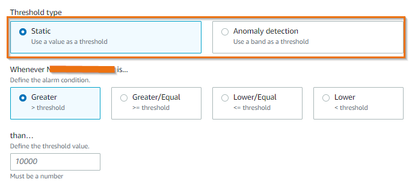

# アラーム

Amazon CloudWatch アラームを使用すると、CloudWatch メトリクスとログに対してしきい値を定義し、CloudWatch で構成されているルールに基づいて通知を受信できます。

**CloudWatch メトリクスのアラーム:**

CloudWatch アラームを使用すると、CloudWatch メトリクスに対してしきい値を定義し、メトリクスが範囲外に出たときに通知を受信できます。各メトリクスは複数のアラームをトリガーでき、各アラームには多くのアクションを関連付けることができます。CloudWatch メトリクスに基づいてメトリックアラームを設定するには、2 つの異なる方法があります。

1. **静的しきい値**: 静的しきい値は、メトリクスが違反してはならない厳密な制限を表します。通常の運用中の動作を理解するために、上限と下限などの静的しきい値の範囲を定義する必要があります。メトリクス値が静的しきい値の下または上を下回った場合、CloudWatch でアラームを生成するように構成できます。

2. **異常検知**: 異常検知は、一般にデータの大部分から大きく逸脱し、正常な動作のよく定義された概念に準拠していないまれなアイテム、イベント、観測結果として識別されます。CloudWatch の異常検知は、過去のメトリクスデータを分析して、期待値のモデルを作成します。期待値には、メトリクスの典型的な時間帯、日次、週次のパターンが考慮されます。必要に応じて各メトリクスに異常検知を適用でき、CloudWatch は機械学習アルゴリズムを適用して、有効になっている各メトリクスの上限と下限を定義し、メトリクスが期待値の範囲外に出た場合にのみアラームを生成します。

!!! tip
	静的しきい値は、ワークロードの特定のパフォーマンスのブレークポイントや、インフラストラクチャコンポーネントの絶対制限など、メトリクスの確固たる理解がある場合に最適です。
	
!!! success
	特定のメトリクスの時間経過に伴うパフォーマンスが不明な場合、またはメトリクス値が負荷テストや異常トラフィック下で以前に観測されなかった場合は、アラームで異常検知モデルを使用します。

以下の説明に従って、CloudWatch での静的および異常ベースのアラームの設定方法を確認できます。

[静的しきい値アラーム](https://catalog.us-east-1.prod.workshops.aws/workshops/31676d37-bbe9-4992-9cd1-ceae13c5116c/en-US/alarms/mericalarm)

[CloudWatch 異常検知ベースのアラーム](https://catalog.us-east-1.prod.workshops.aws/workshops/31676d37-bbe9-4992-9cd1-ceae13c5116c/en-US/alarms/adalarm)

!!! success
	アラーム疲労やアラームの数によるノイズを減らすには、アラームを構成するための 2 つの高度な方法があります。

	1. **複合アラーム**: 複合アラームには、他の作成済みアラームのアラーム状態を考慮に入れたルール式が含まれます。複合アラームは、ルールのすべての条件が満たされた場合にのみ `ALARM` 状態になります。複合アラームのルール式で指定されるアラームには、メトリックアラームと他の複合アラームを含めることができます。複合アラームは、[集約によるアラーム疲労との戦い](../../signals/alarms/#fight-alarm-fatigue-with-aggregation) に役立ちます。

	2. **メトリック数式に基づくアラーム**: メトリック数式を使用して、より意味のある KPI とそのアラームを構築できます。複数のメトリクスを組み合わせて、統合利用率メトリクスを作成し、それらにアラームを設定できます。

以下の説明は、複合アラームとメトリック数式ベースのアラームの設定方法をガイドします。

[複合アラーム](https://catalog.us-east-1.prod.workshops.aws/workshops/31676d37-bbe9-4992-9cd1-ceae13c5116c/en-US/alarms/compositealarm)

[メトリック数式アラーム](https://aws.amazon.com/blogs/mt/create-a-metric-math-alarm-using-amazon-cloudwatch/)

**CloudWatch ログのアラーム**

CloudWatch Logs に基づいてアラームを作成できます。CloudWatch Logs は CloudWatch メトリックフィルタを使用します。メトリックフィルタはログデータをグラフ化したりアラームを設定したりできる数値の CloudWatch メトリクスに変換します。メトリクスを設定したら、CloudWatch ログから生成された CloudWatch メトリクスに対して静的または異常ベースのアラームを使用できます。

CloudWatch ログの[メトリックフィルタの設定](https://aws.amazon.com/blogs/mt/quantify-custom-application-metrics-with-amazon-cloudwatch-logs-and-metric-filters/)の例を参照できます。
