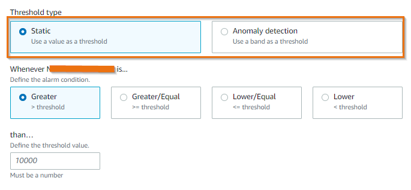

# Alarms

Amazon CloudWatch alarms allows you to define thresholds around CloudWatch Metrics and Logs and receive notifications based on the rules configured in the CloudWatch.  

**Alarms on CloudWatch metrics:**

CloudWatch alarms allows you to define thresholds on CloudWatch metrics and receive notifications when the metrics fall outside range. Each metric can trigger multiple alarms, and each alarm can have many actions associated with it. There are two different ways you could setup metric alarms based on CloudWatch metrics.

1. **Static threshold**: A static threshold represents a hard limit that the metric should not violate. You must define the range for the static threshold like upper limit and the lower limit to understand the behaviour during the normal operations.  If the metric value falls below or above the static threshold you may configure the CloudWatch to generate the alarm.

2. **Anomaly detection**: Anomaly detection is generally identified as rare items, events or observations which deviate significantly from the majority of the data and do not conform to a well-defined notion of normal behaviour.  CloudWatch anomaly detection analyzes past metric data and creates a model of expected values. The expected values take into account the typical hourly, daily, and weekly patterns in the metric.  You can apply the anomaly detection for each metric as required and CloudWatch applies a machine-learning algorithm to define the upper limit and lower limit for each of the enabled metrics and generate an alarm only when the metrics fall out of the expected values. 

!!! tip
	Static thresholds are best used for metrics that you have a firm understanding of, such as identified performance breakpoints in your workload, or absolute limits on infrastructure components.

!!! success
	Use an anomaly detection model with your alarms when you do not have visibility into the performance of a particular metric over time, or when the metric value has not been observed under load-testing or anomalous traffic previously.

You can follow the instructions below on how to setup of Static and Anomaly based alarms in CloudWatch.

[Static threshold alarms](https://catalog.us-east-1.prod.workshops.aws/workshops/31676d37-bbe9-4992-9cd1-ceae13c5116c/en-US/alarms/mericalarm)

[CloudWatch anomaly Detection based alarms](https://catalog.us-east-1.prod.workshops.aws/workshops/31676d37-bbe9-4992-9cd1-ceae13c5116c/en-US/alarms/adalarm)

!!! success
	To reduce the alarm fatigue or reduce the noise from the number of alarms generated, you have two advanced methods to configure the alarms:

	1. **Composite alarms**: A composite alarm includes a rule expression that takes into account the alarm states of other alarms that have been created. The composite alarm goes into `ALARM` state only if all conditions of the rule are met. The alarms specified in a composite alarm's rule expression can include metric alarms and other composite alarms. Composite alarms help to [fight alarm fatigue with aggregation](../../signals/alarms/#fight-alarm-fatigue-with-aggregation).

	2. **Metric math based alarms**: Metric math expressions can be used to build more meaningful KPIs and alarms on them. You can combine multiple metrics and create a combined utilization metric and alarm on them.

These instructions below guide you on how to setup of Composite alarms and Metric math based alarms.

[Composite Alarms](https://catalog.us-east-1.prod.workshops.aws/workshops/31676d37-bbe9-4992-9cd1-ceae13c5116c/en-US/alarms/compositealarm)

[Metric Math alarms](https://aws.amazon.com/blogs/mt/create-a-metric-math-alarm-using-amazon-cloudwatch/)

**Alarms on CloudWatch Logs**

You can create alarms based on the CloudWatch Logs uses CloudWatch Metric filter. Metric filters turn the log data into numerical CloudWatch metrics that you can graph or set an alarm on. Once you have setup the metrics you could use either the static or anomaly based alarms on the CloudWatch metrics generated from the CloudWatch Logs.

You can find an example on how to setup [metric filter on CloudWatch logs](https://aws.amazon.com/blogs/mt/quantify-custom-application-metrics-with-amazon-cloudwatch-logs-and-metric-filters/).

