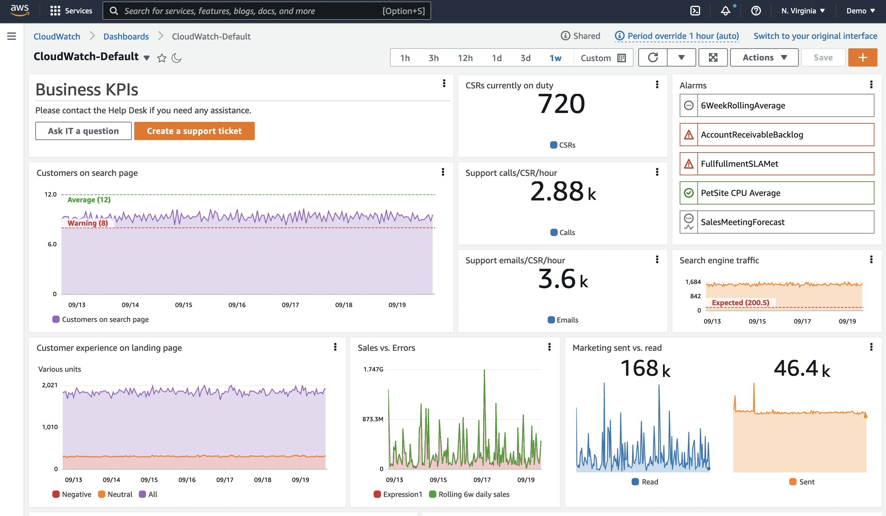
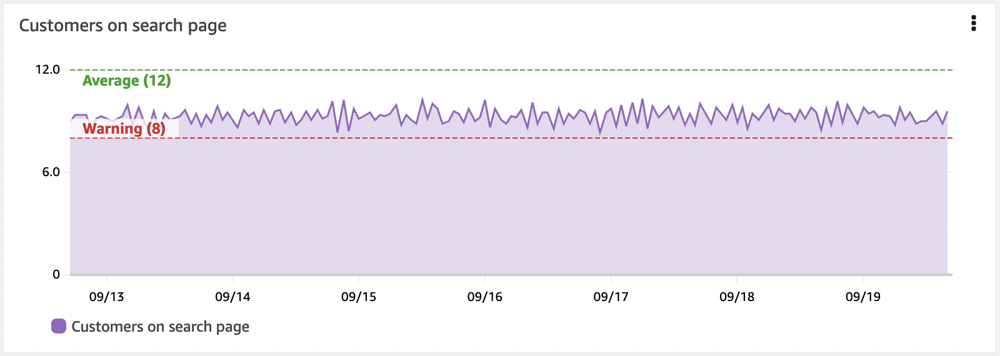

# ダッシュボード

ダッシュボードは、オブザーバビリティソリューションの重要な部分です。データのキュレーションされたビジュアライゼーションを生成できます。データの履歴を見たり、関連する他のデータと並べて見たりできます。また、コンテキストを提供することもできます。全体像を理解するのに役立ちます。

多くの場合、人々はデータを収集し、アラームを作成し、そこで止まってしまいます。しかし、アラームはある時点のみを示すだけで、通常は単一のメトリクスや少量のデータに対してのみ機能します。ダッシュボードは時間経過とともに動作を確認するのに役立ちます。



## 実践的な例:高 CPU 用のアラームを考える

インスタンスやアプリケーションの CPU 使用率が望ましい値よりも高くなっていることがわかっています。
対応が必要なのか、そしてその緊急性はどの程度なのか? 判断を助けてくれるものは何か?

* このインスタンスやアプリケーションにとって正常な CPU 使用率とは?
* スパイクなのか、CPU 使用率が徐々に上昇しているトレンドなのか?
* パフォーマンスに影響しているか? まだ影響が出ていないとして、いつ影響が出始めるか?
* こうしたことは定期的に起こるのか? そして通常は自動的に回復するのか?

### データの履歴を確認する

ここで、CPU の時系列チャートを含むダッシュボードを考えてみましょう。この単一のメトリクスからでも、これがスパイクなのか、上昇傾向なのかがわかります。また、上昇の速度もわかるので、対応の優先順位を決定することができます。

### ワークフローへの影響を確認する

しかし、このマシンは何をしているのでしょうか? 全体的なコンテキストの中で、どの程度重要なのでしょうか? ここで、レスポンスタイム、スループット、エラー、その他の測定値など、ワークフローのパフォーマンスの視覚化を追加してみましょう。これにより、高い CPU 使用率が、このインスタンスがサポートしているワークフローやユーザーに影響を及ぼしているかどうかを確認できます。

### アラームの履歴を確認する

過去1ヶ月間にアラームが発生した頻度を示す視覚化を追加し、さらに過去を遡ってこの発生が定期的なものかどうかを確認することを検討してください。
例えば、バックアップジョブがスパイクを引き起こしているのでしょうか。
再発のパターンを知ることで、根本的な問題を理解し、アラームの再発を完全に停止するための長期的な判断を下すことができます。

### コンテキストを追加する

最後に、ダッシュボードにコンテキストを追加します。このダッシュボードが存在する理由の簡単な説明、関連するワークフロー、問題が発生したときの対処法、ドキュメントへのリンク、および連絡先を含めます。

!!! info
    これで*ストーリー*ができあがりました。これにより、ダッシュボードのユーザーは発生していることを見て、影響を理解し、どのアクションをどの程度の緊急性を持って実行するかという、データに基づいた適切な意思決定ができるようになります。

### すべてを一度に可視化しようとしない

アラーム疲労についてよく話します。明確なアクションと優先順位がないアラームが多すぎると、チームが過負荷になり非効率を招くことがあります。アラームは、あなたにとって重要でアクション可能なものにする必要があります。

ダッシュボードはここでより柔軟です。同じように注意を要求するわけではないので、まだ重要かどうか確信が持てないものや、調査を支援するものを可視化するためのより大きな自由度があります。それでも、しすぎは禁物です! 良いことでも過ぎたるは及ばざるがごとしです。

ダッシュボードは、あなたにとって重要なものの全体像を提供する必要があります。インジェストするデータを決定するのと同じように、ダッシュボードにとって何が重要かを考える必要があります。
ダッシュボードの場合、次のことを考えてください。

* 誰がこれを見るのか
    * その人のバックグラウンドと知識は何か 
	* どのくらいのコンテキストが必要か
* どのような質問に答えようとしているのか
* このデータを見た結果として、どのようなアクションを取るのか

!!! tip
    ダッシュボードのストーリーをどうするべきか、どのくらい含めるべきかがわからないことがよくあります。では、ダッシュボードの設計をどこから始められるでしょうか。*KPI駆動*か*インシデント駆動*の2つの方法を見ていきましょう。

#### ダッシュボードの設計: KPI 主導

これを理解する1つの方法は、KPI から逆算することです。これは通常、非常にユーザー主導のアプローチです。
[レイアウト](#layout) の場合、通常、上から下に作業を進め、ダッシュボードを下に移動したり、下位のダッシュボードに移動したりするにつれて、より詳細な情報が得られます。

まず、**KPI を理解する**ことが大切です。それらの意味するところを理解することで、どのように可視化したいかを決定するのに役立ちます。
多くの KPI は単一の数字として示されます。たとえば、特定のワークフローを正常に完了した顧客の割合と、その完了に要した時間はどうか。しかし、どの程度の期間で考えるべきか。1週間の平均を取れば KPI を満たしていても、その期間内で基準を超えている短い期間がある可能性があります。こうした違反はあなたにとって重要なのでしょうか。顧客体験に影響を与えているでしょうか。影響があるならば、異なる期間と時系列チャートを使って KPI を確認することを検討するかもしれません。おそらく詳細を見る必要のない人もいるでしょうから、KPI の内訳を別のダッシュボードに移し、別の対象者向けにすることもできます。

次に、**それらの KPI に影響を与えるものは何か** を考えましょう。それらのアクションが発生するためには、どのようなワークフローが動作している必要があるでしょうか。これらを測定できますか。

主要コンポーネントを特定し、それらのパフォーマンスの可視化を追加します。KPI が基準値を超えたときに、ワークフローのどこで主な影響が生じているかをすぐに確認できる必要があります。

さらに下のレベルまで掘り下げることもできます。これらのワークフローのパフォーマンスに影響を与えるものは何か。対象者を考慮しながら、掘り下げる深さを決定してください。

注文数を KPI とする EC サイトを例に考えてみましょう。
注文を行うために、ユーザーは次のアクションを実行できる必要があります: 商品の検索、カートへの追加、配送詳細の入力、注文の支払い。
これらの各ワークフローについて、主要コンポーネントが正常に機能していることを確認することを検討できます。たとえば、RUM や Synthetics を使用してアクションの成功とユーザーが問題の影響を受けているかどうかのデータを取得します。スループット、レイテンシ、失敗したアクションの割合などの測定を行い、各アクションのパフォーマンスが期待どおりであるかを確認できます。基盤となるインフラストラクチャの測定を行い、パフォーマンスに影響を与えているものを確認することもできます。

ただし、すべての情報を同じダッシュボードに置く必要はありません。ここでも、対象者を考慮してください。 

!!! success
    ドリルダウンを可能にし、適切なコンテキストを適切なユーザーに提供するために、ダッシュボードのレイヤーを作成します。

#### ダッシュボードの設計: インシデント駆動

多くの人にとって、インシデントの解決はオブザーバビリティの主要なドライバーです。ユーザーやオブザーバビリティアラームから問題が通知され、迅速に修正を見つけ、潜在的な問題の根本原因を特定する必要があります。

!!! success
    最近のインシデントから始めましょう。共通のパターンはありますか? 会社にとって最も影響の大きいものはどれですか? 繰り返し発生するものはどれですか?

この場合、重大度を理解し、根本原因を特定し、インシデントを修正しようとしている人々のためのダッシュボードを設計しています。 

特定のインシデントを思い出してください。

* 報告されたインシデントをどのように検証しましたか?
    * 何をチェックしましたか? エンドポイント? エラー?
* 影響と優先順位をどのように理解しましたか?
* 問題の原因を何を見て調べましたか?

Application Performance Monitoring (APM) は、エンドポイントとワークフローの定期的なベースラインとテストのために [Synthetics](../../tools/synthetics/) を使用し、実際の顧客体験のために [RUM](../../tools/rum/) を使用することでここで役立ちます。 このデータを使用して、影響を受けるワークフローとその程度をすばやく視覚化できます。

時間経過とともにエラー数を示す視覚化や、上位 # エラーを示す視覚化は、正しい領域に焦点を当て、エラーの詳細を示すのに役立ちます。 ここでログデータを使用していることが多く、エラーコードと理由の動的な視覚化をしています。

可能な限り早く詳細に辿り着くために、フィルタリングやドリルダウンのようなものを持つことが非常に役立ちます。 たとえば、詳細に近づくためにフィルタリングできる単一のダッシュボードを持つなど、過度なオーバーヘッドなしにこれを実装する方法を考えてください。

### レイアウト

ダッシュボードのレイアウトも重要です。

!!! success
    通常、ユーザーが最も重要だと考える視覚化は、ページの左上、あるいはページの自然な*始まり*に合わせて配置することが多いです。

レイアウトを利用してストーリーを伝えることができます。例えば、上から下へのレイアウトを使い、スクロールを下へ移動させるほど詳細な情報が表示される、といったことが考えられます。あるいは、左右の表示が有用で、左側に上位サービス、右に移動するほど依存関係が表示される、といったこともできるでしょう。

### 動的コンテンツの作成

多くのワークロードは需要に応じて成長したり縮小したりするように設計されているため、ダッシュボードはこれを考慮する必要があります。 
たとえば、インスタンスをオートスケーリンググループに置いている場合、特定の負荷に達すると追加のインスタンスが追加されます。

!!! success
    特定のインスタンスからのデータを示すダッシュボードは、それらの新しいインスタンスからのデータが表示されることはありません。 
    リソースとデータにメタデータを追加することで、特定のメタデータ値を持つすべてのインスタンスをキャプチャする視覚化を作成できます。 
    このようにして、実際の状態を反映できます。

動的な視覚化の別の例は、現在発生している上位10のエラーと、最近の履歴でのそれらの動作を見つけることができることかもしれません。 
どのエラーが発生するかを知らずに、テーブルやチャートを表示できる必要があります。

### 原因よりもまず症状を考える

症状を観察するとき、ユーザーやシステムへの影響を考えています。多くの根本的な原因が同じ症状を引き起こす可能性があります。これにより、未知の問題を含む、より多くの問題を把握できます。原因を理解するにつれて、下位レベルのダッシュボードは、これらの問題を迅速に診断および修正するのに役立つように、より具体的になる場合があります。

!!! tip
    先週ユーザーに影響を与えた特定の JavaScript エラーを記録するのではなく、*ワークフローへの影響*を記録し、最近の履歴での JavaScript エラーの上位カウントを示すか、最近の履歴で劇的に増加したものを示します。

### 上位/下位 N の使用

ほとんどの場合、同時に*すべての*運用メトリクスを可視化する必要はありません。 これは大規模な EC2 インスタンスのフリートが良い例です。 数百台のサーバーから成るファーム全体のディスク IOPS や CPU 使用率を同時に表示する必要や価値はありません。 これは、メトリクスを掘り下げようとするのに、最高(または最低)のパフォーマンスのリソースを見る時間を超えて費やしてしまうというアンチパターンを生み出します。

!!! success
    ダッシュボードを使用して、任意のメトリクスの上位10個または20個を表示し、これが明らかにする[症状](#think-about-symptoms-first-over-causes)に焦点を当ててください。

[CloudWatch メトリクス](../../tools/metrics/) を使用すると、任意の時系列の上位 N を検索できます。 たとえば、次のクエリは、CPU 使用率が最も高い上位 20 の EC2 インスタンスを返します。

```
SORT(SEARCH('{AWS/EC2,InstanceId} MetricName="CPUUtilization"', 'Average', 300), SUM, DESC, 10)
```

このアプローチ、または[CloudWatch メトリックインサイト](https://docs.aws.amazon.com/AmazonCloudWatch/latest/monitoring/query_with_cloudwatch-metrics-insights.html)で類似のアプローチを使用して、ダッシュボードの上位または下位のパフォーマンスメトリクスを特定します。

### しきい値を使用した KPI の視覚的表示

KPI には警告やエラーのしきい値を設定する必要があり、ダッシュボードではこれを水平アノテーションを使用して表示できます。これはウィジェット上に高水位点として表示されます。これを視覚的に表示することで、ビジネスの成果やインフラストラクチャが危険な状態にある場合に、人間のオペレーターに事前警告を出すことができます。



!!! success
    水平アノテーションは、完成度の高いダッシュボードの重要な部分です。

### コンテキストの重要性

人はデータを誤解しやすいものです。背景や現在のコンテキストがデータの見方に影響を与えます。

だから、ダッシュボード内に*テキスト*を含めることを確認してください。このデータは何のためのものなのか、誰のためのものなのか。それは何を意味しているのか。アプリケーションのドキュメントへのリンク、サポート担当者、トラブルシューティングドキュメントへのリンクを含めてください。テキストディスプレイを使用してダッシュボードディスプレイを分割することもできます。左右のコンテキストを設定するために左側に配置します。垂直にダッシュボードを分割するために全横ディスプレイとして使用します。  

!!! success
    IT サポート、オンコール運用担当者、ビジネスオーナーへの連絡先があると、イシューが発生したときに支援を得られるパスがチームに与えられます。

!!! tip
    ダッシュボードへのチケットシステムへのハイパーリンクは、非常に有用な追加機能です。
