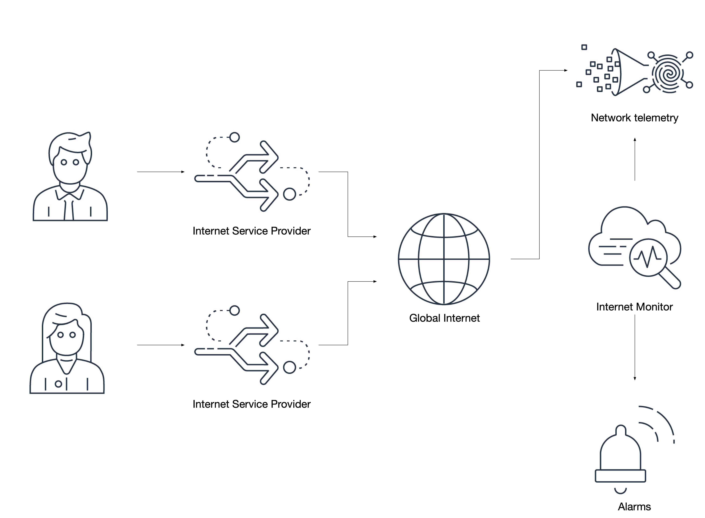
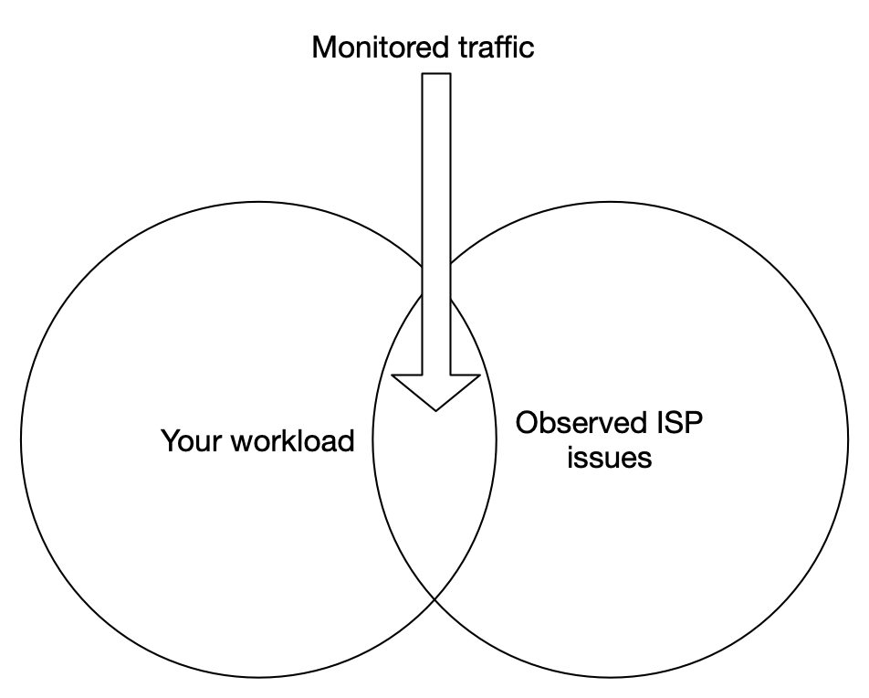
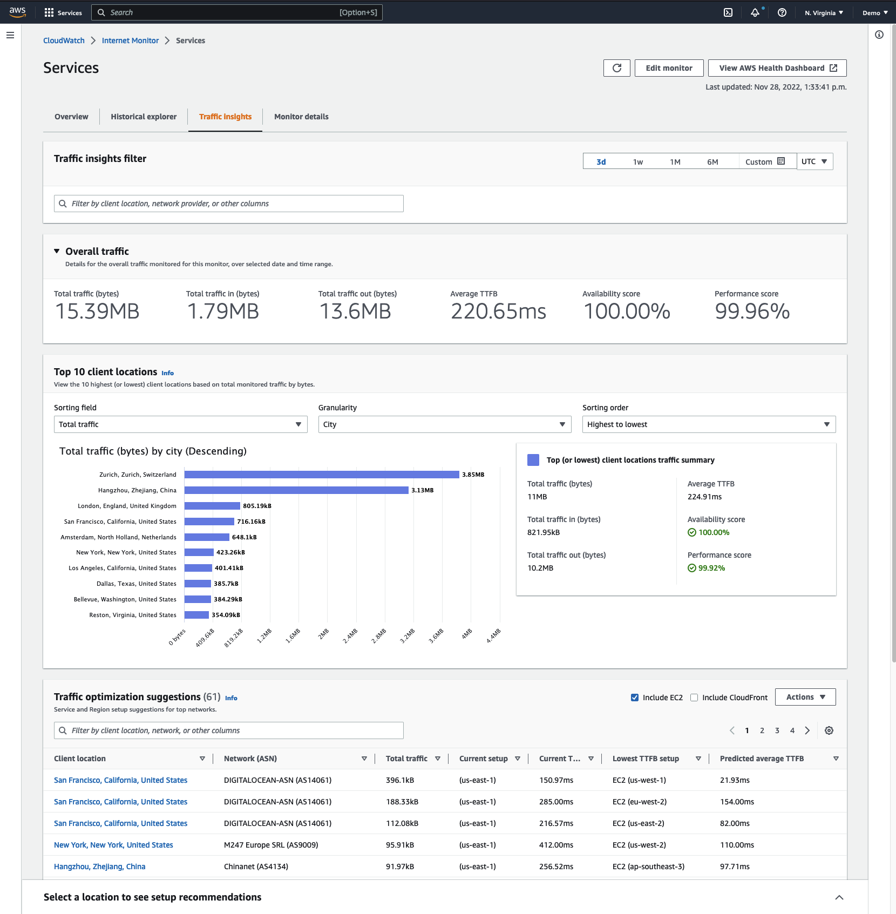

# インターネットモニター

!!! warning
	この記事を書いている時点では、[インターネットモニター](https://aws.amazon.com/blogs/aws/cloudwatch-internet-monitor-end-to-end-visibility-into-internet-performance-for-your-applications/) は CloudWatch コンソールで **プレビュー** 版として利用できます。 一般提供時の機能範囲は、現在体験しているものから変更される可能性があります。

[ワークロードの全ティアからテレメトリを収集](../../guides/#collect-telemetry-from-all-tiers-of-your-workload) することはベストプラクティスであり、課題となりえる点でもあります。 しかし、ワークロードのティアとは何でしょうか。 ある人にとっては、Web、アプリケーション、データベースのサーバーがティアに相当するかもしれません。 また、ワークロードをフロントエンドとバックエンドの観点から見る人もいます。 そして、Web アプリケーションを運用している人は、[リアルユーザーモニタリング](../../tools/rum)(RUM) を使用して、エンドユーザーから見たこれらのアプリケーションの正常性を観察することができます。

しかし、クライアントとデータセンターまたはクラウドサービスプロバイダー間のトラフィックはどうでしょうか。 そして、Web ページとして提供されず、したがって RUM を使用できないアプリケーションはどうでしょうか。



インターネットモニターはネットワークレベルで機能し、観測されたトラフィックの正常性を [AWS が保有するインターネットに関する知見](https://docs.aws.amazon.com/AmazonCloudWatch/latest/monitoring/CloudWatch-IM-inside-internet-monitor.html) と照合して評価します。 要するに、パフォーマンスまたは可用性の問題を抱えるインターネットサービスプロバイダー (ISP) が **存在し**、アプリケーションのトラフィックがクライアント/サーバー間の通信にこの ISP を使用している場合、インターネットモニターはワークロードへのこの影響について事前に通知できます。 さらに、選択したホスティングリージョンと [CloudFront](https://aws.amazon.com/cloudfront/) をコンテンツデリバリーネットワーク[^1] として使用しているかどうかに基づいて、推奨事項を提示できます。 

!!! tip
	インターネットモニターは、ワークロードが通過するネットワークからのトラフィックのみを評価します。 たとえば、別の国の ISP に問題が発生していても、ユーザーがそのキャリアを使用していない場合、その問題の可視性は得られません。

## インターネットを介して通信するアプリケーションのモニターを作成する

Internet Monitor の動作は、CloudFront ディストリビューションや VPC への影響を受けた ISP からのトラフィックを監視することです。これにより、ビジネス上の問題への対処として、アプリケーションの動作、ルーティング、ユーザーへの通知に関する意思決定を行うことができます。これらの問題は、コントロールの及ばないネットワークの問題が原因で発生します。



!!! success
	インターネットを介して通信するトラフィックを監視するモニターのみを作成してください。プライベートネットワーク([RFC1918](https://www.arin.net/reference/research/statistics/address_filters/))内の 2 つのホスト間などのプライベートトラフィックは、Internet Monitor を使用して監視できません。
	
!!! success
	該当する場合は、モバイルアプリケーションからのトラフィックを優先してください。プロバイダー間をローミングしたり、地理的に離れた場所にいるお客様は、把握しておくべき異なる、予期しない体験をする可能性があります。

## EventBridge と CloudWatch を通じたアクションの有効化

観測された問題は、ソースが `aws.internetmonitor` として識別される[スキーマ](https://docs.aws.amazon.com/AmazonCloudWatch/latest/monitoring/CloudWatch-IM-EventBridge-integration.html)を使用して [EventBridge](https://aws.amazon.com/eventbridge/) を介して公開されます。EventBridge を使用して、チケット管理システムで自動的に問題を作成したり、サポートチームに通知したり、あるシナリオを緩和するためにワークロードを変更する自動化をトリガーしたりできます。

```json
{
  "source": ["aws.internetmonitor"]
}
```

同様に、観測された都市、国、メトロ、サブディビジョンの詳細なトラフィック情報が [CloudWatch Logs](../../tools/logs) で利用できます。これにより、ローカルの問題について影響を受けるお客様に事前に通知するための、非常にターゲットを絞ったアクションを作成できます。単一のプロバイダーの国レベルの観測結果の例を次に示します。

```json
{
    "version": 1,
    "timestamp": 1669659900,
    "clientLocation": {
        "latitude": 0,
        "longitude": 0,
        "country": "United States",
        "subdivision": "",
        "metro": "",
        "city": "",
        "countryCode": "US",
        "subdivisionCode": "",
        "asn": 00000,
        "networkName": "MY-AWESOME-ASN"
    },
    "serviceLocation": "us-east-1",
    "percentageOfTotalTraffic": 0.36,
    "bytesIn": 23,
    "bytesOut": 0,
    "clientConnectionCount": 0,
    "internetHealth": {
        "availability": {
            "experienceScore": 100,
            "percentageOfTotalTrafficImpacted": 0,
            "percentageOfClientLocationImpacted": 0
        },
        "performance": {
            "experienceScore": 100,
            "percentageOfTotalTrafficImpacted": 0,
            "percentageOfClientLocationImpacted": 0,
            "roundTripTime": {
                "p50": 71,
                "p90": 72,
                "p95": 73
            }
        }
    },
    "trafficInsights": {
        "timeToFirstByte": {
            "currentExperience": {
                "serviceName": "VPC",
                "serviceLocation": "us-east-1",
                "value": 48
            },
            "ec2": {
                "serviceName": "EC2",
                "serviceLocation": "us-east-1",
                "value": 48
            }
        }
    }
}
```

!!! success
	`percentageOfTotalTraffic` などの値は、お客様がワークロードにアクセスする場所についての強力な洞察を明らかにすることができ、高度な分析に使用できます。
	
!!! warning
	Internet Monitor によって作成されたロググループには、デフォルトで*期限切れにならない*保持期間が設定されていることに注意してください。AWS はお客様の同意なしにデータを削除しないため、ニーズに合った保持期間を設定する必要があります。
	
!!! success
	各モニターは少なくとも 10 個の個別の CloudWatch メトリクスを作成します。これらは、他の運用メトリクスと同様に[アラーム](../../tools/alarms)の作成に使用する必要があります。

## トラフィック最適化の提案を利用する

Internet Monitor には、ワークロードを最適な場所に配置することで、最高の顧客体験を実現できるようにアドバイスしてくれるトラフィック最適化の提案機能があります。グローバルなワークロードやグローバルな顧客を対象とする場合、この機能は特に価値があります。



!!! success
	トラフィック最適化の提案ビューの現在の TTFB 値、予測 TTFB 値、最低 TTFB 値に注意を払ってください。これらは、そうでない場合観測が難しい、潜在的に不良なエンドユーザー体験を示している可能性があります。
	
[^1]: この新機能についてのローンチブログは [https://aws.amazon.com/blogs/aws/cloudwatch-internet-monitor-end-to-end-visibility-into-internet-performance-for-your-applications/](https://aws.amazon.com/blogs/aws/cloudwatch-internet-monitor-end-to-end-visibility-into-internet-performance-for-your-applications/) を参照してください。
