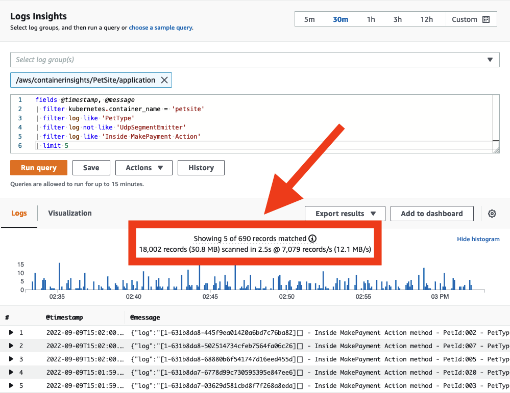

# ログ記録

ログ記録ツールの選択は、データ送信、フィルタリング、保持、キャプチャ、およびデータを生成するアプリケーションとの統合に関する要件によって異なります。
Amazon Web Services を使用してオブザーバビリティを実現する場合(オンプレミスまたは他のクラウド環境でホストしているかどうかに関係なく)、[CloudWatch エージェント](https://docs.aws.amazon.com/ja_jp/AmazonCloudWatch/latest/monitoring/Install-CloudWatch-Agent.html) や [Fluentd](https://www.fluentd.org/) などのツールを利用して、分析のためのログデータを出力できます。

ここでは、ログ記録のための CloudWatch エージェントの実装に関するベストプラクティスと、AWS コンソールまたは API での CloudWatch Logs の使用について詳しく説明します。

!!! info
	CloudWatch エージェントは、[メトリクスデータ](../../signals/metrics/) を CloudWatch に配信するためにも使用できます。実装の詳細については、[メトリクス](../../tools/metrics/) ページを参照してください。

## CloudWatch エージェントによるログの収集

### 転送

[クラウドファーストのアプローチ](../../faq#what-is-a-cloud-first-approach)でオブザーバビリティを実現する場合、原則として、マシンにログインしてログを取得する必要がある場合は、アンチパターンが存在していることになります。ワークロードは、ログ分析システムに対して、近リアルタイムで自身のログデータをエミットする必要があります。そして、その送信と元のイベント間のレイテンシは、ワークロードに障害が発生した場合に、タイムスタンプ情報が失われる可能性を表しています。

アーキテクトとして、許容可能なログデータの損失量を判断し、それに合わせて CloudWatch エージェントの [`force_flush_interval`](https://docs.aws.amazon.com/AmazonCloudWatch/latest/monitoring/CloudWatch-Agent-Configuration-File-Details.html#CloudWatch-Agent-Configuration-File-Logssection) を調整する必要があります。

`force_flush_interval` は、バッファサイズに達した場合を除き、エージェントに一定の間隔でログデータをデータプレーンに送信するよう指示します。その場合は、すべてのバッファされたログが直ちに送信されます。

!!! tip
	エッジデバイスは、低レイテンシーの AWS 内ワークロードとは要件が大きく異なる場合があり、`force_flush_interval` の設定をより長くする必要があるでしょう。例えば、低帯域幅のインターネット接続を使用している IoT デバイスの場合、ログのフラッシュは 15 分ごとに実行するだけで十分な場合があります。

!!! success
	コンテナ化されたステートレスなワークロードや、EC2 フリートは、ログフラッシュの要件に特に敏感である可能性があります。いつでもスケールインできるステートレスな Kubernetes アプリケーションや EC2 フリートを考えてみましょう。これらのリソースが突然終了したときにログの損失が発生する可能性があり、将来的にはそれらからログを抽出する方法がなくなります。こうしたシナリオの場合、標準の `force_flush_interval` が通常適していますが、必要に応じて低減することもできます。

### ロググループ

CloudWatch Logs では、アプリケーションに論理的に適用されるログのコレクションは、単一の[ロググループ](https://docs.aws.amazon.com/ja_jp/AmazonCloudWatch/latest/logs/CloudWatchLogsConcepts.html)に配信する必要があります。そのロググループ内で、ログストリームを作成するソースシステム間で*共通性*が欲しいです。

LAMP スタックを考えてみましょう。Apache、MySQL、PHP アプリケーション、ホスティング Linux オペレーティングシステムからのログは、それぞれ別個のロググループに属します。

このグループ化は重要で、同じ保持期間、暗号化キー、メトリックフィルター、サブスクリプションフィルター、Contributor Insights ルールをグループで扱えます。

!!! success
	ロググループ内のログストリーム数に制限はありません。アプリケーションのログ全体を、CloudWatch Logs Insights のクエリー 1 つで検索できます。Kubernetes サービスの各 Pod や、EC2 フリートの各インスタンス用に個別のログストリームを用意するのが一般的なパターンです。
	
!!! success
	ロググループのデフォルトの保持期間は*無制限*です。ベストプラクティスは、ロググループを作成するタイミングで保持期間を設定することです。

	保持期間は CloudWatch コンソールでいつでも設定できますが、ベストプラクティスは、インフラストラクチャ as コード(CloudFormation、Cloud Development Kit など)を使用したロググループ作成時に同時に設定するか、CloudWatch エージェント構成内の `retention_in_days` 設定を使用することです。

	いずれのアプローチも、ログの保持期間をプロアクティブに設定し、プロジェクトのデータ保持要件に合わせて設定できます。
	
!!! success 
	デフォルトでは、ロググループは暗号化されません。ベストプラクティスは、プレーンテキストデータの偶発的な漏洩を防ぐために、ロググループ作成時に暗号化キーを設定することです。これは、インフラストラクチャ as コード(CloudFormation、Cloud Development Kitなど)を使用して実行できます。

	AWS Key Management Service を使用して CloudWatch Logs のキーを管理するには、追加の構成とユーザーへのキーへのアクセス許可の付与が必要です。[^1]

### ログのフォーマット

CloudWatch Logs には、インジェスト時に JSON データをインデックス化し、そのインデックスをアドホッククエリに使用する機能があります。 
CloudWatch Logs に配信できるログデータの種類に制限はありませんが、データの自動インデックス化が行われるには、構造化されている必要があります。

構造化されていないログでも検索は可能ですが、正規表現を使用した検索のみに限られます。

!!! success
	CloudWatch Logs を使用する場合のログフォーマットのベストプラクティスは次のとおりです。

	1. [Log4j](https://logging.apache.org/log4j/2.x/)、[`python-json-logger`](https://pypi.org/project/python-json-logger/)、フレームワークのネイティブ JSON エミッタなどの構造化ログフォーマッタを使用します。
	1. ログ先にイベントごとに 1 行のログを送信します。

	JSON ログの複数行を送信する場合、各行が 1 つのイベントとして解釈されることに注意してください。

### `stdout` の処理

[ログ信号](../../signals/logs/#log-to-stdout)のページで説明したように、ベストプラクティスは、ログシステムを生成アプリケーションから切り離すことです。
ただし、`stdout` からファイルにデータを送信することは、多くのプラットフォームで一般的なパターンです。
Kubernetesや[Amazon Elastic Container Service](https://aws.amazon.com/ecs/)などのコンテナオーケストレーションシステムは、この`stdout`からログファイルへの配信を自動的に管理し、各ログをコレクタから収集できるようにします。
CloudWatch エージェントは、このファイルをリアルタイムで読み取り、ロググループにデータを転送します。

!!! success
	`stdout`へのアプリケーションログの出力とエージェントによる収集というパターンをできるだけ多く利用してください。

### ログのフィルタリング

ログをフィルタリングする理由はさまざまですが、個人データの永続的な保存を防止したり、特定の[ログレベル](../../logs/#use-log-levels-appropriately)のデータのみをキャプチャしたりすることがその例です。いずれにせよ、ベストプラクティスは、できるだけ発信元のシステムに近いところでこのフィルタリングを実行することです。CloudWatch の場合、これは分析のために CloudWatch Logs にデータが配信される*前に*意味します。CloudWatch エージェントはこのフィルタリングを実行できます。

!!! success
	[`filters`](https://docs.aws.amazon.com/AmazonCloudWatch/latest/monitoring/CloudWatch-Agent-Configuration-File-Details.html#CloudWatch-Agent-Configuration-File-Logssection) 機能を使用して、必要なログレベルを`include`し、クレジットカード番号、電話番号などの望ましくないパターンを`exclude`します。
	
!!! tip
	ログに潜在的に漏れる可能性のある特定の形式の既知のデータをフィルタリングすることは時間がかかり、エラーが発生しやすい場合があります。ただし、クレジットカード番号や社会保障番号など、特定のタイプの望ましくないデータを扱うワークロードの場合、これらのレコードのフィルタを持つことで、将来的に深刻なコンプライアンスの問題を防ぐことができます。たとえば、社会保障番号を含むすべてのレコードをドロップする単純な構成は次のとおりです。

	```
	"filters": [
      {
        "type": "exclude",
        "expression": "\b(?!000|666|9\d{2})([0-8]\d{2}|7([0-6]\d))([-]?|\s{1})(?!00)\d\d\2(?!0000)\d{4}\b"
      }
    ]
    ```

### 複数行ログ

すべてのログ記録におけるベストプラクティスは、ディスクリートなログイベントごとに 1 行が出力される[構造化ログ](../../signals/logs/#structured-logging-is-key-to-success) を使用することです。
ただし、このオプションがないレガシーアプリケーションや ISV サポートアプリケーションが多数あります。
これらのワークロードの場合、マルチライン対応プロトコルを使用して出力されない限り、CloudWatch Logs は各行をユニークなイベントとして解釈します。
CloudWatch エージェントは、[`multi_line_start_pattern`](https://docs.aws.amazon.com/AmazonCloudWatch/latest/monitoring/CloudWatch-Agent-Configuration-File-Details.html#CloudWatch-Agent-Configuration-File-Logssection) ディレクティブを使用してこれを実行できます。

!!! success
	`multi_line_start_pattern` ディレクティブを使用して、マルチラインログを CloudWatch Logs に取り込む負担を軽減します。

## CloudWatch Logsでの検索

### クエリのスコープを絞ってコストを管理する

CloudWatch Logs にデータが配信されると、必要に応じて検索できるようになります。CloudWatch Logs はスキャンされたデータのギガバイト数に応じて課金されることに注意してください。クエリのスコープを制御する戦略があり、これによりスキャンされるデータが削減されます。

!!! success
	ログを検索するときは、日時の範囲が適切であることを確認してください。CloudWatch Logs では、スキャンのための相対的または絶対的な時間範囲を設定できます。*前日のエントリだけを探している場合は、今日のログのスキャンを含める必要はありません!*

!!! success
	1 つのクエリで複数のロググループを検索できますが、そうするとスキャンされるデータが多くなります。ターゲットとする必要のあるロググループを特定したら、クエリのスコープをそれに合わせて縮小してください。

!!! tip
	各クエリが実際にスキャンしたデータ量は、CloudWatch コンソールから直接確認できます。このアプローチにより、効率的なクエリを作成できます。

	

### 他のユーザーとのクエリの共有

[CloudWatch Logs のクエリ構文](https://docs.aws.amazon.com/ja_jp/AmazonCloudWatch/latest/logs/CWL_QuerySyntax.html)は複雑ではありません(コマンドは7つしかありませんが)、一からクエリを書くのに時間がかかることがあります。同じ AWS アカウント内の他のユーザーと、[AWS コンソール内から直接](https://docs.aws.amazon.com/ja_jp/AmazonCloudWatch/latest/logs/CWL_Insights-Saving-Queries.html)または [CloudFormation](https://docs.aws.amazon.com/ja_jp/AWSCloudFormation/latest/UserGuide/aws-resource-logs-querydefinition.html) を使用して、あなたの上手く書かれたクエリを共有することができます。これにより、アプリケーションログを調査する必要がある場合の再作業量を減らすのに役立ちます。  

!!! success
	頻繁に繰り返し使用されるクエリを CloudWatch Logs に保存することで、ユーザーに対して事前入力された状態で提供できます。  

	


[^1]: CloudWatch Logs ロググループの暗号化とアクセス権限の実践的な例については、[How to search through your AWS Systems Manager Session Manager console logs – Part 1](https://aws.amazon.com/blogs/mt/how-to-search-through-your-aws-systems-manager-session-manager-console-logs-part-1/) を参照してください。
