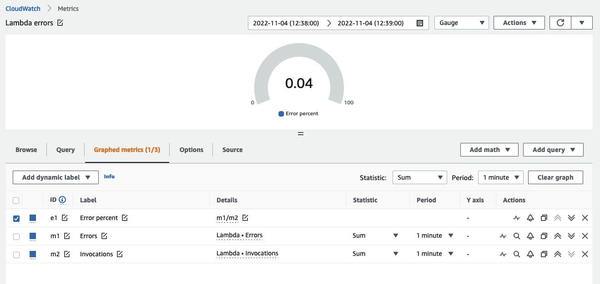
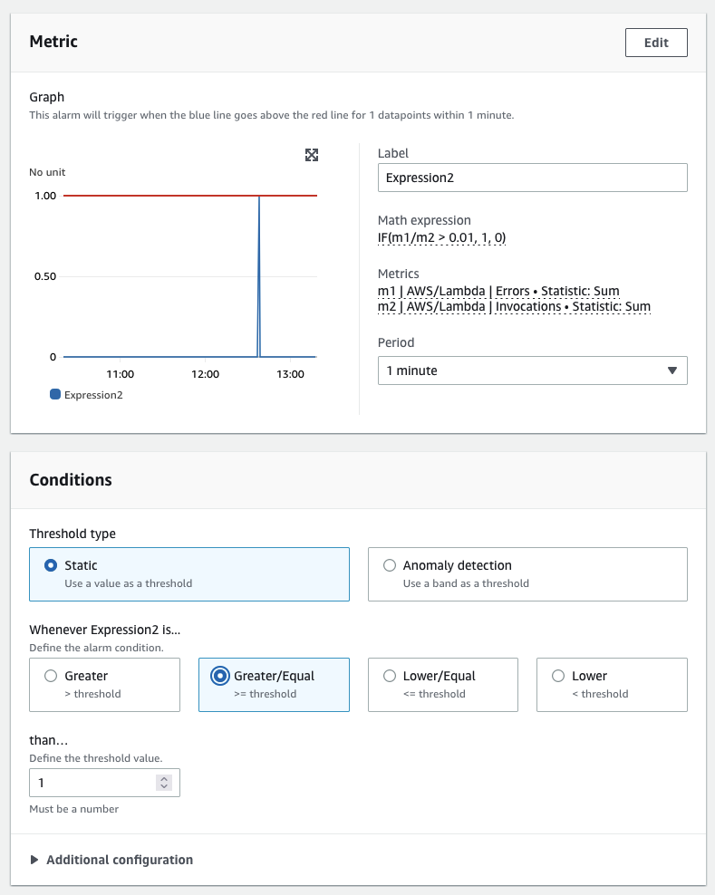
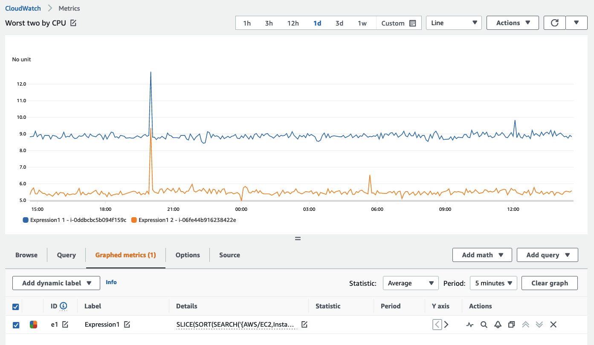
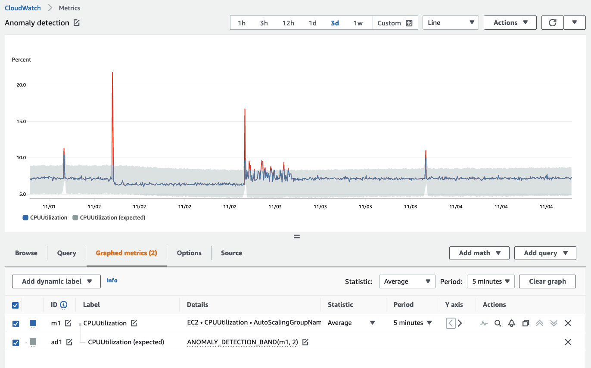

# メトリクス

メトリクスとは、システムのパフォーマンスに関するデータです。 
システムやリソースに関連するすべてのメトリクスを集中管理することで、メトリクスを比較したり、パフォーマンスを分析したり、リソースのスケールアップやスケールインなどの戦略的な意思決定を行うことができます。
メトリクスは、リソースの健全性を知り、予防措置を講じる上でも重要です。

メトリクスデータは基礎的なものであり、[アラーム](../../signals/alarms/)、異常検知、[イベント](../../signals/events/)、[ダッシュボード](../../tools/dashboards)などを駆動するために使用されます。

## ベンダーメトリクス

[CloudWatch メトリクス](https://docs.aws.amazon.com/ja_jp/AmazonCloudWatch/latest/monitoring/working_with_metrics.html) は、システムのパフォーマンスに関するデータを収集します。デフォルトでは、ほとんどの AWS サービスがリソースの無料メトリクスを提供します。これには、[Amazon EC2](https://aws.amazon.com/jp/ec2/) インスタンス、[Amazon RDS](https://aws.amazon.com/jp/rds/)、[Amazon S3](https://aws.amazon.com/jp/s3/?p=pm&c=s3&z=4) バケットなどが含まれます。

これらのメトリクスを *ベンダーメトリクス* と呼びます。ベンダーメトリクスの収集には料金がかかりません。

!!! info
	CloudWatch にメトリクスを送信する AWS サービスの完全なリストについては、[このページ](https://docs.aws.amazon.com/ja_jp/AmazonCloudWatch/latest/monitoring/aws-services-cloudwatch-metrics.html)を参照してください。

## メトリクスのクエリ

CloudWatch の [メトリック数式](https://docs.aws.amazon.com/ja_jp/AmazonCloudWatch/latest/monitoring/using-metric-math.html) 機能を利用して、複数のメトリクスをクエリし、より詳細なメトリクスの分析のために数式を使用できます。 たとえば、次のようにメトリック数式を書くことで、Lambda のエラーレートをクエリできます。

	Errors/Requests

以下は、これが CloudWatch コンソールにどのように表示されるかの例です。

!!! success
	メトリック数式を使用して、データから最大限の価値を引き出し、個別のデータソースのパフォーマンスから値を導出してください。

CloudWatch は条件文もサポートしています。 たとえば、レイテンシが特定のしきい値を超える各タイムシリーズに対して `1` の値を返し、その他のすべてのデータポイントに `0` を返すには、次のようなクエリになります。

	IF(latency>threshold, 1, 0)

CloudWatch コンソールでは、このロジックを使用してブール値を作成できます。これにより、[CloudWatch アラーム](../../tools/alarms)やその他のアクションをトリガーできます。 これにより、導出されたデータポイントからの自動アクションが可能になります。 CloudWatch コンソールからの例を以下に示します。

!!! success
	条件文を使用して、パフォーマンスが導出値のしきい値を超えたときに、アラームと通知をトリガーしてください。

任意のメトリクスの上位 `n` を表示するために、`SEARCH` 関数も使用できます。 多数のタイムシリーズ (たとえば、数千のサーバー) 全体で最もパフォーマンスの高いメトリクスや最も低いメトリクスを可視化する場合、このアプローチにより、最も重要なデータのみを表示できます。 過去 5 分間の平均で、CPU 使用量が最も高い上位 2 つの EC2 インスタンスを返す検索の例を次に示します。

	SLICE(SORT(SEARCH('{AWS/EC2,InstanceId} MetricName="CPUUtilization"', 'Average', 300), MAX, DESC),0, 2)

CloudWatch コンソールでの同じ表示は次のとおりです。

!!! success
	`SEARCH` アプローチを使用して、環境内の価値の高いリソースや最もパフォーマンスの低いリソースをすばやく表示し、[ダッシュボード](../../tools/dashboards)に表示してください。

## メトリクスの収集

EC2 インスタンスのメモリやディスク空き容量など、追加のメトリクスが必要な場合は、[CloudWatch エージェント](../../tools/cloudwatch_agent/) を使用して、このデータを CloudWatch にプッシュできます。または、グラフィカルに可視化する必要があるカスタム処理データがあり、このデータを CloudWatch メトリクスとして存在させたい場合は、[`PutMetricData` API](https://docs.aws.amazon.com/AmazonCloudWatch/latest/APIReference/API_PutMetricData.html) を使用して、カスタムメトリクスを CloudWatch にパブリッシュできます。

!!! success
	裸の API ではなく、[AWS SDK](https://aws.amazon.com/developer/tools/) のいずれかを使用して、メトリクスデータを CloudWatch にプッシュします。

`PutMetricData` API 呼び出しはクエリの数に基づいて課金されます。この API を最適に使用するには、ベストプラクティスに従うことが大切です。この API の Values and Counts メソッドを使用すると、1 つの `PutMetricData` リクエストでメトリクスごとに最大 150 個の値をパブリッシュでき、このデータのパーセンタイル統計を取得できます。したがって、各データポイントごとに個別の API 呼び出しを行う代わりに、すべてのデータポイントをグループ化してから、単一の `PutMetricData` API 呼び出しで CloudWatch にプッシュする必要があります。このアプローチは、次の 2 つの方法でユーザーに利益をもたらします。

1. CloudWatch の料金
2. `PutMetricData` API のスロットリングを防ぐ

!!! success
	`PutMetricData` を使用する場合、可能な限りバッチデータを単一の `PUT` 操作にまとめることがベストプラクティスです。
	
!!! success
	大量のメトリクスが CloudWatch に発行される場合は、代替アプローチとして [Embedded Metric Format](https://docs.aws.amazon.com/AmazonCloudWatch/latest/monitoring/CloudWatch_Embedded_Metric_Format_Manual.html) の使用を検討してください。Embedded Metric Format は `PutMetricData` の使用や課金を行いませんが、[CloudWatch Logs](../../tools/logs/) の使用からの課金は発生します。

## 異常検知

CloudWatch には、記録されたメトリクスに基づいて「正常」が何であるかを学習する[異常検知](https://docs.aws.amazon.com/ja_jp/AmazonCloudWatch/latest/monitoring/CloudWatch_Anomaly_Detection.html)機能があり、これによりオブザーバビリティ戦略が拡張されます。 異常検知の使用は、メトリック信号収集システムにおける[ベストプラクティス](../../signals/metrics/#use-anomaly-detection-algorithms)です。

異常検知は 2 週間の期間にわたってモデルを構築します。

!!! warning
	異常検知は、作成時から先の時間についてのみモデルを構築します。過去に遡って以前の外れ値を見つけることはありません。
	
!!! warning 
	異常検知は、メトリクスの「良い」が何であるかは知りません。標準偏差に基づいて「正常」が何であるかのみを知っています。
	
!!! success
	ベストプラクティスは、予測される通常の動作時間のみを分析するように異常検知モデルをトレーニングすることです。 トレーニングから除外する時間帯(夜間、週末、休日など)を定義できます。

ここでは、グレーの帯が異常検知帯の例を示しています。

異常検知の除外ウィンドウの設定は、CloudWatch コンソール、 [CloudFormation](https://docs.aws.amazon.com/ja_jp/AWSCloudFormation/latest/UserGuide/aws-properties-cloudwatch-anomalydetector-configuration.html)、または AWS SDK のいずれかを使用して行うことができます。
